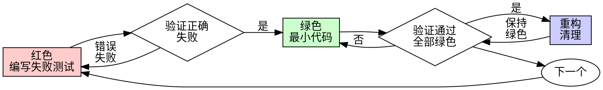

# 测试驱动开发 (TDD)

## 概述

先写测试，看着它失败，然后编写最小代码使其通过。

**核心原则：** 如果你没有看到测试失败，你就不知道它是否测试了正确的东西。

**违反规则的字面意思，就是违反规则的精神。**

## 何时使用

**总是：**
- 新功能
- 错误修复
- 重构
- 行为变更

**例外（询问你的人类伙伴）：**
- 一次性原型
- 生成的代码
- 配置文件

想着"就跳过这一次 TDD"？停下，那只是自我合理化。

## 铁律

```
没有失败的测试就不写生产代码
```

在测试之前写了代码？删除它，重新开始。

**没有例外：**
- 不要把它作为"参考"保留
- 不要在写测试时"适配"它
- 不要看它
- 删除就是删除

从测试开始全新实现，就这样。

## 红-绿-重构



### 红色 - 编写失败测试

编写一个最小测试，展示应该发生什么。

<good>
```typescript
test('失败操作重试3次', async () => {
  let attempts = 0;
  const operation = () => {
    attempts++;
    if (attempts < 3) throw new Error('fail');
    return 'success';
  };

  const result = await retryOperation(operation);

  expect(result).toBe('success');
  expect(attempts).toBe(3);
});
```
名称清晰，测试真实行为，只做一件事
</good>

<bad>
```typescript
test('重试有效', async () => {
  const mock = jest.fn()
    .mockRejectedValueOnce(new Error())
    .mockRejectedValueOnce(new Error())
    .mockResolvedValueOnce('success');
  await retryOperation(mock);
  expect(mock).toHaveBeenCalledTimes(3);
});
```
名称模糊，测试的是模拟而不是真实代码
</bad>

**要求：**
- 一个行为
- 清晰名称
- 真实代码（除非不可避免，否则不使用模拟）

### 验证红色 - 看着它失败

**这是强制性的，永远不要跳过。**

```bash
npm test path/to/test.test.ts
```

确认：
- 测试失败（不是错误）
- 失败消息是预期的
- 因为功能缺失而失败（不是拼写错误）

**测试通过了？** 你在测试现有行为。修复测试。

**测试出错了？** 修复错误，重新运行直到正确失败。

### 绿色 - 最小代码

编写最简单的代码来使测试通过。

<good>
```typescript
async function retryOperation<T>(fn: () => Promise<T>): Promise<T> {
  for (let i = 0; i < 3; i++) {
    try {
      return await fn();
    } catch (e) {
      if (i === 2) throw e;
    }
  }
  throw new Error('unreachable');
}
```
刚好足够使测试通过
</good>

<bad>
```typescript
async function retryOperation<T>(
  fn: () => Promise<T>,
  options?: {
    maxRetries?: number;
    backoff?: 'linear' | 'exponential';
    onRetry?: (attempt: number) => void;
  }
): Promise<T> {
  // YAGNI
}
```
过度设计
</bad>

不要添加功能、重构其他代码，或超出测试范围进行"改进"。

### 验证绿色 - 看着它通过

**这是强制性的。**

```bash
npm test path/to/test.test.ts
```

确认：
- 测试通过
- 其他测试仍然通过
- 输出纯净（没有错误、警告）

**测试失败了？** 修复代码，不是测试。

**其他测试失败了？** 现在修复。

### 重构 - 清理

只有在测试通过（绿色）之后：
- 移除重复
- 改善名称
- 提取辅助函数

保持测试通过（绿色）。不要添加新行为。

### 重复

下一个失败的测试对应下一个功能。

## 好测试

| 质量         | 好                                       | 坏                             |
| ------------ | ---------------------------------------- | ------------------------------ |
| **最小**     | 只做一件事。如果名称中有"和"，就拆分它。 | `test('验证邮箱和域名和空白')` |
| **清晰**     | 名称清晰描述行为                         | `test('test1')`                |
| **显示意图** | 演示期望的 API 使用方式                  | 混淆了代码应该做什么           |

## 为什么顺序很重要

**"我会在代码工作后再写测试来验证"**

在代码之后写的测试会立即通过。立即通过并不能证明什么：
- 可能测试了错误的东西
- 可能测试了实现而不是行为
- 可能错过了你忘记的边缘情况
- 你从没看到它捕获错误

测试优先迫使你看到测试失败，从而证明它实际上测试了某些东西。

**"我已经手动测试了所有边缘情况"**

手动测试是临时的。你以为你测试了所有东西，但实际上：
- 没有测试记录
- 代码变更时无法重新运行
- 压力下容易忘记情况
- "我试的时候它工作了" ≠ 全面

自动化测试是系统性的，它们每次都以相同方式运行。

**"删除 X 小时的工作是浪费"**

这是沉没成本谬误。时间已经过去了，你现在需要选择：
- 删除并用 TDD 重写（X 更多小时，高信心）
- 保留它并在之后添加测试（30 分钟，低信心，可能有错误）

真正的"浪费"是你不能信任的代码。没有真正测试的工作代码就是技术债务。

**"TDD 是教条的，实用主义意味着适应"**

TDD 本身就是实用主义：
- 在提交前发现错误（比之后调试更快）
- 防止回归（测试立即捕获中断）
- 记录行为（测试显示如何使用代码）
- 支持重构（自由更改，测试捕获中断）

所谓的"实用主义"捷径，实际上等于在生产环境调试，反而更慢。

**"之后的测试实现相同目标 - 是精神不是仪式"**

不对。之后的测试回答的是"这个做什么？"，而之前的测试回答的是"这个应该做什么？"

之后的测试受你的实现影响。你测试的是你构建的东西，而不是需要的东西。你验证的是你记住的边缘情况，而不是发现的边缘情况。

之前的测试在实现前强制你发现边缘情况。之后的测试验证你是否记得所有东西（实际上你没记住）。

花 30 分钟写之后的测试 ≠ TDD。你得到了覆盖率，但失去了证明测试有效的证据。

## 常见合理化

| 借口                     | 现实                                                        |
| ------------------------ | ----------------------------------------------------------- |
| "太简单不需要测试"       | 简单代码也会出错。写测试只需要 30 秒。                      |
| "我之后再测试"           | 测试立即通过并不能证明什么。                                |
| "之后的测试实现相同目标" | 之后的测试 = "这个做什么？" 之前的测试 = "这个应该做什么？" |
| "已经手动测试过"         | 临时测试 ≠ 系统性测试。没有记录，无法重新运行。             |
| "删除 X 小时是浪费"      | 这是沉没成本谬误。保留未验证的代码就是技术债务。            |
| "作为参考保留，先写测试" | 你会去适配它。那就是测试之后的做法。删除就是删除。          |
| "需要先探索"             | 可以。扔掉探索代码，从 TDD 开始。                           |
| "测试难 = 设计不清楚"    | 倾听测试的反馈。难以测试 = 难以使用。                       |
| "TDD 会拖慢我"           | TDD 比调试更快。真正的实用主义 = 测试优先。                 |
| "手动测试更快"           | 手动测试不能证明边缘情况。每次更改都要重新手动测试。        |
| "现有代码没有测试"       | 你正在改进它。为现有代码添加测试。                          |

## 危险信号 - 停下重新开始

- 测试前写代码
- 实现后测试
- 测试立即通过
- 无法解释测试为何失败
- "稍后"添加测试
- 合理化"就这一次"
- "我已经手动测试过"
- "之后的测试实现相同目的"
- "是精神不是仪式"
- "作为参考"或"适配现有代码"
- "已经花了 X 小时，删除是浪费"
- "TDD 是教条的，我是实用主义"
- "这次不同因为..."

**所有这些都意味着：删除代码，用 TDD 重新开始。**

## 示例：错误修复

**错误：** 接受空邮箱

**红色**
```typescript
test('拒绝空邮箱', async () => {
  const result = await submitForm({ email: '' });
  expect(result.error).toBe('需要邮箱');
});
```

**验证红色**
```bash
$ npm test
失败：期望得到'需要邮箱'，实际得到 undefined
```

**绿色**
```typescript
function submitForm(data: FormData) {
  if (!data.email?.trim()) {
    return { error: '需要邮箱' };
  }
  // ...
}
```

**验证绿色**
```bash
$ npm test
通过
```

**重构**
如果需要，可以为多个字段提取验证逻辑。

## 验证清单

标记工作完成前：

- [ ] 每个新函数/方法都有测试
- [ ] 在实现前看到每个测试失败
- [ ] 每个测试都因预期原因失败（功能缺失，不是拼写错误）
- [ ] 为通过每个测试编写了最小代码
- [ ] 所有测试通过
- [ ] 输出纯净（没有错误、警告）
- [ ] 测试使用真实代码（除非不可避免，否则不使用模拟）
- [ ] 覆盖边缘情况和错误

不能勾选所有项？说明你跳过了 TDD。重新开始。

## 卡住时

| 问题             | 解决方案                                     |
| ---------------- | -------------------------------------------- |
| 不知道如何测试   | 编写期望的 API。先写断言。询问你的人类伙伴。 |
| 测试太复杂       | 设计太复杂。简化接口。                       |
| 必须模拟所有东西 | 代码耦合太紧。使用依赖注入。                 |
| 测试设置巨大     | 提取辅助函数。还复杂？简化设计。             |

## 调试集成

发现错误？编写失败的测试来重现它。遵循 TDD 周期。测试证明修复有效并防止回归。

永远不要在没有测试的情况下修复错误。

## 测试反模式

添加模拟或测试工具时，阅读 @testing-anti-patterns.md 以避免常见陷阱：
- 测试模拟行为而不是真实行为
- 向生产类添加仅测试方法
- 不理解依赖关系就进行模拟

## 最终规则

```
生产代码 → 测试存在且先失败
否则 → 不是 TDD
```

没有人类伙伴的许可，就没有例外。

---
> Converted and distributed by [TomeVault](https://tomevault.io/claim/klaaay) — claim your Tome and manage your conversions.
<!-- tomevault:4.0:skill_md:2026-04-13 -->
