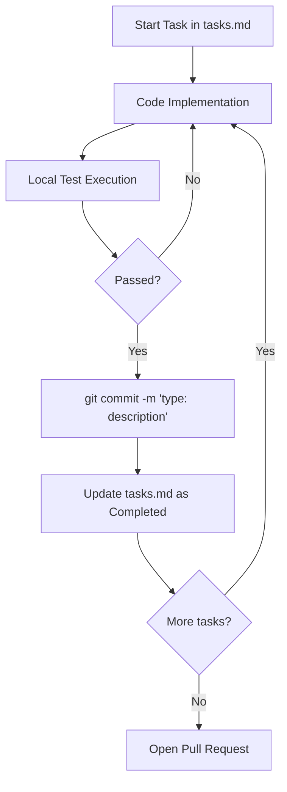

## 🔒 Prerequisites (Mandatory)
This skill operates WITHIN the **SDD** framework. Before starting any technical execution:
0. **Mode Check**: Verify the current operational mode (`.hub-mode`) and apply the `token-distiller` skill guidelines.
1. **Context Check**: Did you rehydrate the context by reading `STATE.md`, `MEMORY.md`, and `LEARNINGS.md`?
2. **Knowledge Check**: Follow the **Knowledge Verification Chain** (see below).

---

## 🧩 Delegation Matrix

The `git-workflow` skill maps lifecycle stages to specialized protocols to ensure a linear and traceable history:

| Phase | Resource / Protocol | Primary Artifact | Purpose |
|---|---|---|---|
| **DISCOVERY** | `references/branching-strategies.md` | Feature Branch | Selection of the branching model (GitHub Flow recommended). |
| **SPECIFY** | `examples/gitmessage.template` | Git Config | Configuration of the mandatory commit message template. |
| **IMPLEMENT** | `references/conventional-commits.md` | Atomic Commits | Standardized commits mapped to `tasks.md` IDs. |
| **VERIFY** | `examples/pull-request.md` | Pull Request | Final audit, review documentation, and evidence collection. |

---

## 🔄 4-Phase Workflow

### 1. DISCOVERY
*   **Goal**: Align local state with remote and select strategy.
*   **Action**: `git pull --rebase origin main`. Select branching strategy from `references/branching-strategies.md`.
*   **Output**: Synchronized `main` and active `feature/` branch.

### 2. SPECIFY
*   **Goal**: Configure environment for standardized contributions.
*   **Action**: Set up `.gitmessage` template. Verify scope definitions for Conventional Commits.
*   **Output**: Configured local Git environment.

### 3. IMPLEMENT
*   **Goal**: Create a traceable, atomic history.
*   **Action**: Execute commits using the mandatory format. Each commit MUST map to a task in `tasks.md`.
*   **Output**: Atomic commits with English messages and correct types.

### 4. VERIFY
*   **Goal**: Finalize and integrate changes.
*   **Action**: Rebase against `main`. Open PR using `examples/pull-request.md`. Update `STATE.md` with evidence.
*   **Output**: Merged PR and clean linear history.

---

## Goal

Establish version control standards, branching strategies, and collaborative development that ensure traceability, facilitate code reviews, and maintain project history integrity, especially when operating under the SDD framework.

---

## Output Structure

Execution of this skill results in the following artifacts:

| Artifact | Format | Description |
|----------|---------|-----------|
| **Clean History** | Git Log | Linear and readable commit history. |
| **Pull Request** | Markdown | Documented PR following the project template. |
| **Git Config** | `.gitmessage` | Local commit template configuration. |

---

## Branching Strategies

### 1. GitHub Flow (Simple and Recommended)
Ideal for continuous deployment and small to medium-sized teams.
- `main` is always production-ready.
- Create `feature/` branches from `main`.
- Open a Pull Request for review.
- After approval and testing, merge into `main`.

### 2. Trunk-Based Development (High Velocity)
For teams with robust CI/CD and Feature Flags.
- Short, frequent commits directly to `main` (or very short-lived branches).
- CI must pass before any integration.

### 3. GitFlow (Enterprise Release Cycle)
For scheduled releases and complex projects.
- `main` (production), `develop` (integration).
- `feature`, `release`, and `hotfix` branches.

---

## Conventional Commits

Mandatory format: `<type>(<scope>): <subject>`

| Type | Usage | Example |
|------|-----|---------|
| `feat` | New functionality | `feat(auth): add SSO support` |
| `fix` | Bug fix | `fix(api): handle connection timeout` |
| `docs` | Documentation | `docs(readme): add setup steps` |
| `refactor` | Code refactoring | `refactor(db): optimize query logic` |
| `test` | Tests | `test(unit): add auth validation tests` |

*See the full guide at: [references/conventional-commits.md](references/conventional-commits.md)*

---

## Git in the SDD Workflow (Mandatory)

Integrating Git with the SDD cycle is fundamental for traceability and history integrity:

1.  **Discovery Phase**: Before starting, ensure your local `main` is synchronized with the remote using **`git pull --rebase origin main`**.
2.  **Implementation Phase**: 
    - **Atomic Branches**: Each feature/fix must have its own branch.
    - **Isolated Workspaces (Worktree)**: For tasks sized **Medium+**, instead of `checkout`, use **`git worktree add ../<branch-name> <branch-name>`**. This ensures a clean, isolated environment for implementation and testing without affecting the main working directory.
    - **Commits per Task**: Each completed task in `tasks.md` must generate at least one clear commit.

    - **Conventional Commits**: Use **`git commit -m "<type>(<scope>): <message>"`**.
    - **Language**: All commit messages **MUST** be written in **English**, even if technical documentation is in Portuguese.
    - **Atomicity**: Do not mix changes from different tasks in the same commit.
3.  **Review Phase**:
    - **Linearity**: Always run **`git pull --rebase origin main`** before pushing to keep history clean and resolve conflicts early via rebase.
    - **Gated Push (Hook)**: You MUST configure the SDD hook (`bin/pre-push.sh` -> `.git/hooks/pre-push`) in your project to mathematically guarantee that code failing tests, lint, or build cannot be pushed to the remote repository.
    - **Evidence**: The Pull Request link must be included in `validation-report.md`.

### SDD Commit Cycle Diagram


---

## Integration Mandates: Merge vs Rebase

### Use REBASE for:
- Updating your local branch with the latest changes from `main`.
- Cleaning up intermediate commits (squash) before sending for review.
- Maintaining a linear history without unnecessary merge commit noise.

### Use MERGE for:
- Integrating a completed feature branch into `main`.
- When the branch is shared with other developers (to avoid force pushing to public branches).

---

## 🛠️ Operational Protocols

### 1. Knowledge Verification Chain
Follow this hierarchy to maintain Git integrity:
1.  **Git State**: Inspect `git status`, `git branch`, and `git log -n 5`.
2.  **Implementation Trace**: Check `tasks.md` for task-commit mapping requirements.
3.  **Internal Standards**: `git-workflow/references/` for naming and commit formats.
4.  **Global Mandates**: Section 6 of `.specs/codebase/GLOBAL_MANDATES.md`.

### 2. The Linear History Mandate
Rebasing is the default for local synchronization. Merge commits are reserved for integration points (PR merges).

### 3. English-Only Policy
All Git metadata (commits, branches, PR titles) MUST be in English.

---

## Quality Rules

- **English-Only**: All commit messages must be written in English.
- **Conventional-Commits**: Mandatory use of the Conventional Commits standard.
- **Linear-History**: Preference for `rebase` to maintain a clean history.
- **Atomic-Commits**: Small commits focused on a single change.

---

## Prohibited

- **NEVER** perform direct commits to `main` without review (except in Quick SDD mode).
- **NEVER** commit secrets, API keys, or `.env` files.
- **NEVER** use vague commit messages (e.g., "update", "fix").
- **NEVER** send giant Pull Requests (>500 lines).
- **NEVER** write commit messages in any language other than English.

---

## References and Examples
- [Conventional Commits Guide](references/conventional-commits.md)
- [Detailed Branching Strategies](references/branching-strategies.md)
- [Git Message Template](examples/gitmessage.template)
- [Pull Request Template](examples/pull-request.md)
- [Pre-Push Hook Template](../../bin/pre-push.sh)


---

<!-- @sdd-state -->
```yaml
version: "2.3.0"
feature_id: "HUB-ALIGNMENT"
phase: "VERIFY"
status: "COMPLETED"
last_update: "2026-05-06T13:16:19.362355Z"
evidence_checksum: "8e52f6a"
```

---
> Source: [KlebersonCollab/skills](https://github.com/KlebersonCollab/skills) — distributed by [TomeVault](https://tomevault.io).
<!-- tomevault:4.0:skill_md:2026-05-22 -->
