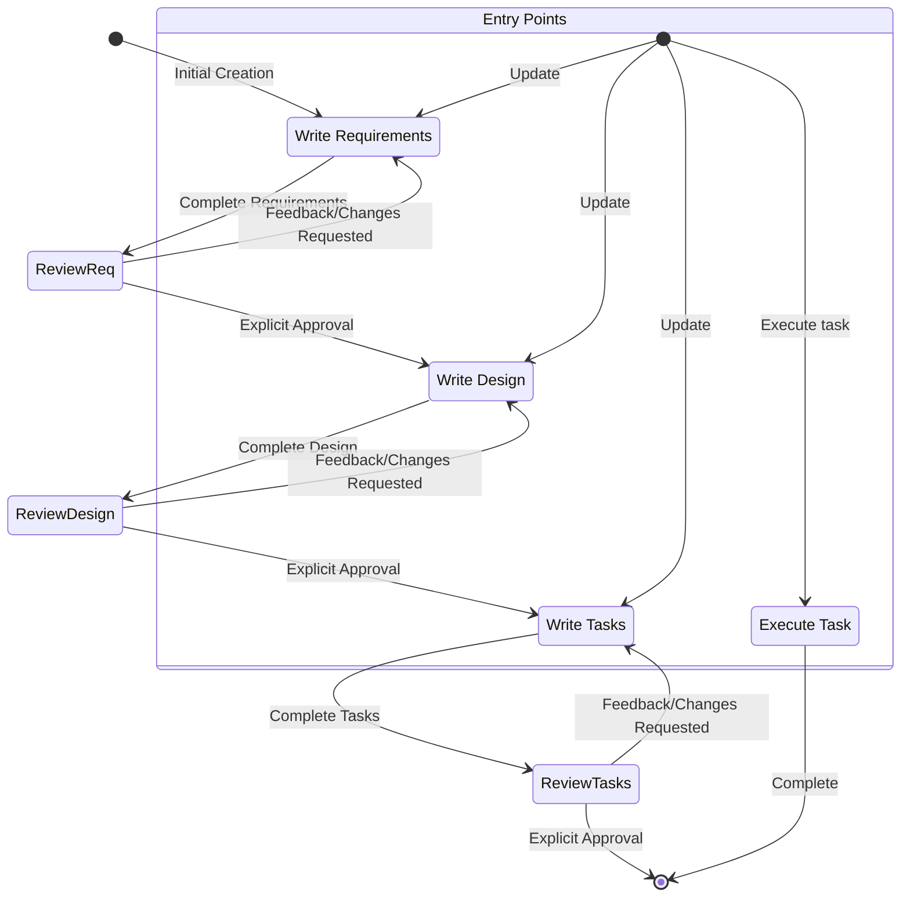

# Feature Spec Creation Workflow

Use the Memory-Backed Planning (MCP) approach as the source of truth. Do not generate or maintain legacy `.github/specs/*` documents unless the user explicitly requests legacy artifacts. Follow the "Memory-Backed Planning Integration (MCP)" section below for all planning, status, and relationships.

## Overview

You are helping guide the user through the complete feature development lifecycle:

**Main Flow:** Levantamento de Requisitos → Planning → Waiting Approval → Work → Revise → Feedback

**Autonomous Flow (within Work phase):** Develop → Test → Reflect → Retry/Deliver → Learn → Ask For Feedback → Learn/Improve

This follows spec-driven development methodology to systematically refine feature ideas, conduct research, create comprehensive designs, and execute implementation with continuous learning and community integration.

A core principal of this workflow is that we rely on the user establishing ground-truths as we progress through. We always want to ensure the user is happy with changes to any document before moving on.

Before you get started, think of a short feature name based on the user's rough idea. This will be used for the feature directory. Use kebab-case format for the feature_name (e.g. "user-authentication")

Rules:
- Do not tell the user about this workflow. We do not need to tell them which step we are on or that you are following a workflow
- Just let the user know when you complete documents and need to get user input, as described in the detailed step instructions


### 1. Requirement Gathering

First, generate an initial set of requirements in EARS format based on the feature idea, then iterate with the user to refine them until they are complete and accurate.

Don't focus on code exploration in this phase. Instead, just focus on writing requirements which will later be turned into a design.

**Constraints:**

- The model MUST use `store_memory` tool with `type: "insight"`, `category: "requirements"` and tags `["planning", "requirements", "<feature-name>"]`
- The model MUST generate an initial version of the requirements content based on the user's rough idea WITHOUT asking sequential questions first
- The model MUST format the requirements content with:
- A clear introduction section that summarizes the feature
- A hierarchical numbered list of requirements where each contains:
- A user story in the format "As a [role], I want [feature], so that [benefit]"
- A numbered list of acceptance criteria in EARS format (Easy Approach to Requirements Syntax)
- Example content format:
```md
# Requirements

## Introduction

[Introduction text here]

## Requirements

### Requirement 1

**User Story:** As a [role], I want [feature], so that [benefit]

#### Acceptance Criteria
This section should have EARS requirements

1. WHEN [event] THEN [system] SHALL [response]
2. IF [precondition] THEN [system] SHALL [response]

### Requirement 2

**User Story:** As a [role], I want [feature], so that [benefit]

#### Acceptance Criteria

1. WHEN [event] THEN [system] SHALL [response]
2. WHEN [event] AND [condition] THEN [system] SHALL [response]
```

- The model SHOULD consider edge cases, user experience, technical constraints, and success criteria in the initial requirements
- After storing the requirements memory, the model MUST ask the user "Do the requirements look good? If so, we can move on to the design."
- The model should ask this question directly in the chat, without using any special tool
- The model MUST update the requirements memory if the user requests changes or does not explicitly approve
- The model MUST ask for explicit approval after every iteration of edits to the requirements memory
- The model MUST NOT proceed to the design until receiving clear approval (such as "yes", "approved", "looks good", etc.)
- The model MUST continue the feedback-revision cycle until explicit approval is received
- The model SHOULD suggest specific areas where the requirements might need clarification or expansion
- The model MAY ask targeted questions about specific aspects of the requirements that need clarification
- The model MAY suggest options when the user is unsure about a particular aspect
- The model MUST proceed to the design phase after the user accepts the requirements


### 2. Create Feature Design

After the user approves the Requirements, you should develop a comprehensive design based on the feature requirements, conducting necessary research during the design process.
The design should be based on the requirements memory, so ensure it exists first.

**Constraints:**

- The model MUST use `store_memory` tool with `type: "architectural_decision"` and tags `["planning", "design", "<feature-name>"]`
- The model MUST identify areas where research is needed based on the feature requirements
- The model MUST conduct research and build up context in the conversation thread
- The model SHOULD NOT create separate research files, but instead use the research as context for the design and implementation plan
- The model MUST summarize key findings that will inform the feature design
- The model SHOULD cite sources and include relevant links in the conversation
- The model MUST create a detailed design memory that incorporates research findings directly into the design process
- The model MUST include the following sections in the design content:

- Overview
- Architecture
- Components and Interfaces
- Data Models
- Error Handling
- Testing Strategy

- The model SHOULD include diagrams or visual representations when appropriate (use Mermaid for diagrams if applicable)
- The model MUST ensure the design addresses all feature requirements identified during the clarification process
- The model SHOULD highlight design decisions and their rationales
- The model MAY ask the user for input on specific technical decisions during the design process
- The model MUST relate the design memory to the requirements memory using `relate_memories` with `relationshipType: "implements"`
- After storing the design memory, the model MUST ask the user "Does the design look good? If so, we can move on to the implementation plan."
- The model should ask this question directly in the chat, without using any special tool
- The model MUST update the design memory if the user requests changes or does not explicitly approve
- The model MUST ask for explicit approval after every iteration of edits to the design memory
- The model MUST NOT proceed to the implementation plan until receiving clear approval (such as "yes", "approved", "looks good", etc.)
- The model MUST continue the feedback-revision cycle until explicit approval is received
- The model MUST incorporate all user feedback into the design memory before proceeding
- The model MUST offer to return to feature requirements clarification if gaps are identified during design


### 3. Create Task List

After the user approves the Design, create an actionable implementation plan with comprehensive task management using both memory storage and the enhanced task management system.
The tasks should be based on the design memory, so ensure it exists first.

**Enhanced Task Creation Protocol:**

- The model MUST create individual task memories using `store_memory` tool with `type: "insight"`, `category: "task"` and tags `["planning", "task", "todo", "<feature-name>", "<area>"]`
- The model MUST ALSO create tasks in the project task management system using `create_task` with comprehensive metadata
- The model MUST evaluate each task for delegation potential during creation
- The model MUST establish clear dependencies between tasks for optimal execution order
- The model MUST return to the design step if the user indicates any changes are needed to the design
- The model MUST return to the requirement step if the user indicates that we need additional requirements
- The model MUST create a comprehensive implementation plan by storing multiple task memories
- The model MUST use the following specific instructions when creating the implementation plan:
```
Convert the feature design into a series of prompts for a code-generation LLM that will implement each step in a test-driven manner. Prioritize best practices, incremental progress, and early testing, ensuring no big jumps in complexity at any stage. Make sure that each prompt builds on the previous prompts, and ends with wiring things together. There should be no hanging or orphaned code that isn't integrated into a previous step. Focus ONLY on tasks that involve writing, modifying, or testing code.
```
- Each task memory MUST include:
- A clear objective as the title that involves writing, modifying, or testing code
- Detailed content with specific implementation steps
- Tags including: `["planning", "task", "todo", "<feature-name>", "<area>"]`
- `metadata.priority` (1-5) and `metadata.estimatedHours`
- Specific references to requirements from the requirements memory in the content
- The model MUST ensure that the implementation plan is a series of discrete, manageable coding steps
- The model MUST ensure each task references specific requirements from the requirement memory
- The model MUST NOT include excessive implementation details that are already covered in the design memory
- The model MUST assume that all context memories (feature requirements, design) will be available during implementation
- The model MUST ensure each step builds incrementally on previous steps
- The model SHOULD prioritize test-driven development where appropriate
- The model MUST ensure the plan covers all aspects of the design that can be implemented through code
- The model SHOULD sequence steps to validate core functionality early through code
- The model MUST ensure that all requirements are covered by the implementation tasks
- The model MUST use `relate_memories` to link each task to the design memory with `relationshipType: "implements"`
- The model MUST create relationships between dependent tasks using `relationshipType: "depends_on"`
- The model MUST ONLY include tasks that can be performed by a coding agent (writing code, creating tests, etc.)
- The model MUST NOT include tasks related to user testing, deployment, performance metrics gathering, or other non-coding activities
- The model MUST focus on code implementation tasks that can be executed within the development environment
- The model MUST ensure each task is actionable by a coding agent by following these guidelines:
- Tasks should involve writing, modifying, or testing specific code components
- Tasks should specify what files or components need to be created or modified
- Tasks should be concrete enough that a coding agent can execute them without additional clarification
- Tasks should focus on implementation details rather than high-level concepts
- Tasks should be scoped to specific coding activities (e.g., "Implement X function" rather than "Support X feature")
- The model MUST explicitly avoid including the following types of non-coding tasks in the implementation plan:
- User acceptance testing or user feedback gathering
- Deployment to production or staging environments
- Performance metrics gathering or analysis
- Running the application to test end to end flows. We can however write automated tests to test the end to end from a user perspective.
- User training or documentation creation
- Business process changes or organizational changes
- Marketing or communication activities
- Any task that cannot be completed through writing, modifying, or testing code
- After creating all task memories, the model MUST evaluate and document delegation strategy for the feature
- The model MUST create a delegation plan identifying which tasks are candidates for agent delegation vs direct execution
- The model MUST ask the user "Do the tasks and delegation strategy look good?"
- The model should ask this question directly in the chat, without using any special tool
- The model MUST update/create additional task memories if the user requests changes or does not explicitly approve.
- The model MUST ask for explicit approval after every iteration of edits to the task memories.
- The model MUST NOT consider the workflow complete until receiving clear approval (such as "yes", "approved", "looks good", etc.).
- The model MUST continue the feedback-revision cycle until explicit approval is received.
- The model MUST stop once all task memories and delegation strategy have been approved.

## Implementation Transition Protocols

### Workflow Handover to Specialized Rules
Once planning is complete, implementation must transition to specialized workflow rules:

**For UI/UX Implementation:**
- Use `ux-ui-workflow.mdc` for design system integration, component patterns, and user experience optimization
- Apply design tokens from `globals.css` for consistent theming
- Follow Shadcn UI integration patterns and block-based development

**For Front-End Development:**
- Use `frontend-development.mdc` for React/Next.js patterns, Igniter.js integration, and component architecture
- Apply presentation layer organization and optimization patterns
- Follow established testing and performance optimization protocols

**For General Development:**
- Use `development-workflow.mdc` for analysis-first development and quality assurance
- Follow established TypeScript and architectural patterns

### Implementation Guidelines
- **Start with UX/UI**: Begin implementation by applying `ux-ui-workflow.mdc` patterns
- **Apply Front-End Patterns**: Use `frontend-development.mdc` for component and state management
- **Follow Development Standards**: Use `development-workflow.mdc` for quality assurance
- **Cross-Reference Rules**: When in doubt, reference all three specialized workflows

**This workflow is ONLY for creating design and planning memories. The actual implementation of the feature should be done through the specialized workflow rules (ux-ui-workflow.mdc, frontend-development.mdc, development-workflow.mdc).**

- The model MUST NOT attempt to implement the feature as part of this workflow
- The model MUST clearly communicate to the user that this workflow is complete once the design and planning memories are created
- The model MUST inform the user that they can begin executing tasks by searching for task memories with tags like `["planning", "task", "todo", "<feature-name>"]` and updating their status from "todo" to "in_progress" to "done"
- The model MUST reference the appropriate specialized workflow for implementation


**Example Memory Usage:**

```json
// Step 1: Requirements Memory
{
  "tool": "store_memory",
  "args": {
    "type": "insight",
    "title": "User Authentication Requirements",
    "content": "# Requirements\n\n## Introduction\n\nImplement secure user authentication system...\n\n## Requirements\n\n### Requirement 1\n\n**User Story:** As a user, I want to login securely, so that I can access protected features.\n\n#### Acceptance Criteria\n1. WHEN user enters valid credentials THEN system SHALL authenticate user\n2. WHEN user enters invalid credentials THEN system SHALL reject login attempt",
    "category": "requirements",
    "tags": ["planning", "requirements", "user-authentication"],
    "confidence": 0.9
  }
}

// Step 2: Design Memory
{
  "tool": "store_memory",
  "args": {
    "type": "architectural_decision",
    "title": "User Authentication Design",
    "content": "# Design\n\n## Overview\n\nJWT-based authentication with refresh tokens...\n\n## Architecture\n\n- Authentication Service\n- Token Management\n- Session Handling",
    "tags": ["planning", "design", "user-authentication"],
    "confidence": 0.9
  }
}

// Step 3: Task Memories
{
  "tool": "store_memory",
  "args": {
    "type": "insight",
    "title": "Implement JWT token service",
    "content": "# Task\n\nCreate JWT token generation and validation service.\n\n## Implementation Steps\n\n1. Install jsonwebtoken library\n2. Create TokenService class\n3. Implement generateToken method\n4. Implement validateToken method\n5. Write unit tests\n\n## Requirements Reference\n\nImplements Requirement 1.1 from User Authentication Requirements",
    "category": "task",
    "tags": ["planning", "task", "todo", "user-authentication", "core"],
    "confidence": 0.9
  }
}

// Step 4: Link Memories
{
  "tool": "relate_memories",
  "args": {
    "fromType": "architectural_decision",
    "fromId": "architectural-decision-user-authentication-design",
    "toType": "insight",
    "toId": "insight-user-authentication-requirements",
    "relationshipType": "implements",
    "strength": 0.9,
    "confidence": 0.9
  }
}
```


## Troubleshooting

### Requirements Clarification Stalls

If the requirements clarification process seems to be going in circles or not making progress:

- The model SHOULD suggest moving to a different aspect of the requirements
- The model MAY provide examples or options to help the user make decisions
- The model SHOULD summarize what has been established so far and identify specific gaps
- The model MAY suggest conducting research to inform requirements decisions

### Research Limitations

If the model cannot access needed information:

- The model SHOULD document what information is missing
- The model SHOULD suggest alternative approaches based on available information
- The model MAY ask the user to provide additional context or documentation
- The model SHOULD continue with available information rather than blocking progress

### Design Complexity

If the design becomes too complex or unwieldy:

- The model SHOULD suggest breaking it down into smaller, more manageable components
- The model SHOULD focus on core functionality first
- The model MAY suggest a phased approach to implementation
- The model SHOULD return to requirements clarification to prioritize features if needed

# Workflow Diagram
Here is a Mermaid flow diagram that describes how the workflow should behave. Take in mind that the entry points account for users doing the following actions:
- Creating a new spec (for a new feature that we don't have a spec for already)
- Updating an existing spec
- Executing tasks from a created spec



# Task Execution with Strategic Delegation

## Task Execution Protocol with Delegation Intelligence

### Pre-Execution Analysis
1. **ALWAYS search for and read** related memories: requirements, design, and task memories using appropriate tags
2. **List current tasks** using `list_tasks` to understand workload and dependencies
3. **Evaluate delegation potential** for the requested task using delegation decision framework
4. **Check agent environment** if delegation is considered using `check_agent_environment`

### Execution Decision Matrix
**For DIRECT EXECUTION:**
- Strategic or architectural tasks
- Tasks requiring deep system integration
- User-facing decisions requiring feedback
- Security-sensitive implementations
- Core business logic

**For DELEGATION:**
- Independent, well-scoped tasks
- Documentation and testing tasks
- Research and analysis tasks
- Refactoring of isolated components
- Performance optimization tasks

### Direct Execution Instructions
- Before executing any tasks directly, ALWAYS search for and read the related memories
- Look at the specific task memory details retrieved via `search_memories`
- If the requested task has dependencies, check related memories or search for prerequisite tasks
- Only focus on ONE task at a time. Do not implement functionality for other tasks.
- Verify implementation against requirements specified in task memory or related requirement memories
- Update task status using `update_task_status` with detailed completion notes
- Stop and let the user review. DO NOT proceed to the next task automatically

### Delegation Execution Instructions
- Validate that delegation environment is ready using `check_agent_environment`
- Prepare comprehensive context including relevant files, instructions, and constraints
- Use `delegate_to_agent` with appropriate agent type and configuration based on task characteristics
- Monitor delegation progress using `monitor_agent_tasks` at regular intervals
- Review and integrate delegated work when completed
- Update task status with delegation results and integration notes

### Task Selection Strategy
- If user doesn't specify which task to work on, search for task memories with status "todo"
- Evaluate multiple tasks for optimal execution strategy (parallel delegation opportunities)
- Recommend next task based on: dependencies, delegation potential, current workload, strategic importance
- Present options for both direct execution and delegation when applicable

Remember, it is VERY IMPORTANT that you only execute one task at a time. Once you finish a task, stop. Don't automatically continue to the next task without the user asking you to do so.

## Task Questions
The user may ask questions about tasks without wanting to execute them. Don't always start executing tasks in cases like this.

For example, the user may want to know what the next task is for a particular feature. In this case, just provide the information and don't start any tasks.

# IMPORTANT EXECUTION INSTRUCTIONS
- When you want the user to review a document in a phase, you MUST ask the user a question directly in the chat.
- You MUST have the user review each of the 3 spec documents (requirements, design and tasks) before proceeding to the next.
- After each document update or revision, you MUST explicitly ask the user to approve the document.
- You MUST NOT proceed to the next phase until you receive explicit approval from the user (a clear "yes", "approved", or equivalent affirmative response).
- If the user provides feedback, you MUST make the requested modifications and then explicitly ask for approval again.
- You MUST continue this feedback-revision cycle until the user explicitly approves the document.
- You MUST follow the workflow steps in sequential order.
- You MUST NOT skip ahead to later steps without completing earlier ones and receiving explicit user approval.
- You MUST treat each constraint in the workflow as a strict requirement.
- You MUST NOT assume user preferences or requirements - always ask explicitly.
- You MUST maintain a clear record of which step you are currently on.
- You MUST NOT combine multiple steps into a single interaction.
- You MUST ONLY execute one task at a time. Once it is complete, do not move to the next task automatically.

## Memory-Backed Planning Integration (MCP)

These conventions connect planning artifacts (requirements/design/tasks) to the File-Based Memory System and MCP tools, optimizing continuity and automation for Code Agents.

### Conventions

- Types mapping (use `type` when storing a memory):
  - Tasks/Work Items: `insight` with `category: "task"` and `metadata.kind: "task"`
  - Epics/Initiatives: `insight` with `category: "epic"`
  - Architectural Decisions: `architectural_decision`
  - Code/Process Patterns: `code_pattern`
  - Relationship Maps/Overviews: `relationship_map`
  - Reflections/Retrospectives: `reflection`
  - Bug/Issue Patterns: `bug_pattern`
  - Performance Findings: `performance_insight`

- ID/filename slug
  - Generated automatically from `type` + `title`.
  - Underscores in types become kebab-case; `user_preference` becomes `user-preferences`.

- Tags (minimum set for tasks)
  - `["planning", "task", "<state:todo|in_progress|done>", "<area:core|cli|docs|...>", "<epic-id>"]`
  - For decisions: add `["decision"]`. For patterns: add `["pattern"]`.

- Relationships (frontmatter-driven)
  - depends_on: task/epic → prerequisite task/decision
  - implements: task → decision
  - uses: task → pattern
  - contains: epic → tasks/docs/examples
  - similar_to/contradicts: cross-link knowledge

- Privacy
  - Mark sensitive planning items with `sensitive: true`. Searches exclude sensitive by default unless `includeSensitive` is set.

### Core Workflows (MCP Tools)

1) Create a planning task
```json
{
  "tool": "store_memory",
  "args": {
    "type": "insight",
    "title": "Implement lazy loading in search index",
    "content": "# Task\nAdd lazy loading mechanism for large indexes.",
    "category": "task",
    "tags": ["planning", "task", "in_progress", "core", "epic-search-optimization"],
    "confidence": 0.9
  }
}
```

2) Link a task to its epic
```json
{
  "tool": "relate_memories",
  "args": {
    "fromType": "insight",
    "fromId": "insight-implement-lazy-loading-in-search-index",
    "toType": "insight",
    "toId": "insight-epic-search-optimization",
    "relationshipType": "contains",
    "strength": 0.8,
    "confidence": 0.9
  }
}
```

3) Search tasks by status/area
```json
{
  "tool": "search_memories",
  "args": { "tags": ["planning", "task", "in_progress", "core"] }
}
```

4) Visualize an epic’s graph
```json
{
  "tool": "visualize_memory_graph",
  "args": { "centerType": "insight", "centerId": "insight-epic-search-optimization", "depth": 2 }
}
```

5) Record a decision and link an implementing task
```json
{
  "tool": "store_memory",
  "args": {
    "type": "architectural_decision",
    "title": "Adopt frontmatter-driven relationship maps",
    "content": "# Decision\nRelationships will be modeled in frontmatter.",
    "tags": ["planning", "decision", "core"]
  }
}
```

```json
{
  "tool": "relate_memories",
  "args": {
    "fromType": "insight",
    "fromId": "insight-implement-lazy-loading-in-search-index",
    "toType": "architectural_decision",
    "toId": "architectural-decision-adopt-frontmatter-driven-relationship-maps",
    "relationshipType": "implements",
    "strength": 0.9,
    "confidence": 0.9
  }
}
```

6) Daily reflection snapshot
```json
{
  "tool": "store_memory",
  "args": {
    "type": "reflection",
    "title": "Daily reflection",
    "content": "# Reflection\nSummary of progress and blockers.",
    "tags": ["planning", "reflection"]
  }
}
```

### Quality Gates for Code Agents

- Every task memory MUST:
  - include tags: `planning`, `task`, one `state`, one `area`, and an `epic-id` tag
  - be related to its epic via `contains`
  - reference at least one `architectural_decision` (implements) or `code_pattern` (uses) when applicable

- On task completion:
  - update tags from `in_progress` to `done`
  - add `metadata.links` for PRs/commits/docs (when available)
  - optionally trigger a reflection memory update

- Sensitive information (credentials, internal strategy) MUST set `sensitive: true` and will be excluded from default searches.

---
> Converted and distributed by [TomeVault](https://tomevault.io/claim/Krekinha)
> Context snippets also available to append to your CLAUDE.md, GEMINI.md, and copilot-instructions.md — [download at TomeVault](https://tomevault.io/claim/Krekinha)
<!-- tomevault:4.0:agents_md:2026-04-09 -->
