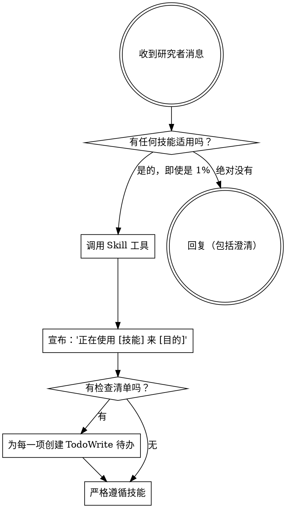

# 使用学术超能力

## 概述

<EXTREMELY-IMPORTANT>
如果你认为有 1% 的可能性某个技能可能适用于你正在做的事情，你**绝对必须**调用该技能。

如果某个技能适用于你的任务，你没有选择的余地。你必须使用它。

这是不可商量的。这不是可选的。你不能找借口不这样做。
</EXTREMELY-IMPORTANT>

## 如何访问技能

**在 Claude Code 中：** 使用 `Skill` 工具。当你调用一个技能时，它的内容会被加载并呈现给你——直接遵循它。永远不要对技能文件使用 Read 工具。

**在其他环境中：** 检查你的平台文档，了解如何加载技能。

# 使用技能

## 规则

**在任何回复或行动之前，调用相关或请求的技能。** 即使只有 1% 的机会某个技能可能适用，也意味着你应该调用该技能进行检查。如果调用的技能结果证明不适合该情况，你不需要使用它。

## 危险信号

这些想法意味着**停止**——你在找借口：

| 想法 | 现实 |
|---------|---------|
| “这只是一个简单的问题” | 问题就是任务。检查技能。 |
| “我先需要更多背景信息” | 技能检查在澄清问题**之前**。 |
| “让我先浏览一下文献库” | 技能告诉你**如何**浏览。先检查。 |
| “我可以快速检查文件/草稿” | 文件缺乏对话背景。检查技能。 |
| “让我先收集信息” | 技能告诉你**如何**收集信息。 |
| “这不需要正式技能” | 如果存在技能，使用它。 |
| “我记得这个技能” | 技能会演变。阅读当前版本。 |
| “这不算任务” | 行动 = 任务。检查技能。 |
| “这个技能太大材小用了” | 简单的事情会变复杂。使用它。 |
| “我只先做这一件事” | 在做**任何事**之前检查。 |
| “这感觉很高效” | 无纪律的行动浪费时间。技能防止这种情况。 |
| “我知道那是什么意思” | 知道概念 ≠ 使用技能。调用它。 |

## 技能优先级

当多个技能可能适用时，使用此顺序：

1.  **流程技能优先** (ideation, debugging/revision) - 这些决定**如何**处理任务
2.  **实施技能其次** (frontend-design, mcp-builder 等具体领域技能) - 这些指导执行

“让我们撰写 X” → 先 ideation，然后是实施技能。
“修正这个逻辑谬误” → 先 debugging/revision，然后是领域特定技能。

## 技能类型

**刚性** (ADW, debugging): 严格遵循。不要为了方便而放弃纪律。

**灵活** (patterns): 根据语境调整原则。

技能本身会告诉你属于哪一种。

## 研究者指令

指令说的是**做什么 (WHAT)**，而不是**怎么做 (HOW)**。“添加 X”或“修正 Y”并不意味着跳过工作流。

---
> Converted and distributed by [TomeVault](https://tomevault.io/claim/kun4ai) — claim your Tome and manage your conversions.
<!-- tomevault:4.0:skill_md:2026-04-11 -->
