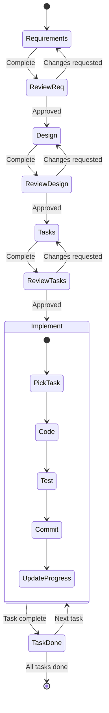

## Spec-Driven Development

This embedded copy is deprecated.

Use the maintained replacement:

- GitHub: `https://github.com/kundeng/spec-driven-dev-skill`
- skills.sh install: `npx skills add https://github.com/kundeng/spec-driven-dev-skill -g --all`

Do not continue maintaining this embedded copy except as a redirect for older
installs.

This skill powers the windloop framework. Specs live in a **spec directory** — either `.windloop/specs/<name>/` or `.kiro/specs/<name>/`. The format is the same regardless of location.

### When to Use

- Complex features with multiple components or integrations
- Multi-step work where rework costs are significant
- AI-assisted development where structured planning improves output quality
- Team collaboration requiring shared understanding and traceability
- Resuming implementation across sessions

### When NOT to Use

- Simple bug fixes with obvious one-file solutions
- Time-critical hotfixes requiring immediate action
- Experimental prototypes for rapid throwaway iteration
- Trivial changes with no ambiguity

### Quick Start

**New feature:**
```
/spec-plan my-feature create
```
Creates `requirements.md`, `design.md`, `tasks.md`, `progress.txt` in a new spec directory. Walk through requirements → design → tasks with approval gates between each phase.

**Refine existing spec:**
```
/spec-plan my-feature refine
```
Merges redundant requirements, fixes stale paths, cascades renumbering, validates traceability.

**Resume implementation:**
```
/spec-go my-feature
```
Reads the spec, finds the next uncompleted task, implements it test-first, commits, and repeats.

**Check progress:**
```
/spec-status
```

### Phase Gate Protocol

Each phase requires **explicit user approval** before advancing:

```
Requirements ──[approve]──> Design ──[approve]──> Tasks ──[approve]──> Implement
```

- After generating `requirements.md`: ask *"Do the requirements look good? Ready for design?"*
- After generating `design.md`: ask *"Does the design look good? Ready for task breakdown?"*
- After generating `tasks.md`: ask *"Do the tasks look good? Ready to implement?"*
- **Never skip a phase or combine phases.** If running `/spec-go` (autonomous mode), the user has pre-approved all phases by invoking the command.



### Resume / Detection Protocol

Determine current phase by checking which files exist in SPEC_DIR:

| Files present | Phase | Next action |
|---------------|-------|-------------|
| None | New | `/spec-plan <name> create` — start with requirements |
| `requirements.md` only | Design needed | Generate `design.md`, then ask for approval |
| `requirements.md` + `design.md` | Tasks needed | Generate `tasks.md`, then ask for approval |
| All 3 + unchecked tasks | Implementation | `/spec-go` or `/spec-task` — pick next unchecked task |
| All tasks checked | Done | `/spec-merge` — merge branch, clean up |

When resuming, **always re-read** `requirements.md`, `design.md`, and `tasks.md` before acting.

### Quality Checklists

**Requirements checklist** (validate before advancing to design):
- [ ] All user roles identified
- [ ] Normal, edge, and error cases covered
- [ ] Every criterion uses WHEN/SHALL (EARS) format
- [ ] Requirements are testable and measurable
- [ ] No conflicting requirements

**Design checklist** (validate before advancing to tasks):
- [ ] All requirements addressed in design
- [ ] Component responsibilities and interfaces specified
- [ ] Correctness properties defined with test approaches
- [ ] Error handling covers expected failures
- [ ] Diagrams match system complexity

**Tasks checklist** (validate before implementing):
- [ ] Every requirement traced to ≥1 task
- [ ] Tasks ordered to respect dependencies
- [ ] Tests are separate tasks (not embedded)
- [ ] Each task is independently completable
- [ ] Scope is appropriate (30 min – 2 hours each)

### Spec Lifecycle

```
idea → requirements.md (why) → design.md (what + how) → tasks.md (steps) → [implement loop] → done
```

The traceability chain:
- **requirements.md** — requirements as user stories with WHEN/SHALL acceptance criteria — the *why*
- **design.md** — architecture, tech stack, constraints, testing strategy, correctness properties — the *what + how*
- **tasks.md** — implementation tasks referencing requirements and properties — the *steps*
- **progress.txt** — auto-updated log
- **steering/** *(optional)* — project-level context: product vision, repo structure, tech decisions. Read-only priors that inform all spec work.

### Workflow References

Detailed instructions for each command live in `references/` alongside this file. When a command is invoked, read the corresponding reference document.

### Commands

| Command | Reference | Purpose |
|---------|-----------|---------|
| `/spec-help` | [spec-help.md](references/spec-help.md) | Onboarding guide |
| `/spec-plan <name> [create\|refine]` | [spec-plan.md](references/spec-plan.md) | Create or refine a spec |
| `/spec-audit <name>` | [spec-audit.md](references/spec-audit.md) | Validate spec consistency |
| `/spec-go <name>` | [spec-go.md](references/spec-go.md) | Autonomous implement loop |
| `/spec-task <name> <task>` | [spec-task.md](references/spec-task.md) | Implement single task |
| `/spec-merge <name>` | [spec-merge.md](references/spec-merge.md) | Merge parallel branches, resolve conflicts, verify |
| `/spec-status` | [spec-status.md](references/spec-status.md) | Progress dashboard |
| `/spec-reset <name>` | [spec-reset.md](references/spec-reset.md) | Clear progress for re-run |

### Spec Resolution

When a command receives a spec name SPEC, resolve its directory:

1. `.windloop/specs/SPEC/` — if exists, use it
2. `.kiro/specs/SPEC/` — if exists, use it
3. Neither → error

When no name is given, list directories in `.windloop/specs/` and `.kiro/specs/`. If exactly one spec exists, use it automatically.

Let **SPEC_DIR** be the resolved directory.

### Rules

1. **One session per working tree**: use worktrees or branches to isolate parallel work.
2. **Resolve the spec** using the Spec Resolution rules above.
3. Read `requirements.md` AND `design.md` before implementing. If `steering/` exists, read it too.
4. **When in doubt, stop and re-anchor to the spec**: if there is any chance the next action could deviate from spec-driven development (unclear scope, missing task, ambiguous acceptance criteria, tempting “quick fix”, undocumented refactor), STOP and re-read `requirements.md`, `design.md`, `tasks.md`, and the relevant workflow in `references/` (typically `references/spec-go.md` or `references/spec-task.md`) before proceeding. If it still isn’t clearly supported by the spec, ask the user to refine the spec (via `/spec-plan ... refine`) instead of guessing.
5. Check task dependencies — never skip ahead.
6. **Tests are separate tasks**: property tests and E2E tests each get their own task. Don't embed test work inside implementation tasks.
7. Run tests after implementation; fix up to 3 times before BLOCKED.
8. Commit per task: `feat(<spec>/<task>): [description]`
9. Update `tasks.md` (checkbox) and `progress.txt` (log line) after each task.
10. Keep changes minimal and focused.

### Common Pitfalls

**Vague requirements:**
- Bad: "System should be fast"
- Good: "WHEN user submits search THEN system SHALL return results within 2 seconds"

**Implementation details in requirements:**
- Bad: "System shall use Redis for caching"
- Good: "WHEN user requests frequently accessed data THEN system SHALL return cached results"

**Skipping phases:**
- Bad: Jump straight to tasks.md without requirements or design
- Good: Complete each phase, get approval, then advance

**Monolithic tasks:**
- Bad: "Implement the entire authentication system" (one task)
- Good: Break into 30-min–2-hour tasks with clear boundaries and test coverage

**Missing error cases:**
- Bad: Only documenting the happy path
- Good: Include WHEN/IF statements for all error conditions and edge cases

**Embedding tests in implementation tasks:**
- Bad: "Implement user model and write all tests" (one task)
- Good: Separate tasks: "Implement user model" → "Write property test for user validation"

### Scaffolding

When `/spec-plan` creates a new spec, it must create a **per-spec subdirectory** — never put spec files directly in `.windloop/specs/` or `.kiro/specs/`.

**If `.kiro/` exists:**
1. Create `.kiro/specs/` if it doesn't exist
2. Create `.kiro/specs/<name>/` — this is the spec directory
3. Create all spec files inside `.kiro/specs/<name>/`

**Otherwise:**
1. Create `.windloop/specs/` if it doesn't exist
2. Create `.windloop/specs/<name>/` — this is the spec directory
3. Create all spec files inside `.windloop/specs/<name>/`

The spec directory must contain:
```
.windloop/specs/<name>/    # or .kiro/specs/<name>/
  requirements.md
  design.md
  tasks.md
  progress.txt
```

**Common mistake**: placing spec files directly in `.windloop/specs/` or `.kiro/specs/` without the `<name>/` subdirectory. Each spec MUST have its own subdirectory.

### Steering Docs (optional)

Steering docs provide project-level context that applies across all specs. They live at the root of the spec area:

- `.windloop/steering/` or `.kiro/steering/`

Note: steering docs live at the root (`.windloop/steering/`, not `.windloop/specs/steering/`).

| File | Purpose |
|------|--------|
| `product.md` | Product vision, target users, key goals |
| `structure.md` | Repo layout, module boundaries, naming conventions |
| `tech.md` | Tech stack decisions, version constraints, deployment targets |

**Rules:**
- Steering docs are **read-only context** — never modify them during task execution.
- When they exist, **always** read them during planning (`spec-plan`) and before implementing (`spec-go`, `spec-task`).
- They are not scaffolded automatically — the user creates them when ready.
- They inform requirements, design decisions, and coding conventions but are not part of the traceability chain.

If the host project has an `AGENTS.md`, append the windloop snippet (see below). If not, create it.

### AGENTS.md Snippet

```markdown
## Windloop

This project uses spec-driven development. Specs live in `.windloop/specs/` or `.kiro/specs/`.
Read the `spec-driven-dev` skill before modifying any spec files.
Run `/spec-help` for the full command list.
```

### Spec Refinement Principles

When running `/spec-plan <name> refine`:

1. **Merge redundant requirements**: combine duplicates into the earlier/more natural location.
2. **Separate what from how**: move implementation details from Requirements to Constraints.
3. **Collapse over-specified sub-requirements**: individual assertions become acceptance criteria on tasks, not separate requirements.
4. **Demote aspirational items**: untestable patterns become Notes, not requirements.
5. **Merge overlapping properties**: if one is a subset of another, merge and renumber.
6. **Cascade renumbering**: update ALL references in design.md and tasks.md after merging/removing.
7. **Validate traceability**: every requirement → ≥1 property → ≥1 task. Flag orphans.
8. **Present tense for done work**: completed requirements describe the system as-is.
9. **Sync derived documents**: update README, architecture docs, etc. if affected.
10. **Align spec with disk**: fix stale paths, add missing entries, remove deleted files.

### Embedded Templates

#### requirements.md template

```markdown
# Requirements Document

## Introduction
<!-- Brief description of what this spec covers and why -->

## Glossary

- **Term_1**: Definition
- **Term_2**: Definition

## Requirements

### Requirement 1: [Feature area]

**User Story:** As a [role], I want [action], so that [benefit].

#### Acceptance Criteria

1. WHEN [trigger], THE [Component] SHALL [expected behavior]
2. WHEN [trigger], THE [Component] SHALL [expected behavior]

### Requirement 2: [Feature area]

**User Story:** As a [role], I want [action], so that [benefit].

#### Acceptance Criteria

1. WHEN [trigger], THE [Component] SHALL [expected behavior]

### Non-Functional

**NF 1**: [Performance / reliability / security requirement]

## Out of Scope
<!-- What this spec explicitly does NOT cover -->
```

#### design.md template

```markdown
# Design: [SPEC NAME]

## Tech Stack
- **Language**:
- **Framework**:
- **Testing**:
- **Linter**:

## Directory Structure
\```
src/
tests/
\```

## Architecture Overview

\```mermaid
graph TD
    A[Module A] --> B[Module B]
    A --> C[Module C]
    B --> D[Shared Service]
    C --> D
\```

## Module Design

### [Module 1]
- **Purpose**: [what it does]
- **Interface**:
  \```
  [function signatures, class interfaces, API endpoints]
  \```
- **Dependencies**: [what it depends on]

## Data Flow

\```mermaid
sequenceDiagram
    participant User
    participant CLI
    participant Service
    participant Store
    User->>CLI: command
    CLI->>Service: process(args)
    Service->>Store: read/write
    Store-->>Service: result
    Service-->>CLI: output
    CLI-->>User: display
\```

## State Management
<!-- Omit if stateless -->

## Data Models
<!-- Omit if simple -->

## Error Handling Strategy
<!-- How errors are propagated and handled -->

## Testing Strategy

- **Property tests**: Verify design invariants, inline with implementation tasks (required)
- **E2E tests**: Validate user stories end-to-end, as separate tasks (required)
- **Unit tests**: For complex internal logic only (optional, add when warranted)
- **Test command**: `[command]`
- **Lint command**: `[command]`
- **Coverage target**: [percentage]

## Constraints
<!-- Important decisions and constraints -->

## Correctness Properties

Properties that must hold true. Each validates one or more requirements.

### Property 1: [Property name]
- **Statement**: *For any* [condition], when [action], then [expected outcome]
- **Validates**: Requirement 1.1, 1.2
- **Example**: [concrete example]
- **Test approach**: [how to verify]

### Property 2: [Property name]
- **Statement**: *For any* [condition], when [action], then [expected outcome]
- **Validates**: Requirement 2.1
- **Example**: [example]
- **Test approach**: [approach]

## Edge Cases
<!-- Known edge cases and how they should be handled -->

## Decisions

### Decision: [Title]
**Context:** [Situation requiring a decision]
**Options Considered:**
1. [Option 1] — Pros: [benefits] / Cons: [drawbacks]
2. [Option 2] — Pros: [benefits] / Cons: [drawbacks]
**Decision:** [Chosen option]
**Rationale:** [Why this was selected]

## Security Considerations
<!-- If applicable -->
```

**Diagram guidance**: Include diagrams that match complexity:
- **Always**: Component diagram (architecture overview)
- **Multi-actor systems**: Sequence diagram
- **Stateful systems**: State diagram
- **Data-heavy systems**: ER diagram

Omit sections that don't apply. Use Mermaid syntax.

#### tasks.md template

```markdown
# Tasks: [SPEC NAME]

## Overview
<!-- Brief description of implementation approach -->

## Tasks

- [ ] 1. [Phase title — REQUIRED, never leave blank]
  - [ ] 1.1 [Task title]
    - [What to implement]
    - **Depends**: —
    - **Requirements**: 1.1, 1.2
    - **Properties**: 1

  - [ ] 1.2 [Task title]
    - [What to implement]
    - **Depends**: 1.1
    - **Requirements**: 2.1
    - **Properties**: 2

  - [ ] 1.3 Write property test for [property name]
    - Property 1 (validates 1.1, 1.2)
    - **Depends**: 1.1
    - **Properties**: 1

  - [ ]* 1.4 [Optional task title]
    - [What to implement]
    - **Depends**: 1.1

- [ ] 2. [Phase or group title]
  - [ ] 2.1 [Task title]
    - [What to implement]
    - **Depends**: 1.1, 1.2
    - **Requirements**: 1.3, 2.2
    - **Properties**: 1, 2

- [ ] 3. E2E Tests
  - [ ] 3.1 E2E — [User story scenario]
    - End-to-end test validating [user story]
    - **Depends**: 1.1, 1.2
    - **Requirements**: 1.1, 1.2, 2.1

## Notes
<!-- Implementation notes, known issues, etc. -->
```

**Task conventions**:
- IDs use hierarchical numbering: `1.1`, `1.2`, `2.1`, etc.
- Parent items (`1.`, `2.`) are phase/group headers — their checkbox tracks phase completion. **Always include a descriptive title** (e.g. `- [ ] 1. Set up project infrastructure`).
- `[ ]*` marks optional tasks.
- `[~]` = partial/skipped, `[!]` = blocked.
- **Depends** is the only required metadata field. **Requirements** and **Properties** for traceability.
- When a task needs testing, create a **separate sub-task** for writing the test (e.g. `1.3 Write property test for X`). Don't embed test specs inside implementation tasks.

#### progress.txt template

```
# Progress Log: [SPEC NAME]
# Auto-updated by spec-go workflow
# Format: [TIMESTAMP] [STATUS] [TASK_ID] - [DESCRIPTION]
# STATUS: DONE | BLOCKED | SKIPPED | IN_PROGRESS
# SUMMARY: 0/N done | next: 1.1
```

The `# SUMMARY:` line is machine-readable. Format: `# SUMMARY: <done>/<total> done | next: <NEXT_TASK_ID or DONE>`

### Parallel Execution

For independent tasks, use worktree mode:
1. Open a new Cascade in Worktree mode
2. Run `/spec-task <name> <task>`
3. Merge back when done

---
> Converted and distributed by [TomeVault](https://tomevault.io/claim/kundeng) — claim your Tome and manage your conversions.
<!-- tomevault:4.0:skill_md:2026-04-11 -->
