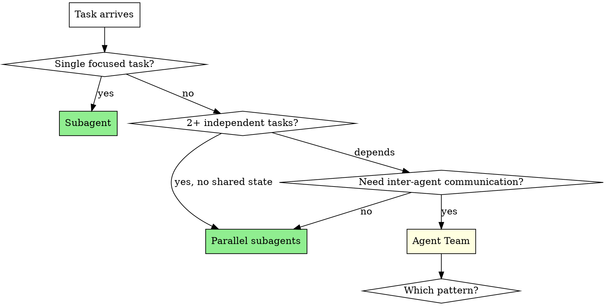
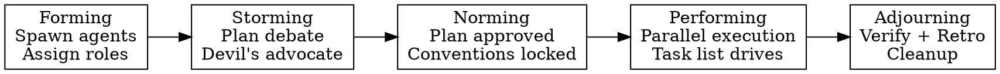

# Orchestrating Work: Subagent vs Agent Team

## Overview

Route tasks to the cheapest effective execution mode. Default to subagents. Escalate to teams only when inter-agent communication is genuinely needed.

**Core principle:** Start cheap (subagent), escalate only with clear signals (team).

## Decision Framework



### Use Subagent When

- Task is self-contained, only the result matters
- Research a question, verify a claim, review a file
- No need for workers to talk to each other
- Token budget is a concern

### Use Parallel Subagents When

- 2+ independent tasks with no shared state
- Each can be understood without context from others
- Results don't contradict or need debate

## Subagent Dispatch Guide

When routing to subagents, you MUST choose the right subagent_type and mode based on whether the task requires code modification.

### Subagent Permission Matrix

| Agent Role | Can Modify Code? | subagent_type | Use For |
|------------|-----------------|---------------|---------|
| `researcher` | NO (read-only) | `Explore` | Search, read, investigate |
| `reviewer` | NO (read-only) | `general-purpose` | Review code, report issues |
| `devil-advocate` | NO (read-only) | `general-purpose` | Challenge findings |
| `implementer` | **YES** | `general-purpose` | Build features, write code |
| `debugger` | **YES** | `general-purpose` | Fix bugs, patch code |
| `finisher` | **YES** | `general-purpose` | Write tests, handle edge cases |
| `architect` | NO (design only) | `general-purpose` | Design interfaces, plan |
| `integrator` | **YES** | `general-purpose` | Fix cross-module issues |

**Critical:** Read-only tasks use `Explore` (faster, cheaper). Code-modification tasks MUST use `general-purpose` (has Edit, Write, Bash tools).

### Dispatch Examples

**Read-only subagent (research):**
```
Task tool:
  subagent_type: Explore
  description: "Investigate auth module"
  prompt: |
    You are a researcher. Investigate the authentication module at src/auth/.
    Find: how tokens are handled, where sessions are stored, any security gaps.
    Report findings with file:line references and confidence levels.
    DO NOT modify any files.
```

**Code-modifying subagent (implement):**
```
Task tool:
  subagent_type: general-purpose
  description: "Implement user profile endpoint"
  prompt: |
    You are an implementer. Build the user profile API endpoint.

    Requirements:
    - GET /api/profile/:id returns user profile
    - Include validation and error handling
    - Write tests

    File ownership: only edit files in src/api/profile/ and tests/api/profile/
    Commit your changes when done.
    Report: files changed, tests passing, any concerns.
```

**Parallel subagents (mixed read/write):**
```
# Subagent 1: read-only research
Task tool (Explore): "Investigate why login is slow"

# Subagent 2: code modification
Task tool (general-purpose): "Fix the N+1 query in user list endpoint"

# Subagent 3: code modification
Task tool (general-purpose): "Add input validation to signup form"
```

### File Ownership for Parallel Subagents

When dispatching multiple code-modifying subagents in parallel, you MUST assign non-overlapping file ownership to prevent conflicts:

```
Subagent A owns: src/api/users/    tests/api/users/
Subagent B owns: src/api/orders/   tests/api/orders/
Subagent C owns: src/components/   tests/components/

Rule: NO subagent edits files outside its assigned scope.
Include this constraint explicitly in the dispatch prompt.
```

### Subagent Output → Next Action

After subagent returns:
- **Read-only subagent:** Synthesize findings, decide next step
- **Code-modifying subagent:** Verify changes (run tests), review diff
- **Multiple subagents returned:** Check for file conflicts before proceeding
- **Subagent failed:** Dispatch a fix subagent with specific instructions, or escalate to team if problem requires coordination

### Use Agent Team When (Escalation Signals)

- Subagent results contradict each other and need debate
- Workers need to share findings and challenge each other
- Task requires ongoing coordination, not one-shot results
- Multiple competing hypotheses need adversarial testing
- Cross-layer work (FE/BE/test) needs integration agent
- Context window filling up from parallel subagent results

### Escalation Trigger: Subagent → Team

If you started with parallel subagents but encounter any of these:
1. Results contradict — need structured debate
2. Context overflow — too many results to synthesize
3. Workers need to coordinate — shared state emerging
4. Ongoing back-and-forth needed — not one-shot

→ Convert to agent team. This is the natural transition point.

## Team Composition: The 10 Rules

Before launching any team, validate these rules derived from management theory:

| # | Rule | Source | Check |
|---|------|--------|-------|
| 1 | Thinking + Action + People roles all covered | Belbin | At least 1 agent per category |
| 2 | No implementation before plan approval | Tuckman | Stage gates enforced |
| 3 | Team/Direction/Structure/Context/Coaching validated | Hackman | 5 conditions met |
| 4 | Falling behind → reduce scope, never add agents | Brooks | No panic-spawning |
| 5 | Team structure mirrors desired architecture | Conway | Split by module/layer |
| 6 | Max 7 agents, default 3-4 | Two-Pizza | Hard cap enforced |
| 7 | Devil-advocate review mandatory | Psych Safety | reviewer or devil-advocate present |
| 8 | Retrospective generated and persisted | Agile Retro | session-reflection runs at end |
| 9 | Lead manages max 4 direct reports | Span of Control | Hierarchy for larger teams |
| 10 | Every agent has specialty + general context | T-Shaped | System prompt has both sections |

## Scenario → Team Pattern Routing

| Signal | Pattern | Skill |
|--------|---------|-------|
| "investigate", "research", "analyze", "review" | Research & Review | team-orchestrator:research-and-review |
| "build", "implement", "new feature", "module" | Feature Development | team-orchestrator:feature-development |
| "bug", "debug", "why does", "root cause" | Competing Hypotheses | team-orchestrator:competing-hypotheses |
| "frontend + backend", "full-stack", "API + UI" | Cross-Layer | team-orchestrator:cross-layer-collaboration |

## Role Pool (agents/)

Agents are organized by Belbin category:

**Thinking roles:**
- `architect` — Plant: creative solutions, system design
- `reviewer` — Monitor-Evaluator: critical evaluation, flaw detection
- `researcher` — Specialist: deep investigation, evidence gathering

**Action roles:**
- `implementer` — Implementer: translates plans to working code
- `debugger` — Shaper: hypothesis-driven debugging, root cause
- `finisher` — Completer-Finisher: edge cases, tests, polish

**People roles:**
- `coordinator` — Coordinator: team lead, task delegation, synthesis
- `integrator` — Teamworker: cross-module consistency, conflict resolution
- `devil-advocate` — Psychological safety: mandatory dissent, challenge assumptions

## Team Sizing Guide

| Scenario | Size | Composition |
|----------|------|-------------|
| Simple research | 2 | lead + 1 researcher |
| Standard investigation | 3-4 | coordinator + researchers + devil-advocate |
| Feature development | 3-5 | coordinator + architect + implementers + reviewer |
| Adversarial debugging | 3-6 | coordinator + debuggers + devil-advocate |
| Cross-layer feature | 4-5 | coordinator + FE impl + BE impl + finisher + integrator |
| Large-scale (7+) | Split | Meta-lead → sub-leads → agents (hierarchy) |

## Pre-Launch Checklist (Hackman's 5 Conditions)

Before `TeamCreate`, verify:

1. **Real Team** — membership defined, roles assigned
2. **Compelling Direction** — clear goal statement, measurable outcome
3. **Enabling Structure** — task list with dependencies, communication channels
4. **Supportive Context** — all agents have required tools
5. **Expert Coaching** — lead agent designated with coordinator prompt

## Lifecycle (Tuckman Mapping)



**Stage gates:**
- Forming → Storming: all agents spawned, context loaded
- Storming → Norming: at least one plan reviewed by devil-advocate
- Norming → Performing: plan approved by lead
- Performing → Adjourning: all tasks completed + verified
- Adjourning → Done: retrospective written to `.claude.md`, team cleaned up

## Cost Awareness

| Mode | Token Cost | When Worth It |
|------|-----------|---------------|
| Single session | Baseline | Sequential, simple tasks |
| Parallel subagents | 2-5x | Independent research, no communication |
| Agent team (3-4) | 5-15x | Complex, needs debate/coordination |
| Agent team (5-7) | 15-30x | Large features, cross-layer, deep debugging |

**Rule:** If subagents can solve it, don't use a team. Teams are for when communication between workers adds genuine value.

## Red Flags — You're Using Teams Wrong

- Team of 1 implementer + lead → just use a subagent
- All agents editing the same file → guaranteed conflicts
- No devil-advocate or reviewer → confirmation bias risk
- Lead doing implementation → enable delegate mode
- Adding agents to a stuck team → Brooks' Law violation
- No retrospective at end → losing learning opportunity

## Integration

**REQUIRED:** Use team-orchestrator:session-reflection at session end to persist learnings.

**Team pattern skills:**
- team-orchestrator:research-and-review
- team-orchestrator:feature-development
- team-orchestrator:competing-hypotheses
- team-orchestrator:cross-layer-collaboration

---
> Converted and distributed by [TomeVault](https://tomevault.io/claim/labrinyang) — claim your Tome and manage your conversions.
<!-- tomevault:4.0:skill_md:2026-04-15 -->
