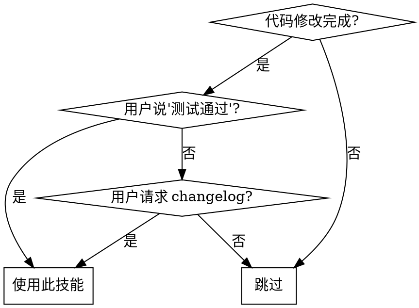

# Changelog Logger

## Overview

自动为代码变更生成结构化 changelog 条目并更新 changelog.md，遵循 Conventional Commits 规范。

## When to Use



**触发条件：**
- 用户说"测试通过"、"测试好了"等
- 用户明确请求"更新 changelog"、"生成 changelog"
- 完成功能开发、Bug 修复或代码优化后准备提交

**何时 NOT 使用：**
- 代码仍在开发中
- 用户未确认测试通过
- 仅为代码审查或代码查看

## Quick Reference

| 修改类型 | Conventional Commit | 使用场景 |
|---------|-------------------|---------|
| 新增功能 | `feat:` | 实现新功能 |
| Bug 修复 | `fix:` | 修复问题 |
| 性能优化 | `perf:` | 提升性能 |
| 代码重构 | `refactor:` | 重构代码(不改变功能) |
| 文档更新 | `docs:` | 更新文档 |
| 代码格式 | `style:` | 格式调整(不影响运行) |
| 测试相关 | `test:` | 添加/修改测试 |
| 其他 | `chore:` | 构建、工具链等 |

## Implementation

### 1. 分析变更

```bash
git status
git diff --name-status
```

### 2. 收集信息

通过 `AskUserQuestion` 收集：
- **修改类型**: 从上述表格选择
- **修改原因**: 为什么改? (用户视角)
- **具体内容**: 怎么改的? (技术细节)

### 3. 生成条目

```markdown
## [YYYY-MM-DD] v[版本号] [类型]

**修改原因：**
[为什么进行这次修改]

**修改内容：**
- [具体修改 1]
- [具体修改 2]

**影响范围：**
- [受影响的文件/模块]

**相关提交：**
- `[commit-id]: 提交信息`

---
```

### 4. 更新 changelog.md

```kotlin
// 读取现有内容
val existing = read("changelog.md")
val content = existing.substringAfter("---\n")

// 生成新条目
val entry = """## ${date} ${version} ${type}
...
"""

// 写入新内容
val newContent = "# Changelog\n\n$entry\n---\n$content"
write("changelog.md", newContent)
```

### 5. 提交

```bash
git add .
git commit -m "docs: 更新 changelog - ${简短描述}"
```

## Format Reference

详见 `references/changelog-format.md`：
- 条目结构规范
- 版本号格式 (语义化版本)
- 日期格式 (YYYY-MM-DD)
- Conventional Commits 规范

## Common Mistakes

| 错误 | 正确做法 |
|-----|---------|
| description 描述工作流程 | 仅描述触发条件 |
| 手动输入所有信息 | 用 `AskUserQuestion` 半自动收集 |
| 忘记版本号 | 遵循语义化版本 (Major.Minor.Patch) |
| 覆盖现有 changelog | 插入到标题后，保留历史 |
| 格式不一致 | 参考 `references/changelog-format.md` |

---
> Converted and distributed by [TomeVault](https://tomevault.io/claim/lengyuefenghua) — claim your Tome and manage your conversions.
<!-- tomevault:4.0:skill_md:2026-04-14 -->
