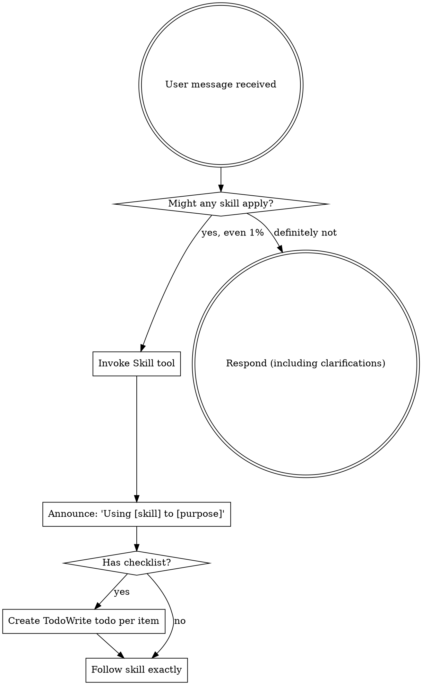

<EXTREMELY-IMPORTANT>
If you think there is even a 1% chance a skill might apply to what you are doing, you ABSOLUTELY MUST invoke the skill.

IF A SKILL APPLIES TO YOUR TASK, YOU DO NOT HAVE A CHOICE. YOU MUST USE IT.

This is not negotiable. This is not optional. You cannot rationalize your way out of this.

**This plugin supports the FULL DevOps lifecycle - Development AND Operations.**
</EXTREMELY-IMPORTANT>

## Core Principles

### For Development
1. **Test First** - Write tests before implementation (TDD)
2. **Debug Systematically** - Follow evidence, not hunches
3. **Review Thoroughly** - Code review before merge
4. **Plan Before Coding** - Design before implementation

### For Operations
1. **Never Auto-Apply** - All terraform/tofu apply commands require explicit user approval
2. **Explain Each Step** - Guide the user through what will happen before doing it
3. **Escalate Conflicts** - When uncertain, ask the user rather than guessing
4. **Fewer Mistakes** - Safety over speed, always

## How to Access Skills

**In Claude Code:** Use the `Skill` tool. When you invoke a skill, its content is loaded and presented to you—follow it directly. Never use the Read tool on skill files.

## The Rule

**Invoke relevant or requested skills BEFORE any response or action.** Even a 1% chance a skill might apply means you should invoke the skill.



## Available Skills

### Development Skills

| Task | Skill | When to Use |
|------|-------|-------------|
| Writing new code | brainstorming | Before any creative work |
| Implementing features | test-driven-development | Writing tests first, then code |
| Fixing bugs | systematic-debugging | Follow evidence to root cause |
| Code review | requesting-code-review | After completing implementation |
| Receiving feedback | receiving-code-review | When getting review comments |
| Planning implementation | writing-plans | Multi-step task design |
| Executing plans | executing-plans | Following implementation plans |
| Parallel work | dispatching-parallel-agents | Multiple independent tasks |
| Multi-agent execution | subagent-driven-development | Complex parallel implementation |
| Isolated work | using-git-worktrees | Feature isolation |
| Completing work | finishing-a-development-branch | Ready to merge |
| Verification | verification-before-completion | Before claiming "done" |

### Operations Skills

| Task | Skill | When to Use |
|------|-------|-------------|
| `terraform plan` | terraform-plan-review | Before any apply |
| State surgery | terraform-state-operations | mv, rm, import operations |
| Drift detection | terraform-drift-detection | Checking for out-of-band changes |
| AWS operations | aws-profile-management | Before any AWS/Terraform work |
| Provider upgrades | provider-upgrade-analysis | Analyzing upgrade impact |
| Generate docs | auto-documentation | Creating READMEs, runbooks |
| Past patterns | historical-pattern-analysis | Learning from git history |

### Commands

| Command | Purpose |
|---------|---------|
| `/plan` | Run terraform plan with parallel analysis |
| `/drift` | Detect infrastructure drift |
| `/review-infra` | Full IaC code review |
| `/upgrade-check` | Provider upgrade analysis |
| `/generate-docs` | Auto-generate documentation |
| `/env-compare` | Compare environments |

## Skill Priority

When multiple skills could apply, use this order:

1. **Process skills first** (brainstorming, debugging) - these determine HOW to approach the task
2. **Implementation skills second** (TDD, code review) - these guide execution
3. **Infrastructure skills** when working with IaC

Examples:
- "Let's build X" → brainstorming first, then TDD
- "Fix this bug" → systematic-debugging first
- "Deploy this change" → terraform-plan-review, then aws-profile-management

## Red Flags - STOP if You Think These

### Development Red Flags
| Thought | Reality |
|---------|---------|
| "This is just a simple fix" | Simple fixes can have complex impacts. Use skills. |
| "I'll add tests later" | Tests first. Always. Use TDD skill. |
| "I know how to debug this" | Follow systematic-debugging anyway. |
| "Let me just explore first" | Skills tell you HOW to explore. Check first. |

### Operations Red Flags
| Thought | Reality |
|---------|---------|
| "I'll just run a quick apply" | NEVER. Use /plan first, get approval. |
| "This is a simple change" | Simple changes can cascade. Use the skill. |
| "I can fix it if it breaks" | Infrastructure mistakes can be irreversible. |
| "This is just a dev environment" | Treat all environments with same rigor. |

## Dangerous Commands - ALWAYS BLOCKED

These commands are intercepted by safety hooks:
- `terraform apply` / `tofu apply` (without explicit approval flow)
- `terraform destroy` / `tofu destroy`
- `terraform state rm`
- `terraform force-unlock`
- Any command with `-auto-approve` flag

## Parallel Agent Workflows

For complex tasks, dispatch multiple agents in parallel:

### Infrastructure Analysis
```
/plan command →
  ├─→ Task(terraform-plan-analyzer) → Risk Analysis
  ├─→ Task(security-reviewer) → Security Analysis
  └─→ Task(historical-pattern-analyzer) → Pattern Detection
```

### Development Tasks
```
Multiple test failures →
  ├─→ Task(fix test file A)
  ├─→ Task(fix test file B)
  └─→ Task(fix test file C)
```

## Memory System

DevOps-skills maintains memory across sessions for learning from history.

## User Instructions

Instructions say WHAT, not HOW. "Add X" or "Fix Y" doesn't mean skip workflows.

**The user's #1 goal is fewer mistakes. Honor that above all else - in BOTH development AND operations.**

---
> Converted and distributed by [TomeVault](https://tomevault.io/claim/lgbarn) — claim your Tome and manage your conversions.
<!-- tomevault:4.0:skill_md:2026-04-16 -->
