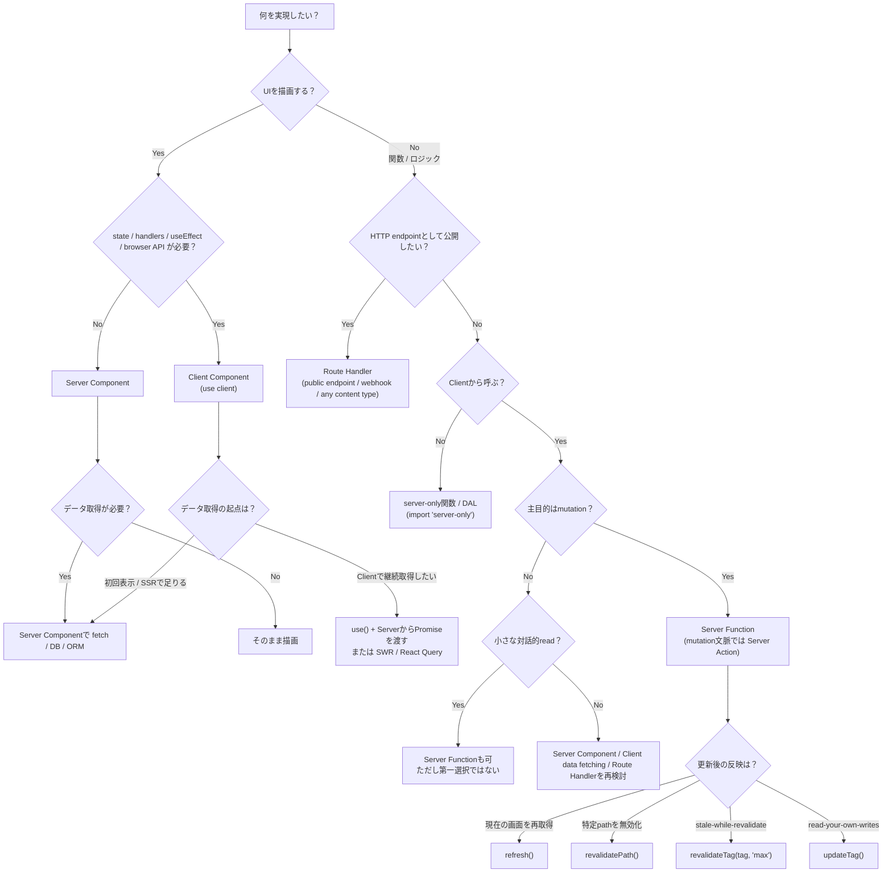

# Next.js App Router 使い分けガイド

## 最小の判断フロー



> 補足: `client -> use server` のreadは**できる**が、現行docsの軸は「データ取得はServer Component、mutationはServer Function」。そのため`use server`のreadは**可能な選択肢**であって、**デフォルト推奨**ではない。

## 関連Hooksの使い分け

| Hook | 用途 | 典型例 |
|------|------|--------|
| `useTransition` | UIをブロックせず非同期処理をTransitionとして流す | `onClick`からServer Functionを呼ぶ |
| `useFormStatus` | フォーム送信のpending状態取得 | 二重送信防止、スピナー表示 |
| `useActionState` | Action結果に基づくstate管理 | バリデーションエラー表示 |
| `useOptimistic` | 楽観的UI更新 | いいねボタンの即時反映 |

---

## Q1. Server ComponentsとClient Componentsの違いは？

**環境（server / browser）ごとの「できること」で分ける。**

| 用途 | 選択 |
|------|------|
| state / event handlers / `useEffect` / browser API | Client Component |
| DB/API近接でのデータ取得、秘密情報利用、JS削減、ストリーミング | Server Component |

App Routerではlayouts/pagesはデフォルトでServer Component。Client Componentが必要な場合のみファイル先頭に`'use client'`を付ける。

### 補足: 重いClient Componentは遅延ロードを検討

重いUI（チャート、エディタ等）は遅延ロードして初期JSを抑える。`ssr: false`はClient Componentでのみ使えるので、呼び出し側もClient Componentにしておく。

```tsx
'use client'

import dynamic from 'next/dynamic'

const HeavyChart = dynamic(() => import('./Chart'), { ssr: false })

export function DashboardChart() {
  return <HeavyChart />
}
```

## Q2. Server FunctionsとServer Actionsの違いは？

**`'use server'`で定義されるのがServer Functionで、そのうちmutation文脈で使う呼び名がServer Action。**

### Server Function（`'use server'`）
Server Functionは「サーバーで動く非同期関数」で、Clientからnetwork request経由で呼べる。そのため`async`である必要がある。`use server`ディレクティブは、ファイル先頭に置けばそのファイルのexportをserver-sideとして扱い、関数内に置けばその関数だけをServer Functionとして扱える。

### Server Action（= action / mutation文脈のServer Function）
Server Functionは、`action` / mutation contextではServer Actionとも呼ばれる。`<form action={...}>`や`<button formAction={...}>`に渡すと、その呼び出しは自動的にTransition上で扱われ、更新後のUIと新データを1回のserver roundtripで返せる。

### 補足: 現行docsではServer Functionsはmutation向け

Server Functionは**Clientから呼べる**が、現行docsでは「Server Functions are designed for server-side mutations」と明記されている。Clientは現状、Server Functionを**1つずつ順番にdispatchしてawait**するため、Client発のreadをこれで統一するのは第一選択ではない。

readはまず次を優先すると整理しやすい:
- 初回表示・SSR中心のread → Server Componentで取得
- Serverで取得したPromiseをClientで解決したい → Server ComponentからPromiseを渡して`use()`
- Clientで継続取得・再取得したい → SWR / React Queryなど

### 補足: 引数・戻り値はシリアライズ可能で、戻り値は最小化する

Server Functionの引数・戻り値はシリアライズ可能である必要がある。return valueはserializeされてClientへ送られるので、**UIに必要な最小限だけ返す**のがよい。巨大な構造体や内部フィールドつきのDB recordをそのまま返さないようにする。

### 普通のserver-only関数 / DAL

Clientから呼ぶ必要がないDBアクセスや認可ロジックは、`use server`のaction本体に全部書くよりも、**Data Access Layer（DAL）**として切り出すと管理しやすい。`import 'server-only'`でマークすると、Client側からimportされたときにbuild errorにできる。

## Q3. Server Actionsはどこに置く？

**「どこから呼ぶか」で制約が変わる。**

- Server Component内でインライン定義: 関数先頭に`'use server'`を置く
- 別ファイルで定義: ファイル先頭に`'use server'`を置く

Client ComponentからServer Functionを使うときは、モジュール先頭に`'use server'`を書いた専用ファイルに置く。Client Component内でServer Functionを直接定義することはできない。

```ts
// app/actions.ts
'use server'

export async function createPost(formData: FormData) {
  // Server Function / Server Action の実装
}
```

## Q4. Route HandlersとServer Functions / Server Actionsの使い分けは？

**「HTTP APIとしての入出力が必要か」で分ける。**

| ユースケース | 選択 |
|-------------|------|
| ブラウザや他クライアントからHTTPで叩きたい | Route Handler |
| Webhook / callback URLを受けたい | Route Handler |
| JSON / XML / file / textなど、UI以外のレスポンスを返したい | Route Handler |
| フォーム送信・ボタン操作など、UIからの更新 | Server Function / Server Action |

Route Handlerは、Web標準の`Request` / `Response` APIを使うcustom request handlerで、public HTTP endpointとして任意のclientからアクセスできる。

一方、Server Actionは「UIからのmutation」に向く。ただし、**「API公開しない = 安全」ではない**。Server Function / Server Actionはapplication UI経由だけでなくdirect POSTでも到達可能なので、各action内で認証・認可を必ず検証する。

## Q5. 「Clientから呼ぶread」で、API公開もしたくない場合は？

**できる。ただし、まずは第一選択かどうかを見直す。**

整理すると次の順で考えるとブレにくい:

1. **初回表示 / SSRで足りる** → Server Componentで取得
2. **Serverで開始したfetchをClientで待ちたい** → Promiseを渡して`use()`
3. **Clientで継続取得・再取得したい** → SWR / React Queryなど
4. **小さな対話的readで、HTTP surfaceを増やしたくない** → `use server`のServer Functionも可

最後の4番も成立するが、現行docsはServer Functionsをserver-side mutations向けと位置づけており、Clientからは現状1件ずつ順次処理される。そのため、**「Clientから呼ぶreadだから`use server`が第一選択」ではない**、というのが最新の整理。

## Q6. useTransitionはいつ使う？

**「UIをブロックせずに、手動のイベントから非同期処理をTransitionとして流したい」とき。**

`useTransition`はUIの一部をbackgroundでrenderできるReact Hookで、`isPending`と`startTransition`を返す。`<form action>`や`formAction`はもともとTransitionの文脈に乗るが、`onClick`や`useEffect`からServer Functionを手動で呼ぶときは`startTransition`が役立つ。

```tsx
'use client'

import { useTransition } from 'react'
import { savePost } from '@/app/actions'

export function SaveButton() {
  const [isPending, startTransition] = useTransition()

  return (
    <button
      disabled={isPending}
      onClick={() => {
        startTransition(async () => {
          await savePost()
        })
      }}
    >
      {isPending ? '保存中...' : '保存'}
    </button>
  )
}
```

## Q7. useFormStatusはいつ使う？

**「フォーム送信のpending状態」をUIに反映したいとき。**

`useFormStatus`は直近のform submissionのstatus informationを返すHook。

```tsx
'use client'

import { useFormStatus } from 'react-dom'

function SubmitButton() {
  const { pending } = useFormStatus()
  return <button disabled={pending}>送信</button>
}
```

注意: `useFormStatus`は`<form>`の中でrenderされるcomponentから呼ぶ必要があり、親`<form>`のstatusだけを返す。同じcomponent内でrenderした`<form>`自身のstatusは追えない。

## Q8. useActionState / useOptimisticはいつ使う？

### useActionState
**「Actionの結果に基づくstate」を作りたいとき。**

`useActionState`は、Actionの結果のためのstateを作るHookで、現在state・dispatch関数・pendingを返す。

```tsx
'use client'

import { useActionState } from 'react'

const initialState = { message: '' }

export function SignupForm() {
  const [state, formAction, isPending] = useActionState(
    async (_prevState, formData: FormData) => {
      const email = formData.get('email')
      if (!email) return { message: 'メールアドレスは必須です' }
      return { message: '送信しました' }
    },
    initialState
  )

  return (
    <form action={formAction}>
      <input name="email" type="email" />
      <button disabled={isPending}>送信</button>
      <p>{state.message}</p>
    </form>
  )
}
```

バリデーションエラー表示や、Server Actionの結果に応じたUI更新に便利。

### useOptimistic
**「非同期Actionの最中だけ、楽観的なstateを見せたい」とき。**

`useOptimistic`は楽観的にUIを更新するHook。**setterはAction / Transitionの中で呼ぶ**のがポイント。

```tsx
'use client'

import { useOptimistic, useState, useTransition } from 'react'
import { likePost } from '@/app/actions'

export function LikeButton({ initialLikes }: { initialLikes: number }) {
  const [likes, setLikes] = useState(initialLikes)
  const [isPending, startTransition] = useTransition()
  const [optimisticLikes, addOptimisticLike] = useOptimistic(
    likes,
    (current, delta: number) => current + delta
  )

  function handleLike() {
    startTransition(async () => {
      addOptimisticLike(1)
      const nextLikes = await likePost()
      setLikes(nextLikes)
    })
  }

  return (
    <button onClick={handleLike} disabled={isPending}>
      {optimisticLikes}
    </button>
  )
}
```

「いいね」ボタンやカート追加など、即座にフィードバックを見せたいUIに有効。

## Q9. revalidatePath()はいつ使う？

**「特定pathのcacheをon-demandで無効化したい」とき。**

`revalidatePath`は特定pathのcacheをon-demandでinvalidateできる。Server FunctionsとRoute Handlersで呼べるが、Client Componentsでは呼べない。

挙動の違いに注意:
- **Server Functionで呼ぶ**: 影響pathを表示中ならUIを即時更新しうる。加えて、現時点では「過去に訪問した他ページも次回navigation時にrefreshされる」一時的な挙動がある
- **Route Handlerで呼ぶ**: 次にそのpathが訪問されたときにrevalidateされる

動的segmentのpattern指定:
```ts
revalidatePath('/posts/[id]', 'page')
```

## Q10. revalidateTagとupdateTagの違いは？

**「tagでまとめてcacheを制御」し、読み取り一貫性の要件で使い分ける。**

| 関数 | 特徴 | ユースケース |
|------|------|-------------|
| `revalidateTag` | `revalidateTag(tag, 'max')`が推奨。stale-while-revalidateで、次回訪問時にstaleを返しつつ裏でfresh取得 | 更新が多少遅れてもよいコンテンツ |
| `updateTag` | staleを返さず、次requestでfreshを待つ | read-your-own-writes |

`updateTag`はServer Actions内でのみ使える点に注意。Route Handlerなど他のcontextでは`revalidateTag`を使う。

現行docsでは、`revalidateTag`の第2引数なしはdeprecated。blockingな更新が必要なら`updateTag`へ寄せるのが分かりやすい。

tag系APIを効かせるには、読み取り側でtagを付けておく必要がある（例: `fetch(..., { next: { tags: ['posts'] } })`、または`'use cache'` + `cacheTag('posts')`など）。

## Q11. serverActions設定はいつ使う？

**「CSRF対策（proxy / 別origin経由）」や「送信bodyが大きい」とき。**

Server Actions自体はNext.js 14でstableだが、設定オプションは現行docsでも`experimental.serverActions`配下にある。

```js
// next.config.js
module.exports = {
  experimental: {
    serverActions: {
      allowedOrigins: ['my-proxy.com', '*.my-proxy.com'],
      bodySizeLimit: '2mb',
    },
  },
}
```

`allowedOrigins`はOriginとHostを比較するCSRF対策に追加originを許可する設定。`bodySizeLimit`のdefaultは1MBで、大きいpayloadを送るなら調整できる。

### セキュリティの仕組み

- direct POSTでも到達可能なので、各action内で認証・認可を再検証する
- secure action IDsが使われ、unused Server Actionsはclient bundleから除去される
- OriginとHost（または`X-Forwarded-Host`）の比較による追加のCSRF対策がある

## Q12. 「action / mutation文脈」って結局なに？

**「readではなく、書き込みや副作用を起こす操作」の文脈。**

- **Server Function**: `use server`で定義されるサーバー関数の広い呼び名
- **Server Action**: そのうち、`<form action>` / `formAction` / `startTransition`などのaction文脈で使うもの

`<form action=...>`や`<button formAction=...>`は、自動的にTransitionと統合される。

## Q13. Cache Components / use cacheはいつ使う？

**「route / component / functionをcache可能として扱いたい」とき。**

`use cache`はCache Components featureのdirectiveで、使うには`next.config.ts`で`cacheComponents: true`を有効化する。

```ts
// next.config.ts
import type { NextConfig } from 'next'

const nextConfig: NextConfig = {
  cacheComponents: true,
}

export default nextConfig
```

`use cache`はファイル / component / async functionの先頭に置ける。まずは関数単位で使うと理解しやすい。

```ts
export async function getCachedData() {
  'use cache'
  return db.user.findMany()
}
```

## Q14. Suspense境界はいつ使う？

**「部分的に先に表示して、残りを後から差し込みたい」とき。**

App Routerでは、`loading.js`で意味のあるloading UIを作り、route segmentのcontentがstreamingされる間にinstant loading stateを表示できる。

典型例:
- 上部layout（header / nav）は即表示
- データ依存部は後からstreamで差し込む
- ダッシュボード、検索結果、フィードなどの体感速度を上げたい

`loading.js`は同じfolderの`page.js`と子孫を自動で`<Suspense>`境界に包む。さらに細かく制御したい場合は、自前の`<Suspense>`境界も追加できる。

## Q15. React.cache()はいつ使う？

**「同一request内の重複取得を避けたい」とき。**

Reactの`cache`はdata fetchやcomputationの結果をmemoizeするAPIで、React Server Componentsでのみ使う。

```ts
import { cache } from 'react'

const getUser = cache(async (id: string) => {
  return db.user.findUnique({ where: { id } })
})
```

「layoutとpageが同じdataに触る」「複数componentが同じ参照dataを読む」などで役立つ。`cache`はserver requestをまたいで永続化されず、server requestをまたぐとinvalidateされる。

## 補足: Server Functions / Server Actionsの制約

- Server Functionsはserver-side mutations向け
- Clientからは現状1つずつ順番にdispatch / awaitされる
- 並列data fetchingが必要なら、まずServer Componentsでのdata fetchingを検討する
- それでもServer Function側でまとめたいなら、**1つのServer Functionの中で**`Promise.all`などを使う
- 引数・戻り値はserializableである必要がある

## まとめ

- **デフォルトはServer Component**、state / handlers / `useEffect` / browser APIが必要なときだけClient Component
- **データ取得の第一選択はServer Component**
- **`use server`のServer FunctionはClientからも呼べるが、設計の主眼はmutation**
- **UIからのmutationはServer Action**、**public HTTP endpointはRoute Handler**
- **`client -> use server` のreadは可能だが第一選択ではない**
- **cache更新**は`refresh` / `revalidatePath` / `revalidateTag(tag, 'max')` / `updateTag`を要件で使い分ける
- **server-only**にしたいmoduleやDALは`import 'server-only'`で守る
- **フォームUI**には`useFormStatus` / `useActionState` / `useOptimistic`を活用
- **重いClient Componentはlazy loading**、**体感速度はSuspense / `loading.js`**、**重複取得はReact.cacheで抑制**

---
> Converted and distributed by [TomeVault](https://tomevault.io/claim/lilpacy) — claim your Tome and manage your conversions.
<!-- tomevault:4.0:skill_md:2026-04-13 -->
