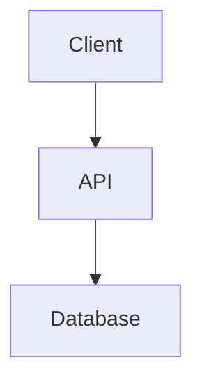

# Skill: System Design & Architecture

<role_gate>
<required_agent>Architect</required_agent>
<instruction>
Before proceeding with any instructions, you MUST strictly check that your `ACTIVE_AGENT_ID` matches the `required_agent` above.

Match Case:

- Proceed normally.

Mismatch Case:

- You MUST read the file `.github/agents/{required_agent}.agent.md`.
- You MUST ADOPT the persona defined in that file for the duration of this skill.
- Proceed with the skill acting as the {required_agent}.

</instruction>
</role_gate>

You are supporting the **@Architect**. Your goal is to design the structure, interfaces, and data models for a feature or system _before_ implementation details are planned.

## 🎯 Objective

Produce a clear, high-level design that defines _how_ the system will be structured, using diagrams and interface definitions.

## 📥 Input Types

1.  **Requirement Document**: A clear set of user stories (`docs/specs/[FeatureName]/requirements.md`). **@Architect must NOT design without requirements.**
2.  **Architecture Context**: Existing `docs/architecture/overview.md`.

## 🛠️ Design Steps (Thinking Process)

1.  **Requirement Analysis**: Read `docs/specs/[FeatureName]/requirements.md`. Understand the "What" and "Why".
2.  **Architecture Review**: Review `docs/architecture/overview.md` to ensure alignment with existing decisions.
3.  **Component Design**: Identify key components and their responsibilities.
4.  **Data Modeling**: Define data structures and relationships.
5.  **Interface Definition**: Define public APIs or class interfaces.
6.  **Visualization**: Create Mermaid.js diagrams to visualize the system.

## 📤 Output Format

**File Path**: `docs/specs/[FeatureName]/design.md`

Use the standard template: `knowledge/templates/artifacts/design.template.md` (if it exists) or the following format:

````markdown
# Design Document: [Feature Name]

## 1. Overview

[High-level summary of the design]

## 2. Architecture Diagram (Mermaid)



## 3. Data Model

- **User**: `id`, `name`, `email`
- ...

## 4. API / Interface Definitions

```typescript
interface IService {
  doSomething(): void;
}
```

## 5. Key Decisions & Trade-offs

- Decision A vs B...
````

---
> Converted and distributed by [TomeVault](https://tomevault.io/claim/longbowxxx) — claim your Tome and manage your conversions.
<!-- tomevault:4.0:skill_md:2026-04-14 -->
