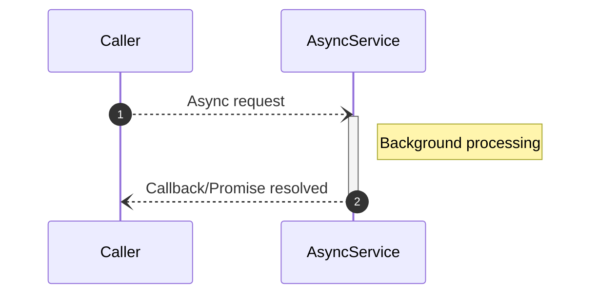
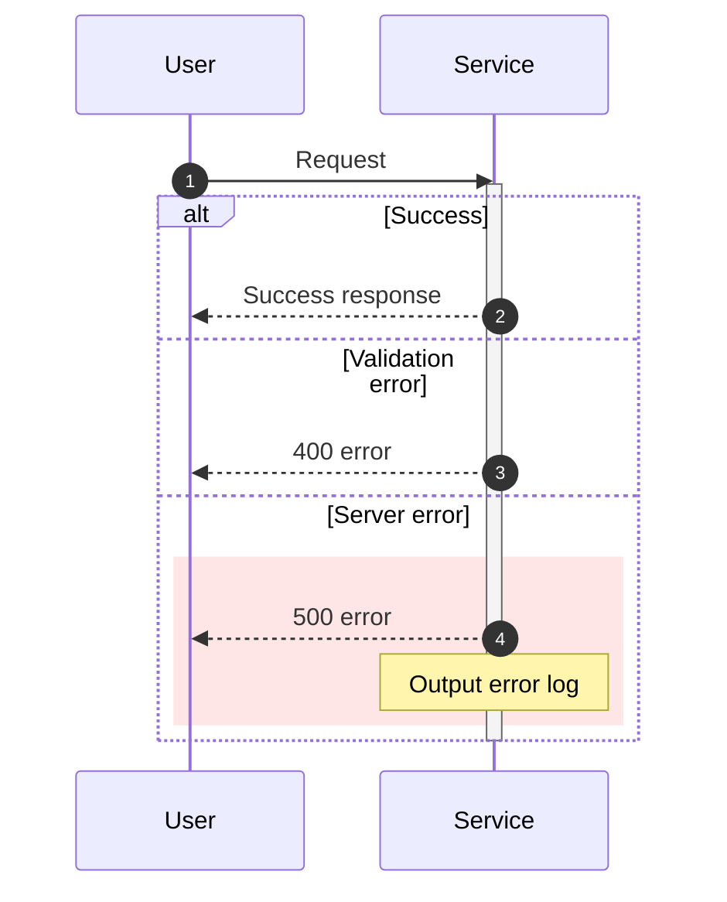

# Sequence Diagram Generation Skill

This skill generates Mermaid sequence diagrams for specified code behavior.

## When to Use This Skill

- Generating a sequence diagram for a specific feature
- Adding sequence diagrams to existing docs
- Preparing Mermaid sequence diagram templates

## Prerequisites

- Target feature/file is identified
- Call chain is understood (if unknown, run `document.codeflow.analyze` first)

## Step-by-Step Workflows

### Workflow: Generate Sequence Diagram

1. Identify entry point of the target feature
2. Trace function call chain
3. List participating classes/modules as `participant`
4. Represent call order with arrows
5. Represent branching with `alt/else`
6. Represent loops with `loop`
7. Mark async processing appropriately
8. Include error cases

## Mermaid Syntax Reference

### Basic Template

```mermaid
sequenceDiagram
    autonumber
    participant Actor as User/Trigger
    participant A as Class A
    participant B as Class B

    Actor->>A: Action/Event
    activate A
    A->>B: Method call
    activate B
    B-->>A: Return value
    deactivate B

    alt Success
        A-->>Actor: Success response
    else Error
        A-->>Actor: Error message
    end
    deactivate A
```

### Arrow Types

| Syntax | Meaning |
|--------|---------|
| `->>` | Synchronous message (solid line, arrow) |
| `-->>` | Response message (dashed line, arrow) |
| `-)` | Asynchronous message (solid line, open arrow) |
| `--)` | Asynchronous response (dashed line, open arrow) |

### Block Syntax

| Syntax | Purpose |
|--------|---------|
| `alt/else/end` | Conditional branching |
| `opt/end` | Optional processing |
| `loop/end` | Loop |
| `par/and/end` | Parallel processing |
| `rect rgb(r,g,b)/end` | Highlight processing group |
| `Note over A,B: text` | Supplementary note |
| `activate A / deactivate A` | Show processing duration |
| `autonumber` | Auto step numbering |

### Async Processing Example



### Error Handling Example



## Rules

- Write labels in Japanese
- Add step numbers with `autonumber`
- Show processing duration with `activate/deactivate`
- Add supplementary notes with `Note`
- Enclose processing groups with `rect`
- Recommend up to 8 participants per diagram (split if more)

## Troubleshooting

| Problem | Solution |
|---------|----------|
| Diagram is too complex | Split into sub-flows and add links via `Note` |
| Too many participants | Group less-relevant components |
| Mermaid fails to render | Check special character escaping and unclosed syntax |

---
> Converted and distributed by [TomeVault](https://tomevault.io/claim/luckgakidz) — claim your Tome and manage your conversions.
<!-- tomevault:4.0:skill_md:2026-04-14 -->
