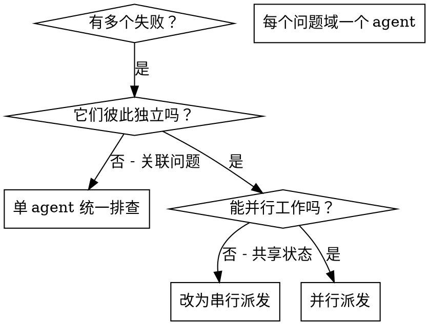

# Dispatching Parallel Agents

## Overview

当你遇到多个互不相关的失败（不同测试文件、不同子系统、不同 bug）时，串行排查会浪费大量时间。这些调查通常彼此独立，完全可以并行。

**核心原则：** 每个独立问题域派发一个 agent，让它们并行工作。

## When to Use



**适用：**
- 3+ 个测试文件失败且 root cause 不同
- 多个子系统独立损坏
- 每个问题都能在不依赖其他问题上下文的情况下理解
- 排查之间没有共享状态

**不适用：**
- 失败高度关联（修一个可能顺带修其他）
- 必须理解全局系统状态才能判断
- agent 会互相干扰（同一文件/资源/状态）

## The Pattern

### 1) 划分独立问题域（Domain）

按“坏在哪”分组，例如：
- 文件 A 测试：tool approval 流程
- 文件 B 测试：batch completion 行为
- 文件 C 测试：abort 功能

每个 domain 彼此独立——修 tool approval 不应影响 abort 测试。

### 2) 给每个 agent 一份聚焦任务

每个 agent 都要拿到：
- **明确 scope：** 一个测试文件或一个子系统
- **清晰目标：** 让这些测试通过
- **约束：** 不要改其他无关代码
- **期望输出：** 总结你发现了什么、修了什么

### 3) 并行派发

```typescript
// 在 Claude Code / AI 环境中
Task("修复 agent-tool-abort.test.ts 的失败")
Task("修复 batch-completion-behavior.test.ts 的失败")
Task("修复 tool-approval-race-conditions.test.ts 的失败")
// 三个任务并行运行
```

### 4) Review 并集成

当 agent 返回后：
- 逐个阅读总结
- 确认修复互不冲突
- 运行完整测试套件
- 集成所有改动

## Agent Prompt 结构

好的 agent prompt 应该：
1. **聚焦**：只覆盖一个问题域
2. **自包含**：包含理解问题所需的上下文
3. **明确输出**：要求 agent 返回什么

```markdown
修复 src/agents/agent-tool-abort.test.ts 中 3 个失败的测试：

1. "should abort tool with partial output capture" - 期望消息里包含 'interrupted at'
2. "should handle mixed completed and aborted tools" - fast tool 被 abort 了但期望 completed
3. "should properly track pendingToolCount" - 期望 3 个结果但拿到 0

这些看起来是 timing/race condition 问题。你的任务：

1. 阅读测试文件，理解每个测试在验证什么
2. 找 root cause：是 timing 问题还是实现 bug？
3. 修复方式（择其必要者）：
   - 用事件/状态驱动等待替换任意 timeout
   - 如果确实存在 abort 实现 bug，就修实现
   - 如果测试在验证“已改变的行为”，再调整期望

不要简单把 timeout 加大——要找到真正原因。

返回：你发现的 root cause + 你做的修改摘要。
```

## Common Mistakes

**❌ 太宽泛：** “把所有测试都修好” ——agent 会迷失  
**✅ 够具体：** “只修 agent-tool-abort.test.ts” ——scope 清晰

**❌ 没上下文：** “修 race condition” ——不知道在哪  
**✅ 给上下文：** 粘贴错误信息与测试名

**❌ 没约束：** agent 可能大改重构  
**✅ 给约束：** “不要改 production code” 或 “只改测试”

**❌ 输出要求模糊：** “修好它” ——你不知道改了什么  
**✅ 输出清晰：** “返回 root cause 与改动摘要”

## When NOT to Use

- **失败有关联**：先合并排查（修一个可能修一片）
- **需要全局上下文**：必须看完整系统才能理解
- **探索性排障**：你甚至还不确定坏在哪
- **共享状态**：会互相干扰（改同一文件、抢同一资源）

## Real Example from Session

**场景：** 一次大重构后，3 个文件里有 6 个测试失败

**失败分布：**
- `agent-tool-abort.test.ts`：3 个失败（timing issues）
- `batch-completion-behavior.test.ts`：2 个失败（tools 没执行）
- `tool-approval-race-conditions.test.ts`：1 个失败（execution count = 0）

**判断：** 3 个独立 domain —— abort 逻辑 / batch completion / race conditions 互不依赖

**派发：**
```
Agent 1 → 修复 agent-tool-abort.test.ts
Agent 2 → 修复 batch-completion-behavior.test.ts
Agent 3 → 修复 tool-approval-race-conditions.test.ts
```

**结果：**
- Agent 1：用事件驱动等待替换 timeout
- Agent 2：修复 event 结构 bug（threadId 放错位置）
- Agent 3：增加等待异步 tool 执行完成的逻辑

**集成：** 修复互不冲突，全套测试绿

**时间节省：** 并行解决 3 个问题，用时接近串行解决 1 个问题

## Key Benefits

1. **并行化**：多条排查同时进行
2. **聚焦**：每个 agent scope 更窄，负担更低
3. **独立**：互不干扰
4. **速度**：3 个问题用接近 1 个问题的时间解决

## Verification

agent 返回后：
1. **Review 每份总结**：理解具体改了什么
2. **检查冲突**：是否改了同一处代码？
3. **跑全套**：验证改动能一起工作
4. **抽查**：agent 可能犯系统性错误

## Real-World Impact

来自一次排障记录（2025-10-03）：
- 3 个文件共 6 个失败
- 并行派发 3 个 agent
- 调查并行完成
- 修复成功集成
- agent 之间零冲突

---
> Converted and distributed by [TomeVault](https://tomevault.io/claim/lyfe2025) — claim your Tome and manage your conversions.
<!-- tomevault:4.0:skill_md:2026-04-13 -->
