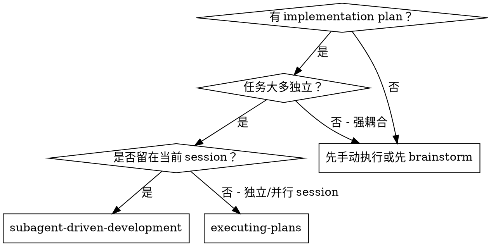
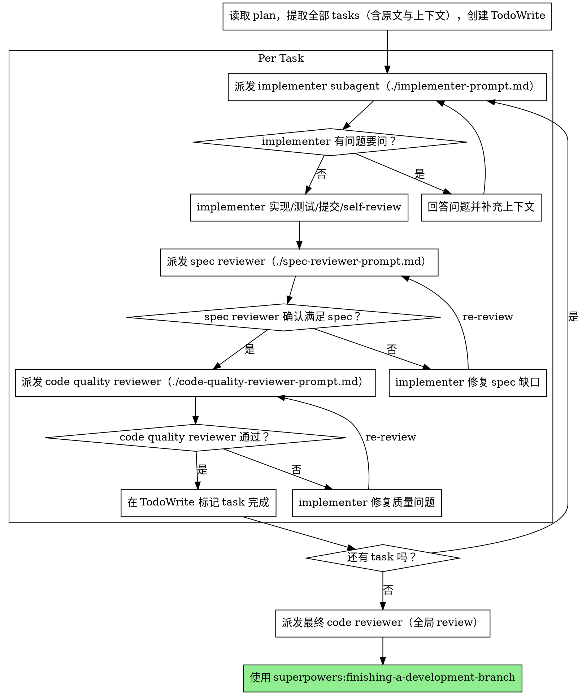

# Subagent-Driven Development

按计划执行：每个 task 派发一个全新的 implementer subagent；每个 task 完成后做两阶段 review（先 spec compliance，再 code quality）。

**核心原则：** 每 task 一个新 subagent + 两阶段 review（spec → quality）= 高质量、快迭代

## When to Use



**对比 Executing Plans（独立 session）：**
- 同一 session（无上下文切换）
- 每 task 新 subagent（避免上下文污染）
- 每 task 自动两阶段 review（先 spec，再质量）
- 迭代更快（task 之间无需人类中断）

## The Process



## Prompt Templates

- `./implementer-prompt.md`：派发 implementer subagent
- `./spec-reviewer-prompt.md`：派发 spec compliance reviewer subagent
- `./code-quality-reviewer-prompt.md`：派发 code quality reviewer subagent

## Example Workflow

```
你：我正在使用 Subagent-Driven Development 来执行这个计划。

[只读一次计划文件：docs/plans/feature-plan.md]
[提取 5 个 tasks 的完整原文与上下文]
[创建 TodoWrite，包含所有 tasks]

Task 1：安装 hook 脚本

[拿到 Task 1 原文与上下文（已提前提取）]
[派发 implementer subagent，附上完整 task 文本 + 上下文]

Implementer：“开始前确认下：hook 应该安装在 user 级还是 system 级？”

你：“user 级（~/.config/superpowers/hooks/）”

Implementer：“收到，开始实现……”
[稍后] Implementer：
  - 实现 install-hook 命令
  - 添加测试，5/5 通过
  - 自检（self-review）：发现漏了 --force flag，已补上
  - 已提交

[派发 spec compliance reviewer]
Spec reviewer：✅ 满足 spec——需求齐全，没有多做

[获取 git SHAs，派发 code quality reviewer]
Code reviewer：优点：覆盖好、代码干净。问题：无。结论：通过。

[标记 Task 1 完成]

Task 2：Recovery modes

[派发 implementer subagent]
Implementer：[无问题，直接做]
Implementer：
  - 新增 verify/repair modes
  - 8/8 tests 通过
  - 自检（self-review）：OK
  - 已提交

[派发 spec compliance reviewer]
Spec reviewer：❌ 问题：
  - 缺失：进度汇报（spec 写了“每 100 项报告一次”）
  - 多做：新增了 --json flag（未要求）

[implementer 修复]
Implementer：移除 --json flag，新增进度汇报

[spec reviewer 复审]
Spec reviewer：✅ 现在满足 spec

[派发 code quality reviewer]
Code reviewer：优点：扎实。问题（重要）：magic number（100）

[implementer 修复]
Implementer：抽出 PROGRESS_INTERVAL 常量

[code quality reviewer 复审]
Code reviewer：✅ 通过

[标记 Task 2 完成]

...

[全部 tasks 完成后]
[派发最终 code-reviewer]
Final reviewer：需求满足，可以合并

完成！
```

## Advantages

**对比手动执行：**
- subagent 更自然地遵循 TDD
- 每 task 新上下文（不混淆）
- 并行安全（subagent 不互相干扰）
- subagent 可在开工前或过程中提问

**对比 Executing Plans：**
- 同一 session（无需交接）
- 持续推进（无需等待）
- review checkpoint 自动化

**效率收益：**
- controller 不用重复读文件（一次提取，持续复用）
- controller 精选并提供最需要的上下文
- subagent 一开始就拿到完整信息
- 问题在开工前暴露（不是做完才发现）

**质量闸门（Quality gates）：**
- self-review 先抓一轮问题
- 两阶段 review：spec compliance → code quality
- review loop 确保修复真的生效
- spec compliance 防止多做/少做
- code quality 确保实现本身够好

**成本：**
- subagent 调用更多（每 task：implementer + 2 reviewers）
- controller 需要更多前置准备（提前提取所有 tasks）
- review loop 会增加迭代次数
- 但能更早抓问题（比后期 debugging 便宜）

## Red Flags

**Never：**
- 跳过 review（spec 或 quality 任意一类）
- 带着未修复问题继续推进
- 并行派发多个 implementer（会冲突）
- 让 subagent 自己读 plan 文件（应提供完整文本）
- 跳过 scene-setting 上下文（subagent 需要理解任务放在哪）
- 忽略 subagent 的问题（先回答再让其继续）
- 对 spec compliance 接受“差不多”（reviewer 找到问题 = 还没完成）
- 跳过 review loop（reviewer 找到问题 → implementer 修 → 必须再审）
- 用 implementer 的 self-review 替代真正的 review（两者都需要）
- **在 spec compliance ✅ 之前就做 code quality review**（顺序错误）
- 当任一 review 还有 open issues 时就进入下一个 task

**如果 subagent 提问：**
- 回答清晰、完整
- 需要时补上下文
- 不要催促其跳过理解直接开写

**如果 reviewer 提问题：**
- implementer（同一个 subagent）修复
- reviewer 复审
- 重复直到通过
- 不要跳过 re-review

**如果 subagent 失败：**
- 派发 fix subagent，给具体指令
- 不要自己手动修（避免上下文污染）

## Integration

**必需的 workflow skills：**
- `superpowers:writing-plans`：生成要执行的计划
- `superpowers:requesting-code-review`：reviewer subagent 的模板/规范
- `superpowers:finishing-a-development-branch`：全部任务完成后的收尾

**subagent 应使用：**
- `superpowers:test-driven-development`：每个 task 遵循 TDD

**替代 workflow：**
- `superpowers:executing-plans`：适用于独立/并行 session

---
> Converted and distributed by [TomeVault](https://tomevault.io/claim/lyfe2025) — claim your Tome and manage your conversions.
<!-- tomevault:4.0:skill_md:2026-04-13 -->
