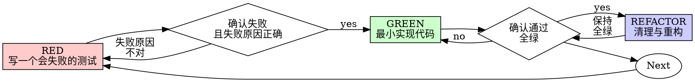

# Test-Driven Development (TDD)

## Overview

先写测试。看它失败。再写最小代码让它通过。

**核心原则：** 如果你没有亲眼看过测试失败，你就不知道它是否真的在测试正确的东西。

**只遵守字面、不遵守精神，就是在违反规则。**

## When to Use

**永远：**
- 新功能
- 修 bug
- 重构
- 行为变更

**例外（必须问 human partner）：**
- 一次性原型（throwaway prototype）
- 生成代码（generated code）
- 配置文件（configuration）

如果你脑子里出现“就这一次跳过 TDD 吧”——停。那是在自我合理化。

## The Iron Law

```
没有先失败的测试，就禁止写 production code
```

先写了代码再写测试？删掉。重来。

**没有例外：**
- 不要保留代码当“参考”
- 不要边写测试边“参考/微调”实现
- 不要偷看它
- “删掉”就是删掉

从测试重新实现。就这样。

## Red-Green-Refactor



### RED：写一个会失败的测试

写一个最小测试，明确“应该发生什么”。

<Good>
```typescript
test('失败时会重试 3 次', async () => {
  let attempts = 0;
  const operation = () => {
    attempts++;
    if (attempts < 3) throw new Error('fail');
    return 'success';
  };

  const result = await retryOperation(operation);

  expect(result).toBe('success');
  expect(attempts).toBe(3);
});
```
命名清晰、测真实行为、只测一件事
</Good>

<Bad>
```typescript
test('重试能工作', async () => {
  const mock = jest.fn()
    .mockRejectedValueOnce(new Error())
    .mockRejectedValueOnce(new Error())
    .mockResolvedValueOnce('success');
  await retryOperation(mock);
  expect(mock).toHaveBeenCalledTimes(3);
});
```
命名含糊、测的是 mock 而不是代码行为
</Bad>

**要求：**
- 一次只测一个行为
- 测试名清晰
- 尽量用真实代码（除非无法避免，不要上来就 mock）

### Verify RED：亲眼看它失败

**必须做。永远不要跳过。**

```bash
npm test path/to/test.test.ts
```

确认：
- 测试是“失败”（fail），不是“报错”（error）
- 失败信息符合预期
- 失败原因是“功能缺失”，不是 typo/测试写错

**测试直接通过？** 你在测试既有行为。修测试。  
**测试报错？** 修报错，反复运行直到它“正确地失败”。

### GREEN：最小实现代码

写刚好能让测试通过的最简单代码。

<Good>
```typescript
async function retryOperation<T>(fn: () => Promise<T>): Promise<T> {
  for (let i = 0; i < 3; i++) {
    try {
      return await fn();
    } catch (e) {
      if (i === 2) throw e;
    }
  }
  throw new Error('unreachable');
}
```
刚好足够通过测试
</Good>

<Bad>
```typescript
async function retryOperation<T>(
  fn: () => Promise<T>,
  options?: {
    maxRetries?: number;
    backoff?: 'linear' | 'exponential';
    onRetry?: (attempt: number) => void;
  }
): Promise<T> {
  // YAGNI
}
```
过度设计
</Bad>

不要在这里加功能、重构别的代码、或“顺手优化”超出测试需求的东西。

### Verify GREEN：亲眼看它通过

**必须做。**

```bash
npm test path/to/test.test.ts
```

确认：
- 测试通过
- 其他测试仍然通过
- 输出干净（无 errors/warnings）

**测试失败？** 修代码，不要修测试。  
**其他测试失败？** 现在就修。

### REFACTOR：清理与重构

只有在全绿之后才做：
- 去重复
- 改命名
- 抽 helper

保持 tests 全绿。不要引入新行为。

### Repeat

为下一个功能点写下一个 failing test。

## 好测试长什么样

| 维度 | 好 | 坏 |
|------|----|----|
| **Minimal** | 一次只测一件事；名字里出现 “and”？拆开 | `test('校验邮箱和域名和空白')` |
| **Clear** | 名字描述行为 | `test('test1')` |
| **Shows intent** | 展示期望 API/用法 | 把期望行为藏起来 |

## 为什么顺序很重要

**“我先写实现，之后再补测试验证”**

事后写的测试通常会立刻通过；“立刻通过”证明不了任何事：
- 可能测错了东西
- 可能测的是实现细节而非行为
- 可能漏掉你没想到的边界条件
- 你从没见过它抓住 bug

test-first 强迫你看到测试先失败，从而证明它确实在测试某个东西。

**“我已经手动测过所有边界条件了”**

手测是临时的、随机的：
- 没有记录
- 代码一改就无法复测
- 压力下很容易漏
- “我试过能用” ≠ 覆盖完整

自动化测试是系统化的，每次都一样地运行。

**“删掉 X 小时的工作太浪费了”**

沉没成本谬误。时间已经花掉了。你现在的选择是：
- 删掉并用 TDD 重写（再花 X 小时，高置信）
- 保留并事后补测试（省 30 分钟，低置信，后续更可能出 bug）

真正的浪费是保留“你无法信任”的代码。没有真实测试的“能跑”只是技术债。

**“TDD 太教条，务实就该灵活点”**

TDD 才是务实：
- commit 前抓 bug（比事后 debug 快）
- 防 regression（测试立刻报警）
- 文档化行为（测试展示如何使用）
- 支撑重构（放心改，测试兜底）

所谓“务实捷径”= 线上 debug = 更慢。

**“事后测试也能达到同样目的——重要的是精神不是仪式”**

不行。事后测试回答“它现在做了什么”；test-first 回答“它应该做什么”。

事后测试会被你的实现带偏：你会测试你写出来的东西，而不是需求要求的东西。你只会验证你记得的边界条件，而不是在实现前被迫发现的边界条件。

30 分钟的事后补测 ≠ TDD：你可能得到覆盖率，但失去“测试确实能抓 bug”的证明。

## 常见自我合理化（Rationalizations）

| 借口 | 现实 |
|------|------|
| “太简单了不值得测” | 简单代码也会坏；写个测试 30 秒。 |
| “我之后再测” | 立刻通过的测试证明不了任何事。 |
| “事后测试也一样” | 事后：what does this do；事前：what should this do。 |
| “我已经手测过了” | 临时 ≠ 系统；无记录、不可复跑。 |
| “删掉 X 小时太浪费” | 沉没成本；保留未验证代码是技术债。 |
| “留着当参考，先写测试” | 你会忍不住照着改；那就是事后测试。删就是删。 |
| “我得先探索一下” | 可以。探索完就丢掉，从 TDD 开始。 |
| “难测说明测试麻烦” | 难测 = 设计不清晰/难用；听测试的。 |
| “TDD 会拖慢我” | TDD 比 debug 更快；务实 = test-first。 |
| “手测更快” | 手测无法证明边界条件；每次改动都要重复测。 |
| “旧代码本来就没测试” | 你是在改进它；从你改的地方开始补测试。 |

## Red Flags（停下并重来）

- 先写代码再写测试
- 先实现再补测试
- 测试一开始就通过
- 说不清测试为什么失败
- “之后再补测试”
- “就这一次”
- “我已经手测过了”
- “事后测试效果一样”
- “精神比仪式重要”
- “留着当参考 / 改着用”
- “已经花了 X 小时，删了太亏”
- “TDD 太教条，我更务实”
- “这次情况特殊，因为……”

**看到这些就意味着：删掉代码。用 TDD 重来。**

## Example：修 Bug

**Bug：** 空邮箱被接受

**RED**
```typescript
test('拒绝空邮箱', async () => {
  const result = await submitForm({ email: '' });
  expect(result.error).toBe('需要邮箱');
});
```

**Verify RED**
```bash
$ npm test
FAIL: expected '需要邮箱', got undefined
```

**GREEN**
```typescript
function submitForm(data: FormData) {
  if (!data.email?.trim()) {
    return { error: '需要邮箱' };
  }
  // ...
}
```

**Verify GREEN**
```bash
$ npm test
PASS
```

**REFACTOR**
如需要，可抽出多字段共享的 validation。

## Verification Checklist

在标记“完成”之前逐项检查：

- [ ] 每个新增函数/方法都有测试
- [ ] 在实现前亲眼看过每个测试失败
- [ ] 每个测试是因为“预期的原因”失败（功能缺失，而不是 typo）
- [ ] 每次写最小实现让测试通过
- [ ] 全套测试通过
- [ ] 输出干净（无 errors/warnings）
- [ ] 测试尽量跑真实代码（除非不可避免才 mock）
- [ ] 覆盖边界条件与错误路径

任何一项打不了勾？你跳过了 TDD。重来。

## When Stuck

| 问题 | 解决方式 |
|------|----------|
| 不知道怎么测 | 先写“你希望的 API”，先写断言；问 human partner。 |
| 测试太复杂 | 设计太复杂。简化接口。 |
| 必须 mock 一切 | 代码耦合太深。引入 dependency injection。 |
| 测试 setup 巨大 | 抽 helper；仍复杂就简化设计。 |

## Debugging Integration

发现 bug？先写能复现的 failing test，然后走 TDD cycle。测试既证明修复有效，也防止 regression。

永远不要在没有测试的情况下修 bug。

## Testing Anti-Patterns

当你要引入 mocks 或 test utilities 时，先读 `@testing-anti-patterns.md`，避免常见陷阱：
- 测 mock 行为而不是测真实行为
- 为测试在 production class 里加 test-only 方法
- 不理解依赖就盲目 mock

## Final Rule

```
Production code → 必须先存在且先失败过的测试
否则 → 不是 TDD
```

除非 human partner 明确许可，否则没有例外。

---
> Converted and distributed by [TomeVault](https://tomevault.io/claim/lyfe2025) — claim your Tome and manage your conversions.
<!-- tomevault:4.0:skill_md:2026-04-13 -->
