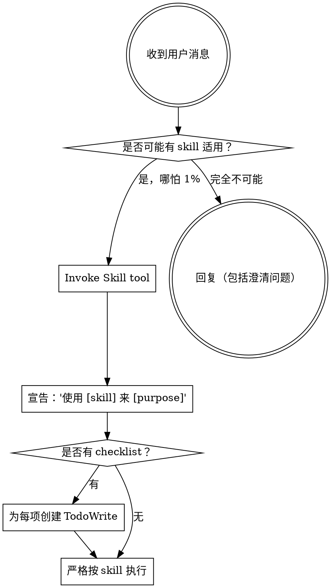

<EXTREMELY-IMPORTANT>
只要你觉得“有 1% 的可能某个 skill 适用”，你就必须先 invoke 该 skill。

如果某个 skill 适用于当前任务，你没有选择权：你必须使用它。

这不可协商，不是可选项，也不能用任何理由自我合理化绕过。
</EXTREMELY-IMPORTANT>

## 如何访问 Skills

**在 Claude Code：** 使用 `Skill` tool。invoke 后会加载并展示该 skill 的内容——直接照做。不要对 skill 文件使用 Read tool。

**在其他环境：** 参考平台文档了解 skill 的加载机制。

# Using Skills

## The Rule

**在任何回应或行动之前，先 invoke 相关或被请求的 skill。** 只要有 1% 可能，就先 invoke 来确认；如果最终发现不适用，再不使用也不迟。

## Red Flags

出现以下想法就立刻停下——你在“自我合理化”：

| 想法 | 事实 |
|------|------|
| “这只是个简单问题” | 问题也是任务。先检查 skill。 |
| “我得先问清楚上下文” | skill 检查要在澄清问题之前。 |
| “我先随便逛一下代码库” | skill 会告诉你应该怎么逛。先检查。 |
| “我先快速看下 git/文件” | 文件没有对话上下文。先检查 skill。 |
| “我先收集点信息” | skill 会告诉你如何收集信息。 |
| “这种事不需要正式的 skill” | 既然 skill 存在，就用它。 |
| “我记得这个 skill 大概内容” | skill 会演进。读最新版本。 |
| “这不算任务” | 只要有行动就是任务。先检查。 |
| “skill 太重了” | 小事会变复杂。用它。 |
| “我先做这一件小事再说” | 做任何事之前先检查。 |
| “我感觉这样更高效” | 无纪律的行动会浪费时间。skill 用来避免。 |
| “我知道那是什么意思” | 知道概念 ≠ 使用 skill。先 invoke。 |

## Skill Priority

当多个 skill 都可能适用时，按以下顺序：

1. **先 process skills**（brainstorming、debugging）：决定“怎么做”
2. **再 implementation skills**（例如 frontend-design、mcp-builder）：指导“具体落地”

“我们来做 X” → 先 brainstorming，再用实现类 skill。  
“修这个 bug” → 先 debugging，再用领域类 skill。

## Skill Types

**Rigid**（TDD、debugging）：必须严格照做，不要“灵活变通”掉纪律。

**Flexible**（patterns）：按原则结合上下文调整。

以 skill 本身的要求为准。

## User Instructions

用户指令通常说明 WHAT，而不是 HOW。“加 X / 修 Y”不等于可以跳过 workflow。

---
> Converted and distributed by [TomeVault](https://tomevault.io/claim/lyfe2025) — claim your Tome and manage your conversions.
<!-- tomevault:4.0:skill_md:2026-04-13 -->
