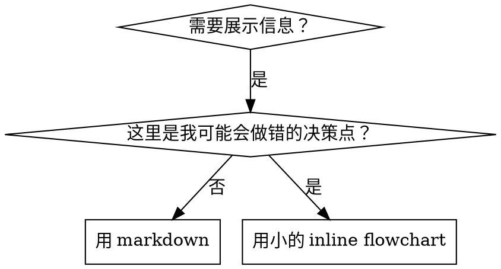

# Writing Skills

## Overview

**写 skills = 把 Test-Driven Development（TDD）应用到流程文档。**

**个人 skills 通常放在 agent 对应目录（Claude Code：`~/.claude/skills`；Codex：`~/.codex/skills`）。**

你要写“测试用例”（用 subagent 做压力场景），先观察在没有 skill 时它会失败（baseline 行为），再写 skill（文档）让它通过（agent 遵守），最后 refactor（堵漏洞）。

**核心原则：** 如果你没亲眼见过 agent 在“没有 skill”时会违反规则，你就不知道这个 skill 是否真的教对了。

**必备背景：** 使用本 skill 前，必须理解 `superpowers:test-driven-development`。它定义了 RED-GREEN-REFACTOR 周期；本 skill 是把同样周期迁移到文档上。

**官方参考：** Anthropic 的 skill 编写最佳实践见 `anthropic-best-practices.md`（补充模式与指南，配合本 skill 的 TDD 思路使用）。

## 什么是 Skill？

**skill** 是经过验证的 technique/pattern/tool 的参考指南，帮助未来的 Claude 实例找到并应用有效方法。

**Skills 是：** 可复用技巧、pattern、工具、reference guide  
**Skills 不是：** “我当时怎么解决某个问题”的一次性故事

## Skills 的 TDD 映射

| TDD 概念 | Skill 创建中的含义 |
|----------|--------------------|
| **Test case** | 用 subagent 跑压力场景（pressure scenario） |
| **Production code** | skill 文档（`SKILL.md`） |
| **Test fails（RED）** | 没 skill 时 agent 会违反规则（baseline） |
| **Test passes（GREEN）** | 有 skill 时 agent 能遵守规则 |
| **Refactor** | 在保持遵守的前提下堵漏洞 |
| **Write test first** | 写 skill 之前先跑 baseline 场景 |
| **Watch it fail** | 记录 agent 的原话与自我合理化方式 |
| **Minimal code** | 只写足以覆盖这些违规点的 skill 内容 |
| **Watch it pass** | 验证 agent 现在会遵守 |
| **Refactor cycle** | 发现新借口 → 补规则 → 再验证 |

整个 skill 创建流程都应遵循 RED-GREEN-REFACTOR。

## 什么时候该写 Skill

**应该写：**
- 这个技巧对你来说也不是“天生直觉”
- 你会在多个项目里反复用到
- 这个 pattern 适用面广（不是某个项目特例）
- 其他人也能受益

**不该写：**
- 一次性方案
- 外部已有大量成熟文档的通用实践
- 项目特定约定（放到 CLAUDE.md / CONTRIBUTING 等更合适）
- 纯机械约束（能用 regex/validator 强制就自动化；文档留给需要判断的地方）

## Skill Types

### Technique
可执行的方法与步骤（例如 condition-based-waiting、root-cause-tracing）

### Pattern
思考问题的方式（例如 flatten-with-flags、test-invariants）

### Reference
API 文档、语法指南、工具说明（例如 office docs）

## Directory Structure

```
skills/
  skill-name/
    SKILL.md              # 主文档（必需）
    supporting-file.*     # 仅在确有需要时添加
```

**Flat namespace：** 所有 skills 在一个可搜索命名空间中。

**拆到独立文件的情况：**
1. **重 reference（100+ 行）**：API docs、完整语法
2. **可复用工具**：scripts、utilities、templates

**适合放在 `SKILL.md` 内的：**
- 原则与概念
- 代码 pattern（< 50 行）
- 其他轻量内容

## `SKILL.md` 结构

**Frontmatter（YAML）：**
- （平台/校验器可能不同）很多平台只使用 `name` 与 `description` 来做触发与检索
- `name`：只用字母、数字、连字符（hyphens）
- `description`：第三人称，描述“何时使用”（when to use），而不是“怎么做”（how）
  - 用 “Use when …” 开头，聚焦触发条件
  - 包含具体症状/场景/上下文
  - **不要在 description 里总结 workflow**（见 CSO）

```markdown
---
name: skill-name-with-hyphens
description: Use when [具体触发条件与症状]
---

# Skill Name

## Overview
这是什么？用 1–2 句话写核心原则。

## When to Use
[如果决策不明显，可给一个小的 inline flowchart]

用 bullet 列出症状与用例
以及何时“不该用”

## Core Pattern（适用于 technique/pattern）
before/after 的代码对比

## Quick Reference
表格或要点，方便快速扫

## Implementation
简单 pattern 可以 inline
重 reference 或可复用工具则链接到独立文件

## Common Mistakes
常见踩坑 + 修正

## Real-World Impact（可选）
具体成效
```

## Claude Search Optimization（CSO）

**可发现性至关重要：** 未来的 Claude 需要能“搜到”你的 skill。

### 1) 写好 `description`

**目的：** Claude 会用 `description` 来决定某个任务是否要加载这个 skill。它必须回答：“我现在该读这个 skill 吗？”

**格式：** 用 “Use when …” 开头，聚焦触发条件。

**关键：description = When to Use，不是 What/How**

description 只能描述触发条件，不要总结 skill 的 workflow。

**为什么：** 实测发现，如果 description 里总结了 workflow，Claude 可能只按 description 行事而跳过正文。比如 description 写了 “code review between tasks”，Claude 可能只做一次 review；但正文 flowchart 明确要求两次 review（spec compliance → code quality）。当 description 改成只写触发条件（不总结流程）后，Claude 才会去读 flowchart 并正确执行两阶段 review。

**陷阱：** workflow 摘要会变成 Claude 的捷径，导致正文被跳过。

```yaml
# ❌ Bad：总结 workflow（Claude 可能不读正文）
description: Use when 执行计划时，按 task 派发 subagent，并在 tasks 之间做 code review

# ❌ Bad：流程细节太多
description: Use for TDD - 先写测试，看它失败，再写最小实现，最后重构

# ✅ Good：只写触发条件，不总结流程
description: Use when 在当前 session 执行包含多个独立 tasks 的 implementation plan

# ✅ Good：只写触发条件
description: Use when 实现任何 feature 或 bugfix，在写实现代码之前
```

**内容建议：**
- 用具体 triggers/symptoms/situations
- 描述“问题本质”（race conditions、timing dependencies、flaky）而不是“语言细节”（setTimeout、sleep）
- 除非 skill 本身技术栈限定，否则触发条件尽量技术无关
- 如果 skill 技术栈限定，要在触发条件里明确写出
- 用第三人称（会被注入 system prompt）
- **永远不要总结 workflow**

```yaml
# ❌ Bad：太抽象
description: 用于 async 测试

# ❌ Bad：第一人称
description: 我可以在 async tests flaky 时帮你修

# ❌ Bad：提到技术细节但 skill 并不限定它
description: Use when tests 使用 setTimeout/sleep 且 flaky

# ✅ Good：以问题为中心，不总结流程
description: Use when tests 存在 race conditions、timing dependencies，或 pass/fail 不稳定

# ✅ Good：技术栈限定的 skill
description: Use when 使用 React Router 且需要处理 authentication redirects
```

### 2) 覆盖关键词（Keyword coverage）

写 Claude 会用来搜索的词：
- 错误信息：`Hook timed out`、`ENOTEMPTY`、`race condition`
- 症状：`flaky`、`hanging`、`zombie`、`pollution`
- 同义词：`timeout/hang/freeze`、`cleanup/teardown/afterEach`
- 工具：真实命令、库名、文件类型

### 3) 命名要描述行为

**用主动语态、动词优先：**
- ✅ `creating-skills` 而不是 `skill-creation`
- ✅ `condition-based-waiting` 而不是 `async-test-helpers`

### 4) Token Efficiency（非常关键）

**问题：** getting-started 或高频 skills 会在每次对话都加载。每个 token 都要省。

**目标字数：**
- getting-started workflows：每个 <150 words
- 高频 skills：总计 <200 words
- 其他 skills：<500 words（仍然要尽量精简）

**技巧：**

把细节挪到工具帮助里：
```bash
# ❌ Bad：在 SKILL.md 里列出所有 flags
search-conversations 支持 --text、--both、--after DATE、--before DATE、--limit N

# ✅ Good：让用户/agent 去看 --help
search-conversations 支持多种模式与筛选；详情请运行 --help。
```

用 cross-reference：
```markdown
# ❌ Bad：重复写 workflow 细节
搜索时，用模板派发 subagent……
[重复 20 行]

# ✅ Good：引用其他 skill
永远使用 subagents。**REQUIRED:** 使用 [other-skill-name] 作为 workflow。
```

压缩示例：
```markdown
# ❌ Bad：啰嗦示例
伙伴：“我们之前怎么处理 React Router 的鉴权错误？”
你：我会去搜索历史对话……
[再写一堆派发细节]

# ✅ Good：最小示例
伙伴：“我们之前怎么处理 auth errors？”
你：我去搜一下……
[派发 subagent → 汇总]
```

消除冗余：
- 不要重复 cross-referenced skills 已说过的内容
- 不解释命令本身就很明显的东西
- 同一模式不要给多个重复例子

验证字数：
```bash
wc -w skills/path/SKILL.md
```

### 5) Cross-Referencing 其他 Skills

当文档需要引用其他 skills：

只写 skill 名，并标注明确的强制程度：
- ✅ `**REQUIRED SUB-SKILL:** Use superpowers:test-driven-development`
- ✅ `**REQUIRED BACKGROUND:** You MUST understand superpowers:systematic-debugging`
- ❌ `See skills/testing/test-driven-development`（不清晰是否必须）
- ❌ `@skills/testing/test-driven-development/SKILL.md`（强制加载，烧 context）

**为什么不要用 `@` 链接：** `@` 会立刻 force-load 文件，可能在还没需要时就消耗大量 context。

## Flowchart Usage



**只在这些情况下用 flowchart：**
- 决策点不明显
- 存在循环，容易“以为结束了”而过早停止
- “A vs B 何时用”的选择题

**不要用 flowchart：**
- reference 材料 → 用表格/列表
- 代码示例 → 用 Markdown code block
- 线性步骤 → 用编号列表
- 无语义标签（step1、helper2）

graphviz 约定见 `graphviz-conventions.dot`。

为 human partner 渲染 SVG：用本目录的 `render-graphs.js`：
```bash
./render-graphs.js ../some-skill           # 每个图单独渲染
./render-graphs.js ../some-skill --combine # 合并成一个 SVG
```

## Code Examples

**一个优秀示例胜过一堆一般示例。**

选择最相关的语言：
- 测试技巧 → TypeScript/JavaScript
- 系统排障 → Shell/Python
- 数据处理 → Python

好的示例应当：
- 完整且可运行
- 注释解释 WHY（不是只解释 WHAT）
- 来自真实场景
- 能清晰展示 pattern
- 容易改造（不是空模板）

不要：
- 一个 skill 里实现 5+ 种语言
- 造填空模板（fill-in-the-blank）
- 写很刻意的假例子

你很擅长迁移——一个高质量示例足够。

## File Organization

### Self-Contained Skill
```
defense-in-depth/
  SKILL.md    # 全部 inline
```
适用：内容都能装下、不需要重 reference

### Skill with Reusable Tool
```
condition-based-waiting/
  SKILL.md    # Overview + patterns
  example.ts  # 可直接复用/改造的 helpers
```
适用：存在可复用代码工具

### Skill with Heavy Reference
```
pptx/
  SKILL.md       # Overview + workflows
  pptxgenjs.md   # 600 行 API reference
  ooxml.md       # 500 行 XML 结构
  scripts/       # 可执行工具
```
适用：reference 过大，不适合 inline

## The Iron Law（同 TDD）

```
没有先失败的测试，就不能写/改 skill
```

适用于新建 skill，也适用于编辑已有 skill。

先写 skill 再测试？删掉，重来。  
改 skill 不测试？同样违规。

**没有例外：**
- 不是因为“只是加个小段落”
- 不是因为“只是补文档”
- 不要保留未测试的改动当“参考”
- 不要边测边“顺手改”
- “删掉”就是删掉

**必备背景：** 见 `superpowers:test-driven-development`，同样原则适用于文档。

## 不同 Skill 类型的测试方式

不同类型需要不同测试策略：

### Discipline-Enforcing Skills（纪律/规则类）

示例：TDD、verification-before-completion、designing-before-coding

**测试方式：**
- 学术题：是否理解规则？
- 压力场景：在压力下是否仍遵守？
- 组合压力：时间 + 沉没成本 + 疲劳
- 识别自我合理化，并加“明确反制”

**成功标准：** 在最大压力下仍能遵守规则

### Technique Skills（how-to 指南）

示例：condition-based-waiting、root-cause-tracing、defensive-programming

**测试方式：**
- 应用场景：能否正确应用？
- 变体场景：能否处理 edge cases？
- 信息缺失测试：文档是否有缺口？

**成功标准：** 能在新场景中正确应用该 technique

### Pattern Skills（心智模型）

示例：reducing-complexity、information-hiding

**测试方式：**
- 识别场景：能否识别何时适用？
- 应用场景：能否用该模型指导决策？
- 反例：能否知道何时不适用？

**成功标准：** 正确识别并正确应用

### Reference Skills（文档/API）

示例：API 文档、命令参考、库指南

**测试方式：**
- 检索场景：能否找到正确信息？
- 应用场景：能否正确使用找到的信息？
- 缺口测试：常见用例是否覆盖？

**成功标准：** 能检索到并正确应用 reference 信息

## 跳过测试的常见自我合理化

| 借口 | 现实 |
|------|------|
| “这个 skill 这么清晰” | 你觉得清晰 ≠ 其他 agent 觉得清晰。测试它。 |
| “它只是 reference” | reference 也会缺口/含糊；要测检索与应用。 |
| “测试是 overkill” | 未测试的 skill 总会出问题；15 分钟测试能省数小时。 |
| “问题出现再测” | 出问题=agent 用不了；要在部署前测试。 |
| “太麻烦了” | 比线上 debug 一个烂 skill 更不麻烦。 |
| “我很有信心” | 过度自信必翻车；照样要测。 |
| “读一遍就够了” | 阅读 ≠ 使用；要测应用场景。 |
| “没时间测试” | 部署未测试的 skill 只会让你之后花更多时间补救。 |

**看到这些就意味着：部署前必须测试。没有例外。**

## 让规则类 Skill 抗自我合理化（Bulletproofing）

规则类 skill（如 TDD）必须能抵抗 rationalization。agent 很聪明，在压力下会找漏洞。

心理学提示：理解 WHY 某些说服技巧有效能让你更系统地应用。研究基础见 `persuasion-principles.md`（Cialdini, 2021；Meincke et al., 2025）。

### 明确堵住每个漏洞

不要只写规则，也要禁止常见“绕法”：

<Bad>
```markdown
先写代码再写测试？删掉。
```
</Bad>

<Good>
```markdown
先写代码再写测试？删掉，重来。

**No exceptions:**
- 不要保留当“reference”
- 不要在写测试时“照着改/适配”
- 不要偷看
- “删掉”就是删掉
```
</Good>

### 预防 “Spirit vs Letter” 辩解

尽早加入基础原则：

```markdown
**只遵守字面、不遵守精神，就是在违反规则。**
```

这能直接切断一大类“我是在遵守精神”的辩解。

### 建立 Rationalization Table

把 baseline 测试里出现的借口收集成表；agent 的每个借口都应该被记录并反制：

```markdown
| 借口 | 现实 |
|------|------|
| “太简单了不值得测” | 简单代码也会坏；写个测试 30 秒。 |
| “我之后再测” | 立刻通过的测试证明不了任何事。 |
| “事后测试也一样” | 事后：what does this do；事前：what should this do。 |
```

### 建立 Red Flags 列表

让 agent 能快速自检是否在 rationalize：

```markdown
## Red Flags - STOP and Start Over

- 先写代码再写测试
- “我已经手测过了”
- “事后测试也能达到同样目的”
- “重要的是精神不是仪式”
- “这次情况不同，因为……”

**出现这些就意味着：删掉代码，用 TDD 重来。**
```

### 把“违规前兆”写进 CSO

在 description 里加入“你快要违规了”的症状提示（仅触发条件，不写 workflow）：

```yaml
description: use when 实现任何 feature 或 bugfix，在写实现代码之前
```

## Skills 的 RED-GREEN-REFACTOR

遵循同样 TDD 周期：

### RED：写 failing test（baseline）

在**没有该 skill**的情况下跑压力场景，记录 agent 的真实行为：
- 它做了哪些选择？
- 它用了哪些借口（原话）
- 是哪些压力触发了违规？

这就是 “watch the test fail”：你必须先看到 agent 的自然行为，再写 skill。

### GREEN：写最小 skill

只写足以覆盖这些具体违规点的内容，不要为假设场景堆料。

然后在**有 skill**的情况下跑同样场景，验证 agent 现在能遵守。

### REFACTOR：堵漏洞

agent 找到新借口？加明确反制，再测，直到足够稳。

完整测试方法见 `@testing-skills-with-subagents.md`：
- 如何写压力场景
- 压力类型（时间、沉没成本、权威、疲劳）
- 系统化堵洞
- meta-testing 技术

## Anti-Patterns

### ❌ Narrative Example
“在 2025-10-03 的 session 里我们发现空 projectDir …”
**问题：** 过于具体，不可复用

### ❌ Multi-Language Dilution
`example-js.js`、`example-py.py`、`example-go.go`
**问题：** 平庸质量 + 维护负担

### ❌ Code in Flowcharts
```dot
step1 [label="import fs"];
step2 [label="read file"];
```
**问题：** 不可复制粘贴，且难读

### ❌ Generic Labels
`helper1`、`helper2`、`step3`
**问题：** label 应该有语义

## STOP：别急着写下一个 Skill

**写完任何 skill 后，你必须停下并完成部署流程。**

**不要：**
- 不测试就批量创建多个 skills
- 当前 skill 未验证就开始下一个
- 因为“批量更高效”就跳过测试

下方的部署 checklist 对**每个 skill**都强制执行。

部署未测试的 skill = 部署未测试的代码，违反质量标准。

## Skill Creation Checklist（TDD 版）

**重要：用 TodoWrite 为下列每项创建 todo。**

**RED Phase：写 failing test**
- [ ] 设计压力场景（规则类至少 3+ 组合压力）
- [ ] 在没有 skill 时跑场景，逐字记录 baseline 行为
- [ ] 提炼违规/借口模式

**GREEN Phase：写最小 skill**
- [ ] `name` 只用字母/数字/连字符（无括号/特殊字符）
- [ ] YAML frontmatter（只放触发与检索所需字段）
- [ ] `description` 以 “Use when …” 开头，包含具体 triggers/symptoms
- [ ] `description` 用第三人称
- [ ] 全文覆盖关键词（errors、symptoms、tools）
- [ ] Overview 清晰，核心原则明确
- [ ] 针对 RED 阶段发现的违规点逐个反制
- [ ] 代码要么 inline，要么链接到独立文件
- [ ] 只保留一个高质量示例（不要多语言堆砌）
- [ ] 在有 skill 时跑同样场景，验证 agent 现在遵守

**REFACTOR Phase：堵漏洞**
- [ ] 从测试中找出新的借口
- [ ]（规则类）加入明确反制
- [ ] 汇总所有迭代中的借口表（rationalization table）
- [ ] 建立 red flags 列表
- [ ] 反复测试直到足够稳

**质量检查：**
- [ ] 只有决策不明显时才加小 flowchart
- [ ] Quick reference 表
- [ ] Common mistakes 段
- [ ] 不写故事叙述（no narrative）
- [ ] supporting files 只用于工具或重 reference

**Deployment：**
- [ ] 提交到 git，并 push 到 fork（如已配置）
- [ ] 如果通用价值高，考虑提 PR 回馈上游

## Discovery Workflow

未来的 Claude 通常这样找到你的 skill：

1. **遇到问题**（例如 “tests are flaky”）
2. **找到 skill**（description 匹配）
3. **扫 Overview**（是否相关？）
4. **看 patterns**（Quick reference）
5. **需要实现时再读例子/工具**

**按这个流程优化**：可搜索的词要早出现、常出现。

## The Bottom Line

**写 skills 就是对流程文档做 TDD。**

同样 Iron Law：没有 failing test 就不能写 skill。  
同样周期：RED（baseline）→ GREEN（写 skill）→ REFACTOR（堵洞）。  
同样收益：更高质量、更少意外、更不容易被钻空子。

你对代码遵循 TDD，就也要对 skills 遵循 TDD——纪律是同一套。

---
> Converted and distributed by [TomeVault](https://tomevault.io/claim/lyfe2025) — claim your Tome and manage your conversions.
<!-- tomevault:4.0:skill_md:2026-04-13 -->
