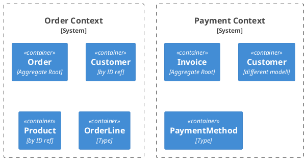

# Domain-Driven Design for TypeScript

Tactical DDD patterns for rich, behavior-driven domain models in TypeScript.

> **vs `hexagonal-typescript`:** This skill focuses on **domain modeling** — Value Objects, Entities, Aggregates, Domain Events, and Ubiquitous Language. Use `hexagonal-typescript` when you need **package structure and dependency direction** — how to organize ports, adapters, and use case classes.

## When to Activate

- Modeling a new domain concept (entity or value object?)
- Deciding whether logic belongs in domain, use case, or adapter
- Identifying aggregate boundaries and consistency rules
- Designing domain events and their dispatch
- Reviewing for anemic domain model (objects with no behavior)
- Naming modules, types, and functions (ubiquitous language)

---

## Building Block 1: Value Objects

**Identity**: none — equal when all fields are equal.
**Rule**: Immutable. Use readonly properties. Use factory functions or classes with private constructors.

```typescript
// domain/model/Money.ts
export interface Money {
  readonly amount: number
  readonly currency: string
}

export function money(amount: number, currency: string): Money {
  if (amount < 0) throw new InvalidMoneyError('amount must be non-negative')
  if (!currency) throw new InvalidMoneyError('currency required')
  return Object.freeze({ amount, currency })
}

export function addMoney(a: Money, b: Money): Money {
  if (a.currency !== b.currency) throw new CurrencyMismatchError(a.currency, b.currency)
  return money(a.amount + b.amount, a.currency)
}

export function isZero(m: Money): boolean {
  return m.amount === 0
}
```

### Branded Types for Typed IDs

Prevents passing a `UserId` where a `MarketId` is expected — zero runtime cost:

```typescript
// domain/model/MarketId.ts
export type MarketId = string & { readonly _brand: 'MarketId' }

export function marketId(value: string): MarketId {
  if (!value.trim()) throw new Error('MarketId cannot be empty')
  return value as MarketId
}

// domain/model/UserId.ts
export type UserId = string & { readonly _brand: 'UserId' }
export function userId(value: string): UserId { return value as UserId }
```

**Common Value Objects**: `Money`, `Email`, `Slug`, `DateRange`, typed IDs (`MarketId`, `UserId`).

---

## Building Block 2: Entities

**Identity**: defined by a unique ID — two entities with the same ID are the same object.
**Rule**: Has behavior (domain functions), not just data. Immutable updates via spread.

```typescript
// domain/model/market.ts
import type { MarketId } from './MarketId'
import type { MarketPublishedEvent } from '../event/MarketPublishedEvent'

export type MarketStatus = 'DRAFT' | 'ACTIVE' | 'SUSPENDED'

export interface Market {
  readonly id: MarketId | null
  readonly name: string
  readonly slug: string
  readonly status: MarketStatus
}

// Factory — enforces creation invariants
export function createMarket(name: string, slug: string): Market {
  if (!name || name.trim() === '') throw new InvalidMarketError('name required')
  if (!slug || !/^[a-z0-9-]+$/.test(slug)) throw new InvalidMarketError('invalid slug')
  return Object.freeze({ id: null, name: name.trim(), slug, status: 'DRAFT' })
}

// Behavior — returns new entity + events (no mutation)
export function publishMarket(market: Market): { market: Market; events: MarketPublishedEvent[] } {
  if (market.status !== 'DRAFT') throw new MarketAlreadyPublishedError(market.slug)
  return {
    market: { ...market, status: 'ACTIVE' },
    events: [{ type: 'MarketPublished', marketId: market.id!, name: market.name, occurredAt: new Date() }],
  }
}
```

---

## Building Block 3: Aggregates & Aggregate Root

An **Aggregate** is a cluster of domain objects treated as a unit for data changes.
The **Aggregate Root** is the only entry point — external code never holds references to internal entities.

### Rules
- **One transaction = one aggregate** — never modify two aggregates in one async flow
- **Reference other aggregates by ID only** — never by object reference
- **One repository per Aggregate Root** — no repository for child entities
- **Invariants enforced inside the aggregate**

```typescript
// domain/model/order.ts — Aggregate Root
import type { OrderId } from './OrderId'
import type { CustomerId } from './CustomerId'
import type { Money } from './Money'

export interface OrderLine {
  readonly productId: string
  readonly quantity: number
  readonly unitPrice: Money
}

export interface Order {
  readonly id: OrderId | null
  readonly customerId: CustomerId   // reference by ID, not Customer object
  readonly lines: readonly OrderLine[]
  readonly status: 'DRAFT' | 'PLACED'
}

export function createOrder(customerId: CustomerId): Order {
  return Object.freeze({ id: null, customerId, lines: [], status: 'DRAFT' })
}

// Aggregate method — enforces internal invariant, returns new state
export function addLineToOrder(order: Order, line: OrderLine): Order {
  if (order.status !== 'DRAFT') throw new OrderAlreadyPlacedError(order.id)
  return { ...order, lines: [...order.lines, line] }
}

export function placeOrder(order: Order): Order {
  if (order.lines.length === 0) throw new EmptyOrderError(order.id)
  return { ...order, status: 'PLACED' }
}

export function orderTotal(order: Order): Money {
  return order.lines.reduce(
    (acc, line) => addMoney(acc, { amount: line.unitPrice.amount * line.quantity, currency: line.unitPrice.currency }),
    money(0, order.lines[0]?.unitPrice.currency ?? 'EUR'),
  )
}
```

---

## Building Block 4: Domain Services

**When**: Logic belongs in the domain but doesn't fit a single entity.
**Rule**: Stateless functions. No framework imports. Named after domain verbs.

```typescript
// domain/service/pricingPolicy.ts
import type { Order } from '../model/order'
import type { DiscountCode } from '../model/DiscountCode'
import type { Money } from '../model/Money'
import { orderTotal, addMoney, money } from '../model'

export function calculateFinalPrice(order: Order, discountCode: DiscountCode): Money {
  const base = orderTotal(order)
  if (isValidDiscount(discountCode) && discountAppliesTo(discountCode, order)) {
    return subtractMoney(base, discountAmount(discountCode, base))
  }
  return base
}
```

**Domain Service vs Application Service (Use Case):**

| | Domain Service | Application Service (Use Case) |
|---|---|---|
| Location | `domain/service/` | `application/usecase/` |
| Depends on | Domain model only | Ports (in + out), domain services |
| Async/await | Usually not | Yes (DB calls, external services) |
| Framework imports | Never | Can use types from config |
| Example | `pricingPolicy`, `slugGenerator` | `CreateOrderService`, `PlaceOrderService` |

---

## Building Block 5: Domain Events

Domain events represent something that **happened**. Immutable facts.

```typescript
// domain/event/DomainEvent.ts
export interface DomainEvent {
  readonly type: string
  readonly occurredAt: Date
}

// domain/event/MarketPublishedEvent.ts
export interface MarketPublishedEvent extends DomainEvent {
  readonly type: 'MarketPublished'
  readonly marketId: MarketId
  readonly name: string
}
```

### Dispatching Domain Events

Collect events from aggregate operations, dispatch after successful save:

```typescript
// application/usecase/PublishMarketService.ts
import type { PublishMarketUseCase } from '../../domain/port/in/PublishMarketUseCase'
import type { MarketRepository } from '../../domain/port/out/MarketRepository'
import type { EventBus } from '../../domain/port/out/EventBus'
import { publishMarket } from '../../domain/model/market'

export class PublishMarketService implements PublishMarketUseCase {
  constructor(
    private readonly marketRepository: MarketRepository,
    private readonly eventBus: EventBus,
  ) {}

  async execute(marketId: MarketId): Promise<void> {
    const market = await this.marketRepository.findById(marketId)
    if (!market) throw new MarketNotFoundError(marketId)

    const { market: updated, events } = publishMarket(market)  // domain logic
    await this.marketRepository.save(updated)
    await Promise.all(events.map(e => this.eventBus.publish(e)))  // dispatch after save
  }
}
```

---

## Ubiquitous Language

Use the **same terms** in code as domain experts use. Never translate.

```typescript
// ❌ Technical naming — no domain meaning
async function processMarketData(input: MarketInput) {}

// ✅ Ubiquitous language — mirrors domain expert speech
async function publishMarket(market: Market): Promise<{ market: Market; events: DomainEvent[] }>
async function suspendMarket(market: Market, reason: SuspensionReason): Promise<Market>
async function resolveMarket(market: Market, outcome: ResolutionOutcome): Promise<Market>
```

---

## Bounded Contexts

Each service/module corresponds to one Bounded Context. The same word means different things in different contexts.



### Anti-Corruption Layer Between Contexts

```typescript
// adapter/out/client/PaymentContextAdapter.ts
import type { PaymentPort } from '../../../domain/port/out/PaymentPort'
import type { Order } from '../../../domain/model/order'
import type { Money } from '../../../domain/model/Money'

export class PaymentContextAdapter implements PaymentPort {
  constructor(private readonly httpClient: PaymentHttpClient) {}

  async initiatePayment(order: Order, amount: Money): Promise<PaymentResult> {
    // Translate Order domain model → Payment API request
    const request = {
      orderId: order.id!,
      amount: amount.amount,
      currency: amount.currency,
    }
    const response = await this.httpClient.charge(request)
    // Translate Payment API response → domain PaymentResult
    return { success: response.ok, transactionId: response.txId }
  }
}
```

---

## Anti-Patterns to Avoid

### Anemic Domain Model

```typescript
// ❌ Data container — no behavior, all logic in use case
interface Market {
  status: string  // mutable
  setStatus(s: string): void  // plain setter
}

// ❌ Use case doing domain work it shouldn't
async function publishMarket(id: string) {
  const market = await repo.findById(id)
  if (market.status !== 'DRAFT') throw new Error('not a draft')  // domain rule leaked out!
  market.setStatus('ACTIVE')  // mutation with no intent
  await repo.save(market)
}

// ✅ Domain logic in domain
export function publishMarket(market: Market) {
  if (market.status !== 'DRAFT') throw new MarketAlreadyPublishedError(market.slug)
  return { ...market, status: 'ACTIVE' as const }
}
```

### Primitive Obsession

```typescript
// ❌ Strings everywhere — no type safety
async function createOrder(userId: string, marketId: string): Promise<void>

// ✅ Branded types
async function createOrder(userId: UserId, marketId: MarketId): Promise<void>
```

### Repository per Entity (not per Aggregate Root)

```typescript
// ❌ Direct access to internal entities
await orderLineRepository.save(orderLine)  // bypasses Order invariants!

// ✅ Only via aggregate root
const updatedOrder = addLineToOrder(order, newLine)
await orderRepository.save(updatedOrder)
```

---

## DDD Checklist for New Projects

- [ ] Identify Bounded Contexts (one per service/module)
- [ ] Define Ubiquitous Language (glossary per context)
- [ ] Model Aggregate Roots (what enforces consistency?)
- [ ] Identify Value Objects (use branded types for IDs)
- [ ] Define Domain Events (what facts must be communicated?)
- [ ] Locate Domain Services (stateless logic not fitting an entity)
- [ ] Ensure one repository per Aggregate Root
- [ ] Avoid anemic models (entities have behavior functions)
- [ ] Reference other aggregates by ID only

## Reference

- **Strategic DDD** (Bounded Contexts, Context Map, Subdomain classification, Event Storming): see skill `strategic-ddd`
- **Hexagonal Architecture** (package structure, adapters): see skill `hexagonal-typescript`

---
> Source: [marvinrichter/clarc](https://github.com/marvinrichter/clarc) — distributed by [TomeVault](https://tomevault.io).
<!-- tomevault:4.0:skill_md:2026-05-22 -->
