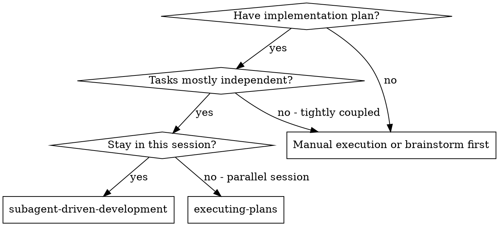
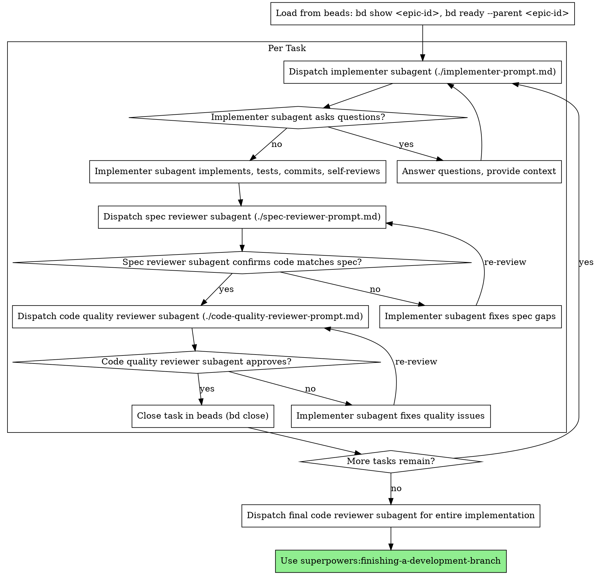

# Subagent-Driven Development

Execute plan from beads by dispatching fresh subagent per task, with two-stage review after each: spec compliance review first, then code quality review.

**Core principle:** Fresh subagent per task + two-stage review (spec then quality) = high quality, fast iteration

**Storage:** Plans tracked in beads epics. No TodoWrite needed - beads provides persistent state.

## When to Use



**vs. Executing Plans (parallel session):**
- Same session (no context switch)
- Fresh subagent per task (no context pollution)
- Two-stage review after each task: spec compliance first, then code quality
- Faster iteration (no human-in-loop between tasks)

## The Process



## Prompt Templates

- `./implementer-prompt.md` - Dispatch implementer subagent
- `./spec-reviewer-prompt.md` - Dispatch spec compliance reviewer subagent
- `./code-quality-reviewer-prompt.md` - Dispatch code quality reviewer subagent

## Example Workflow

```
You: I'm using Subagent-Driven Development to execute this plan.

[Load epic from beads: bd show superpowers-abc123]
[Get ready tasks: bd ready --parent superpowers-abc123]
[Epic has 5 tasks total]

Task 1: Hook installation script (superpowers-abc123.1)

[Get Task 1 details: bd show superpowers-abc123.1]
[Mark in progress: bd update superpowers-abc123.1 --status in_progress]
[Dispatch implementation subagent with full task text + context]

Implementer: "Before I begin - should the hook be installed at user or system level?"

You: "User level (~/.config/superpowers/hooks/)"

Implementer: "Got it. Implementing now..."
[Later] Implementer:
  - Implemented install-hook command
  - Added tests, 5/5 passing
  - Self-review: Found I missed --force flag, added it
  - Committed

[Dispatch spec compliance reviewer]
Spec reviewer: ✅ Spec compliant - all requirements met, nothing extra

[Get git SHAs, dispatch code quality reviewer]
Code reviewer: Strengths: Good test coverage, clean. Issues: None. Approved.

[Close Task 1: bd close superpowers-abc123.1]

Task 2: Recovery modes (superpowers-abc123.2)

[Get Task 2 details: bd show superpowers-abc123.2]
[Mark in progress: bd update superpowers-abc123.2 --status in_progress]
[Dispatch implementation subagent with full task text + context]

Implementer: [No questions, proceeds]
Implementer:
  - Added verify/repair modes
  - 8/8 tests passing
  - Self-review: All good
  - Committed

[Dispatch spec compliance reviewer]
Spec reviewer: ❌ Issues:
  - Missing: Progress reporting (spec says "report every 100 items")
  - Extra: Added --json flag (not requested)

[Implementer fixes issues]
Implementer: Removed --json flag, added progress reporting

[Spec reviewer reviews again]
Spec reviewer: ✅ Spec compliant now

[Dispatch code quality reviewer]
Code reviewer: Strengths: Solid. Issues (Important): Magic number (100)

[Implementer fixes]
Implementer: Extracted PROGRESS_INTERVAL constant

[Code reviewer reviews again]
Code reviewer: ✅ Approved

[Close Task 2: bd close superpowers-abc123.2]

...

[After all tasks]
[Check all closed: bd list --parent superpowers-abc123 --status open]
[Empty list - all done]
[Dispatch final code-reviewer]
Final reviewer: All requirements met, ready to merge

[Close epic: bd close superpowers-abc123]
[Sync to git: bd sync]

Done!
```

## Advantages

**vs. Manual execution:**
- Subagents follow TDD naturally
- Fresh context per task (no confusion)
- Parallel-safe (subagents don't interfere)
- Subagent can ask questions (before AND during work)

**vs. Executing Plans:**
- Same session (no handoff)
- Continuous progress (no waiting)
- Review checkpoints automatic

**Efficiency gains:**
- No file reading overhead (controller loads from beads once)
- Controller provides full task text to subagents
- Subagent gets complete information upfront
- Questions surfaced before work begins (not after)
- Beads tracks state persistently (survives session restarts)

**Quality gates:**
- Self-review catches issues before handoff
- Two-stage review: spec compliance, then code quality
- Review loops ensure fixes actually work
- Spec compliance prevents over/under-building
- Code quality ensures implementation is well-built

**Cost:**
- More subagent invocations (implementer + 2 reviewers per task)
- Controller does more prep work (extracting all tasks upfront)
- Review loops add iterations
- But catches issues early (cheaper than debugging later)

## Beads Integration

This skill loads plans from beads epics and updates task status during execution.

**Initial Setup:**
```bash
# Source helper functions
source skills/lib/beads-helper.sh

# Get epic ID from user or writing-plans output
EPIC_ID="superpowers-abc123"

# View epic and tasks
bd show "$EPIC_ID"
bd ready --parent "$EPIC_ID"
```

**Per Task Workflow:**
```bash
# Get next ready task
TASK_ID=$(bd ready --parent "$EPIC_ID" --format json | jq -r '.[0].id')

# Get task details
TASK_DESC=$(bd show "$TASK_ID" --json | jq -r '.description')

# Mark in progress
bd update "$TASK_ID" --status in_progress

# [Dispatch implementer subagent with $TASK_DESC]
# [Two-stage review process]
# [Implementer commits work]

# Close task when approved
bd close "$TASK_ID"
# This automatically unblocks dependent tasks
```

**Key Commands:**
- Load epic: `bd show <epic-id>`
- Get ready tasks: `bd ready --parent <epic-id> [--format json]`
- Get task details: `bd show <task-id> [--json]`
- Start task: `bd update <task-id> --status in_progress`
- Complete task: `bd close <task-id>`
- Check progress: `bd list --parent <epic-id> --status open`
- Close epic: `bd close <epic-id>`
- Sync to git: `bd sync`

**No TodoWrite:**
- Beads replaces TodoWrite entirely
- All state persists in `.beads/` directory
- Synced to git automatically
- Survives session restarts and crashes
- Dependencies tracked automatically

**Passing to Subagents:**
- Get task description: `bd show <task-id> --json | jq -r '.description'`
- Pass full description text to implementer subagent
- Include context from epic: `bd show <epic-id>`
- Subagents don't need beads access - controller manages state

## Red Flags

**Never:**
- Start implementation on main/master branch without explicit user consent
- Skip reviews (spec compliance OR code quality)
- Proceed with unfixed issues
- Dispatch multiple implementation subagents in parallel (conflicts)
- Make subagent read plan file (provide full text instead)
- Skip scene-setting context (subagent needs to understand where task fits)
- Ignore subagent questions (answer before letting them proceed)
- Accept "close enough" on spec compliance (spec reviewer found issues = not done)
- Skip review loops (reviewer found issues = implementer fixes = review again)
- Let implementer self-review replace actual review (both are needed)
- **Start code quality review before spec compliance is ✅** (wrong order)
- Move to next task while either review has open issues

**If subagent asks questions:**
- Answer clearly and completely
- Provide additional context if needed
- Don't rush them into implementation

**If reviewer finds issues:**
- Implementer (same subagent) fixes them
- Reviewer reviews again
- Repeat until approved
- Don't skip the re-review

**If subagent fails task:**
- Dispatch fix subagent with specific instructions
- Don't try to fix manually (context pollution)

## Integration

**Required workflow skills:**
- **superpowers:using-git-worktrees** - REQUIRED: Set up isolated workspace before starting
- **superpowers:writing-plans** - Creates the plan this skill executes
- **superpowers:requesting-code-review** - Code review template for reviewer subagents
- **superpowers:finishing-a-development-branch** - Complete development after all tasks

**Subagents should use:**
- **superpowers:test-driven-development** - Subagents follow TDD for each task

**Alternative workflow:**
- **superpowers:executing-plans** - Use for parallel session instead of same-session execution

---
> Converted and distributed by [TomeVault](https://tomevault.io/claim/matthew-reed-holden) — claim your Tome and manage your conversions.
<!-- tomevault:4.0:skill_md:2026-04-16 -->
