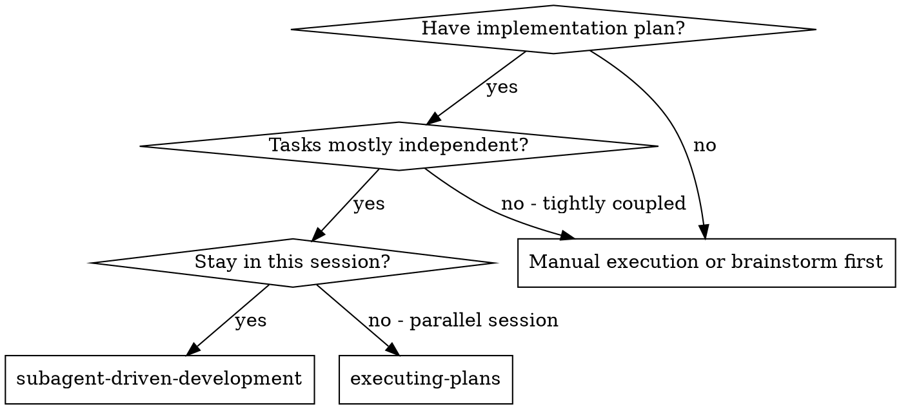

# Subagent-Driven Development

Execute plan by dispatching fresh subagent per task, with two-stage review after
each:
spec compliance review first, then code quality review.

**Core principle:** Fresh subagent per task + two-stage review (spec then
quality) = high quality, fast iteration

## When to Use

**vs. Executing Plans (parallel session):**

- Same session (no context switch)
- Fresh subagent per task (no context pollution)
- Two-stage review after each task:
  spec compliance first, then code quality
- Faster iteration (no human-in-loop between tasks)

## The Process

1. Read plan, extract all tasks with full text, note context, create task list
2. For each task:
   - Dispatch implementer subagent with full task text + context
   - If subagent asks questions, answer and re-dispatch
   - Subagent implements, tests, commits, self-reviews
   - Dispatch spec reviewer subagent
   - If spec issues found, implementer fixes, spec reviewer re-reviews
   - Dispatch code quality reviewer subagent
   - If quality issues found, implementer fixes, quality reviewer re-reviews
   - Mark task complete
3. After all tasks:
   dispatch final code reviewer for entire implementation
4. Use superpowers:finishing-a-development-branch

## Prompt Templates

- `./implementer-prompt.md` - Dispatch implementer subagent
- `./spec-reviewer-prompt.md` - Dispatch spec compliance reviewer subagent
- `./code-quality-reviewer-prompt.md` - Dispatch code quality reviewer subagent

## Advantages

**vs. Manual execution:**

- Subagents follow TDD naturally
- Fresh context per task (no confusion)
- Parallel-safe (subagents don't interfere)
- Subagent can ask questions (before AND during work)

**Quality gates:**

- Self-review catches issues before handoff
- Two-stage review:
  spec compliance, then code quality
- Review loops ensure fixes actually work
- Spec compliance prevents over/under-building
- Code quality ensures implementation is well-built

## Red Flags

**Never:**

- Start implementation on main/master branch without explicit user consent
- Skip reviews (spec compliance OR code quality)
- Proceed with unfixed issues
- Dispatch multiple implementation subagents in parallel (conflicts)
- Make subagent read plan file (provide full text instead)
- Skip scene-setting context
- **Start code quality review before spec compliance is ✅** (wrong order)
- Move to next task while either review has open issues

**If subagent asks questions:**

- Answer clearly and completely
- Provide additional context if needed
- Don't rush them into implementation

**If reviewer finds issues:**

- Implementer (same subagent) fixes them
- Reviewer reviews again
- Repeat until approved
- Don't skip the re-review

## Integration

**Required workflow skills:**

- **superpowers:using-git-worktrees** - REQUIRED:
  Set up isolated workspace before starting
- **superpowers:writing-plans** - Creates the plan this skill executes
- **superpowers:requesting-code-review** - Code review template for reviewer
  subagents
- **superpowers:finishing-a-development-branch** - Complete development after
  all tasks

**Subagents should use:**

- **superpowers:test-driven-development** - Subagents follow TDD for each task

**Alternative workflow:**

- **superpowers:executing-plans** - Use for parallel session instead of
  same-session execution

---
> Converted and distributed by [TomeVault](https://tomevault.io/claim/mattniedelman) — claim your Tome and manage your conversions.
<!-- tomevault:4.0:skill_md:2026-04-16 -->
