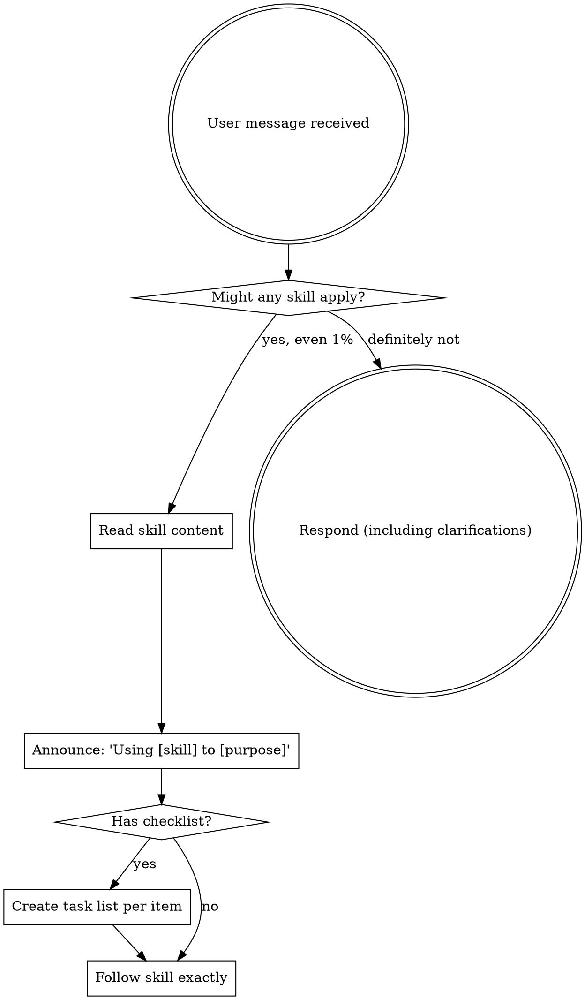

<!-- QUICK REFERENCE - Follow This -->

## Skill Decision (Every Response)

1. Read user message
2. Scan skill list - ANY might apply?
3. IF found → Read skill → Follow exactly
4. IF not found → Proceed

**No exceptions.
No rationalizations.**

### Common Skill Triggers

| User Says | Use Skill |
|-----------|-----------|
| "Fix this bug" | systematic-debugging |
| "Add feature X" | brainstorming → writing-plans |
| "Is this done?" | verification-before-completion |
| "Write tests" | test-driven-development |
| "Continue from yesterday" | continue-conversation |
| "Review this" | requesting-code-review |

### Phase Declaration

Before significant work, state:

```text
**Phase: EXPLORE** | **Phase: PLAN** | **Phase: EXECUTE** | **Phase: VERIFY** | **Phase: LEARN**
```

<!-- END QUICK REFERENCE -->

---

<EXTREMELY-IMPORTANT>
If you think there is even a 1% chance a skill might apply to what you are doing, you ABSOLUTELY MUST invoke the skill.

IF A SKILL APPLIES TO YOUR TASK, YOU DO NOT HAVE A CHOICE.
YOU MUST USE IT.

This is not negotiable.
This is not optional.
You cannot rationalize your way out of this.
</EXTREMELY-IMPORTANT>

## How to Access Skills

**In Augment Agent:** Skills are loaded via the skills system.
When you see a skill in the available_skills list, read it and follow it
directly.

**In other environments:** Check your platform's documentation for how skills
are loaded.

# Using Skills

## The Rule

**Invoke relevant or requested skills BEFORE any response or action.** Even a 1%
chance a skill might apply means that you should invoke the skill to check.
If an invoked skill turns out to be wrong for the situation, you don't need to
use it.



## Red Flags

These thoughts mean STOP -- you're rationalizing:

| Thought | Reality |
|---------|---------|
| "This is just a simple question" | Questions are tasks. Check for skills. |
| "I need more context first" | Skill check comes BEFORE clarifying questions. |
| "Let me explore the codebase first" | Skills tell you HOW to explore. Check first. |
| "I can check git/files quickly" | Files lack conversation context. Check for skills. |
| "Let me gather information first" | Skills tell you HOW to gather information. |
| "This doesn't need a formal skill" | If a skill exists, use it. |
| "I remember this skill" | Skills evolve. Read current version. |
| "This doesn't count as a task" | Action = task. Check for skills. |
| "The skill is overkill" | Simple things become complex. Use it. |
| "I'll just do this one thing first" | Check BEFORE doing anything. |
| "This feels productive" | Undisciplined action wastes time. Skills prevent this. |
| "I know what that means" | Knowing the concept ≠ using the skill. Invoke it. |

## Skill Priority

When multiple skills could apply, use this order:

1. **Process skills first** (brainstorming, debugging) - these determine HOW to
   approach the task
2. **Implementation skills second** (frontend-design, mcp-builder) - these guide
   execution

"Let's build X" → brainstorming first, then implementation skills.
"Fix this bug" → debugging first, then domain-specific skills.

## Skill Types

**Rigid** (TDD, debugging):
Follow exactly.
Don't adapt away discipline.

**Flexible** (patterns):
Adapt principles to context.

The skill itself tells you which.

## User Instructions

Instructions say WHAT, not HOW.
"Add X" or "Fix Y" doesn't mean skip workflows.

## Phase Awareness

Before taking action, declare your current phase.
This prevents drift and helps recognize when to transition.

### The Five Phases

| Phase | Purpose | Key Activities | Exit Criteria |
|-------|---------|----------------|---------------|
| **EXPLORE** | Understand the problem | Read code, search, gather context | Have clear picture of current state |
| **PLAN** | Design the solution | Create tasks, identify dependencies | Have actionable implementation steps |
| **EXECUTE** | Implement changes | Write code, make edits | All planned changes complete |
| **VERIFY** | Confirm correctness | Run tests, check lint, verify behavior | All checks pass |
| **LEARN** | Capture knowledge | Update notes, document decisions | Insights persisted to Basic Memory |

### Declaring Your Phase

At the start of significant work, state your phase:

```text
**Phase: EXPLORE** - Understanding how the auth system currently works before
proposing changes.
```

### Phase Transitions

| Current | Trigger | Next |
|---------|---------|------|
| EXPLORE | "I understand the current state" | PLAN |
| PLAN | "I have a clear implementation path" | EXECUTE |
| EXECUTE | "All planned changes are complete" | VERIFY |
| VERIFY | "All checks pass" | LEARN |
| VERIFY | "Tests fail" | Back to EXECUTE or PLAN |
| LEARN | "Knowledge captured" | Done or new EXPLORE |

### Anti-Patterns

- Jumping to EXECUTE without EXPLORE (coding before understanding)
- Skipping VERIFY (claiming done without evidence)
- Forgetting LEARN (losing insights to the void)
- Staying in EXPLORE too long (analysis paralysis)
- Not declaring phase transitions (drifting without awareness)

## Skill Chains

Skills connect through the workflow phases.
See `workflow-spine` skill for full details.

### Common Chains

| Scenario | Chain |
|----------|-------|
| New feature | brainstorming -> writing-plans -> executing-plans -> verification -> knowledge-capture |
| Bug fix | systematic-debugging -> TDD -> verification |
| Research | deep-dive OR storm -> knowledge-capture |
| Resume work | continue-conversation -> (pick up at saved phase) |
| Code review | receiving-code-review -> (EXECUTE if changes) -> verification |

### Artifacts Connect Skills

Skills communicate through Basic Memory artifacts:

```text
[brainstorming]
      |
      v writes
artifacts/specs/feature.md
      |
      v read by
[writing-plans]
      |
      v writes
artifacts/plans/feature.md
      |
      v read by
[executing-plans]
```

### Skill Handoff Protocol

When completing a skill, use the handoff protocol:

1. Save artifact to Basic Memory
2. Declare:
   "**Phase Complete:
   X -> Y**"
3. Suggest next skill

### Pre-Checks

Before starting PLAN or EXECUTE skills, verify input artifacts exist:

- PLAN needs spec or exploration
- EXECUTE needs plan

If missing, suggest the prerequisite phase.

---
> Converted and distributed by [TomeVault](https://tomevault.io/claim/mattniedelman) — claim your Tome and manage your conversions.
<!-- tomevault:4.0:skill_md:2026-04-16 -->
