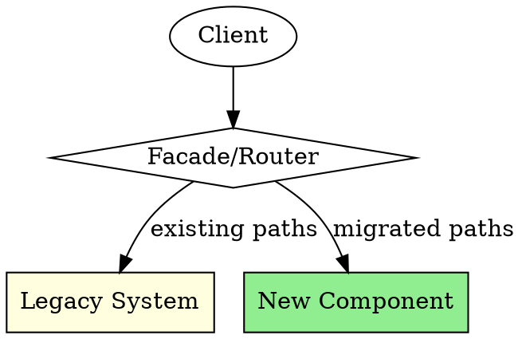

# Safe Brownfield Refactor

## Overview

**Refactor legacy code safely through incremental, reversible changes.** Brownfield systems require
different strategies than greenfield development. This skill provides guardrails for modernising
code without destabilising production systems.

**REQUIRED BACKGROUND:** superpowers:test-driven-development, superpowers:verification-before-completion

## When to Use

**Triggered when:**

- Modifying legacy code without comprehensive test coverage
- Introducing changes to long-running production systems
- Modernising technology stacks incrementally
- Refactoring code you do not fully understand
- Improving code quality in systems with high change risk
- Working with code that has implicit dependencies or undocumented behaviour

## Core Workflow

1. Understanding: Map dependencies, identify risks using assessment matrix, find seams, write characterisation tests
2. Preparation: Add monitoring, create rollback plan, set up feature flags if needed, establish baseline metrics
3. Execution: Make one atomic change at a time, run tests after each change, deploy frequently, monitor closely
4. Verification: Compare before/after metrics, validate characterisation tests pass, remove scaffolding, update documentation

## Core Principles

### 1. Characterisation Tests First

Before changing any code, write tests that capture current behaviour:

```text
1. Identify the code unit to change
2. Write tests that document existing behaviour (even if "wrong")
3. Verify tests pass against current implementation
4. Only then begin refactoring
```

**Characterisation tests are not unit tests.** They document what code does, not what it should do.
They become your safety net during refactoring.

### 2. Strangler Fig Pattern

Incrementally replace legacy code without big-bang rewrites:



**Implementation steps:**

1. Create a facade or routing layer in front of legacy code
2. Implement new functionality behind the facade
3. Gradually route traffic from legacy to new implementation
4. Remove legacy code only after new code is proven

### 3. Seam-Based Extraction

Find natural seams in code to enable testing and replacement:

| Seam Type          | Description                                   | Example                        |
| ------------------ | --------------------------------------------- | ------------------------------ |
| Object seam        | Replace behaviour via inheritance/composition | Extract interface, inject mock |
| Preprocessing seam | Conditional compilation                       | Feature flags                  |
| Link seam          | Replace dependencies at build/deploy time     | Dependency injection           |

**Finding seams:**

- Look for constructor parameters, method arguments
- Identify static calls that could be instance calls
- Find configuration points that affect behaviour

### 4. Small, Reversible Changes

Every change should be:

- **Incremental**: One logical change at a time
- **Reversible**: Easy to revert if problems arise
- **Deployable**: Each commit could go to production
- **Observable**: Behaviour difference is measurable

```text
Bad:  Rewrite entire module (3000 lines changed)
Good: Extract single method, add test, refactor (50 lines changed)
```

## Risk Assessment Matrix

Before each refactoring task, assess risk:

| Factor               | Low Risk        | Medium Risk    | High Risk        |
| -------------------- | --------------- | -------------- | ---------------- |
| Test coverage        | >80%            | 40-80%         | <40%             |
| Code understanding   | Well documented | Some docs      | No docs          |
| Deployment frequency | Daily           | Weekly         | Monthly+         |
| Rollback capability  | Automated       | Manual (fast)  | Manual (slow)    |
| Business criticality | Low traffic     | Medium traffic | Revenue critical |

**Risk mitigation by level:**

- **Low risk**: Proceed with standard TDD
- **Medium risk**: Add characterisation tests, use feature flags
- **High risk**: Parallel implementation, gradual cutover, comprehensive monitoring

## Workflow

### Phase 1: Understanding

1. **Map dependencies** - Document what the code touches
2. **Identify risks** - Use risk assessment matrix
3. **Find seams** - Locate points for safe modification
4. **Document behaviour** - Write characterisation tests

### Phase 2: Preparation

1. **Add monitoring** - Ensure you can detect regressions
2. **Create rollback plan** - Know how to revert quickly
3. **Set up feature flags** - Enable gradual rollout if needed
4. **Establish baseline** - Record current performance/behaviour metrics

### Phase 3: Execution

1. **One change at a time** - Atomic, focused commits
2. **Test after each change** - Run characterisation tests
3. **Deploy frequently** - Validate in production early
4. **Monitor closely** - Watch for unexpected behaviour

### Phase 4: Verification

1. **Compare metrics** - Before/after performance
2. **Validate behaviour** - Characterisation tests still pass
3. **Remove scaffolding** - Delete old code paths when safe
4. **Update documentation** - Reflect new architecture

## Anti-Patterns to Avoid

### Big Bang Rewrites

**Problem:** "Let's rewrite the whole thing properly"
**Reality:** Rewrites fail more often than they succeed

**Instead:** Incremental strangler fig, one component at a time

### Testing After Refactoring

**Problem:** "I'll add tests after I clean up the code"
**Reality:** Changes without tests are changes without a safety net

**Instead:** Characterisation tests BEFORE any changes

### Optimistic Timelines

**Problem:** "It's just a small refactor, should take a day"
**Reality:** Legacy code contains hidden complexity

**Instead:** Triple your estimate, plan for unexpected dependencies

### Ignoring Production Feedback

**Problem:** "Tests pass, so it's fine"
**Reality:** Production has scenarios tests do not cover

**Instead:** Deploy incrementally, monitor metrics, be ready to rollback

## Emergency Rollback Checklist

If production issues occur during refactoring:

1. [ ] Revert feature flag (if applicable)
2. [ ] Rollback deployment to last known good state
3. [ ] Verify system stability
4. [ ] Capture reproduction steps and logs
5. [ ] Root cause analysis before retry
6. [ ] Add characterisation test for discovered behaviour

## Integration with Other Skills

- **broken-window**: Apply 2x rule when encountering legacy issues
- **technical-debt-prioritisation**: Prioritise refactoring opportunities
- **change-risk-rollback**: Detailed rollback strategies
- **characterisation testing**: Advanced techniques (see references/)

## Quick Reference

| Situation             | Action                             |
| --------------------- | ---------------------------------- |
| No tests exist        | Write characterisation tests first |
| Understanding is poor | Document before changing           |
| Change is large       | Break into smaller increments      |
| Rollback is slow      | Add feature flags                  |
| Risk is high          | Parallel implementation            |

## Sample Characterisation Test Template

```csharp
/// <summary>
/// Characterisation tests for LegacyOrderProcessor.
/// These tests document CURRENT behaviour, not CORRECT behaviour.
/// Do NOT fix "bugs" found here without explicit decision.
/// </summary>
public class LegacyOrderProcessorCharacterisationTests
{
    private readonly LegacyOrderProcessor _sut;

    public LegacyOrderProcessorCharacterisationTests()
    {
        _sut = new LegacyOrderProcessor(/* real dependencies */);
    }

    [Fact]
    public void ProcessOrder_WithNullCustomer_ReturnsMinusOne()
    {
        // CHARACTERISATION: Current behaviour returns -1 for null customer
        // This may be a bug, but it's what production does
        var result = _sut.ProcessOrder(null, new Order());

        result.Should().Be(-1);
    }

    [Fact]
    public void ProcessOrder_WithExpiredDiscount_StillAppliesDiscount()
    {
        // CHARACTERISATION: Expired discounts are still applied
        // Known bug #1234 - fixing requires migration plan
        var order = new Order { DiscountCode = "EXPIRED2020" };

        var result = _sut.ProcessOrder(customer, order);

        result.TotalDiscount.Should().BeGreaterThan(0);
    }

    [Theory]
    [InlineData("", 0)]           // Empty input returns 0
    [InlineData("INVALID", -1)]   // Invalid code returns -1
    [InlineData("VALID10", 10)]   // Valid code applies correctly
    public void ApplyDiscount_VariousInputs_DocumentedBehaviour(
        string code, decimal expected)
    {
        var result = _sut.ApplyDiscount(code);
        result.Should().Be(expected);
    }
}
```

## Refactor Sequencing Checklist

Before each refactoring step, complete this checklist:

### Pre-Refactor Checklist

- [ ] **Characterisation tests written** for code being changed
- [ ] **All characterisation tests pass** against current implementation
- [ ] **Change scope documented** (which files/methods will change)
- [ ] **Rollback plan identified** (revert commit, feature flag, or dual-run)
- [ ] **Dependencies mapped** (what else might break)
- [ ] **Estimate reviewed** (3x initial estimate for legacy code)

### During Refactor Checklist

- [ ] **Small commits** (each independently revertable)
- [ ] **Tests run after each change** (characterisation + any new tests)
- [ ] **Behaviour preserved** (no functional changes unless explicit)
- [ ] **Comments added** for non-obvious legacy behaviour retained
- [ ] **Technical debt noted** (issues found but not fixed this iteration)

### Post-Refactor Checklist

- [ ] **All tests pass** (characterisation + new + existing)
- [ ] **Code review completed** with focus on behaviour preservation
- [ ] **Deployment plan documented** (incremental rollout if possible)
- [ ] **Monitoring configured** for relevant metrics
- [ ] **Rollback tested** (verify rollback works before full deploy)
- [ ] **Documentation updated** (if public interfaces changed)

### Refactor Sequencing Order

1. **Extract method** - Isolate the code to change
2. **Add characterisation tests** - Document current behaviour
3. **Refactor internals** - Change implementation, preserve interface
4. **Add new tests** - Test improved behaviour
5. **Remove duplication** - Clean up temporary scaffolding
6. **Update documentation** - Reflect new structure

## Red Flags - STOP

These statements indicate brownfield refactoring anti-patterns:

| Thought                               | Reality                                                                     |
| ------------------------------------- | --------------------------------------------------------------------------- |
| "Let's rewrite the whole thing"       | Big bang rewrites fail more often than succeed; use strangler fig           |
| "Tests can wait until after cleanup"  | Characterisation tests BEFORE any changes; they're your safety net          |
| "This refactor is straightforward"    | Legacy code has hidden complexity; triple your estimate                     |
| "Tests pass, so we're safe"           | Production has scenarios tests don't cover; deploy incrementally            |
| "Just one more thing while I'm here"  | Scope creep kills refactors; one logical change at a time                   |
| "We understand this code well enough" | Document assumptions with characterisation tests; trust evidence not memory |

---
> Converted and distributed by [TomeVault](https://tomevault.io/claim/mcj-coder) — claim your Tome and manage your conversions.
<!-- tomevault:4.0:skill_md:2026-04-15 -->
