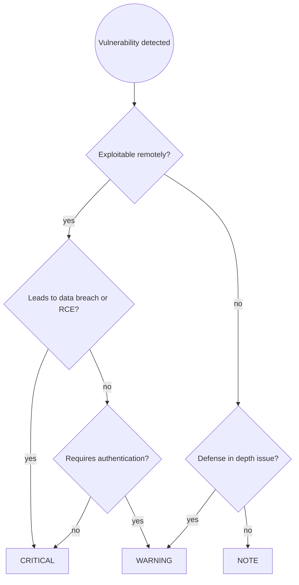

# Security Audit Principles

Universal OWASP Top 10 vulnerability identification for server-side applications.
Catch security issues before they reach production.

## Workflow

### Step 1 — Scope the audit

Determine what's being reviewed:
- Entire application (initial security review)
- Specific feature or PR (targeted review)
- Security-critical subsystem (authentication, payment, PII handling)

Ask user to clarify scope if unclear.

### Step 2 — Run the security checklist

Work through each OWASP category. For every finding, assign severity:

| Severity | Meaning |
|---|---|
| 🔴 CRITICAL | Exploitable vulnerability, must fix before deploying |
| 🟡 WARNING | Potential security issue, defense-in-depth concern |
| 🔵 NOTE | Security best practice suggestion |

### Step 3 — Present findings

Group by severity, then by category. Include file path and line number in the header:

```
🔴 CRITICAL — path/to/file.ext:42
SQL Injection: query built with string formatting allows arbitrary SQL
execution. Attacker can dump the database or modify records.

Suggested fix:
[Concrete remediation with code]
```

After all findings, show summary:
```
Security audit complete: N CRITICAL, N WARNINGS, N NOTES
```

### Step 4 — Conclude

**If CRITICAL findings exist:**
> "🔴 There are CRITICAL security vulnerabilities that must be fixed before
> deploying. I can help you address them, or walk you through the fixes."

**If no CRITICAL findings:**
> "✅ No critical vulnerabilities found. [N warnings / notes listed above.]
> Consider addressing warnings for defense-in-depth."

---

## Security Checklist (OWASP Top 10)

Work through each OWASP category systematically:

### 🔴 A01 — Injection

**SQL/Query Injection** - user input concatenated into queries:
- Never build queries with string concatenation
- Use parameterized queries/prepared statements
- Validate and escape user input before use in queries

**Log Injection** - unsanitized user input in log statements:
- Sanitize user input before logging (strip newlines, control characters)
- Don't log sensitive data (passwords, tokens, PII)

**Command Injection** - user input passed to shell commands:
- Avoid shell execution with user input
- Use language-native APIs instead of shell commands
- If unavoidable, validate input against strict whitelist

### 🔴 A02 — Broken Authentication

**Weak credentials** - hardcoded or weak passwords/tokens:
- Never hardcode credentials in code
- Use environment variables or secret management systems
- Enforce strong password policies

**Session management** - improper session handling:
- Implement proper session timeout
- Invalidate sessions on logout
- Regenerate session IDs after authentication
- Use secure, httpOnly cookies for session tokens

**Missing authentication** - unprotected endpoints:
- Require authentication for all non-public endpoints
- Default to deny, explicitly allow public endpoints

### 🔴 A03 — Broken Access Control

**Missing authorization** - no ownership/permission checks:
- Verify user owns resource before operations
- Check permissions at every access point, not just UI
- Implement role-based or attribute-based access control

**Mass assignment** - binding user input directly to objects:
- Use DTOs with explicit field mapping
- Never bind request data directly to entities
- Whitelist allowed fields, don't rely on blacklist

**Insecure direct object reference** - exposing internal IDs:
- Verify ownership before serving resources by ID
- Use UUIDs instead of sequential IDs where appropriate

### 🔴 A04 — Cryptographic Failures

**Weak hashing** - using weak or no hashing for sensitive data:
- Use strong hashing algorithms (bcrypt, scrypt, argon2)
- Never use MD5 or SHA1 for passwords
- Salt hashes appropriately

**Plaintext secrets** - storing secrets unencrypted:
- Encrypt secrets at rest
- Use key management systems for encryption keys
- Never commit secrets to version control

**Weak TLS** - missing or misconfigured TLS:
- Enforce TLS for all connections
- Use strong cipher suites
- Validate certificates properly

### 🔴 A05 — Security Misconfiguration

**Verbose error messages** - exposing stack traces to users:
- Sanitize error messages for production
- Log detailed errors server-side only
- Return generic error messages to clients

**Missing security headers** - no defense-in-depth headers:
- Set Content-Security-Policy
- Enable X-Frame-Options
- Configure HSTS for HTTPS

**Debug mode in production** - debug flags enabled:
- Disable debug mode in production
- Remove development endpoints/tools
- Minimize exposed surface area

**Permissive CORS** - allowing all origins:
- Validate CORS origins against whitelist
- Don't use wildcard (*) in production
- Only allow necessary HTTP methods

### 🔴 A06 — Vulnerable and Outdated Components

**Known CVEs** - dependencies with known vulnerabilities:
- Regularly scan dependencies for CVEs
- Update dependencies to patch versions
- Monitor security advisories for frameworks

**Unmaintained dependencies** - using abandoned libraries:
- Check maintenance status of dependencies
- Replace unmaintained libraries
- Track security update policies

### 🔴 A08 — Server-Side Request Forgery (SSRF)

**Unvalidated external URLs** - accepting user-provided URLs:
- Validate external URLs against whitelist
- Reject private IP ranges (127.0.0.1, 10.0.0.0/8, etc.)
- Use DNS rebinding protection

**Open redirects** - redirecting to user-provided URLs:
- Validate redirect URLs against whitelist
- Use relative URLs for internal redirects
- Reject javascript: and data: schemes

---

## Defense in Depth Principles

**Input validation** - validate at boundaries:
- Validate all external input (HTTP, messages, files)
- Whitelist validation preferred over blacklist
- Validate data types, ranges, formats

**Rate limiting** - prevent DoS attacks:
- Implement rate limiting on authentication endpoints
- Throttle expensive operations
- Use backpressure for queue processing

**Least privilege** - minimize permissions:
- Run services with minimal required permissions
- Separate read/write database users
- Use fine-grained permission models

**Audit logging** - track security-relevant events:
- Log authentication attempts (success and failure)
- Log authorization failures
- Log access to sensitive data
- Include user ID, timestamp, action, resource

---

## Severity Decision Flow



---

## Common Pitfalls

| Mistake | Why It's Wrong | Fix |
|---------|----------------|-----|
| "It's only accessible to authenticated users" | Auth can be bypassed, always validate authorization | Check permissions even for authenticated endpoints |
| "Input validation on frontend" | Frontend can be bypassed | Always validate on backend |
| "This endpoint isn't public" | Security through obscurity fails | Protect all endpoints |
| "We'll fix it after launch" | Vulnerabilities get exploited quickly | Fix before production |
| Trusting environment variables blindly | Env vars can be exposed or leaked | Validate and sanitize env var contents |
| Using blacklist validation | Attackers find ways around blacklists | Use whitelist validation |
| Logging sensitive data for debugging | Logs leak to unauthorized parties | Never log passwords, tokens, PII |
| "Nobody knows this endpoint exists" | Attackers scan and enumerate | Assume all endpoints will be discovered |

---

## Skill Chaining

Language-specific security audit skills (`java-security-audit` for Java/Quarkus,
`ts-security-audit` for TypeScript/Node.js, `python-security-audit`, etc.) implement
these OWASP principles with language-specific code examples, framework-specific
security features, and ecosystem-specific tooling.

---
> Source: [mdproctor/cc-praxis](https://github.com/mdproctor/cc-praxis) — distributed by [TomeVault](https://tomevault.io).
<!-- tomevault:4.0:skill_md:2026-05-22 -->
