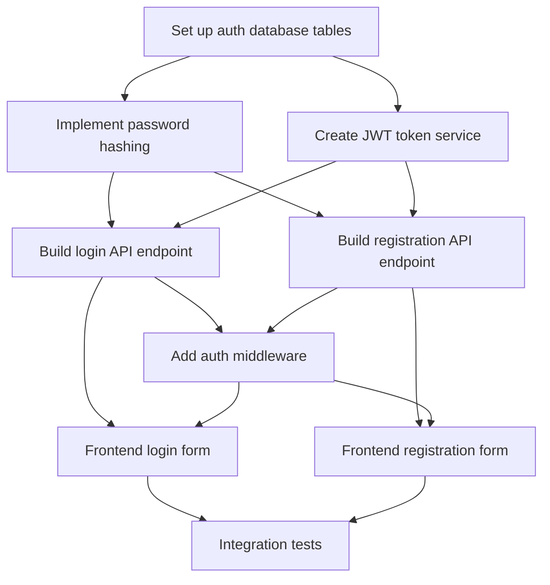

# Project Planner

> **Cross-Platform AI Agent Skill**
> This skill works with any AI agent platform that supports the skills.sh standard.

# Project Planner

Break down large, complex projects into manageable tasks with clear dependencies, progress tracking, and visual diagrams.

## Project to Plan

command arguments

## Planning Workflow

### Phase 0: Project Analysis

**Step 0.1: Understand Project Scope**

Use lightweight exploration for token-efficient codebase analysis:

**Step 0.2: Clarify Requirements**

If the project description is vague or has multiple valid approaches, use `interactive clarification` to clarify:
- What are the must-have vs nice-to-have features?
- Are there specific architectural constraints?
- What's the target completion timeline?
- Should this integrate with existing systems?
- Are there specific technology preferences?

### Phase 1: Task Breakdown

**Step 1.1: Identify Major Milestones**

Break the project into 3-7 major milestones. Each milestone represents a significant deliverable or phase:

**Example for a new authentication system**:
1. Discovery & Planning
2. Database schema and migrations
3. Core authentication logic
4. API endpoints
5. Frontend integration
6. Testing & verification
7. Documentation & deployment

**Step 1.2: Create Tasks for Each Milestone**

For each milestone, create tasks that are:
- **Specific**: Clear deliverable and acceptance criteria
- **Measurable**: Can be marked completed objectively
- **Achievable**: Can be completed in a reasonable timeframe
- **Relevant**: Contributes to the milestone goal
- **Time-bound**: Not open-ended

**Task Granularity Guidelines**:
- **Too large**: "Build the authentication system" (breaks into 10+ subtasks)
- **Too small**: "Import bcrypt library" (trivial step within a larger task)
- **Just right**: "Implement password hashing with bcrypt and validation"

### Phase 2: Dependency Mapping

**Step 2.1: Identify Task Dependencies**

For each task, determine:
- **Prerequisites**: Which tasks must complete before this can start?
- **Blockers**: Which tasks does this one block?
- **Parallelizable**: Which tasks can run concurrently?

**Dependency Types**:
- **Sequential**: Task B requires output from Task A
- **Parallel**: Tasks A and B can run simultaneously
- **Convergence**: Tasks A and B must both complete before Task C

**Step 2.2: Set Up Task Dependencies**

```
# Example: Authentication system task chain
TaskCreate: subject="Set up auth database tables", description="..."
TaskCreate: subject="Implement password hashing", description="..."
TaskCreate: subject="Create JWT token service", description="..."
TaskCreate: subject="Build login API endpoint", description="..."
TaskCreate: subject="Build registration API endpoint", description="..."
TaskCreate: subject="Add auth middleware", description="..."
TaskCreate: subject="Frontend login form", description="..."
TaskCreate: subject="Frontend registration form", description="..."
TaskCreate: subject="Integration tests", description="..."

# Sequential dependencies
TaskUpdate: { taskId: "2", addBlockedBy: ["1"] } # Hash needs DB schema
TaskUpdate: { taskId: "3", addBlockedBy: ["1"] } # JWT needs DB schema
TaskUpdate: { taskId: "4", addBlockedBy: ["2", "3"] } # Login needs hash + JWT
TaskUpdate: { taskId: "5", addBlockedBy: ["2", "3"] } # Registration needs hash + JWT
TaskUpdate: { taskId: "6", addBlockedBy: ["4", "5"] } # Middleware after endpoints
TaskUpdate: { taskId: "7", addBlockedBy: ["4", "6"] } # Frontend needs API + middleware
TaskUpdate: { taskId: "8", addBlockedBy: ["5", "6"] } # Frontend needs API + middleware
TaskUpdate: { taskId: "9", addBlockedBy: ["7", "8"] } # Tests after all frontend
### Phase 3: Visualization

**Step 3.1: Generate Dependency Diagram**

Create a Mermaid diagram showing the task dependency graph:

```mermaid
graph TD
 A[Set up auth database tables] --> B[Implement password hashing]
 A --> C[Create JWT token service]
 B --> D[Build login API endpoint]
 C --> D
 B --> E[Build registration API endpoint]
 C --> E
 D --> F[Add auth middleware]
 E --> F
 D --> G[Frontend login form]
 F --> G
 E --> H[Frontend registration form]
 F --> H
 G --> I[Integration tests]
 H --> I
**Diagram Guidelines**:
- Use clear, concise node labels
- Show critical path in a different color if possible
- Group related tasks visually
- Include milestone markers
- Add estimates if available

**Step 3.2: Document Critical Path**

Identify and highlight the critical path (longest sequential chain):
```
Critical Path: Database → Password Hashing → Login API → Middleware → Frontend Login → Tests
Estimated Duration: [X days/weeks]
### Phase 4: Task Templates

**Step 4.1: Create Task Templates**

For common project types, provide reusable templates:

**Web Feature Template**:
```
1. Discovery & Requirements
2. Database schema (if needed)
3. Backend API implementation
4. Frontend component implementation
5. Integration & E2E tests
6. Documentation
7. Deployment
**Bug Fix Template**:
```
1. Reproduce bug
2. Root cause analysis
3. Plan fix
4. Implement fix
5. Verify with tests
6. Commit and document
**Refactoring Template**:
```
1. Identify refactoring scope
2. Write characterization tests
3. Plan refactoring approach
4. Incremental refactoring (with commits)
5. Verify no behavior changes
6. Update documentation
### Phase 5: Progress Tracking

**Step 5.1: Initial Task List**

After creating all tasks and dependencies, show the full plan:
```
TaskList
**Step 5.2: Track Implementation Progress**

As work progresses, update task status:
```
TaskUpdate: { taskId: "1", status: "in_progress" }
# ... work ...
TaskUpdate: { taskId: "1", status: "completed" }
TaskList # Show updated progress
**Step 5.3: Handle Blockers**

If a task becomes blocked by external factors:
```
TaskUpdate:
 taskId: "4"
 metadata: { blocked_reason: "Waiting for design mockups from UI team" }
Use `interactive clarification` to notify stakeholders and get resolution timeline.

## Common Project Patterns

### Pattern 1: API + Frontend Feature

**Parallel Work Opportunity**: Backend and frontend can be built simultaneously with agreed API contract.

```
Discovery → API Contract Definition → (API Implementation || Frontend Implementation) → Integration → Testing
**Tasks**:
1. Discover project structure
2. Define API contract (OpenAPI/Swagger)
3. Implement API endpoints (parallel)
4. Implement frontend component (parallel)
5. Integration testing (after both)
6. E2E testing
7. Documentation and deployment

### Pattern 2: Database Migration

**Strict Sequential**: Schema changes before code changes.

```
Discovery → Schema Design → Migration Script → Update Models → Update Queries → Tests → Deploy
**Tasks**:
1. Discover existing schema
2. Design new schema/changes
3. Write migration script
4. Update ORM models
5. Update application queries
6. Update tests
7. Test migration on staging
8. Deploy to production

### Pattern 3: Library Integration

**Research First**: Understand library before implementation.

```
Discovery → Research Library → Proof of Concept → Integration → Tests → Documentation
**Tasks**:
1. Discover project patterns
2. Research library documentation (Context7)
3. Create proof of concept
4. Integrate into existing code
5. Write unit tests
6. Write integration tests
7. Document usage patterns

## Advanced Features

### Multi-Phase Projects

For very large projects, create meta-tasks (epics) with sub-task hierarchies:

```
Epic: "User Authentication System"
 Milestone 1: "Core Auth"
 - Task 1.1: Database schema
 - Task 1.2: Password hashing
 - Task 1.3: JWT service
 Milestone 2: "API Endpoints"
 - Task 2.1: Login endpoint
 - Task 2.2: Registration endpoint
 - Task 2.3: Password reset endpoint
 Milestone 3: "Frontend Integration"
 - Task 3.1: Login form
 - Task 3.2: Registration form
 - Task 3.3: Password reset form
Use metadata to track parent-child relationships:
```
TaskCreate:
 subject: "Milestone 1: Core Auth"
 description: "..."
 metadata: { type: "milestone", epic: "authentication" }

TaskCreate:
 subject: "Database schema"
 description: "..."
 metadata: { type: "task", milestone: "1", epic: "authentication" }
### Risk Assessment

Identify high-risk tasks that may cause delays:
- Tasks with unclear requirements
- Tasks depending on external factors
- Tasks using unfamiliar technology
- Tasks with tight coupling to many other tasks

Mark high-risk tasks in metadata:
```
TaskCreate:
 subject: "Implement OAuth provider"
 description: "..."
 metadata: { risk: "high", risk_reason: "Unfamiliar with OAuth flow" }
### Resource Allocation

For team projects, track task ownership:
```
TaskCreate:
 subject: "Build API endpoint"
 description: "..."
 metadata: { assigned_to: "backend-team", estimated_hours: 8 }
## Output Format

Provide a summary including:
- Total number of tasks created
- Dependency graph visualization (Mermaid)
- Critical path analysis
- Estimated timeline (if applicable)
- Next steps to start implementation
- Risk areas identified

## Usage Examples

```bash
# Plan a new feature
project-planner Implement user authentication with OAuth2 and JWT

# Plan a refactoring
project-planner Refactor payment module to use strategy pattern

# Plan a bug fix (for complex bugs)
project-planner Fix memory leak in WebSocket connection handling

# Plan a migration
project-planner Migrate from REST API to GraphQL
## Best Practices

1. **Start with discovery**: Always understand the project before planning
2. **Right-size tasks**: Not too big, not too small (aim for 2-8 hours per task)
3. **Clear dependencies**: Make prerequisites explicit with `blockedBy`
4. **Identify parallel work**: Maximize concurrent progress
5. **Visualize the plan**: Mermaid diagrams help communicate structure
6. **Track progress**: Use `TaskList` regularly to show status
7. **Adapt as needed**: Update tasks and dependencies as requirements change
8. **Document decisions**: Use task descriptions to capture context and rationale

## References

For detailed patterns and examples:
- [references/task-patterns.md](references/task-patterns.md) - Reusable task breakdown patterns
- [references/dependency-examples.md](references/dependency-examples.md) - Complex dependency examples

## Claude Code Enhanced Features

This skill includes the following Claude Code-specific enhancements:

## Project to Plan

$ARGUMENTS

## Planning Workflow

### Phase 0: Project Analysis

**Step 0.1: Understand Project Scope**

Use Haiku-powered Explore agent for token-efficient codebase analysis:

```
Use Task tool with Explore agent:
- prompt: "Analyze the project to understand:
    1. Read CLAUDE.md and README.md for project context
    2. Identify project type (web app, API, CLI, library, etc.)
    3. Map out major components and modules
    4. Note technology stack and frameworks
    5. Identify existing patterns and conventions
    6. Find similar completed features to reference
    Return a structured summary of the project architecture."
- subagent_type: "Explore"
- model: "haiku"  # Token-efficient for exploration
```

**Step 0.2: Clarify Requirements**

If the project description is vague or has multiple valid approaches, use `AskUserQuestion` to clarify:
- What are the must-have vs nice-to-have features?
- Are there specific architectural constraints?
- What's the target completion timeline?
- Should this integrate with existing systems?
- Are there specific technology preferences?

### Phase 1: Task Breakdown

**Step 1.1: Identify Major Milestones**

Break the project into 3-7 major milestones. Each milestone represents a significant deliverable or phase:

**Example for a new authentication system**:
1. Discovery & Planning
2. Database schema and migrations
3. Core authentication logic
4. API endpoints
5. Frontend integration
6. Testing & verification
7. Documentation & deployment

**Step 1.2: Create Tasks for Each Milestone**

For each milestone, create tasks that are:
- **Specific**: Clear deliverable and acceptance criteria
- **Measurable**: Can be marked completed objectively
- **Achievable**: Can be completed in a reasonable timeframe
- **Relevant**: Contributes to the milestone goal
- **Time-bound**: Not open-ended

**Task Granularity Guidelines**:
- **Too large**: "Build the authentication system" (breaks into 10+ subtasks)
- **Too small**: "Import bcrypt library" (trivial step within a larger task)
- **Just right**: "Implement password hashing with bcrypt and validation"

### Phase 2: Dependency Mapping

**Step 2.1: Identify Task Dependencies**

For each task, determine:
- **Prerequisites**: Which tasks must complete before this can start?
- **Blockers**: Which tasks does this one block?
- **Parallelizable**: Which tasks can run concurrently?

**Dependency Types**:
- **Sequential**: Task B requires output from Task A
- **Parallel**: Tasks A and B can run simultaneously
- **Convergence**: Tasks A and B must both complete before Task C

**Step 2.2: Set Up Task Dependencies**

```
# Example: Authentication system task chain
TaskCreate: subject="Set up auth database tables", description="..."
TaskCreate: subject="Implement password hashing", description="..."
TaskCreate: subject="Create JWT token service", description="..."
TaskCreate: subject="Build login API endpoint", description="..."
TaskCreate: subject="Build registration API endpoint", description="..."
TaskCreate: subject="Add auth middleware", description="..."
TaskCreate: subject="Frontend login form", description="..."
TaskCreate: subject="Frontend registration form", description="..."
TaskCreate: subject="Integration tests", description="..."

# Sequential dependencies
TaskUpdate: { taskId: "2", addBlockedBy: ["1"] }  # Hash needs DB schema
TaskUpdate: { taskId: "3", addBlockedBy: ["1"] }  # JWT needs DB schema
TaskUpdate: { taskId: "4", addBlockedBy: ["2", "3"] }  # Login needs hash + JWT
TaskUpdate: { taskId: "5", addBlockedBy: ["2", "3"] }  # Registration needs hash + JWT
TaskUpdate: { taskId: "6", addBlockedBy: ["4", "5"] }  # Middleware after endpoints
TaskUpdate: { taskId: "7", addBlockedBy: ["4", "6"] }  # Frontend needs API + middleware
TaskUpdate: { taskId: "8", addBlockedBy: ["5", "6"] }  # Frontend needs API + middleware
TaskUpdate: { taskId: "9", addBlockedBy: ["7", "8"] }  # Tests after all frontend
```

### Phase 3: Visualization

**Step 3.1: Generate Dependency Diagram**

Create a Mermaid diagram showing the task dependency graph:



**Diagram Guidelines**:
- Use clear, concise node labels
- Show critical path in a different color if possible
- Group related tasks visually
- Include milestone markers
- Add estimates if available

**Step 3.2: Document Critical Path**

Identify and highlight the critical path (longest sequential chain):
```
Critical Path: Database → Password Hashing → Login API → Middleware → Frontend Login → Tests
Estimated Duration: [X days/weeks]
```

### Phase 4: Task Templates

**Step 4.1: Create Task Templates**

For common project types, provide reusable templates:

**Web Feature Template**:
```
1. Discovery & Requirements
2. Database schema (if needed)
3. Backend API implementation
4. Frontend component implementation
5. Integration & E2E tests
6. Documentation
7. Deployment
```

**Bug Fix Template**:
```
1. Reproduce bug
2. Root cause analysis
3. Plan fix
4. Implement fix
5. Verify with tests
6. Commit and document
```

**Refactoring Template**:
```
1. Identify refactoring scope
2. Write characterization tests
3. Plan refactoring approach
4. Incremental refactoring (with commits)
5. Verify no behavior changes
6. Update documentation
```

### Phase 5: Progress Tracking

**Step 5.1: Initial Task List**

After creating all tasks and dependencies, show the full plan:
```
TaskList
```

**Step 5.2: Track Implementation Progress**

As work progresses, update task status:
```
TaskUpdate: { taskId: "1", status: "in_progress" }
# ... work ...
TaskUpdate: { taskId: "1", status: "completed" }
TaskList  # Show updated progress
```

**Step 5.3: Handle Blockers**

If a task becomes blocked by external factors:
```
TaskUpdate:
  taskId: "4"
  metadata: { blocked_reason: "Waiting for design mockups from UI team" }
```

Use `AskUserQuestion` to notify stakeholders and get resolution timeline.

---
> Converted and distributed by [TomeVault](https://tomevault.io/claim/mgiovani) — claim your Tome and manage your conversions.
<!-- tomevault:4.0:skill_md:2026-04-13 -->
