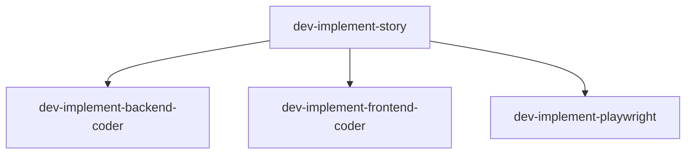

# /doc-sync - Automated Documentation Synchronization

## Description

Automatically detect changes to agent and command files in `.claude/` and update workflow documentation in `docs/workflow/` to prevent documentation drift. The doc-sync skill provides a consistent, automated approach to keeping documentation synchronized with agent and command file changes.

**Key Features:**
- Git diff-based change detection with timestamp fallback
- YAML frontmatter parsing and validation
- Automated table and section updates
- Mermaid diagram regeneration from spawn relationships
- Changelog entry drafting with version bumping
- Comprehensive sync reporting
- Pre-commit hook integration for validation

## Usage

```bash
# Full sync - update all documentation
/doc-sync

# Check-only mode - verify sync without modifying files (for pre-commit hook)
/doc-sync --check-only

# Force sync - process all files regardless of git status
/doc-sync --force
```

## Parameters

| Parameter | Type | Description | Required | Default |
|-----------|------|-------------|----------|---------|
| `--check-only` | Flag | Dry-run mode - verify sync without modifying files. Exits with code 1 if out of sync, 0 if in sync. Useful for pre-commit hooks. | No | false |
| `--force` | Flag | Process all agent/command files regardless of git status. Bypasses git diff detection and processes all files. | No | false |

### Flag Usage Examples

```bash
# Check if docs are in sync (exit code indicates status)
/doc-sync --check-only
# Returns: 0 = in sync, 1 = out of sync

# Force full rebuild of all documentation
/doc-sync --force
# Processes all files regardless of git status

# Combining flags (check-only takes precedence)
/doc-sync --check-only --force
# Checks all files without modifying
```

## Execution Instructions

The doc-sync skill operates through seven distinct phases to ensure comprehensive documentation synchronization.

### Phase 1: File Discovery

**Primary Method (Git Diff):**

The agent uses git commands to detect changed files for optimal accuracy:

```bash
# For staged changes (pre-commit scenario)
git diff --cached --name-only | grep -E '\.claude/(agents|commands)/'

# For uncommitted changes (manual runs)
git diff HEAD --name-only .claude/agents/ .claude/commands/

# All changes (staged + unstaged)
git diff HEAD --name-only --diff-filter=AMR .claude/
```

**Fallback Method (Timestamp-Based):**

When git is unavailable, the agent falls back to timestamp-based detection:

```bash
# Find files modified in last 24 hours
find .claude/agents/ .claude/commands/ -name '*.agent.md' -o -name '*.md' -mtime -1
```

**Output:** List of changed files with action type (added, modified, deleted)

**Error Handling:**
- Git command failure: Falls back to timestamp detection with logged warning
- Empty result: Reports "No changes detected" and exits successfully

---

### Phase 2: Frontmatter Parsing

**Step 2.1: Parse File Frontmatter**

Extract and validate YAML frontmatter from each changed file:

**Extraction Method:**
```bash
# Extract frontmatter between --- delimiters
sed -n '/^---$/,/^---$/p' FILE.agent.md | sed '1d;$d'
```

**Required Fields:**
- `created` - ISO date format YYYY-MM-DD
- `updated` - ISO date format YYYY-MM-DD
- `version` - Semantic version X.Y.Z

**Optional Fields:**
- `type` - orchestrator | leader | worker
- `triggers` - Array of command names
- `name` - Human-readable identifier
- `description` - 1-line description
- `model` - haiku | sonnet | opus
- `tools` - Array of allowed tools
- `spawns` - Array of worker agent names (for diagram generation)
- `kb_tools` - Array of KB tools used
- `mcp_tools` - Array of MCP tools used

**Step 2.2: Query Database (if available)**

If `postgres-knowledgebase` MCP tools are available, query for agent/command/skill metadata from the database. This enables hybrid file+database documentation synchronization.

**Database Query Example:**

```javascript
const DB_QUERY_TIMEOUT_MS = 30000; // Configurable timeout (default: 30 seconds)

try {
  // Query workflow.components for agent/command/skill metadata
  const components = await mcp__postgres_knowledgebase__query_workflow_components({
    component_types: ['agent', 'command', 'skill'],
    timeout: DB_QUERY_TIMEOUT_MS
  });

  // Query workflow.phases for phase status and completion
  const phases = await mcp__postgres_knowledgebase__query_workflow_phases({
    timeout: DB_QUERY_TIMEOUT_MS
  });

  console.log(`Retrieved ${components.length} components and ${phases.length} phases from database`);
} catch (error) {
  if (error.type === 'TIMEOUT') {
    logger.warn(`Database query timeout after ${DB_QUERY_TIMEOUT_MS/1000}s - falling back to file-only mode`);
  } else if (error.type === 'CONNECTION_FAILED') {
    logger.warn('Database connection failed - falling back to file-only mode');
  } else {
    logger.error('Database query error:', error.message);
  }
  // Continue with file-only mode (graceful degradation)
}
```

**Step 2.3: Merge Sources**

If database data is available, merge with file frontmatter:
- **Database overrides file** if both present for same component
- **File-only** if database unavailable or query fails
- **Database-only** for components not in files (future expansion)

**Example Merge Logic:**

```javascript
function mergeMetadata(fileMetadata, dbMetadata) {
  if (!dbMetadata) return fileMetadata;

  return {
    ...fileMetadata,
    ...dbMetadata,  // Database takes precedence
    source: 'hybrid', // Track data source
    file_version: fileMetadata?.version,
    db_version: dbMetadata?.version
  };
}
```

**Step 2.4: Track Database Status**

Record database query status for inclusion in SYNC-REPORT.md:
- `database_queried: true/false`
- `database_status: success | timeout | connection_failed | unavailable`
- `database_components_count: N`
- `database_phases_count: N`
- `query_duration_ms: N`

**Error Handling:**
- **Invalid YAML:** Skip file, add to manual_review_needed section in report
- **Missing required fields:** Log warning but continue processing with defaults
- **Missing optional fields:** Use sensible defaults or omit from output
- **Database timeout:** Log timeout error with duration, fall back to file-only mode
- **Database connection failed:** Log connection error, fall back to file-only mode
- **Database unavailable:** Silently continue with file-only mode

---

### Phase 3: Section Mapping

Map agent files to documentation sections based on naming patterns:

| Agent Pattern | Documentation File | Section |
|---------------|-------------------|---------|
| `pm-*.agent.md` | `docs/workflow/phases.md` | Phase 2: PM Story Generation |
| `elab-*.agent.md` | `docs/workflow/phases.md` | Phase 3: QA Elaboration |
| `dev-*.agent.md` | `docs/workflow/phases.md` | Phase 4: Dev Implementation |
| `code-review-*.agent.md` | `docs/workflow/phases.md` | Phase 5: Code Review |
| `qa-*.agent.md` | `docs/workflow/phases.md` | Phase 6/7: QA Verification |
| `architect-*.agent.md` | `docs/workflow/agent-system.md` | Architecture Agents |
| `workflow-*.agent.md` | `docs/workflow/orchestration.md` | Cross-Cutting Concerns |
| `*.md` (commands) | `docs/workflow/README.md` | Commands Overview |

**Unknown Patterns:**

If an agent doesn't match known patterns, it is added to the `manual_review_needed` section of SYNC-REPORT.md for human review.

---

### Phase 4: Documentation Updates

**Update Agent Tables:**

Locate and update "Agents & Sub-Agents" tables in `docs/workflow/phases.md`:

```markdown
| Phase | Agent | Output |
|-------|-------|--------|
| 0 | `pm-bootstrap-setup-leader.agent.md` | `AGENT-CONTEXT.md`, `CHECKPOINT.md` |
```

**Actions by Change Type:**
- **Added agent:** Insert new row in appropriate phase table
- **Modified agent:** Update existing row if metadata changed
- **Deleted agent:** Remove row or mark as deprecated

The agent uses the Edit tool for surgical updates to preserve existing formatting.

**Update Model Assignments:**

If the `model` field changed, update Model Assignments table in documentation.

**Update Commands Overview:**

For command file changes, update Commands Overview table in `docs/workflow/README.md`:

```markdown
| Command | Purpose | Agents |
|---------|---------|--------|
| `/pm-story` | Generate stories | pm-story-generation-leader |
```

---

### Phase 5: Mermaid Diagram Regeneration

Parse the `spawns` field from agent frontmatter to build spawn relationship graphs.

**Example Input:**
```yaml
# dev-implement-story.agent.md frontmatter
spawns:
  - dev-implement-backend-coder
  - dev-implement-frontend-coder
  - dev-implement-playwright
```

**Generated Mermaid:**


**Validation:**
- Check diagram starts with `graph TD`, `flowchart`, or `sequenceDiagram`
- Verify balanced brackets `[ ]`
- Verify valid arrows `-->`
- Count node declarations

**On Validation Failure:**
- Preserve existing diagram (no data loss)
- Add to `manual_review_needed` in SYNC-REPORT.md
- Log warning but continue processing

---

### Phase 6: Changelog Entry Drafting

Determine version bump type based on change:

| Change Type | Version Bump | Examples |
|-------------|--------------|----------|
| Major | X+1.0.0 | Breaking workflow changes, agent removal, doc structure changes |
| Minor | X.Y+1.0 | New agent files, new command files |
| Patch | X.Y.Z+1 | Frontmatter metadata changes, clarifications, typo fixes |

**Parse Current Version:**
```bash
current_version=$(grep -m1 "^## \[" docs/workflow/changelog.md | sed 's/.*\[\(.*\)\].*/\1/')
```

**Increment Version:**
```bash
# For minor bump: 3.1.0 → 3.2.0
IFS='.' read -r major minor patch <<< "$current_version"
new_version="${major}.$((minor + 1)).0"
```

**Draft Changelog Entry:**
```markdown
## [3.2.0] - 2026-02-07 MST [DRAFT]

### Added
- `doc-sync.agent.md` - Automatic documentation sync agent

### Changed
- `dev-implement-backend-coder.agent.md` - Updated model from sonnet to opus
```

Entry is inserted at the top of changelog after version header using the Edit tool.

---

### Phase 7: SYNC-REPORT.md Generation

Create comprehensive sync report:

```markdown
# Documentation Sync Report

**Run Date:** 2026-02-07 14:30:00 MST
**Run Mode:** Full sync | Check only

## Files Changed

- `.claude/agents/doc-sync.agent.md` (added)
- `.claude/agents/dev-implement-backend-coder.agent.md` (modified)
- `.claude/commands/doc-sync.md` (added)

## Sections Updated

- `docs/workflow/phases.md` - Phase 4: Dev Implementation - Agents & Sub-Agents table
- `docs/workflow/README.md` - Commands Overview table
- `docs/workflow/changelog.md` - New entry drafted

## Diagrams Regenerated

- Agent Spawn Relationships (docs/workflow/phases.md, Phase 4)

## Manual Review Needed

- Invalid YAML in `.claude/agents/broken-agent.agent.md` - skipped
- Mermaid validation failed for Agent Spawn Relationships - preserved existing
- New agent `workflow-retro.agent.md` may need new section

## Changelog Entry

**Version:** 3.2.0 (minor)
**Description:** Added doc-sync agent and dev-implement updates
**Status:** [DRAFT]

## Summary

- Total files changed: 3
- Total sections updated: 3
- Total diagrams regenerated: 1
- Manual review items: 3
- **Success:** Yes (with warnings)
```

Report is written to current directory or story artifacts directory if invoked from workflow.

---

## Hybrid File+Database Sync Examples

### Example 5: Hybrid Sync with Database-Sourced Agents

When `postgres-knowledgebase` MCP tools are available, doc-sync queries the database for agent/command/skill metadata and merges it with file frontmatter.

```bash
# Run sync with database available
/doc-sync

# Check SYNC-REPORT.md for database query status
cat SYNC-REPORT.md

## Database Query Status

**Status:** Success
**Queried:** Yes
**Components Retrieved:** 24
**Phases Retrieved:** 10
**Query Time:** 1.2s

**Details:**
- Successfully queried `workflow.components` table (24 components)
- Successfully queried `workflow.phases` table (10 phases)
- Database metadata merged with file frontmatter (database overrides on conflict)

# Documentation includes both file-based and database-sourced agents
cat docs/workflow/AGENTS.md
```

### Example 6: Database Timeout Fallback

If database queries exceed the 30-second timeout threshold, doc-sync gracefully falls back to file-only mode:

```bash
# Run sync when database is slow/unavailable
/doc-sync

# Check SYNC-REPORT.md
cat SYNC-REPORT.md

## Database Query Status

**Status:** Timeout
**Queried:** Yes
**Components Retrieved:** 0
**Phases Retrieved:** 0
**Query Time:** Timeout (30s threshold exceeded)

**Details:**
- Database query timeout after 30s - fell back to file-only mode
- Timeout occurred during `workflow.components` query
- All documentation generated from file frontmatter only

# Documentation still generated successfully, just without database data
cat docs/workflow/AGENTS.md
```

### Example 7: Database Unavailable (No MCP Tools)

If `postgres-knowledgebase` MCP tools are not available, doc-sync operates in file-only mode:

```bash
# Run sync without database access
/doc-sync

# Check SYNC-REPORT.md
cat SYNC-REPORT.md

## Database Query Status

**Status:** Unavailable
**Queried:** No
**Components Retrieved:** 0
**Phases Retrieved:** 0
**Query Time:** N/A

**Details:**
- postgres-knowledgebase MCP tools not available
- All documentation generated from file frontmatter only

# Documentation generated from file-based agents only
cat docs/workflow/AGENTS.md
```

---

## Examples

### Example 1: Sync After Creating New Agent

```bash
# Create new agent
vim .claude/agents/dev-implement-contracts.agent.md

# Sync documentation
/doc-sync

# Review changes
cat SYNC-REPORT.md
git diff docs/workflow/

# Commit agent + updated docs
git add .claude/agents/dev-implement-contracts.agent.md
git add docs/workflow/phases.md
git add docs/workflow/changelog.md
git commit -m "feat: add contracts implementation agent"
```

### Example 2: Pre-Commit Hook Workflow

```bash
# Modify existing agent
vim .claude/agents/dev-implement-backend-coder.agent.md

# Stage changes
git add .claude/agents/dev-implement-backend-coder.agent.md

# Attempt commit (hook triggers)
git commit -m "fix: update backend coder model"
# → Hook detects out-of-sync docs, blocks commit

# Sync documentation
/doc-sync

# Review and stage updated docs
cat SYNC-REPORT.md
git add docs/workflow/

# Commit again (hook passes)
git commit -m "fix: update backend coder model"
# → Success!
```

### Example 3: Check-Only Mode

```bash
# Verify documentation is in sync
/doc-sync --check-only

# Exit codes:
# 0 = In sync
# 1 = Out of sync (SYNC-REPORT.md shows what needs updating)
```

### Example 4: Force Mode for Complete Rebuild

```bash
# Force full documentation rebuild
/doc-sync --force

# Processes all agent/command files regardless of git status
# Useful after major refactoring or manual doc edits
```

---

## Integration Patterns

### Pre-Commit Hook Integration (Optional)

To automatically verify documentation sync before committing agent/command changes:

**Installation:**

1. Create `.git/hooks/pre-commit` with the following content:

```bash
#!/bin/bash
# Pre-commit hook to verify documentation sync

# Check if agent/command files are in the commit
if git diff --cached --name-only | grep -qE '\.claude/(agents|commands)/'; then
  echo "🔍 Agent/command files changed, checking documentation sync..."

  # Run doc-sync in check-only mode
  /doc-sync --check-only

  if [ $? -ne 0 ]; then
    echo ""
    echo "❌ ERROR: Documentation out of sync with agent changes."
    echo ""
    echo "To fix:"
    echo "  1. Run: /doc-sync"
    echo "  2. Review SYNC-REPORT.md"
    echo "  3. Stage updated docs: git add docs/workflow/"
    echo "  4. Commit again"
    echo ""
    exit 1
  fi

  echo "✅ Documentation is in sync"
fi

exit 0
```

2. Make the hook executable:

```bash
chmod +x .git/hooks/pre-commit
```

**How It Works:**
- Triggers on commits that modify `.claude/agents/` or `.claude/commands/`
- Runs `/doc-sync --check-only` to verify sync
- Blocks commit if documentation is out of sync
- Prompts user to run `/doc-sync` and stage updated docs

**Disable/Bypass:**
```bash
# Temporarily disable for a single commit
git commit --no-verify

# Permanently disable
rm .git/hooks/pre-commit
```

---

### Integration with Workflow Commands

The doc-sync skill integrates with other workflow commands:

**Integration with `/pm-story`:**
When new agents are created during story generation, run `/doc-sync` to update documentation.

**Integration with `/dev-implement-story`:**
After implementation that updates agent metadata, run `/doc-sync` to sync changes.

**Integration with `/elab-story`:**
After elaboration that may update elaboration agents, run `/doc-sync` to sync.

**Relationship to `doc-sync.agent.md`:**

The `/doc-sync` skill serves as the user-facing interface and documentation. When invoked, it triggers the `doc-sync.agent.md` worker agent to perform the actual work. The Skill documents the workflow and usage patterns, while the agent contains the implementation.

**When to Use Skill vs Command Directly:**

- **Use `/doc-sync` skill:** For all user-initiated sync operations and pre-commit hooks
- **Agent invocation:** Happens automatically when skill is invoked - users don't interact with agent directly

---

## Output Artifacts

### SYNC-REPORT.md

**Location:** Current directory or story artifacts directory

**Structure:**
- **Files Changed:** List of agent/command files added/modified/deleted
- **Sections Updated:** Documentation sections modified with file paths
- **Diagrams Regenerated:** Mermaid diagrams created/updated
- **Manual Review Needed:** Items requiring human attention (invalid YAML, unknown patterns, validation failures)
- **Changelog Entry:** Proposed version bump and description
- **Summary:** Counts and success status

### Modified Documentation Files

The skill may update these documentation files:

- `docs/workflow/phases.md` - Agent tables, spawn diagrams
- `docs/workflow/README.md` - Commands overview
- `docs/workflow/agent-system.md` - Architecture agents
- `docs/workflow/orchestration.md` - Cross-cutting agents
- `docs/workflow/changelog.md` - Version history

### Exit Codes (Check-Only Mode)

| Exit Code | Meaning |
|-----------|---------|
| 0 | Documentation is in sync |
| 1 | Documentation is out of sync (see SYNC-REPORT.md for details) |

---

## Troubleshooting

### Issue: "Documentation out of sync" but no visible changes

**Cause:** Agent frontmatter may have been updated without version bump.

**Fix:**
1. Review SYNC-REPORT.md to see what changed
2. Update agent's `updated` and `version` fields in frontmatter
3. Run `/doc-sync` again

---

### Issue: "Invalid YAML frontmatter" warnings

**Cause:** Malformed YAML in agent/command file.

**Fix:**
1. Check SYNC-REPORT.md for affected files
2. Validate YAML syntax (check indentation, colons, quotes)
3. Common issues:
   - Mixed tabs and spaces
   - Unquoted strings with special characters
   - Missing colons after field names
4. Run `/doc-sync` again after fixing

---

### Issue: Mermaid diagram validation failed

**Cause:** Generated diagram has syntax errors.

**Fix:**
1. SYNC-REPORT.md shows which diagram failed
2. Agent preserves existing diagram (no data loss)
3. Review the `spawns` field in affected agent frontmatter
4. Common issues:
   - Invalid agent names in spawns array
   - Special characters in agent names
5. Optionally fix diagram manually or update `spawns` field
6. Run `/doc-sync` again

---

### Issue: Git unavailable scenarios

**Cause:** Git commands failing or git not in PATH.

**Fix:**
1. Agent automatically falls back to timestamp-based detection
2. Check SYNC-REPORT.md for "Using timestamp fallback" message
3. Timestamp method finds files modified in last 24 hours
4. For manual control, use `--force` flag to process all files

---

### Issue: Pre-commit hook not triggering

**Cause:** Hook file not executable or incorrect path.

**Fix:**
1. Verify hook exists: `ls -la .git/hooks/pre-commit`
2. Make executable: `chmod +x .git/hooks/pre-commit`
3. Test manually: `.git/hooks/pre-commit`
4. Verify hook content matches documentation

---

## Agent Details

**Agent:** `doc-sync.agent.md`
**Model:** haiku (fast text processing)
**Tools:** Read, Grep, Glob, Write, Edit, Bash

**Token Budget:**
- Input: ~5,000-10,000 tokens per run
- Output: ~2,000-5,000 tokens per run

**Performance:** Typically completes in 10-30 seconds for standard changes.

---

## LangGraph Porting Notes

This section documents the specification contract for porting doc-sync to a LangGraph node. Tracking story: WINT-9020.

### Inputs

| Flag | Type | Description | Required | Default |
|------|------|-------------|----------|---------|
| `--check-only` | Flag | Dry-run mode — verify sync without modifying files. Exits with code 1 if out of sync, 0 if in sync. | No | false |
| `--force` | Flag | Process all agent/command files regardless of git status. Bypasses git diff detection. | No | false |

### 7-Phase Workflow Contract

The doc-sync agent operates through seven sequential phases. Any LangGraph port must preserve this phase contract as the logical execution unit boundary.

| Phase | Name | Description |
|-------|------|-------------|
| Phase 1 | File Discovery | Detect changed `.claude/agents/` and `.claude/commands/` files via git diff (primary) or timestamp fallback |
| Phase 2 | Frontmatter Parsing | Extract and validate YAML frontmatter; query `postgres-knowledgebase` MCP tools if available; merge file and database sources |
| Phase 3 | Section Mapping | Map agent files to documentation sections by filename pattern or database `metadata.phase` field |
| Phase 4 | Documentation Updates | Update agent tables, model assignment tables, and commands overview in `docs/workflow/` |
| Phase 5 | Mermaid Diagram Regeneration | Parse `spawns` frontmatter field and regenerate spawn-relationship diagrams |
| Phase 6 | Changelog Entry Drafting | Determine version bump type (major/minor/patch) and draft a new changelog entry |
| Phase 7 | SYNC-REPORT.md Generation | Write comprehensive sync report including database query status, sections updated, and manual review items |

### Outputs

| Output | Description |
|--------|-------------|
| `SYNC-REPORT.md` | Comprehensive sync report written to current directory or story artifacts directory. Includes: files changed, sections updated, diagrams regenerated, manual review items, changelog entry, database query status, and summary counts. |
| Modified doc files | Any of `docs/workflow/phases.md`, `docs/workflow/README.md`, `docs/workflow/agent-system.md`, `docs/workflow/orchestration.md`, `docs/workflow/changelog.md` may be updated. |
| Exit codes (check-only mode) | `0` = documentation is in sync. `1` = documentation is out of sync (see SYNC-REPORT.md for details). |

### MCP Tools

| Tool | Purpose |
|------|---------|
| `mcp__postgres-knowledgebase__query-workflow-components` | Query `workflow.components` table for agent/command/skill metadata to merge with file frontmatter. Requires WINT-0080 MCP server. |
| `mcp__postgres-knowledgebase__query-workflow-phases` | Query `workflow.phases` table for phase status and completion data. Requires WINT-0080 MCP server. |

---

## Version History

### 1.1.0 - 2026-02-16

- Database query integration via `postgres-knowledgebase` MCP tools (Phase 2, Steps 2.2-2.4)
- Hybrid file+database sync with database-overrides-file merge strategy
- Graceful degradation on timeout, connection failure, or database unavailability
- 30-second configurable timeout with error categorization (TIMEOUT, CONNECTION_FAILED, other)
- Database status tracking fields in SYNC-REPORT.md (`database_queried`, `database_status`, `database_components_count`, `database_phases_count`, `query_duration_ms`)
- Hybrid sync examples added (Examples 5, 6, 7)
- Extended frontmatter optional fields: `kb_tools`, `mcp_tools`

### 1.0.0 - 2026-02-07

- Initial release
- Git diff-based change detection
- Frontmatter parsing
- Documentation table updates
- Mermaid diagram generation
- Changelog drafting
- SYNC-REPORT.md generation
- Check-only mode for pre-commit hooks

---
> Converted and distributed by [TomeVault](https://tomevault.io/claim/michael-menard) — claim your Tome and manage your conversions.
<!-- tomevault:4.0:skill_md:2026-04-14 -->
