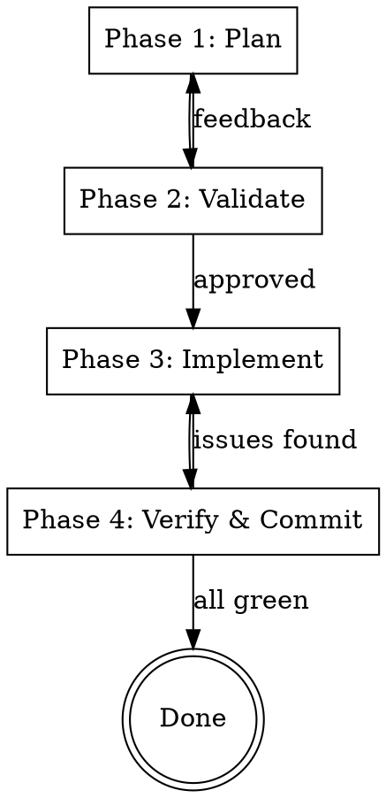

# Feature Development Workflow

## Overview

A structured development cycle that ensures every code change goes through planning, validation, implementation, and verification before being committed. Prevents wasted effort by getting alignment early and catching issues before they reach the codebase.

## When to Use

- Adding a new feature or module
- Fixing a non-trivial bug
- Refactoring existing code
- Any change touching more than 2-3 files
- Any change where the approach isn't immediately obvious

**When NOT to use:** Single-line fixes, typo corrections, trivial changes with obvious implementation.

## The Cycle



## Phase 1 - Plan

Before writing any code, understand the problem and design the solution.

1. **Discover relevant skills** - List available skills and invoke any that match the stack or task type (e.g., `swiftui-expert-skill`, `nitro-backend`, `frontend-design`)
2. **Clarify scope** - If requirements are ambiguous, invoke `superpowers:brainstorming` to explore intent. Use `AskUserQuestion` to resolve open questions
3. **Enter plan mode** - Use `EnterPlanMode` to draft a detailed plan including:
   - Context and motivation
   - Files to create, modify, or delete
   - Step-by-step implementation order
   - Verification strategy (build commands, tests to run)
4. **Track work** - Use `TaskCreate` to create a task list from the plan

## Phase 2 - Validate

Never start implementation without explicit approval.

1. **Present the plan** - Use `ExitPlanMode` to submit the plan for review
2. **Integrate feedback** - If the user requests changes, update the plan and re-submit
3. **Wait for approval** - Do not proceed until the user explicitly approves

## Phase 3 - Implement

Follow the validated plan step by step.

1. **Work through tasks in order** - Use `TaskUpdate` to mark tasks `in_progress` then `completed`
2. **Invoke relevant skills** - Use stack-specific skills for each part of the implementation
3. **Stay focused** - Implement exactly what was planned. If you discover something new is needed, discuss with the user before deviating
4. **One commit per logical unit** - Group related changes together. One feature = one commit

## Phase 4 - Verify & Commit

Every change must be verified before it's committed.

### Code Review

Invoke `superpowers:requesting-code-review` to have expert agents review the changes for:
- Correctness and edge cases
- Security vulnerabilities
- Adherence to project conventions
- Performance concerns

### Build Verification

Run the project's build and type-check commands. These are typically defined in `CLAUDE.md` or discoverable from the project config:
- TypeScript: `tsc --noEmit`, `npm run build`
- Swift/iOS: `xcodebuild build`
- Tests: project-specific test runner

**Do not commit if the build fails.** Fix issues and re-verify.

### Commit Convention

Use conventional commits:

```
<type>(<scope>): <description>
```

| Type | Usage |
|------|-------|
| `feat` | New feature |
| `fix` | Bug fix |
| `chore` | Maintenance, cleanup, dependency updates |
| `refactor` | Code restructuring without behavior change |
| `docs` | Documentation only |
| `test` | Adding or updating tests |

- `scope`: module or feature name in parentheses
- `description`: imperative mood, lowercase, no period
- Add `Co-Authored-By` footer when assisted by AI

**Examples:**
```
feat(auth): add login page
fix(cellar): correct grid layout overflow
chore(deps): update nitro to 2.13
refactor(api): extract shared validation middleware
```

## Red Flags

| Situation | Action |
|-----------|--------|
| Starting to code without a plan | STOP - go to Phase 1 |
| Plan not yet approved | STOP - go to Phase 2 |
| Deviating from the plan | STOP - discuss with user first |
| Build fails before commit | STOP - fix and re-verify |
| Skipping code review | STOP - invoke review agents |
| Committing unrelated changes together | STOP - split into separate commits |

## Common Mistakes

- **Skipping the plan for "simple" changes** - Simple changes have a way of becoming complex. Plan anyway if it touches multiple files.
- **Not running the build before committing** - Compilation errors caught after commit waste time and create noise in git history.
- **Scope creep during implementation** - Stick to the plan. Improvements noticed along the way go into a separate task.
- **Giant commits mixing multiple concerns** - Each logical change gets its own commit with a clear message.

---
> Converted and distributed by [TomeVault](https://tomevault.io/claim/moifort) — claim your Tome and manage your conversions.
<!-- tomevault:4.0:skill_md:2026-04-14 -->
