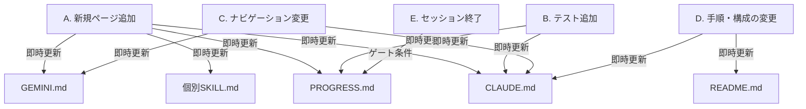

# 仕様書同期スキル

## Goal

`CLAUDE.md` / `GEMINI.md` / `README.md` / `docs/PROGRESS.md` / 各種個別スキル・ルールの全仕様書を、常にプロジェクトの最新状況（実装、テスト、構成）と乖離させず、漏れなく最新に保つ。

---

## 最終更新日（Last Updated）の記載ルール

すべての仕様書および進捗管理ドキュメントには、**更新を行った日付**を必ず明記し、いつ時点の仕様であるかを誰でも判断できるようにしなければなりません。

### 記載フォーマットと場所

各ドキュメントの以下の位置に、最終更新日を記載または更新してください：

| ドキュメント | 最終更新日の記載方法 | 記載・更新場所 |
|---|---|---|
| `CLAUDE.md` | `Updated YYYY-MM-DD` | ファイル冒頭付近 |
| `GEMINI.md` | `Updated YYYY-MM-DD` | ファイル冒頭付近 |
| `README.md` | `最終更新日: YYYY-MM-DD` | ファイル冒頭付近（見出しの直下） |
| `docs/PROGRESS.md` | `Updated YYYY-MM-DD`（現在地テーブル内） | 現在地テーブル内、または「最終 HEAD」欄 |
| 各個別 `SKILL.md` / `*.md` | `(最終更新日: YYYY-MM-DD)` または未移行HTMLリスト等の日付 | タイトル下、または進捗管理の日付欄 |

---

## いつ、どのタイミングで、どの仕様書を更新するか

開発中に発生する操作（イベント）と、更新が必要な仕様書の対応関係は以下の通りです。イベント発生後、**直ちに（次のタスクに移る前に）**対象の仕様書をすべて更新しなければなりません。



### イベント別更新マトリクス（チェックリスト）

| 更新対象ドキュメント | A. 新規ページ追加時 | B. テスト追加時 | C. ナビゲーション変更時 | D. 手順・構成変更時 | E. セッション終了時 |
| :--- | :---: | :---: | :---: | :---: | :---: |
| `CLAUDE.md` | **`Update`**<br>(アーキテクチャ追記) | **`Update`**<br>(テスト数更新) | **`Update`**<br>(NavBarパスの同期) | **`Update`**<br>(コマンド更新) | — |
| `GEMINI.md` | **`Update`**<br>(Migrated Pages) | — | **`Update`**<br>(NavBar有無) | — | — |
| `README.md` | — | — | — | **`Update`**<br>(Dockerや定義) | — |
| `docs/PROGRESS.md` | **`Update`**<br>(進捗テーブル) | **`Update`**<br>(テスト数実測) | — | — | **`Update`**<br>(HEAD/ビルド/再開) |
| 個別 `SKILL.md` / `*.md` | **`Update`**<br>(未移行HTML等) | — | — | — | — |
| **最終更新日の更新** | **必須** | **必須** | **必須** | **必須** | **必須** |

---

## 監査・確認プロセス（「更新漏れがないか確認して」への対応）

ユーザーまたはシステムから「更新漏れがないか確認」の依頼を受けた際、またはセッション終了時には、以下の監査手順を実行し、すべての不整合を解消してください。

### 1. 現在のステータス情報の収集

以下のコマンドを実行し、プロジェクトの「実装・テストの実態値」を取得します。

```bash
# A. 最新の HEAD コミット値の取得
git log --oneline -5
git rev-parse --short HEAD

# B. 現在の Next.js ルート一覧の取得
ls web-next/app/*/page.tsx web-next/app/*/*/page.tsx 2>/dev/null | sed 's|web-next/app/||' | sed 's|/page.tsx||'

# C. テストファイル実数の取得 (Vitest)
find web-next/tests/ web-next/app/ web-next/components/ -name "*.test.ts" -o -name "*.test.tsx" 2>/dev/null | sort

# D. テスト実行結果の取得
cd web-next && bun run test 2>&1 | tail -5
cd web-next && bun run lint 2>&1 | tail -5
```

### 2. 監査チェックリスト

収集した実態値と、各仕様書の記述に乖離がないか検証します。

- [ ] **`CLAUDE.md` 監査**
  - [ ] `app/**/page.tsx` および `app/**/*.css` の全配置パスが `CLAUDE.md` の「アーキテクチャ」セクションに正しく記載されているか。
  - [ ] コマンド節のユニットテスト数が現在の実測値と一致しているか。
  - [ ] 最終更新日のタイムスタンプが最新化されているか。
- [ ] **`GEMINI.md` 監査**
  - [ ] 検証コマンドのテスト通過数が現在の実測値と一致しているか。
  - [ ] 最終更新日のタイムスタンプが最新化されているか。
- [ ] **`README.md` 監査**
  - [ ] Dockerコマンドや起動手順、機能・非機能テストの定義に変更はないか。
  - [ ] 最終更新日のタイムスタンプが最新化されているか。
- [ ] **`docs/PROGRESS.md` 監査**
  - [ ] フロントエンドテストの pass 数が現在の実測値と一致しているか。
  - [ ] ビルド・lint・typecheck の状態が正しく反映されているか。
  - [ ] `## 次回セッションでの再開・実行依頼プロンプト` のテスト件数が上記と同期しているか。
  - [ ] 最終更新日（タイムスタンプ）が更新されているか。
- [ ] **個別 `SKILL.md` / `*.md` 監査**
  - [ ] 完了したタスクや使用が禁止された古いコマンド（例: npm や pnpm）の記述が残っていないか。
  - [ ] 最終更新日のタイムスタンプが最新化されているか。

---

## 修正とコミット規約

監査の結果、1つでも乖離が検出された場合は**直ちに修正**し、以下の規約に従ってコミットしてください。

### コミットメッセージ

仕様書のみの同期更新のコミットには**ソースコードの変更を一切含めない**でください（TDD コミット分割ルール）。

```bash
git add CLAUDE.md GEMINI.md README.md docs/PROGRESS.md .claude/skills/ .agent/skills/
git commit -m "chore(docs): sync spec files — <具体的な更新理由や同期内容>"
```

---

## 自己監査・強制発火ルール (Enforcement & Gate Conditions)

エージェントは、以下のイベントが発生した際、ユーザーからの指示を待たずに**自律的かつ自動的**に本スキルを読み込み、同期・監査を実行しなければなりません。

### 1. 強制発火のトリガー条件

- **テストの追加・変更時**:
  - `web-next/tests/` 配下のファイルやアサーションを修正した直後、直ちに `docs/PROGRESS.md` のテスト数を同期・更新すること。
- **新規規約・ループ対策の発生時**:
  - `DisclaimerBanner` の `ResizeObserver` ループ回避など、再利用可能な不具合回避策や制約が発生した場合は、速やかに `GEMINI.md` または `CLAUDE.md` の `Development Conventions` に反映すること。
- **セッション開始・再開時**:
  - セッションが開始または compaction から再開された場合、最初のコミットを行う前に必ず「### 1. 現在のステータス情報の収集」の見出しのセクションに定義された実測コマンドを実行し、現行コードと仕様書の乖離（テスト数、Next.jsのルートなど）を自動検知して修正すること。
- **Markdown 編集時**:
  - ドキュメント同期のために Markdown ファイルを新規作成または編集した場合は、コミットする前に必ず `markdown-formatter/SKILL.md` スキルをロードし、そこに定義された手順に従ってリント検証を行い、エラーが 0 件であることを保証すること。

### 2. ゲート条件としてのドキュメント同期

- ドキュメント同期および自己監査は、ソースコードのビルド成功と全く同等の **「完了判定ゲート（Gate Condition）」** です。
- 仕様書・進捗管理ドキュメントに実態との不整合（テスト数の記述ミス、未更新の日付）が1点でもある状態でのタスク完了報告は、**プロトコール違反（FAILED）** とみなされます。報告前に必ず本スキルの「監査チェックリスト」を上から順に自律実行してください。

> [!NOTE]
> プロジェクトの規約により、`.claude/skills/` および `.agent/skills/` の配下にある `SKILL.md` ファイルでは、ローカライズされたキーではなく、英語のフロントマターキー `description` を必ず使用する必要があります。

---
> Source: [myoshi2891/Comparison-of-LLMs](https://github.com/myoshi2891/Comparison-of-LLMs) — distributed by [TomeVault](https://tomevault.io).
<!-- tomevault:4.0:skill_md:2026-06-15 -->
