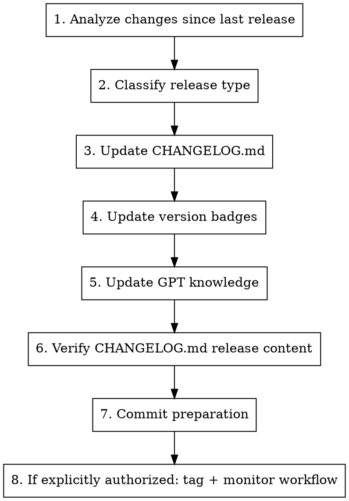

# Prepare Release

## Overview

Prepare a new release by generating changelog entries, updating version references, and creating release notes.

## Usage

```
/prepare-release
```

## Release Authority and Automation

**Do not create release tags just because this skill was invoked.** By default, prepare only.

When Karim explicitly says to do the release (for example "release time" or "do the release"), create and push the annotated tag yourself, then monitor the release automation.

Default job:
- Prepare the changelog
- Update version references
- Generate release notes draft
- Commit preparation changes

Maintainer-authorized release job:
- Verify `master` is clean and up to date
- Verify the release tag does not already exist locally or remotely
- Create and push the annotated tag
- Let `.github/workflows/publish-release.yaml` create the GitHub release
- Confirm the workflow and GitHub release succeeded

## Current Release Automation

The repository has tag-driven release automation in `.github/workflows/publish-release.yaml`.

Important details:
- The workflow runs on any pushed tag.
- It extracts the Markdown release content from `CHANGELOG.md`, specifically everything under `## [Unreleased]` until the next `## [` heading.
- It appends the generated contributor list and GitHub's generated release notes.
- It creates the GitHub release with `ncipollo/release-action`.

Therefore:
- `CHANGELOG.md` is the release-content Markdown file.
- Keep the target release notes under `## [Unreleased]` until after the release tag is pushed.
- Do not move `[Unreleased]` to `[vX.Y.Z] - YYYY-MM-DD` before tagging unless you are also bypassing the workflow and manually providing release notes.
- Do not run `gh release create` during the normal path; the tag workflow owns release creation. Use `gh release create` only as a recovery path if the workflow fails.
- If Karim asks for a tiny release-prep correction during release, commit and push it directly to `master`, then tag the resulting commit.
- After a successful release, cut `CHANGELOG.md`: reset `## [Unreleased]` to an empty placeholder and move the released notes under `## [X.Y.Z] - YYYY-MM-DD`. Commit and push that cleanup directly to `master`.
- Previous release notes must never remain under `## [Unreleased]`; otherwise the next tag workflow will publish stale notes again.

## Workflow



## Step 1: Analyze Changes

```bash
REPO=$(gh repo view --json nameWithOwner --jq .nameWithOwner)

# Get latest release tag
LATEST=$(gh release list --repo "$REPO" --limit 1 --json tagName --jq '.[0].tagName')
echo "Latest release: $LATEST"

# List commits since last release
git log $LATEST..HEAD --oneline

# Get detailed changes
git log $LATEST..HEAD --pretty=format:"- %s (%h)"
```

Use Gemini for comprehensive analysis:

```bash
gemini --model gemini-3-pro-preview -p \
  "Analyze these git changes for a changelog. Categorize into: Features, Bug Fixes, Breaking Changes, Documentation. Ignore internal refactors.

$(git log $LATEST..HEAD --oneline)
$(git diff $LATEST..HEAD --stat)"
```

## Step 2: Classify Release Type

| Type | When | Example |
|------|------|---------|
| **PATCH** (x.x.X) | Bug fixes, docs, deps | 2.19.1 |
| **MINOR** (x.X.0) | New features, backward compatible | 2.20.0 |
| **MAJOR** (X.0.0) | Breaking changes | 3.0.0 |

### Breaking Change Indicators
- Variable removed or renamed
- Default value changes behavior
- Resource naming changes (causes recreation)
- Required migration steps

Use Codex for breaking change analysis:

```bash
codex exec -m gpt-5.5 -s read-only -c model_reasoning_effort="xhigh" \
  "Analyze these changes for breaking changes affecting existing deployments: $(git diff $LATEST..HEAD -- variables.tf locals.tf)"
```

## Step 3: Update CHANGELOG.md

### Changelog Format

```markdown
## [Unreleased]

### ⚠️ Upgrade Notes
<!-- Migration guides, breaking change warnings, special upgrade steps -->

### 🚀 New Features
<!-- New functionality added -->

### 🐛 Bug Fixes
<!-- Bugs that were fixed -->

### 🔧 Changes
<!-- Non-breaking changes, refactors, improvements -->

### 📚 Documentation
<!-- Documentation updates -->
```

### Writing Good Entries

- Write from user's perspective
- Include issue/PR references: `(#1234)`
- Be specific about what changed
- Include migration steps for breaking changes

### Example Entries

```markdown
### 🚀 New Features
- **K3s v1.35 Support** - Added support for k3s v1.35 channel (#2029)
- **NAT Router IPv6** - NAT router now supports IPv6 egress (#2015)

### 🐛 Bug Fixes
- Fixed autoscaler not respecting max_nodes limit (#2018)
- Resolved firewall rules not applying to new nodes (#2012)

### ⚠️ Upgrade Notes
- **NAT Router users**: Run `terraform apply` twice after upgrade due to route changes
```

## Step 4: Update Version Badges

Update README.md badges if version references changed:

```markdown
[](https://k3s.io)
```

Check `versions.tf` for:
- Terraform version requirement
- Provider version requirements
- K3s default channel

## Step 5: Update GPT Knowledge (if applicable)

If significant changes, regenerate the Custom GPT knowledge base:

```bash
# Run the knowledge generation script from CLAUDE.md
python3 << 'PYEOF'
# ... (script from CLAUDE.md)
PYEOF
```

Update `meta.version` in the script to match new release.

## Step 6: Verify Release Notes Content

Normal path: the release notes draft is the `CHANGELOG.md` content under `## [Unreleased]`. Make sure it contains the target release section, issue/PR references, upgrade notes if any, and no stale placeholder text.

Preview exactly what the workflow will extract:

```bash
awk '/^## \[Unreleased\]/{flag=1; next} /^## \[/{flag=0} flag' CHANGELOG.md
```

If a separate `release-notes.md` exists in a future train, use it as a drafting aid, but copy the final release content into `CHANGELOG.md` under `## [Unreleased]` before tagging so the automation can consume it.

### Release Notes Template

```markdown
## 🚀 Release vX.Y.Z

### Highlights

- **Feature 1**: Brief description
- **Feature 2**: Brief description

### ⚠️ Upgrade Notes

[Any special upgrade instructions]

### What's Changed

#### New Features
- Feature description (#PR)

#### Bug Fixes
- Fix description (#PR)

#### Other Changes
- Change description (#PR)

### Full Changelog

https://github.com/kube-hetzner/terraform-hcloud-kube-hetzner/compare/vPREV...vX.Y.Z

### Upgrade

\`\`\`tf
module "kube-hetzner" {
  source  = "kube-hetzner/kube-hetzner/hcloud"
  version = "X.Y.Z"
  # ...
}
\`\`\`

\`\`\`bash
terraform init -upgrade
terraform plan
terraform apply
\`\`\`
```

## Step 7: Commit Preparation

```bash
git status --short
git add CHANGELOG.md README.md docs/llms.md kube.tf.example .claude/skills/prepare-release/SKILL.md
git commit -m "$(cat <<'EOF'
chore: prepare release vX.Y.Z

- Update release notes and version references
EOF
)"
git push origin master
```

For release-only cleanup after Karim explicitly says release, commit directly to `master`; do not create a release-prep PR unless he asks for one.

## Execute Release (Only When Karim Explicitly Authorizes)

```bash
VERSION=vX.Y.Z
REPO=$(gh repo view --json nameWithOwner --jq .nameWithOwner)

git checkout master
git pull origin master
git status --short

# Refuse to continue if either command prints the tag.
git tag --list "$VERSION"
git ls-remote --tags origin "refs/tags/$VERSION"

# Create and push the tag. The GitHub Actions release workflow creates the release.
git tag -a "$VERSION" -m "Release $VERSION"
git push origin "$VERSION"

# Monitor automation and confirm the release exists.
gh run list --repo "$REPO" --workflow "Publish a new Github Release" --limit 1
gh release view "$VERSION" --repo "$REPO"
```

If the workflow fails because of a transient GitHub or provider error, rerun the failed workflow/job and re-check. If release creation itself failed permanently, then use `gh release create "$VERSION" --title "$VERSION" --notes-file <file>` as a recovery path after confirming no partial release exists.

## Post-Release Verification

```bash
VERSION=vX.Y.Z
REPO=$(gh repo view --json nameWithOwner --jq .nameWithOwner)

gh release view "$VERSION" --repo "$REPO" --json tagName,name,isPrerelease,publishedAt,url,targetCommitish
gh release list --repo "$REPO" --limit 3
git ls-remote --tags origin "refs/tags/$VERSION"
```

Inspect the live release notes, not just the workflow status:

```bash
gh release view "$VERSION" --repo "$REPO" --json body --jq .body
```

If the body contains stale content from older releases, edit the GitHub release directly with a corrected body and then fix `CHANGELOG.md` on `master` so the same mistake does not recur.

If creating or updating a pinned upgrade notice issue after release, write it for the full practical upgrade path users need, not just the latest patch delta. For example, after a `v2.19.x` patch, the pinned notice should cover upgrading from `v2.18.x` to the current `v2.19.x`, including older release caveats such as state migration instructions, version requirements, and plan-review warnings.

After confirming the live release, cut the changelog:

```markdown
## [Unreleased]

_No unreleased changes._

---

## [X.Y.Z] - YYYY-MM-DD

...released notes...
```

Commit and push the changelog cut directly to `master`.

## Version Reference Locations

Files that may need version updates:

| File | What to Update |
|------|---------------|
| `README.md` | Badge versions |
| `CHANGELOG.md` | Release content must stay under `[Unreleased]` until tag workflow runs |
| `docs/llms.md` | Example version references |
| `kube.tf.example` | Version in comments |
| GPT knowledge | meta.version |

## Quick Checklist

- [ ] Commits analyzed since last release
- [ ] Release type determined (PATCH/MINOR/MAJOR)
- [ ] CHANGELOG.md updated
- [ ] Breaking changes documented with migration steps
- [ ] Version badges updated (if needed)
- [ ] Release notes drafted
- [ ] Changes committed and pushed
- [ ] If explicitly authorized, tag pushed
- [ ] Release workflow succeeded
- [ ] GitHub release exists and points at the intended commit
- [ ] Live GitHub release body contains only content relevant to this release
- [ ] Pinned upgrade notice, if used, covers the previous-series-to-current upgrade path
- [ ] `CHANGELOG.md` is cut after release, with a clean `[Unreleased]` section

---
> Source: [mysticaltech/terraform-hcloud-kube-hetzner](https://github.com/mysticaltech/terraform-hcloud-kube-hetzner) — distributed by [TomeVault](https://tomevault.io).
<!-- tomevault:4.0:skill_md:2026-06-17 -->
