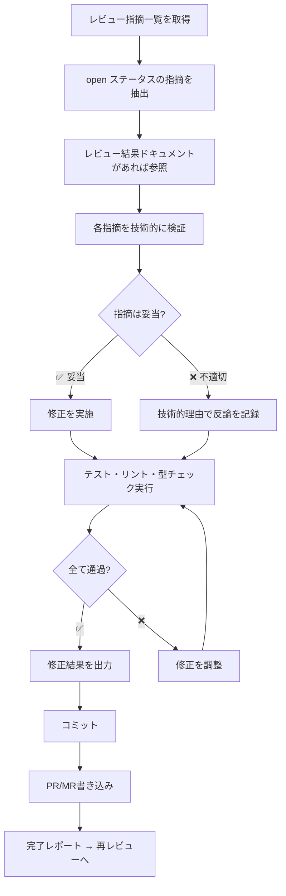

# コードレビュー修正スキル（code-review-fix）

コードレビューの指摘事項を受けて、技術的に検証した上で修正を実施します。

> **技術的厳密さ**: 指摘を盲目的に受け入れず、必ず技術的に検証してから修正します。

## 概要

1. **レビュー指摘一覧**から未解決（open）の指摘事項を取得
2. **レビュー結果ドキュメント**があれば参照し、指摘の詳細コンテキストを把握
3. **各指摘を技術的に検証** — コードベースの現実と照合
4. **妥当な指摘に対して修正を実施**
5. **不適切な指摘に対して技術的理由を付けて反論を記録**
6. **修正後にテスト・リント・型チェックを実行して確認**
7. **修正結果と各指摘のステータス更新を出力**

## レスポンスパターン

各指摘に対して以下の手順で対応します：

1. **READ**: 指摘内容を正確に理解する
2. **VERIFY**: コードベースの現実と照合する
3. **EVALUATE**: この指摘は技術的に正しいか？
4. **IMPLEMENT/DISPUTE**: 修正を実施、または技術的理由で反論

### 反論すべきケース

- 提案が既存機能を壊す場合
- 指摘がコードの完全なコンテキストを欠いている場合
- YAGNI違反（未使用機能の追加要求）の場合
- この技術スタックで技術的に不正確な場合

## 入力

- **レビュー指摘一覧**（必須）: id, severity, category, file, line, description, status を含む指摘リスト
- **レビュー結果ドキュメント**（任意）: 指摘の背景コンテキスト

📖 詳細は [references/input-format.md](references/input-format.md) を参照

## 処理フロー

## 出力

修正完了後、各指摘のステータス（`fixed` / `disputed`）と対応内容を出力し、コミット・完了レポートを作成します。

📖 出力例・ステータス遷移・コミットテンプレート・完了レポートは [references/output-templates.md](references/output-templates.md) を参照

## PR/MR書き込み

コミット後、修正結果をMR/PRに反映:
- 完了レポートをMR/PRコメントとして投稿
- 各指摘のレビュースレッドに対応結果（修正済み/反論）を返信
- 書き込み後にAPIで内容を再取得し確認

📖 詳細は [references/pr-result-writing.md](references/pr-result-writing.md) を参照

## 注意事項

- **技術的検証が最優先**: 指摘を盲目的に受け入れない
- **テスト確認必須**: 修正後に既存テストが壊れていないか確認
- **反論は具体的に**: 技術的理由を明確に記載
- **1指摘ずつ対応**: まとめて修正せず、各指摘を個別に検証・対応

## 関連スキル

- 前提: コードレビュー（指摘を生成）
- 後続: 再レビュー（修正結果を検証）
- 品質: 修正後の検証（テスト・ビルド・リント）

---
> Converted and distributed by [TomeVault](https://tomevault.io/claim/nagasakah) — claim your Tome and manage your conversions.
<!-- tomevault:4.0:skill_md:2026-04-14 -->
