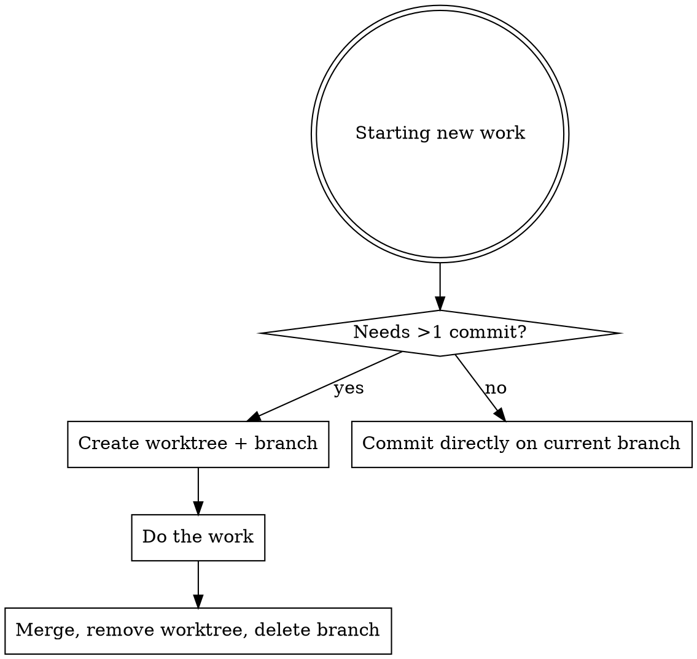

# Git Workflow

## Overview

Enforces three practices: **Conventional Commits** for every commit message, **atomic commits** that separate changes into logical/contextual units, and **git worktree isolation** for any work requiring more than one commit.

## When to Use

- Before writing a commit message
- Before starting feature work, bug fixes, or refactors that need multiple commits
- When creating branches

## Pre-Commit Gate

<!-- Defense-in-depth: this gate is intentionally redundant with CLAUDE.md and using-necturalabs. -->
<!-- It catches the case where the model skipped the mandatory review and reached commit directly. -->
<HARD-GATE>
**BEFORE committing, verify that `necturalabs:iterative-code-review` has run on these changes.** If it has not, **STOP** — invoke it first. If changes are security-related, `necturalabs:iterative-security-audit` must run before code review.

Do NOT commit without a completed review. No exceptions — not for "small changes", not for "just docs", not for "I already looked at it manually."
</HARD-GATE>

## Atomic Commits

Every commit should be a **single logical unit of change**. Separate unrelated changes into distinct commits, even within the same work session.

### Rules

1. **One concern per commit** — a bug fix, a feature addition, a refactor, a test, or a docs update. Never mix these in a single commit.
2. **Each commit should compile and pass tests** — the repo must be in a valid state at every commit. Never commit a half-finished feature that breaks the build.
3. **Group by context, not by file** — if a feature requires changes across 5 files, that is one commit. If you fix a typo in the README while implementing a feature, that is two commits.
4. **Refactoring goes in its own commit** — separate "move/rename/restructure" from "add/change behavior." This makes each commit reviewable in isolation.
5. **Config and dependency changes go in their own commit** — version bumps, new dependencies, and config changes should not be mixed with feature code.

### Decision Guide

```
Is this change related to the same logical concern?
  YES → Same commit
  NO  → Separate commit

Does this commit do exactly ONE thing?
  YES → Good
  NO  → Split it

Could someone revert this commit without losing unrelated work?
  YES → Good
  NO  → Split it
```

### Anti-Patterns

| Bad Practice | Why | Fix |
|-------------|-----|-----|
| "Fix bug and add feature" | Two concerns in one commit | Two separate commits |
| "Update 12 files" | No indication of what changed or why | Split by logical concern |
| "WIP" or "checkpoint" | Incomplete work pollutes history | Finish the unit, then commit |
| Mixing formatting with logic | Impossible to review logic changes | Formatting commit first, then logic |
| Committing generated + source together | Generated files obscure real changes | Source commit, then regenerate |

## Commit Message Format

```
<type>(<optional-scope>): <description>

[optional body]

[optional footer(s)]
```

### Types

| Type | When to use |
|------|-------------|
| `feat` | New feature or functionality |
| `fix` | Bug fix |
| `docs` | Documentation only |
| `style` | Formatting, whitespace (no logic change) |
| `refactor` | Code restructuring (no bug fix, no new feature) |
| `perf` | Performance improvement |
| `test` | Adding or fixing tests |
| `build` | Build system or dependency changes |
| `ci` | CI/CD configuration |
| `chore` | Routine maintenance |

### Subject Line Rules

1. **Imperative mood** -- "add" not "added" or "adds"
2. **50 chars target, 72 hard max** -- if you struggle to fit, the commit does too much
3. **No period** at the end
4. **Lowercase** after type prefix
5. **Litmus test:** "If applied, this commit will _[your subject line]_"

### Body (required for non-trivial changes)

1. Blank line between subject and body
2. Wrap at 72 characters
3. Explain _what_ changed and _why_, not _how_
4. Describe: what was wrong before, what is better now, why this approach

### Footers

- Issue references: `Closes #123`, `Fixes #456`
- Breaking changes: `BREAKING CHANGE: <description>` or `!` after type (`feat!:`)

### Examples

```
feat(auth): add OAuth2 login flow

Implement OAuth2 authorization code flow with PKCE. Replaces the
legacy session-based auth which doesn't meet compliance requirements
for token storage.

Closes #142
```

```
fix: prevent race condition in request handler

Introduce a request ID and reference to the latest request. Dismiss
incoming responses other than from the latest request.

Previously, rapid sequential requests returned stale data because
responses were processed in arrival order.
```

```
refactor: extract validation into shared module
```

```
docs: update API authentication guide
```

### Bad Commits -- Never Do These

| Bad message | Why it's wrong |
|-------------|----------------|
| `fix stuff` | No type prefix, vague |
| `feat: Updated the login page.` | Past tense, period, capitalized after prefix |
| `WIP` | Never commit work-in-progress |
| `misc changes` | Meaningless |
| `feat: changes` | No description of what changed |

## Worktree Workflow

### When to Use Worktrees



**Skip worktrees for:** single-commit changes (typo fixes, one-line config tweaks).

### Creating a Worktree

```bash
# From your main worktree — use <project>-<description> for the path:
git worktree add ../<project>-<description> -b feature/short-description

# Examples:
git worktree add ../myapp-user-auth -b feature/user-authentication
git worktree add ../myapp-fix-cart -b bugfix/cart-total-rounding
```

### LFS in Worktrees

Git worktrees share the main repo's `.git` directory (the worktree has a `.git` file pointing back, not its own `.git` folder). This means the LFS object cache at `.git/lfs/objects/` is already shared — objects downloaded in the main repo are available to every worktree.

```bash
# In the worktree, populate LFS files from the shared local cache:
cd <worktree> && git lfs checkout

# Do NOT use `git lfs pull` — it contacts the remote and re-downloads
# objects that are already in the shared cache.
```

- **Use `git lfs checkout`** (local-only) — reads from the shared `.git/lfs/objects/` cache
- **Never use `git lfs pull`** in a worktree when the main repo already has the objects — it wastes bandwidth re-fetching what's already cached locally
- Only fall back to `git lfs pull` if objects are genuinely missing from the local cache

### Branch Naming

Format: `<type>/<lowercase-hyphenated-description>`

| Prefix | Purpose | Example |
|--------|---------|---------|
| `feature/` | New functionality | `feature/user-authentication` |
| `bugfix/` | Non-urgent bug fix (longer form distinguishes from `hotfix/`) | `bugfix/cart-total-rounding` |
| `hotfix/` | Urgent production fix | `hotfix/payment-null-pointer` |
| `refactor/` | Code improvement | `refactor/extract-auth-service` |
| `docs/` | Documentation | `docs/api-reference` |
| `test/` | Test additions | `test/payment-edge-cases` |
| `chore/` | Maintenance | `chore/upgrade-dependencies` |

Rules:
- Lowercase only, hyphens between words
- Be specific: `feature/user-auth` not `feature/stuff`
- Include ticket ID when available: `feature/PROJ-123-user-auth`

### Cleanup After Merge

```bash
# After branch is merged:
git worktree remove ../worktree-path
git branch -d feature/branch-name

# NEVER use rm -rf on worktrees -- leaves stale metadata
# If you did, fix with:
git worktree prune
```

### Quick Reference

| Action | Command |
|--------|---------|
| Create worktree | `git worktree add <path> -b <branch>` |
| List worktrees | `git worktree list` |
| Remove worktree | `git worktree remove <path>` |
| Clean stale data | `git worktree prune` |
| Delete branch | `git branch -d <branch>` |

### Post-Push: CI Monitoring

After every `git push`, if `gh` CLI is available:

1. Run `gh run list --limit 1` to check if the push triggered a CI run
2. If a run was triggered, `gh run watch <run-id>` to monitor it to completion
3. If no run was triggered (branch doesn't match workflow triggers), skip

Never push and walk away without confirming CI status.

---
> Source: [NecturaLabs/AgentSkills](https://github.com/NecturaLabs/AgentSkills) — distributed by [TomeVault](https://tomevault.io).
<!-- tomevault:4.0:skill_md:2026-06-16 -->
