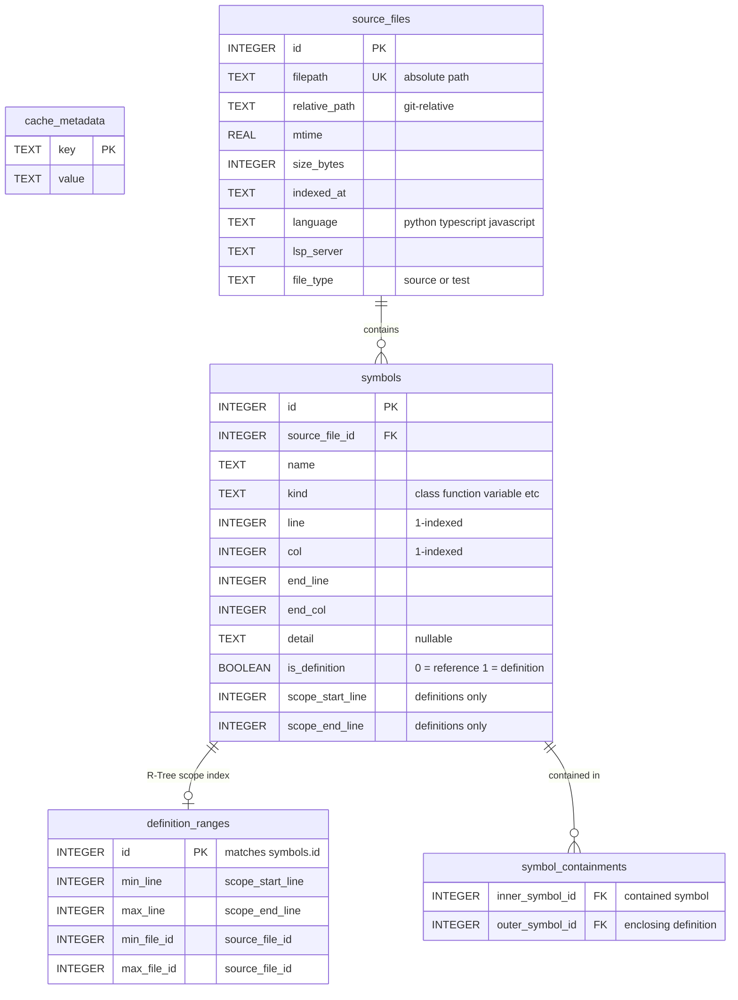

# LSP Explorer

Query language servers for code intelligence from the command line.

## Quick Start

```bash
# List symbols in a file
.claude/skills/lsp/scripts/lsp_explorer.sh symbols src/main.py

# Go to definition (line 10, column 5 — 1-indexed)
.claude/skills/lsp/scripts/lsp_explorer.sh definition src/main.py 10 5

# Find all references
.claude/skills/lsp/scripts/lsp_explorer.sh references src/main.py 10 5

# Get hover info (type signature, docs)
.claude/skills/lsp/scripts/lsp_explorer.sh hover src/main.py 10 5

# Get diagnostics (errors, warnings)
.claude/skills/lsp/scripts/lsp_explorer.sh diagnostics src/main.py

# Combined overview (symbols + diagnostics)
.claude/skills/lsp/scripts/lsp_explorer.sh explore src/main.py

# Change impact analysis (live LSP)
.claude/skills/lsp/scripts/lsp_explorer.sh impact src/main.py 10 5 --depth 2

# Build symbol index (SQLite cache)
.claude/skills/lsp/scripts/lsp_explorer.sh index --root .

# Find definitions by name (no LSP needed)
.claude/skills/lsp/scripts/lsp_explorer.sh lookup MyClass --pretty

# Find dead code
.claude/skills/lsp/scripts/lsp_explorer.sh dead --file-type source --exclude-private --pretty

# Trace impact from cached index
.claude/skills/lsp/scripts/lsp_explorer.sh trace src/main.py 10 5 --depth 3 --pretty
```

## Output Format

All output is **compact JSON** optimized for token efficiency. Use `--pretty` or pipe to `jq` for human-readable output.

### Key Mapping

| Key | Meaning |
|-----|---------|
| `n` | name |
| `k` | kind (class, method, function, variable, etc.) |
| `r` | range [start_line, end_line] (1-indexed) |
| `ch` | children (nested symbols) |
| `f` | file (relative path) |
| `l` | line (1-indexed) |
| `c` | column (1-indexed) |
| `s` | severity (1=error, 2=warning, 3=info, 4=hint) |
| `d` | detail (type annotation) |
| `sym` | symbol name |
| `refs` | references |
| `msg` | message |
| `src` | source (which LSP server) |
| `doc` | documentation string |
| `type` | type signature |

### Example Outputs

**symbols:**
```json
[{"n":"MyClass","k":"class","r":[1,25],"ch":[{"n":"__init__","k":"method","r":[3,6]},{"n":"process","k":"method","r":[8,25]}]},{"n":"main","k":"function","r":[28,35]}]
```

**references:**
```json
{"refs":{"src/main.py":[12,28,33],"src/utils.py":[7,45]},"total":5}
```

**definition:**
```json
[{"f":"src/models.py","l":15,"c":4,"preview":"    def process(self, data: list[str]) -> Result:"}]
```

**hover:**
```json
{"type":"(self, data: list[str]) -> Result","doc":"Process input data and return result."}
```

**diagnostics:**
```json
[{"f":"src/main.py","l":12,"c":1,"s":1,"msg":"Argument missing for parameter \"name\"","src":"pyright"}]
```

## Symbol Index (SQLite Cache)

Pre-compute all definitions and references across a project into a SQLite cache, then query instantly without spinning up LSP servers.

```bash
# Build the full symbol index (default: rebuild)
.claude/skills/lsp/scripts/lsp_explorer.sh index --root .

# Incremental update (only re-index changed files)
.claude/skills/lsp/scripts/lsp_explorer.sh index --root . --cache-incremental

# Show index statistics
.claude/skills/lsp/scripts/lsp_explorer.sh index-status --pretty

# Clear the index
.claude/skills/lsp/scripts/lsp_explorer.sh index-clear

# Find definitions by name (substring match, no LSP needed)
.claude/skills/lsp/scripts/lsp_explorer.sh lookup MyClass --kind class --file-type source --pretty

# Find dead code (unreferenced definitions)
.claude/skills/lsp/scripts/lsp_explorer.sh dead --file-type source --exclude-private --pretty

# Impact analysis from cached index (recursive)
.claude/skills/lsp/scripts/lsp_explorer.sh trace src/main.py 10 5 --depth 3 --pretty

# List indexed files
.claude/skills/lsp/scripts/lsp_explorer.sh files --language python --file-type source --pretty
```

### Cache Control Flags

| Flag | Description |
|------|-------------|
| `--cache-rebuild` | Wipe and rebuild entire index (default) |
| `--cache-incremental` | Only index files with newer mtime |
| `--cache-frozen` | Skip indexing, use existing cache as-is |

### Index Commands

| Command | Purpose | Requires LSP? |
|---------|---------|---------------|
| `index` | Build symbol index | Yes |
| `index-status` | Show index stats | No |
| `index-clear` | Wipe all index data | No |
| `lookup NAME` | Find definitions by name | No |
| `dead` | Find unreferenced definitions | No |
| `trace FILE LINE COL` | Impact analysis from cache | No |
| `files` | List indexed files | No |

### How It Works

The index uses two LSP calls per file (O(N) total):
1. `documentSymbol` — hierarchical definitions with scope ranges
2. `semanticTokens/full` — all token positions in a single pass

References = tokens that are NOT definitions (a SQL VIEW). Definition scope ranges are stored in an R-Tree for O(log N) containment queries. A materialized edge list enables recursive CTE graph traversal for impact analysis.

### Cache Schema



**SQL Views** (no separate tables):
- `definitions` — `SELECT * FROM symbols WHERE is_definition = 1`
- `references` — `SELECT * FROM symbols WHERE is_definition = 0`

## Global Options

These flags are shared across all subcommands. Place them **after** the subcommand name.

| Flag | Description |
|------|-------------|
| `-v` | Verbose logging (debug output) |
| `--pretty` | Pretty-print JSON (indent=2) |
| `--root PATH` | Override project root directory |
| `--timeout N` | Timeout in seconds (default: 30) |

## Supported Languages

| Language | Server | Install |
|----------|--------|---------|
| Python | pyright-langserver | `pip install pyright` |
| TypeScript/TSX | typescript-language-server | `npm install -g typescript-language-server typescript` |
| JavaScript/JSX | typescript-language-server | `npm install -g typescript-language-server typescript` |

## Architecture

```
CLI (argparse)           <- User/Claude invokes commands
    |          \
CodeExplorer    IndexCacheManager  <- High-level: explore/impact | index/dead/trace
    |                |
LspSession       SQLite (R-Tree)   <- Protocol: textDocument/* | Cached symbols
    |
JsonRpcClient                      <- Wire: Content-Length framing
    |
subprocess (stdin/stdout)          <- pyright-langserver or typescript-language-server
```

Positions are **1-indexed** at the CLI (matching editors and grep output), converted to 0-indexed internally for LSP protocol compliance.

## Use Cases

1. **Planning code changes** — understand symbols, types, and definitions before modifying code
2. **Reviewing change impact** — find all references to a symbol, trace what a change would affect
3. **Exploring new codebases** — get high-level symbol overviews of files and directories
4. **Dead code detection** — find unreferenced definitions across the entire project (cached)
5. **Impact analysis** — trace how a change propagates through the call graph (cached)
6. **Symbol lookup** — instantly find any definition by name without spinning up LSP servers

---
> Source: [neozenith/agentic-dotfiles](https://github.com/neozenith/agentic-dotfiles) — distributed by [TomeVault](https://tomevault.io).
<!-- tomevault:4.0:skill_md:2026-05-20 -->
