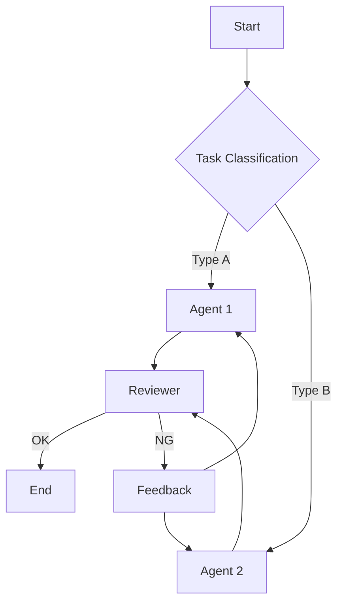

# Agentic Workflow Guide

A comprehensive guide for designing, reviewing, and improving agent workflows based on proven design principles.

## When to Use

Use this skill when creating, reviewing, or updating agents and workflows:

### Create

- **New agent design** - Define responsibilities, tools, and prompts for `.agent.md` files
- **Workflow architecture** - Choose from 5 patterns (Prompt Chaining, Routing, Parallelization, Orchestrator-Workers, Evaluator-Optimizer)
- **Scaffolding** - Generate `.github/agents/*.agent.md` structure with `scaffold_workflow.py`

### Review

- **Orchestrator not delegating** - Agent says "I'll use sub-agents" but does work directly
- **Design principle check** - Validate against SSOT, SRP, Fail Fast, Feedback Loop
- **Context overflow diagnosis** - Long-running agents hitting limits

### Update

- **Adding Handoffs** - Implement Plan → Implement → Review phase transitions
- **Improving delegation** - Fix vague instructions with MUST/MANDATORY language
- **Tool configuration** - Configure `tools:` property and `#tool:` references

## Core Principles

→ See **[references/design-principles.md](references/design-principles.md)** for details

| Tier                  | Principles                                                                  | Focus                      |
| --------------------- | --------------------------------------------------------------------------- | -------------------------- |
| **Tier 1: Essential** | SSOT, SRP, Simplicity First, Fail Fast, Iterative Refinement, Feedback Loop | Must-have for any workflow |
| **Tier 2: Quality**   | Transparency, Gate/Checkpoint, DRY, ISP, Idempotency, Observability         | Recommended for production |
| **Tier 3: Scale**     | Human-in-the-Loop, KISS, Loose Coupling, Graceful Degradation               | Advanced patterns          |

**Anthropic's Key Insight:**

> "Start with simple prompts, optimize them with comprehensive evaluation, and add multi-step agentic systems only when simpler solutions fall short."

## Workflow Patterns

→ See **[references/workflow-patterns.md](references/workflow-patterns.md)** for details

### Pattern Selection Guide

```
What's the nature of the task?
├─ Sequential processing needed ──→ Prompt Chaining
├─ Multiple independent tasks ────→ Parallelization
├─ Dynamic task decomposition ────→ Orchestrator-Workers
├─ Until quality criteria met ────→ Evaluator-Optimizer
└─ Processing varies by input ────→ Routing
```

### Workflow vs Agent (Stop Conditions)

- **Workflow**: Fixed path with explicit stages and checkpoints. Prefer when steps are known.
- **Agent**: Dynamic decisions and tool use. Prefer when inputs or paths vary.

**Stop Conditions (MANDATORY):**

- Define success criteria (output format, quality bar, tests).
- Define failure criteria (max retries, missing data, validation fail).
- Ensure each loop has an exit condition.

### Pattern Overview

| Pattern                  | Use Case                           | Iterative Level |
| ------------------------ | ---------------------------------- | --------------- |
| **Prompt Chaining**      | Sequential with validation         | ⭐⭐⭐          |
| **Routing**              | Classify → route to specialists    | ⭐⭐            |
| **Parallelization**      | Execute independent tasks together | ⭐⭐            |
| **Orchestrator-Workers** | Dynamic decomposition → workers    | ⭐⭐⭐          |
| **Evaluator-Optimizer**  | Generate → evaluate → improve loop | ⭐⭐⭐⭐⭐      |

## Design Workflow

### Step 1: Requirements Gathering

```markdown
## Workflow Design Interview

1. **Goal**: What do you want to achieve?
2. **Task Decomposition**: What subtasks can this be broken into?
3. **Dependencies**: Are there ordering dependencies between tasks?
4. **Parallelism**: Which tasks can run independently?
5. **Quality Criteria**: What defines success/failure?
6. **Error Handling**: How should failures be handled?
```

### Step 2: Pattern Selection

**⚠️ MANDATORY: Ask user to confirm pattern before proceeding.**

Based on requirements, recommend a pattern and get user approval:

```markdown
## Pattern Recommendation

Based on your requirements, I recommend:

**🎯 Recommended: {Pattern Name}**

- Reason: {why this pattern fits}

**Other Options:**
| Pattern | Fit | Notes |
| -------------------- | --- | ------------------------ |
| Prompt Chaining | ⭐⭐ | Good if sequential |
| Routing | ⭐ | If input types vary |
| Parallelization | ⭐⭐ | If tasks are independent |
| Orchestrator-Workers | ⭐⭐⭐| Dynamic task count |
| Evaluator-Optimizer | ⭐ | If quality loop needed |

**Proceed with {Pattern Name}? (Yes / Other pattern / More info)**
```

**Pattern Selection Criteria:**

| Condition                         | Recommended Pattern  |
| --------------------------------- | -------------------- |
| Tasks have clear ordering         | Prompt Chaining      |
| Tasks are independent             | Parallelization      |
| Number of tasks is dynamic        | Orchestrator-Workers |
| Repeat until quality criteria met | Evaluator-Optimizer  |
| Processing varies by input type   | Routing              |

→ See **[references/workflow-patterns.md](references/workflow-patterns.md)** for detailed pattern descriptions

### Step 3: Create Design Diagram

Visualize with Mermaid:



### Step 4: Principle Check

Validate design against principles (use review checklist)

### Step 5: Implement & Iterate

Build small → verify → get feedback → improve

## Prompt Composition Template

Use a minimal, high-signal prompt structure. Keep only what the task needs.

```markdown
# Objective

- Do: [what to do]
- Don't: [what to avoid]

# Input

- Data: [files, text, or references]
- Assumptions: [constraints or environment]

# Output Format

- Format: [bullet list / JSON / table]
- Length: [max items / max tokens]

# Examples (1–3 representative)

- Example 1: [input → output]
  - Note: Explain why this is a good example

# Validation Criteria

- Test: [test name or procedure]
- Expected: [exact pass condition]
- Fail: [what to do on failure]

# Escape Hatch

- If missing or uncertain, return: "Not found" (or specified fallback)

# Additional Context

- Only the minimum needed context
```

## Review Checklist

→ See **[references/review-checklist.md](references/review-checklist.md)** for complete checklist (includes anti-patterns)

### Quick Check (5 items)

```markdown
- [ ] Is each agent focused on a single responsibility? (SRP)
- [ ] Can errors be detected and stopped immediately? (Fail Fast)
- [ ] Is it divided into small steps? (Iterative)
- [ ] Can results be verified at each step? (Feedback Loop)
- [ ] Are related files (references, scripts) simple and minimal? (DRY)
```

## Validation & Evals

Define how quality is verified and how regressions are detected.

**Minimum Set:**

- Tests or evaluation steps are explicit.
- Expected results are measurable.
- Regression checks are repeatable after model updates.

**Example (template):**

```markdown
- Test: [name]
  - Step: [command or procedure]
  - Expected: [clear pass condition]
  - On Failure: [retry / diagnose / report diff]
```

## Context Engineering

→ See **[references/context-engineering.md](references/context-engineering.md)** for details

For long-running agents, manage context as a finite resource:

| Technique                   | When to Use                            |
| --------------------------- | -------------------------------------- |
| **Compaction**              | Context window 70%+ full               |
| **Structured Note-taking**  | Multi-hour tasks with milestones       |
| **Sub-agent Architectures** | Complex research, parallel exploration |
| **Just-in-Time Retrieval**  | Large codebases, dynamic data          |

**Key Insight:**

> "Context must be treated as a finite resource with diminishing marginal returns." — Anthropic

## runSubagent Implementation

→ See **[references/runSubagent-guide.md](references/runSubagent-guide.md)** for complete guide

### Common Problem: Orchestrator Doesn't Spawn Sub-agents

**Symptoms:** Agent says "I'll delegate to sub-agents" but does work directly.

**Root Cause:** Instructions are too vague or permissive.

**Solution:** Use imperative, mandatory language:

**VS Code Copilot:**

```yaml
---
name: Review Orchestrator
tools: ["runSubagent", "readFile"]
---

## MANDATORY: Sub-agent Delegation

You MUST use #tool:runSubagent for each file review.
Do NOT read file contents directly in main context.

For EACH file:
1. Call runSubagent with prompt:
   "Read {filepath}. Return: {issues: [], suggestions: []}"
2. Wait for summary response
3. Aggregate into final report
```

**Claude Code:**

```yaml
---
name: Review Orchestrator
tools: ["Task", "Read"]
---
## MANDATORY: Sub-agent Delegation

You MUST use Task for each file review.
Do NOT read file contents directly in main context.
```

### Sub-agent Prompt Template

Each runSubagent call needs a **complete, self-contained prompt**:

```markdown
# Task

[Clear, specific objective]

# Input

[What data/files to process]

# Output Format

[Exact structure expected - JSON/Markdown/etc.]

# Constraints

[Scope limits, max length, focus areas]
```

### Quick Checklist

```markdown
- [ ] Agent definition includes subagent tool (`runSubagent` for VS Code, `Task` for Claude Code)
- [ ] Instructions use MUST/MANDATORY (not "can" or "may")
- [ ] Sub-agent prompt template is defined with output format
- [ ] Orchestrator explicitly told NOT to do sub-agent work itself
```

## Handoffs (Agent Transitions)

→ See **[references/agent-template.md](references/agent-template.md#handoffs-agent-transitions)** for details

Enable guided sequential workflows: Plan → Implement → Review.

```yaml
handoffs:
  - label: Start Implementation
    agent: implementation
    prompt: Implement the plan outlined above.
```

## Available Tools

→ See **[references/agent-template.md](references/agent-template.md#available-tools)** for full reference

Tool names differ between VS Code Copilot and Claude Code:

| Purpose         | VS Code Copilot              | Claude Code      | Description           |
| --------------- | ---------------------------- | ---------------- | --------------------- |
| Shell execution | `#runInTerminal`             | `Bash`           | Run terminal commands |
| Read file       | `#readFile`                  | `Read`           | Read file contents    |
| Edit file       | `#editFiles`                 | `Write`/`Edit`   | Edit/create files     |
| Search          | `#textSearch`, `#fileSearch` | `Search`, `Grep` | Search files/text     |
| Subagent        | `#runSubagent`               | `Task`           | Spawn sub-agent       |
| Web fetch       | `#fetch`                     | (MCP)            | Fetch web content     |
| Todo list       | `#todos`                     | `TodoWrite`      | Task list management  |

**Note**: In `.agent.md` files, use the platform-appropriate tool names in the `tools:` property.

## Scaffold Workflow

Automatically generate workflow directory structures.

### Usage

```bash
# Basic workflow
python scripts/scaffold_workflow.py my-workflow

# Specify pattern
python scripts/scaffold_workflow.py code-review --pattern evaluator-optimizer

# Specify output path
python scripts/scaffold_workflow.py data-pipeline --pattern orchestrator-workers --path ./projects

# List available patterns
python scripts/scaffold_workflow.py --list-patterns
```

### Available Patterns

| Pattern                | Description                    |
| ---------------------- | ------------------------------ |
| `basic`                | Basic workflow structure       |
| `prompt-chaining`      | Sequential processing pattern  |
| `parallelization`      | Parallel processing pattern    |
| `orchestrator-workers` | Orchestrator + workers pattern |
| `evaluator-optimizer`  | Evaluation-improvement loop    |
| `routing`              | Routing pattern                |

### Generated Structure

```
my-workflow/
├── README.md                       # Usage guide
├── .github/
│   ├── copilot-instructions.md    # GitHub Copilot instructions
│   ├── agents/                     # Custom agent definitions (NEW standard)
│   │   ├── orchestrator.agent.md  # Main orchestrator agent
│   │   ├── planner.agent.md       # Planning specialist
│   │   ├── implementer.agent.md   # Implementation agent
│   │   └── reviewer.agent.md      # Code review agent
│   └── instructions/               # File-pattern-specific rules
│       └── workflow.instructions.md
├── prompts/                        # Prompt templates (optional)
│   └── system_prompt.md
└── docs/                           # Design documentation
    └── design.md
```

**Note**: Custom agents use `.agent.md` extension in `.github/agents/` directory (VS Code 1.106+).

## Resources

| File                                                        | Content                                |
| ----------------------------------------------------------- | -------------------------------------- |
| [design-principles.md](references/design-principles.md)     | Design principles (Tier 1-3) + ACI     |
| [workflow-patterns.md](references/workflow-patterns.md)     | 5 workflow patterns + IR Architecture  |
| [agent-template.md](references/agent-template.md)           | .agent.md structure & template         |
| [review-checklist.md](references/review-checklist.md)       | Full checklist + anti-patterns         |
| [context-engineering.md](references/context-engineering.md) | Context management for long tasks      |
| [runSubagent-guide.md](references/runSubagent-guide.md)     | runSubagent usage & common pitfalls    |
| [examples/](references/examples/)                           | Concrete agent examples (orchestrator) |
| [scaffold_workflow.py](scripts/scaffold_workflow.py)        | Directory structure generator          |

## References

### Official Documentation

- [Chat in IDE - GitHub Docs](https://docs.github.com/en/copilot/how-tos/chat-with-copilot/chat-in-ide) - Chat modes, subagents, plan mode
- [Custom Agents in VS Code](https://code.visualstudio.com/docs/copilot/customization/custom-agents) - Agent file structure, handoffs
- [Create Custom Agents - GitHub Docs](https://docs.github.com/en/copilot/how-tos/use-copilot-agents/coding-agent/create-custom-agents) - Agent configuration
- [Custom Agents Configuration - GitHub Docs](https://docs.github.com/en/copilot/reference/custom-agents-configuration) - YAML properties reference

### Design Principles

- [Building Effective Agents - Anthropic](https://www.anthropic.com/engineering/building-effective-agents)
- [Effective Context Engineering - Anthropic](https://www.anthropic.com/engineering/effective-context-engineering-for-ai-agents)
- [Writing Tools for Agents - Anthropic](https://www.anthropic.com/engineering/writing-tools-for-agents)

### Community Resources

- [runSubagent 検証記事 - Zenn](https://zenn.dev/openjny/articles/2619050ec7f167)
- [subagent-driven-development - obra/superpowers](https://github.com/obra/superpowers/tree/main/skills/subagent-driven-development)
- [awesome-copilot agents - GitHub](https://github.com/github/awesome-copilot/tree/main/agents)

### External References (Prompt Engineering)

- https://platform.openai.com/docs/guides/prompt-engineering
- https://learn.microsoft.com/azure/ai-services/openai/concepts/prompt-engineering
- https://code.claude.com/docs/en/best-practices
- https://cloud.google.com/blog/products/application-development/five-best-practices-for-prompt-engineering
- https://docs.aws.amazon.com/bedrock/latest/userguide/prompt-engineering-guidelines.html
- https://www.promptingguide.ai/
- https://www.ibm.com/think/prompt-engineering

---
> Converted and distributed by [TomeVault](https://tomevault.io/claim/neversight) — claim your Tome and manage your conversions.
<!-- tomevault:4.0:skill_md:2026-04-11 -->
