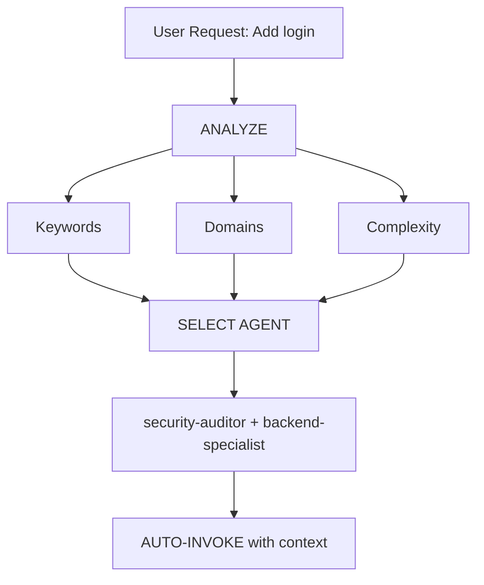

# Intelligent Agent Routing

**Purpose**: Automatically analyze user requests and route them to the most appropriate specialist agent(s) without requiring explicit user mentions.

## Core Principle

> **The AI should act as an intelligent Project Manager**, analyzing each request and automatically selecting the best specialist(s) for the job.

---

## How It Works

### 1. Request Analysis

Before responding to ANY user request, perform automatic analysis:



---

### 2. Agent Selection Matrix

**Use this matrix to automatically select agents:**

| User Intent | Keywords | Selected Agent(s) | Auto-invoke? |
| :--- | :--- | :--- | :--- |
| **Authentication** | "login", "auth", "signup", "password" | `security-auditor` + `backend-specialist` | ✅ YES |
| **UI Component** | "button", "card", "layout", "style" | `frontend-specialist` | ✅ YES |
| **Mobile UI** | "screen", "navigation", "touch", "gesture" | `mobile-developer` | ✅ YES |
| **API Endpoint** | "endpoint", "route", "API", "POST", "GET" | `backend-specialist` | ✅ YES |
| **Database** | "schema", "migration", "query", "table" | `database-architect` + `backend-specialist` | ✅ YES |
| **Bug Fix** | "error", "bug", "not working", "broken" | `debugger` | ✅ YES |
| **Test** | "test", "coverage", "unit", "e2e" | `test-engineer` | ✅ YES |
| **Deployment** | "deploy", "production", "CI/CD", "docker" | `devops-engineer` | ✅ YES |
| **Security Review** | "security", "vulnerability", "exploit" | `security-auditor` + `penetration-tester` | ✅ YES |
| **Performance** | "slow", "optimize", "performance", "speed" | `performance-optimizer` | ✅ YES |
| **Product Def** | "requirements", "user story", "backlog", "MVP" | `product-owner` | ✅ YES |
| **New Feature** | "build", "create", "implement", "new app" | `orchestrator` → multi-agent | ⚠️ ASK FIRST |
| **Complex Task** | Multiple domains detected | `orchestrator` → multi-agent | ⚠️ ASK FIRST |

---

### 3. Domain Detection Rules

| Domain | Patterns | Agent |
| :--- | :--- | :--- |
| **Security** | auth, login, jwt, password, hash, token | `security-auditor` |
| **Frontend** | component, react, vue, css, html, tailwind | `frontend-specialist` |
| **Backend** | api, server, express, fastapi, node | `backend-specialist` |
| **Mobile** | react native, flutter, ios, android, expo | `mobile-developer` |
| **Database** | prisma, sql, mongodb, schema, migration | `database-architect` |
| **Testing** | test, jest, vitest, playwright, cypress | `test-engineer` |
| **DevOps** | docker, kubernetes, ci/cd, pm2, nginx | `devops-engineer` |
| **Debug** | error, bug, crash, not working, issue | `debugger` |
| **Performance** | slow, lag, optimize, cache, performance | `performance-optimizer` |
| **SEO** | seo, meta, analytics, sitemap, robots | `seo-specialist` |
| **Game** | unity, godot, phaser, game, multiplayer | `game-developer` |
| **Odin** | odin, attribute, inspector, validate, layout | `odin-inspector` |

---

### 4. Project Type Routing

| Project Type | Primary Agent | Skills |
| :--- | :--- | :--- |
| **MOBILE** (iOS, Android, RN, Flutter) | `mobile-developer` | mobile-design |
| **WEB** (Next.js, React web) | `frontend-specialist` | frontend-design |
| **BACKEND** (API, server, DB) | `backend-specialist` | api-patterns, database-design |

> 🔴 **Mobile + frontend-specialist = WRONG.** Mobile = mobile-developer ONLY.

---

## ⚠️ AGENT ROUTING CHECKLIST (MANDATORY)

**Before ANY code or design work, you MUST complete this checklist:**

| Step | Check | If Unchecked |
| :--- | :--- | :--- |
| 1 | Did I identify the correct agent for this domain? | → STOP. Analyze domain first. |
| 2 | Did I READ the agent's `.md` file? | → STOP. Open `.agent/agents/{agent}.md` |
| 3 | Did I announce `🤖 Applying knowledge of @[agent]...`? | → STOP. Add announcement. |
| 4 | Did I load required skills from agent's frontmatter? | → STOP. Read `skills:` field. |

---

## Response Format

**When auto-selecting an agent, inform the user concisely:**

```markdown
🤖 **Applying knowledge of `@security-auditor` + `@backend-specialist`...**

[Proceed with specialized response]
```

---

## Complexity Assessment

### SIMPLE (Direct agent invocation)

- Single file edit
- Clear, specific task
- One domain only
- Example: "Fix the login button style"

**Action**: Auto-invoke respective agent.

### MODERATE (2-3 agents)

- 2-3 files affected
- Clear requirements
- 2 domains max
- Example: "Add API endpoint for user profile"

**Action**: Auto-invoke relevant agents sequentially.

### COMPLEX (Orchestrator required)

- Multiple files/domains
- Architectural decisions needed
- Unclear requirements
- Example: "Build a social media app"

**Action**: Auto-invoke `orchestrator` → will ask Socratic questions.

---

## Implementation Rules

### Rule 1: Silent Analysis

- ✅ Analyze silently.
- ✅ Inform which agent is being applied.
- ❌ Avoid verbose meta-commentary.

### Rule 2: Override Capability

**User can still explicitly mention agents:**

```markdown
User: "Use @backend-specialist to review this"
→ Override auto-selection
→ Use explicitly mentioned agent
```

---
> Converted and distributed by [TomeVault](https://tomevault.io/claim/nhomnhem) — claim your Tome and manage your conversions.
<!-- tomevault:4.0:skill_md:2026-04-13 -->
