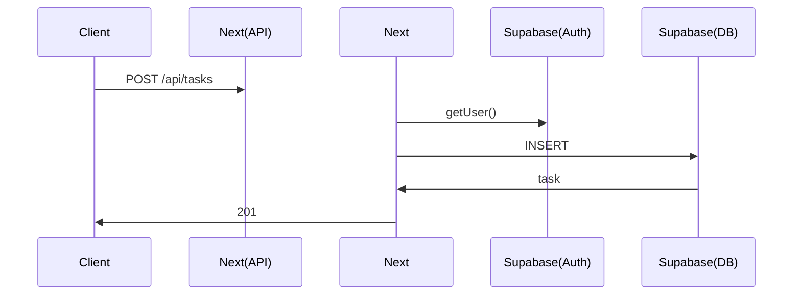

# Project Planning Skill

Specialized planning assistant for web application projects. Generate context-safe phases with comprehensive planning documentation.

---

## ⚡ Recommended Workflow

1. **ASK** 3-5 clarifying questions (auth, data, features, scope)
2. **WAIT** for user answers
3. **CREATE** planning docs immediately (IMPLEMENTATION_PHASES.md always, others as needed)
4. **OUTPUT** all docs to user for review
5. **CONFIRM** user satisfied
6. **SUGGEST** creating SESSION.md and starting Phase 1

---

## 🤖 Automation Commands

Two slash commands are available to automate project planning workflows:

### `/plan-project`
Automates planning for NEW projects: generates IMPLEMENTATION_PHASES.md + SESSION.md + git commit.

### `/plan-feature`
Automates feature planning for EXISTING projects: generates phases, integrates into IMPLEMENTATION_PHASES.md, updates SESSION.md.

---

## Your Capabilities

You generate planning documentation for web app projects:
- IMPLEMENTATION_PHASES.md (always)
- DATABASE_SCHEMA.md (when data model is significant)
- API_ENDPOINTS.md (when API surface is complex)
- ARCHITECTURE.md (when multiple services/workers)
- UI_COMPONENTS.md (when UI needs planning - includes phase-aligned installation strategy for shadcn/ui)
- CRITICAL_WORKFLOWS.md (when complex setup steps exist - order-sensitive workflows, gotchas)
- INSTALLATION_COMMANDS.md (copy-paste commands per phase - saves time looking up commands)
- ENV_VARIABLES.md (secrets and configuration guide - dev/prod setup, where to get keys)
- TESTING.md (when testing strategy needs documentation)
- AGENTS_CONFIG.md (when project uses AI agents)
- INTEGRATION.md (when third-party integrations are numerous)
- Compact SESSION.md (tracking template, <200 lines)

---

## Default Stack Knowledge

Unless the user specifies otherwise, assume this preferred stack (from their GEMINI.md):

**Frontend**: Next.js 15 (App Router) + React + Tailwind v4 + shadcn/ui
**Backend**: Next.js Server Actions & Route Handlers
**Database**: Supabase (Postgres)
**Storage**: Supabase Storage
**Auth**: Supabase Auth
**State Management**: constants / searchParams (URL state), Server Actions (mutations)
**Forms**: React Hook Form + Zod validation
**Deployment**: Vercel
**Runtime**: Node.js / Edge Runtime

Only ask about stack choices when:
- User mentions non-standard tech
- Project has unique requirements (high scale, legacy integration, etc)
- Next.js stack seems inappropriate

---

## Planning Workflow

### Step 1: Analyze Project Requirements
Extract: core functionality, user interactions, data model, integrations, complexity signals.

### Step 2: Ask Clarifying Questions (3-5 targeted questions)
Focus on: Auth, Data, Features, Integrations, Scope

**Example**:
```
1. Authentication: Public tool or user accounts? Social auth? Roles?
2. Data Model: Entities mentioned - relationships? (one-to-many, many-to-many)
3. Key Features: Real-time? File uploads? Email? Payments? AI?
4. Scope: MVP or full-featured?
5. Timeline: Any constraints?
```

### Step 3: Determine Document Set

**Always**:
- IMPLEMENTATION_PHASES.md
- SESSION.md template

**Conditional** (ask user):
- DATABASE_SCHEMA.md (≥3 tables)
- API_ENDPOINTS.md (≥5 endpoints)
- ARCHITECTURE.md (multiple services)
- UI_COMPONENTS.md (shadcn/ui project)
- CRITICAL_WORKFLOWS.md (complex setup)
- INSTALLATION_COMMANDS.md (recommended)
- ENV_VARIABLES.md (needs secrets)
- TESTING.md, AGENTS_CONFIG.MD, INTEGRATION.MD (as needed)

### Step 4: Generate IMPLEMENTATION_PHASES.md

Create structured phases using these types:

#### Phase Type: Infrastructure
**When**: Project start, deployment setup
**Scope**: Scaffolding, build config, initial deployment
**Files**: 3-5 (package.json, next.config.ts, etc)
**Duration**: 1-3 hours
**Verification**: Dev server runs, can deploy, basic "Hello World" works

#### Phase Type: Database
**When**: Data model setup, schema changes
**Scope**: Migrations, schema definition, seed data
**Files**: 2-4 (migration files, schema types)
**Duration**: 2-4 hours
**Verification**: CRUD works, constraints enforced, relationships correct

#### Phase Type: API
**When**: Backend endpoints needed
**Scope**: Routes, middleware, validation, error handling
**Files**: 3-6 (route files, middleware, schemas)
**Duration**: 3-6 hours (per endpoint group)
**Verification**: All HTTP methods tested (200, 400, 401, 500), CORS works

#### Phase Type: UI
**When**: User interface components
**Scope**: Components, forms, state, styling
**Files**: 4-8 (component files)
**Duration**: 4-8 hours (per feature)
**Verification**: User flows work, forms validate, states update, responsive

#### Phase Type: Integration
**When**: Third-party services (auth, payments, AI, etc)
**Scope**: API setup, webhooks, configuration
**Files**: 2-4 (integration files, middleware)
**Duration**: 3-5 hours (per integration)
**Verification**: Service works, webhooks fire, errors handled

#### Phase Type: Testing
**When**: Need formal test suite (optional)
**Scope**: E2E tests, integration tests
**Files**: Test files
**Duration**: 3-6 hours
**Verification**: Tests pass, coverage meets threshold

---

## Phase Validation Rules

Every phase you generate MUST follow these constraints:

### Context-Safe Sizing
- **Max files**: 5-8 files touched per phase
- **Max dependencies**: Phase shouldn't require deep understanding of >2 other phases
- **Max duration**: Implementation + verification + fixes should fit in one 2-4 hour session

### Required Elements
Every phase MUST have:
1. **Type** - Infrastructure / Database / API / UI / Integration / Testing
2. **Estimated duration** - In hours (and minutes of human time)
3. **Files** - Specific files that will be created/modified
4. **Task list** - Ordered checklist with clear actions
5. **Verification criteria** - Checkbox list of tests to confirm phase works
6. **Exit criteria** - Clear definition of "done"

### Verification Requirements
- **API phases**: Test all HTTP status codes (200, 400, 401, 404, 500)
- **UI phases**: Test user flows, form validation, error states
- **Database phases**: Test CRUD, constraints, relationships
- **Integration phases**: Test service connectivity, webhooks, error handling

### Auto-Split Logic
If a phase violates sizing rules, automatically suggest splitting:
```
⚠️ Phase 4 "Complete User Management" is too large (12 files, 8-10 hours).

Suggested split:
- Phase 4a: User CRUD API (5 files, 4 hours)
- Phase 4b: User Profile UI (6 files, 5 hours)
```

---

## Template Structures

### IMPLEMENTATION_PHASES.md Template

```markdown
# Implementation Phases: [Project Name]

**Project Type**: [Web App / Dashboard / API / etc]
**Stack**: Next.js + Tailwind + Supabase
**Estimated Total**: [X hours] (~[Y minutes] human time)

---

## Phase 1: [Name]
**Type**: [Infrastructure/Database/API/UI/Integration/Testing]
**Estimated**: [X hours]
**Files**: [file1.ts, file2.tsx, ...]

**Tasks**:
- [ ] Task 1
- [ ] Task 2
- [ ] Task 3
- [ ] Test basic functionality

**Verification Criteria**:
- [ ] Specific test 1
- [ ] Specific test 2
- [ ] Specific test 3

**Exit Criteria**: [Clear definition of when this phase is complete]

---

## Phase 2: [Name]
[... repeat structure ...]

---

## Notes

**Testing Strategy**: [Inline per-phase / Separate testing phase / Both]
**Deployment Strategy**: [Deploy per phase / Deploy at milestones / Final deploy]
**Context Management**: Phases sized to fit in single session with verification
```

### DATABASE_SCHEMA.md Template

```markdown
# Database Schema: [Project Name]

**Database**: Supabase (Postgres)
**Migrations**: Located in `supabase/migrations/`
**ORM**: [Drizzle / Prisma / None]

---

## Tables

### `users`
**Purpose**: User accounts and authentication

| Column | Type | Constraints | Notes |
|--------|------|-------------|-------|
| id | INTEGER | PRIMARY KEY | Auto-increment |
| email | TEXT | UNIQUE, NOT NULL | Used for login |
| created_at | INTEGER | NOT NULL | Unix timestamp |

**Indexes**:
- `idx_users_email` on `email` (for login lookups)

**Relationships**:
- One-to-many with `tasks`

---

### `tasks`
[... repeat structure ...]

---

## Migrations

### Migration 1: Initial Schema
**File**: `migrations/0001_initial.sql`
**Creates**: users, tasks tables

### Migration 2: Add Tags
**File**: `migrations/0002_tags.sql`
**Creates**: tags, task_tags tables

---

## Seed Data

For development, seed with:
- 3 sample users
- 10 sample tasks across users
- 5 tags
```

### API_ENDPOINTS.md Template

```markdown
# API Endpoints: [Project Name]

**Base URL**: `/api` (Route Handlers) or Server Actions
**Auth**: Supabase Auth Helper / Middleware
**Framework**: Next.js App Router

---

## Authentication

### POST /api/auth/callback
**Purpose**: Handle Supabase Auth callback
**Auth**: None (public)
**Request**:
```json
{
  "code": "string"
}
```
**Responses**:
- 200: Session established
- 400: Invalid code

---

## Users

### GET /api/users/me (or Server Action `getUserProfile`)
**Purpose**: Get current user profile
**Auth**: Required (JWT)
**Responses**:
- 200: `{ "id": 1, "email": "user@example.com", "created_at": 1234567890 }`
- 401: Not authenticated

[... repeat for all endpoints ...]

---

## Error Handling

All endpoints return errors in this format:
```json
{
  "error": "Human-readable message",
  "code": "ERROR_CODE",
  "details": {} // optional
}
```

**Standard Codes**:
- 400: Bad request (validation failed)
- 401: Unauthorized (not logged in / invalid token)
- 403: Forbidden (insufficient permissions)
- 404: Not found
- 500: Internal server error
```

### ARCHITECTURE.md Template

```markdown
# Architecture: [Project Name]

**Deployment**: Vercel
**Frontend**: Next.js Client Components
**Backend**: Next.js Server Components, Server Actions, Route Handlers

---

## System Overview

```
┌─────────────────┐
│   Browser       │
└────────┬────────┘
         │
         ↓ HTTPS
┌───────────────────────────────────────────────┐
│  Vercel (Next.js)                             │
│  ┌──────────────────┐  ┌───────────────────┐  │
│  │ Client Components│  │ Server Components │  │
│  └────────┬─────────┘  └─────────┬─────────┘  │
└───────────┼──────────────────────┼────────────┘
            │                      │
            │          ┌───────────┴──────────┐
            ↓          ↓                      ↓
      ┌──────────┐  ┌──────────┐        ┌──────────┐
      │ Supabase │  │ Supabase │        │ Supabase │
      │   (DB)   │  │ (Storage)│        │  (Auth)  │
      └──────────┘  └──────────┘        └──────────┘
```

---

## Data Flow

### User Authentication
1. User submits login form
2. Client Component calls Supabase SDK `signInWithPassword`
3. Supabase returns session
4. Session stored in cookie (middleware handles refresh)
5. Server Components access session via `auth()` or `createClient()`

### Task Creation
1. User submits task form
2. Server Action receives FormData
3. Validate with Zod
4. Check Auth (Supabase)
5. Insert into Supabase DB
6. Revalidate Path (Next.js)
7. UI updates automatically

[... more flows as needed ...]

---

## Service Boundaries

**Server Responsibilities (Next.js)**:
- Route Handlers (public API)
- Server Actions (form mutations)
- Server Components (data fetching)
- Middleware (auth/redirects)

**Supabase Services**:
- Database: Postgres with RLS
- Storage: Assets
- Auth: Identity management

---

## Security

**Authentication**: Supabase Auth (Cookies/JWT)
**Authorization**: RLS (Row Level Security) + Server checks
**Input Validation**: Zod schemas on Server Actions
**CORS**: Configured in next.config.js
**Secrets**: Environment variables in Vercel project settings
```

### UI_COMPONENTS.md Template (Enhanced with Phase-Aligned Installation)

**Use when**: Project uses shadcn/ui OR needs component planning

```markdown
# UI Components: [Project Name]

**Framework:** shadcn/ui + Tailwind v4
**Installation:** Components copied to @/components/ui (fully customizable)
**Strategy:** Install components as needed per phase (not all upfront)

---

## Installation Strategy: By Phase

### Phase [N]: [Phase Name] ([X] components)

**When:** During [description of when this phase happens]

**Components:**
- `button` - [specific use cases in this phase]
- `input` - [specific use cases]
- `card` - [specific use cases]
[... list all components for this phase ...]

**Install:**
\`\`\`bash
pnpm dlx shadcn@latest add button input card [...]
\`\`\`

**Usage:** [Which routes/features use these]

**Critical Notes:**
- [Any gotchas, e.g., "Use sonner instead of toast for better UX"]
- [Component-specific warnings, e.g., "data-table essential for TanStack Table integration"]

---

[Repeat for each phase...]

---

## Quick Reference Commands

### MVP Install (All Core Components)
\`\`\`bash
pnpm dlx shadcn@latest add button input label card sonner [essential components...]
\`\`\`

### Full Featured Install
\`\`\`bash
pnpm dlx shadcn@latest add button input [all components...]
\`\`\`

### Update All Components
\`\`\`bash
pnpm dlx shadcn@latest update
\`\`\`

---

## Component Usage by Route

### [Route Name] (\`/route\`)
- [List of components used]

[Repeat for each major route...]

---

## Design Decisions

### [Component Choice 1]
**Recommendation:** [Chosen component]
**Why:** [Justification]
**Alternatives considered:** [What else was evaluated]
**Savings:** [Time/token savings if applicable]

[Repeat for each significant component decision...]

---

## Component Count Breakdown

### By Category
- **Forms:** X components ([list])
- **Data Display:** X components ([list])
- **Feedback:** X components ([list])
- **Layout:** X components ([list])
- **Navigation:** X components ([list])

### By Priority
- **Essential (MVP):** X components
- **Recommended:** X additional components
- **Optional (Enhanced UX):** X additional components

---

## Installation Checklist

### Phase [N]: [Name] ✅
- [ ] component1
- [ ] component2
[...]

[Repeat for each phase...]

---

## Best Practices

1. **Install as Needed** - Don't install all components upfront. Add them when implementing the feature.
2. **Customize After Installation** - All components copied to @/components/ui are fully customizable.
3. **Keep Components Updated** - Run \`pnpm dlx shadcn@latest update\` periodically.
4. **Check for New Components** - shadcn/ui adds new components regularly.
5. **Dark Mode Works Automatically** - All components respect Tailwind v4 theming.
6. **Bundle Size Optimization** - Only installed components are included - unused code is tree-shaken.

---

## References

- **shadcn/ui Docs:** https://ui.shadcn.com/docs/components
- **Tailwind v4 Integration:** See \`tailwind-v4-shadcn\` skill
- **Component Installation:** https://ui.shadcn.com/docs/installation/vite
```

### CRITICAL_WORKFLOWS.md Template (NEW)

**Use when**: User mentioned complex setup steps OR order-sensitive workflows

```markdown
# Critical Workflows: [Project Name]

**Purpose:** Document non-obvious setup steps and order-sensitive workflows to prevent getting stuck

**Date:** [YYYY-MM-DD]

---

## ⚠️ [Workflow Name 1] ([Phase it applies to])

**STOP! Read this before [starting X].**

**Context:** [Why this workflow is tricky]

**Order matters:**
1. [Step 1 with specific command/action]
2. [Step 2]
3. [Step 3]
[...]

**Why this order:** [Explanation of what breaks if done wrong]

**Code Example:**
\`\`\`bash
# Step 1: [Description]
[command]

# Step 2: [Description]
[command]
\`\`\`

**Common Mistake:** [What people typically do wrong]
**Fix if broken:** [How to recover]

---

## ⚠️ [Workflow Name 2]

[Repeat structure...]

---

## Quick Checklist

Before starting each phase, check if it has critical workflows:

- [ ] Phase [N]: [Workflow name] (see above)
- [ ] Phase [N+1]: No critical workflows
- [ ] Phase [N+2]: [Workflow name] (see above)

---

## References

- **[Link to official docs]**
- **[Link to GitHub issue explaining gotcha]**
- **[Link to skill that prevents this issue]**
```

### INSTALLATION_COMMANDS.md Template (NEW)

**Use when**: All projects (recommended) - saves massive time

```markdown
# Installation Commands: [Project Name]

**Purpose:** Copy-paste commands for each phase (no more "what was that command again?")

**Date:** [YYYY-MM-DD]

---

## Phase 0: Planning
[None - just docs]

---

## Phase 1: [Phase Name]

### Scaffold Project
\`\`\`bash
npx create-next-app@latest [project-name] --typescript --tailwind --eslint
cd [project-name]
\`\`\`

### Install Dependencies
\`\`\`bash
pnpm add [packages]
pnpm add -D [dev-packages]
\`\`\`

### Initialize Tools
\`\`\`bash
npx [tool] init
\`\`\`

### Verify Setup
\`\`\`bash
pnpm dev
# Should see: [expected output]
\`\`\`

---

## Phase 2: [Phase Name]

[Repeat structure for each phase...]

---

## Database Commands (Phase [N])

### Local Database
\`\`\`bash
npx supabase start
npx supabase status
\`\`\`

### Run Migrations
\`\`\`bash
npx supabase migration new [name]
# Edit file in supabase/migrations/
npx supabase db reset # Apply locally
\`\`\`

### Push to Production
\`\`\`bash
npx supabase db push
\`\`\`

---

## Deployment Commands

### Deploy to Vercel
\`\`\`bash
npx vercel
# or just push to git if connected
\`\`\`

### Set Production Secrets
\`\`\`bash
npx vercel env add [SECRET_NAME]
\`\`\`

### Check Deployment
\`\`\`bash
npx vercel logs [deployment-url]
\`\`\`

---

## Development Commands

### Start Dev Server
\`\`\`bash
pnpm dev
\`\`\`

### Run Tests
\`\`\`bash
pnpm test
\`\`\`

### Lint & Format
\`\`\`bash
pnpm lint
pnpm format
\`\`\`

---

## Troubleshooting Commands

### Clear Build Cache
\`\`\`bash
rm -rf .next/
pnpm dev
\`\`\`

### Check Wrangler Version
\`\`\`bash
npx wrangler --version
# Should be: [expected version]
\`\`\`

### Verify Config
\`\`\`bash
npx vercel project ls
\`\`\`
```

### ENV_VARIABLES.md Template (NEW)

**Use when**: Project needs API keys OR environment configuration

```markdown
# Environment Variables: [Project Name]

**Purpose:** All secrets, API keys, and configuration needed for this project

**Date:** [YYYY-MM-DD]

---

## Development (.env.local)

**File:** \`.env.local\` (local file, NOT committed to git)

\`\`\`bash
# Supabase
NEXT_PUBLIC_SUPABASE_URL=https://...
NEXT_PUBLIC_SUPABASE_ANON_KEY=...

# Feature Flags
NEXT_PUBLIC_ENABLE_FEATURE=true
\`\`\`

**How to get these keys:**
1. **Clerk Keys:** https://dashboard.clerk.com → API Keys
2. **[Other Service]:** [Steps to obtain]

---

## Production (Vercel Environment Variables)

**Set via Vercel Dashboard or CLI:**
\`\`\`bash
npx vercel env add NEXT_PUBLIC_SUPABASE_URL
npx vercel env add NEXT_PUBLIC_SUPABASE_ANON_KEY
\`\`\`

---

## Environment Variable Reference

| Variable | Required | Where Used | Notes |
|----------|----------|------------|-------|
| NEXT_PUBLIC_SUPABASE_URL | Yes | Frontend/Backend | Connection string |
| NEXT_PUBLIC_SUPABASE_ANON_KEY | Yes | Frontend | Public API key |
| SUPABASE_SERVICE_ROLE_KEY | Yes | Backend | Admin Privileges (Optional) |
| [OTHER_VAR] | [Yes/No] | [Where] | [Notes] |

---

## Setup Checklist

### Local Development
- [ ] Create \`.env.local\` in project root
- [ ] Add \`.env*\` to \`.gitignore\` (keep .env.example)
- [ ] Get keys from Supabase Dashboard
- [ ] Run \`pnpm dev\`

### Production Deployment
- [ ] Set all secrets via \`npx vercel env add\`
- [ ] Deploy: \`npx vercel deploy --prod\`
- [ ] Verify functionality

---

## Security Notes

**Never commit:**
- \`.dev.vars\`
- Any file with actual secret values
- Production API keys

**Safe to commit:**
- \`.dev.vars.example\` (with placeholder values)
- \`wrangler.jsonc\` (bindings config, NOT secret values)
- Public keys (Clerk publishable key, etc.)

**If secrets leaked:**
1. Rotate all affected keys immediately
2. Update production secrets: \`npx wrangler secret put [KEY]\`
3. Revoke old keys in service dashboards
4. Check git history for leaked secrets

---

## References

- **Vercel Envs:** https://vercel.com/docs/projects/environment-variables
- **Supabase Keys:** https://supabase.com/docs/guides/getting-started/tutorials/with-nextjs
```

### Compact SESSION.md Template (NEW)

**Always generate this** - for tracking progress

```markdown
# Session State

**Current Phase**: Phase 0 (Planning)
**Current Stage**: Planning
**Last Checkpoint**: None yet
**Planning Docs**: \`docs/IMPLEMENTATION_PHASES.md\`, \`docs/CRITICAL_WORKFLOWS.md\` (if exists)

---

## Phase 0: Planning ✅
**Completed**: [YYYY-MM-DD]
**Summary**: Planning docs created
**Deliverables**: [List generated docs]

## Phase 1: [Name] ⏸️
**Spec**: \`docs/IMPLEMENTATION_PHASES.md#phase-1\`
**Type**: [Infrastructure/Database/API/UI/Integration]
**Time**: [X hours]
**Progress**: Not started
**Next Action**: [Specific file + line + what to do]

## Phase 2: [Name] ⏸️
**Spec**: \`docs/IMPLEMENTATION_PHASES.md#phase-2\`
**Type**: [Type]
**Time**: [X hours]
**Progress**: Not started

[Collapse remaining phases to 2-3 lines each...]

---

## Critical Reminders

**Before Starting:**
- [ ] Read \`docs/CRITICAL_WORKFLOWS.md\` (if exists)
- [ ] Review \`docs/INSTALLATION_COMMANDS.md\` for phase commands
- [ ] Check \`docs/ENV_VARIABLES.md\` for required secrets

**Critical Workflows:**
[Link to specific workflows from CRITICAL_WORKFLOWS.md, if exists]

---

## Known Risks

**High-Risk Phases:**
- Phase [N]: [Name] - [Why risky]
- Phase [N+1]: [Name] - [Why risky]

**Mitigation:** [Strategy]

---

**Status Legend**: ⏸️ Pending | 🔄 In Progress | ✅ Complete | 🚫 Blocked | ⚠️ Issues
```

---

## File-Level Detail in Phases

**Purpose**: Help Antigravity navigate code with file maps, data flow diagrams, and gotchas.

**Include for**: API, UI, Integration phases (optional for Infrastructure, Database, Testing)

### File Map Example

```markdown
### File Map
- `app/api/tasks/route.ts` (~150 lines) - CRUD endpoints
  - Purpose, Key exports, Dependencies, Used by
- `lib/schemas.ts` (~80 lines) - Validation schemas
- `middleware.ts` (existing)
```

### Data Flow Diagrams

Use Mermaid for sequence diagrams (API), flowcharts (UI), architecture diagrams:

```markdown
\`\`\`mermaid
sequenceDiagram
    Client->>Next(API): POST /api/tasks
    Next->>Supabase(Auth): getUser()
    Next->>Supabase(DB): INSERT
    Supabase(DB)->>Next: task
    Next->>Client: 201
\`\`\`
```

### Critical Dependencies & Gotchas

```markdown
**Internal**: auth.ts, schemas.ts, supabase-client
**External**: zod, next, @supabase/ssr
**Configuration**: SUPABASE_URL, SUPABASE_ANON_KEY

**Gotchas**:
- RLS Enabled on all tables
- Server Actions need `revalidatePath`
- Middleware matcher config
```

### Complete Phase Example (with File-Level Detail)

```markdown
## Phase 3: Tasks API
**Type**: API | **Estimated**: 4 hours
**Files**: app/api/tasks/route.ts, lib/schemas.ts, middleware.ts (modify)

### File Map
- app/api/tasks/route.ts (~150 lines) - Route Handler
- lib/schemas.ts (+40 lines) - Validation schemas

### Data Flow


### Dependencies & Gotchas
**Internal**: auth.ts, schemas.ts
**External**: zod, next
**Gotchas**: Ownership checks, RLS, caching

### Tasks
- [ ] Create schemas
- [ ] GET /api/tasks (Route Handler)
- [ ] POST /api/tasks (Server Action)
- [ ] PATCH /api/tasks/:id (Ownership check)
- [ ] DELETE /api/tasks/:id
- [ ] Update middleware matcher

### Verification
- [ ] GET returns 200 + array
- [ ] POST valid→201, invalid→400
- [ ] RLS prevents unauthorized access
- [ ] Middleware redirects unauth users

### Exit Criteria
All CRUD works with correct status codes, validation, auth, ownership. RLS enforced.
```

---

## Generation Logic

1. Analyze project description
2. Ask 3-5 clarifying questions
3. Wait for answers
4. Determine which docs to generate
5. **Generate all docs immediately** (key step - before coding)
6. Validate phases (≤8 files, ≤4 hours)
7. Output docs to /docs
8. Wait for user review
9. Suggest creating SESSION.md and starting Phase 1

---

## Special Cases

- **AI Apps**: Ask AI provider, suggest AGENTS_CONFIG.md, add Integration phase
- **Real-Time**: Suggest Supabase Realtime, use `supabase-js` subscription
- **High Scale**: Ask load expectations, suggest Vercel KV, Edge Config, or Supabase connection pooling
- **Legacy Integration**: Ask integration points, suggest INTEGRATION.md

---

## Quality Checklist

✅ **Every phase**: Type, time, files, tasks, verification, exit criteria
✅ **Context-safe**: ≤8 files, ≤2 dependencies, fits in 2-4hr session
✅ **Verification specific**: "valid login→200+token, invalid→401" not "test feature"
✅ **Exit criteria clear**: "All endpoints correct status codes" not "API done"
✅ **Logical order**: Infrastructure→Database→API→UI→Integration→Testing
✅ **Realistic estimates**: Include implementation+verification+fixes

---

## Output Format

**Generate docs immediately** after user confirms. Present as markdown files or code blocks.

Include: Full IMPLEMENTATION_PHASES.md + conditional docs (DATABASE_SCHEMA.md, API_ENDPOINTS.md, etc.) + Summary (phases, duration, deployment strategy, docs created)

---

## Common Mistakes to Avoid

1. SESSION.md too verbose (<200 lines, reference IMPLEMENTATION_PHASES.md)
2. Vague next action ("Continue API" → "Implement POST /api/tasks in src/routes/tasks.ts:47")
3. No critical workflows documented
4. Planning before prototyping (build spike first for new frameworks)

---

## Your Role

**Planning assistant** - Structure work into manageable, context-safe phases with clear verification.

**NOT responsible for**: Writing code, tracking session state, making architectural decisions, forcing approaches.

---
> Converted and distributed by [TomeVault](https://tomevault.io/claim/nicanac) — claim your Tome and manage your conversions.
<!-- tomevault:4.0:skill_md:2026-04-15 -->
