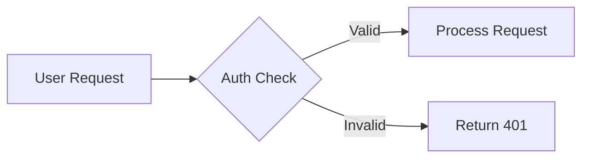
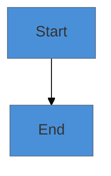
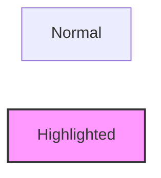

# Mermaid Diagramming

Create clear, professional Mermaid diagrams for technical documentation. Covers all major
diagram types with both basic and styled variants, rendering guidance, and export recommendations.

## When to Use This Skill

- Creating flowcharts for process documentation or decision trees
- Drawing sequence diagrams for API interactions or system communication
- Building ERDs for database schema documentation
- Designing state machine diagrams for workflow states
- Producing Gantt charts for project timelines
- Documenting system architecture with C4 or network diagrams
- Adding visual aids to README files, ADRs, or design docs

## Quick Reference

| Resource | Purpose | Load when |
|----------|---------|-----------|
| `references/diagram-types.md` | Syntax, patterns, and code examples for every Mermaid diagram type | Choosing or building a diagram |

---

## Workflow Overview

```
Phase 1: Scope     → Identify what to visualize, audience, and diagram type
Phase 2: Draft     → Write base Mermaid code with correct syntax
Phase 3: Style     → Add theming, colors, and accessibility annotations
Phase 4: Deliver   → Provide rendering instructions and suggest iterations
```

---

## Phase 1: Scope

Before writing any code, clarify:

1. **What is the narrative?** The diagram should tell a story or answer a question.
2. **Who is the audience?** Developers need detail; stakeholders need overview.
3. **What entities and relationships exist?** List nodes and edges before drawing.
4. **Which diagram type fits?** Use the selection guide below.

### Diagram Type Selection

| If you need to show... | Use |
|------------------------|-----|
| Process flow, decisions, branching | `flowchart` |
| Interactions over time between systems/actors | `sequenceDiagram` |
| Data model and relationships | `erDiagram` |
| Object structure and inheritance | `classDiagram` |
| States and transitions | `stateDiagram-v2` |
| Project schedule and dependencies | `gantt` |
| Proportions or distribution | `pie` |
| Hierarchical idea mapping | `mindmap` |
| Events over time | `timeline` |
| System architecture layers | C4 context/container diagrams |
| Code version history | `gitGraph` |
| User experience flow | `journey` |

---

## Phase 2: Draft

### Structure Rules

1. **One concept per diagram** — split complex systems into multiple views
2. **Limit nodes** — keep under 15 nodes per diagram; split if larger
3. **Meaningful labels** — use descriptive text, not single letters
4. **Consistent direction** — prefer top-to-bottom (`TB`) or left-to-right (`LR`)
5. **Group related nodes** — use `subgraph` to cluster related elements

### Code Conventions



- Use double quotes for labels containing special characters
- Add comments (`%%`) explaining non-obvious relationships
- Prefer `-->` for solid lines, `-.->` for dashed, `==>` for thick
- Use descriptive edge labels: `-->|"reason"| TargetNode`

---

## Phase 3: Style

### Theming

Apply consistent styling using `%%{init: ...}%%` directives:



### Node Styling



### Accessibility

- Use high-contrast color combinations
- Do not rely on color alone to convey meaning — add labels and shapes
- Include alt text when embedding: ``
- Provide a text summary alongside complex diagrams

---

## Phase 4: Deliver

### Always Provide

1. **Basic version** — clean, unstyled diagram that renders anywhere
2. **Styled version** — themed variant with colors and emphasis
3. **Rendering note** — where to preview (GitHub, Mermaid Live, VS Code extension)
4. **Suggestions** — complementary diagrams or next iterations

### Rendering Options

| Platform | Support |
|----------|---------|
| GitHub markdown | Native rendering in `.md` files |
| GitLab markdown | Native rendering |
| Mermaid Live Editor | `https://mermaid.live` for interactive editing |
| VS Code | Mermaid extension for preview |
| Docusaurus / MkDocs | Plugin-based rendering |

### Export Formats

- **SVG**: Best for web and docs (scalable, searchable text)
- **PNG**: Fallback for platforms without Mermaid support
- **PDF**: For print or formal documentation

---

## Best Practices

- **Start simple** — get the structure right before adding style
- **Test rendering** — verify on the target platform before committing
- **Version diagrams** — update diagrams when the underlying system changes
- **Colocate with docs** — keep diagrams in the same directory as related documentation
- **Use subgraphs** — group related nodes to reduce visual complexity

## Anti-Patterns

- Putting too many nodes in one diagram (split at 15+ nodes)
- Using single-letter node IDs without labels
- Relying on color alone to convey meaning
- Hard-coding pixel widths that break on different renderers
- Leaving diagrams out of date after system changes

---
> Converted and distributed by [TomeVault](https://tomevault.io/claim/nickcrew) — claim your Tome and manage your conversions.
<!-- tomevault:4.0:skill_md:2026-04-11 -->
