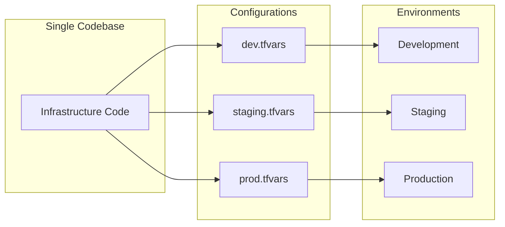

# Environment Parity

## Overview

Environment parity means **using the same infrastructure code** across all environments, with only configuration values changing. This reduces "works on my machine" problems and ensures production behavior is tested before deployment.



## What Should Differ

| Configuration | Dev | Staging | Prod |
|--------------|-----|---------|------|
| Instance sizes | t3.small | t3.medium | t3.large |
| Replica count | 0 | 1 | 2 |
| Multi-AZ | false | false | true |
| Deletion protection | false | false | true |
| Backup retention | 1 day | 7 days | 30 days |
| Monitoring | basic | enhanced | enhanced |

## What Should NOT Differ

- ✅ Resource types and structure
- ✅ Security group rules (ports, protocols)
- ✅ IAM policy structure
- ✅ Encryption settings
- ✅ Network topology

## Best Practices

1. **Single source of truth** - One codebase, multiple configs
2. **Use tfvars/context** - Environment-specific settings
3. **Conditional logic sparingly** - Prefer configuration over conditionals
4. **Match production** - Staging should mirror prod closely
5. **Test in lower environments first** - Dev → Staging → Prod

---

## Example 1: Terraform - Workspaces + Variable Files

Environment parity with workspace isolation and tfvars files.

📁 **Location**: [terraform/examples/environment-parity/](file:///home/nmosquerar/skills-repo/terraform/examples/environment-parity/)

### Configuration Files

```hcl
# environments/dev.tfvars
environment = "dev"
instance_type = "t3.small"
rds_instance_class = "db.t3.micro"
rds_multi_az = false
rds_deletion_protection = false
min_capacity = 1
max_capacity = 2
enable_enhanced_monitoring = false
```

```hcl
# environments/prod.tfvars
environment = "prod"
instance_type = "t3.large"
rds_instance_class = "db.r5.large"
rds_multi_az = true
rds_deletion_protection = true
min_capacity = 3
max_capacity = 10
enable_enhanced_monitoring = true
```

### Usage

```bash
# Deploy to dev
terraform workspace select dev
terraform apply -var-file="environments/dev.tfvars"

# Deploy to prod
terraform workspace select prod
terraform apply -var-file="environments/prod.tfvars"
```

---

## Example 2: CDK - Context-Based Configuration

Environment parity using CDK context for configuration.

📁 **Location**: [cdk/examples/environment-parity/](file:///home/nmosquerar/skills-repo/cdk/examples/environment-parity/)

### Context Configuration

```typescript
// cdk.json
{
  "context": {
    "dev": {
      "instanceType": "t3.small",
      "rdsInstanceClass": "db.t3.micro",
      "multiAz": false,
      "minCapacity": 1,
      "maxCapacity": 2
    },
    "prod": {
      "instanceType": "t3.large",
      "rdsInstanceClass": "db.r5.large",
      "multiAz": true,
      "minCapacity": 3,
      "maxCapacity": 10
    }
  }
}

// app.ts
const environment = app.node.tryGetContext('environment') || 'dev';
const config = app.node.tryGetContext(environment);

new MyStack(app, `MyApp-${environment}`, {
  ...config,
  environment,
});
```

### Usage

```bash
# Deploy to dev
cdk deploy --context environment=dev

# Deploy to prod
cdk deploy --context environment=prod
```

---

## Validation Checklist

- [ ] Same Terraform/CDK code deploys to all environments
- [ ] Only configuration values differ (sizes, counts, retention)
- [ ] Security configurations are consistent
- [ ] Staging closely matches production
- [ ] Changes tested in dev/staging before prod

## Related Skills

- [Layered Stacks](../layered-stacks/SKILL.md) - Layers per environment
- [GitOps Workflow](../gitops-workflow/SKILL.md) - Environment promotion
- [Remote State Boundaries](../remote-state-boundaries/SKILL.md) - State per env

---
> Converted and distributed by [TomeVault](https://tomevault.io/claim/nicolasmosquerar) — claim your Tome and manage your conversions.
<!-- tomevault:4.0:skill_md:2026-04-13 -->
