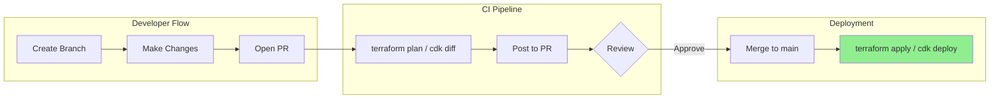
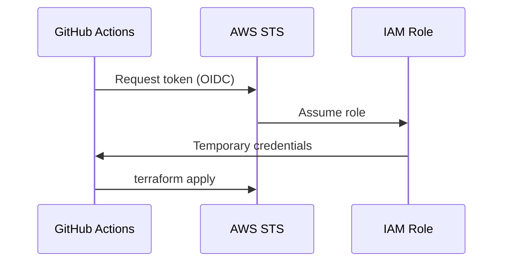

# GitOps Workflow Patterns

## Overview

GitOps treats **Git as the single source of truth** for infrastructure. All changes go through PRs, are previewed before apply, and leave an audit trail. This skill covers CI/CD workflows for Terraform and CDK with OIDC authentication.



## Key Concepts

### OIDC Authentication

Instead of storing AWS credentials in CI, use **OIDC federation** for short-lived, automatically rotated credentials.



### Workflow Stages

| Stage | Trigger | Actions |
|-------|---------|---------|
| **Plan** | PR opened/updated | `terraform plan`, post to PR |
| **Apply** | Merge to main | `terraform apply -auto-approve` |
| **Destroy** | Manual or PR | Requires additional approval |

## Best Practices

1. **Never apply on PR** - Plan only, apply on merge
2. **Use OIDC** - No stored credentials
3. **Lock state during apply** - Prevent concurrent modifications
4. **Require approvals** - CODEOWNERS for infra changes
5. **Post plan output to PR** - Reviewers see exact changes
6. **Run fmt/validate first** -  Fail fast on syntax errors
7. **Environment-specific workflows** - Different approval for prod

---

## Example 1: GitHub Actions with OIDC for Terraform

Complete workflow with OIDC, plan on PR, apply on merge.

📁 **Location**: [ci-templates/github-actions/](file:///home/nmosquerar/skills-repo/ci-templates/github-actions/)

### PR Workflow (Plan Only)

```yaml
name: Terraform Plan
on:
  pull_request:
    paths: ['terraform/**']

permissions:
  id-token: write   # Required for OIDC
  contents: read
  pull-requests: write

jobs:
  plan:
    runs-on: ubuntu-latest
    steps:
      - uses: actions/checkout@v4
      
      - name: Configure AWS Credentials (OIDC)
        uses: aws-actions/configure-aws-credentials@v4
        with:
          role-to-assume: arn:aws:iam::${{ secrets.AWS_ACCOUNT_ID }}:role/github-actions-role
          aws-region: us-east-1
      
      - uses: hashicorp/setup-terraform@v3
      
      - name: Terraform Format Check
        run: terraform fmt -check -recursive
      
      - name: Terraform Init
        run: terraform init
      
      - name: Terraform Plan
        id: plan
        run: terraform plan -no-color -out=tfplan
      
      - name: Post Plan to PR
        uses: actions/github-script@v7
        with:
          script: |
            const output = `#### Terraform Plan 📖
            \`\`\`
            ${{ steps.plan.outputs.stdout }}
            \`\`\``;
            github.rest.issues.createComment({
              issue_number: context.issue.number,
              owner: context.repo.owner,
              repo: context.repo.repo,
              body: output
            })
```

---

## Example 2: GitLab CI with OIDC

GitLab CI pipeline with OIDC and environment-based approvals.

📁 **Location**: [ci-templates/gitlab-ci/](file:///home/nmosquerar/skills-repo/ci-templates/gitlab-ci/)

### Key Features

```yaml
stages:
  - validate
  - plan
  - apply

.terraform:
  image: hashicorp/terraform:1.5
  id_tokens:
    AWS_TOKEN:
      aud: https://gitlab.com  # OIDC audience

plan:
  extends: .terraform
  stage: plan
  script:
    - export AWS_WEB_IDENTITY_TOKEN_FILE=$AWS_TOKEN
    - terraform init
    - terraform plan -out=tfplan
  artifacts:
    paths: [tfplan]

apply:
  extends: .terraform
  stage: apply
  script:
    - terraform apply -auto-approve tfplan
  rules:
    - if: $CI_COMMIT_BRANCH == "main"
  environment:
    name: production
```

---

## OIDC IAM Role (Terraform)

```hcl
# GitHub OIDC Provider
resource "aws_iam_openid_connect_provider" "github" {
  url             = "https://token.actions.githubusercontent.com"
  client_id_list  = ["sts.amazonaws.com"]
  thumbprint_list = ["6938fd4d98bab03faadb97b34396831e3780aea1"]
}

# Role for GitHub Actions
resource "aws_iam_role" "github_actions" {
  name = "github-actions-role"

  assume_role_policy = jsonencode({
    Version = "2012-10-17"
    Statement = [{
      Effect = "Allow"
      Principal = {
        Federated = aws_iam_openid_connect_provider.github.arn
      }
      Action = "sts:AssumeRoleWithWebIdentity"
      Condition = {
        StringEquals = {
          "token.actions.githubusercontent.com:aud" = "sts.amazonaws.com"
        }
        StringLike = {
          "token.actions.githubusercontent.com:sub" = "repo:myorg/myrepo:*"
        }
      }
    }]
  })
}
```

---

## Validation Checklist

- [ ] OIDC provider configured (no stored credentials)
- [ ] Plan runs on all PRs
- [ ] Plan output posted to PR comments
- [ ] Apply only on merge to main
- [ ] `terraform fmt` check in CI
- [ ] CODEOWNERS requires infra team approval
- [ ] Production requires manual approval

## Related Skills

- [OIDC & IRSA Patterns](../oidc-irsa-patterns/SKILL.md) - Deep dive on OIDC
- [Policy as Code](../policy-as-code/SKILL.md) - Pre-apply policy checks
- [Remote State Boundaries](../remote-state-boundaries/SKILL.md) - State isolation

---
> Converted and distributed by [TomeVault](https://tomevault.io/claim/nicolasmosquerar) — claim your Tome and manage your conversions.
<!-- tomevault:4.0:skill_md:2026-04-13 -->
