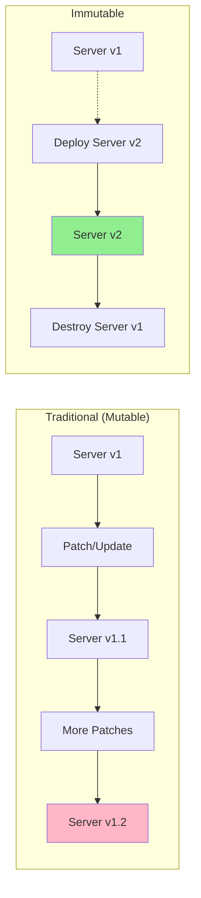

# Immutable Infrastructure

## Overview

**Immutable infrastructure** is the practice of replacing infrastructure components rather than updating them in place. Once deployed, infrastructure is never modified—changes trigger full replacement with new components.

This approach eliminates configuration drift, makes rollbacks trivial, and ensures consistency across environments.



## Key Concepts

### Replacement vs In-Place Update
- **In-place**: SSH into server, run `apt upgrade`, restart service (drift risk)
- **Immutable**: Build new AMI/container with updates, deploy new instances, terminate old

### Baked Images
Pre-bake images (AMIs, container images) with all dependencies and configuration. Deploy identical images across environments.

### Blue/Green Deployments
Run old (blue) and new (green) environments side-by-side. Switch traffic atomically, keep old environment for instant rollback.

### Deployment Identifiers
Every deployment has a unique identifier (git SHA, semantic version, timestamp) baked into the image and tags.

## Best Practices

1. **Never SSH to production** - No manual changes; all changes via deployments
2. **Immutable AMIs/container images** - Build once, deploy many times
3. **Version everything** - Tag images with git SHA + semantic version
4. **Automated rollbacks** - Redeploy previous version, don't "fix forward"
5. **Infrastructure as code only** - No ClickOps, no manual configuration
6. **Stateless applications** - Store state externally (RDS, S3, ElastiCache)
7. **Health checks** - Automated validation before traffic shift
8. **Keep N previous versions** - For fast rollback capability

## Anti-Patterns to Avoid

❌ SSH into instances to apply patches
❌ Configuration management tools for runtime changes (Chef, Puppet on running instances)
❌ Mutable "pet" servers with manual configuration
❌ Incremental updates to running infrastructure
❌ Long-lived instances (months/years old)
❌ Stateful applications without external state storage

---

## Example 1: Terraform - Immutable Auto Scaling Group with Blue/Green

This example demonstrates:
- Launch template with versioned AMI
- Auto Scaling Group with instance refresh
- Blue/Green deployment using target group weights
- Automated rollback on health check failure

📁 **Location**: Inline example (adapt for your use case)

### Key Features

```hcl
# Data source for latest immutable AMI (built by CI/CD)
data "aws_ami" "app" {
  most_recent = true
  owners      = [var.aws_account_id]

  filter {
    name   = "name"
    values = ["${var.app_name}-*"]  # e.g., myapp-v1.2.3-abc123
  }

  filter {
    name   = "tag:GitSHA"
    values = [var.git_sha]  # Specific version to deploy
  }

  filter {
    name   = "tag:Environment"
    values = [var.environment]
  }
}

# Launch template (create new version on every change)
resource "aws_launch_template" "app" {
  name_prefix   = "${local.name_prefix}-"
  image_id      = data.aws_ami.app.id
  instance_type = var.instance_type

  # Immutable: bake configuration into AMI or use user_data once
  user_data = base64encode(templatefile("${path.module}/user_data.sh", {
    app_version    = var.app_version
    git_sha        = var.git_sha
    environment    = var.environment
    config_s3_path = "s3://${var.config_bucket}/${var.environment}/config.json"
  }))

  iam_instance_profile {
    arn = aws_iam_instance_profile.app.arn
  }

  vpc_security_group_ids = [aws_security_group.app.id]

  metadata_options {
    http_tokens = "required"  # IMDSv2 only
  }

  tag_specifications {
    resource_type = "instance"
    tags = merge(local.common_tags, {
      Name       = "${local.name_prefix}-instance"
      AppVersion = var.app_version
      GitSHA     = var.git_sha
      DeployedAt = timestamp()
    })
  }

  lifecycle {
    create_before_destroy = true
  }
}

# Auto Scaling Group with instance refresh
resource "aws_autoscaling_group" "app" {
  name_prefix         = "${local.name_prefix}-asg-"
  vpc_zone_identifier = var.private_subnet_ids
  target_group_arns   = [aws_lb_target_group.blue.arn]

  min_size         = var.min_size
  max_size         = var.max_size
  desired_capacity = var.desired_capacity

  health_check_type         = "ELB"
  health_check_grace_period = 300

  launch_template {
    id      = aws_launch_template.app.id
    version = "$Latest"
  }

  # Instance refresh for zero-downtime immutable updates
  instance_refresh {
    strategy = "Rolling"
    preferences {
      min_healthy_percentage = 90
      instance_warmup        = 300

      # Automatic rollback on health check failure
      auto_rollback = true
      scale_in_protected_instances = "Ignore"
    }

    triggers = ["tag"]  # Trigger refresh on tag changes (AppVersion, GitSHA)
  }

  tag {
    key                 = "Name"
    value               = "${local.name_prefix}-instance"
    propagate_at_launch = true
  }

  tag {
    key                 = "AppVersion"
    value               = var.app_version
    propagate_at_launch = true
  }

  tag {
    key                 = "GitSHA"
    value               = var.git_sha
    propagate_at_launch = true
  }

  lifecycle {
    create_before_destroy = true
    ignore_changes        = [desired_capacity]  # Allow auto-scaling
  }
}

# Blue target group (current)
resource "aws_lb_target_group" "blue" {
  name_prefix = "blue-"
  port        = 8080
  protocol    = "HTTP"
  vpc_id      = var.vpc_id

  health_check {
    enabled             = true
    healthy_threshold   = 2
    unhealthy_threshold = 3
    timeout             = 5
    interval            = 30
    path                = "/health"
    matcher             = "200"
  }

  deregistration_delay = 30

  lifecycle {
    create_before_destroy = true
  }
}

# Green target group (new version, optional for blue/green)
resource "aws_lb_target_group" "green" {
  name_prefix = "green-"
  port        = 8080
  protocol    = "HTTP"
  vpc_id      = var.vpc_id

  health_check {
    enabled             = true
    healthy_threshold   = 2
    unhealthy_threshold = 3
    timeout             = 5
    interval            = 30
    path                = "/health"
    matcher             = "200"
  }

  deregistration_delay = 30

  lifecycle {
    create_before_destroy = true
  }
}

# ALB listener with weighted target groups for gradual rollout
resource "aws_lb_listener_rule" "app" {
  listener_arn = var.alb_listener_arn
  priority     = 100

  action {
    type = "forward"
    forward {
      target_group {
        arn    = aws_lb_target_group.blue.arn
        weight = var.blue_weight  # e.g., 100 initially, then 50, then 0
      }

      target_group {
        arn    = aws_lb_target_group.green.arn
        weight = var.green_weight  # e.g., 0 initially, then 50, then 100
      }

      stickiness {
        enabled  = true
        duration = 3600
      }
    }
  }

  condition {
    path_pattern {
      values = ["/api/*"]
    }
  }
}

# Output for deployment verification
output "current_ami_id" {
  value       = data.aws_ami.app.id
  description = "AMI ID currently deployed"
}

output "app_version" {
  value       = var.app_version
  description = "Application version deployed"
}

output "git_sha" {
  value       = var.git_sha
  description = "Git SHA deployed"
}
```

### Deployment Process

```bash
# Step 1: Build immutable AMI (CI/CD pipeline)
packer build -var "app_version=v1.2.3" -var "git_sha=$(git rev-parse HEAD)" app.pkr.hcl

# Step 2: Deploy new version with Terraform
terraform apply -var="app_version=v1.2.3" -var="git_sha=$(git rev-parse HEAD)"

# Step 3: Auto Scaling Group instance refresh automatically replaces instances

# Step 4: Rollback if needed (redeploy previous version)
terraform apply -var="app_version=v1.2.2" -var="git_sha=<previous-sha>"
```

---

## Example 2: CDK - Immutable ECS Fargate with CodeDeploy Blue/Green

This example creates:
- Immutable ECS Fargate service
- CodeDeploy blue/green deployment
- Automated rollback on CloudWatch alarms
- Zero-downtime updates

📁 **Location**: Inline example (adapt for your use case)

### Key Features

```typescript
import * as cdk from 'aws-cdk-lib';
import * as ec2 from 'aws-cdk-lib/aws-ec2';
import * as ecs from 'aws-cdk-lib/aws-ecs';
import * as elbv2 from 'aws-cdk-lib/aws-elasticloadbalancingv2';
import * as codedeploy from 'aws-cdk-lib/aws-codedeploy';
import * as cloudwatch from 'aws-cdk-lib/aws-cloudwatch';
import { Construct } from 'constructs';

export interface ImmutableServiceProps extends cdk.StackProps {
  vpc: ec2.IVpc;
  appVersion: string;
  gitSha: string;
  containerImage: string;
}

export class ImmutableEcsStack extends cdk.Stack {
  constructor(scope: Construct, id: string, props: ImmutableServiceProps) {
    super(scope, id, props);

    // ECS Cluster
    const cluster = new ecs.Cluster(this, 'Cluster', {
      vpc: props.vpc,
      containerInsights: true,
    });

    // Task Definition (immutable - new version on every change)
    const taskDefinition = new ecs.FargateTaskDefinition(this, 'TaskDef', {
      memoryLimitMiB: 512,
      cpu: 256,
      runtimePlatform: {
        cpuArchitecture: ecs.CpuArchitecture.ARM64,
        operatingSystemFamily: ecs.OperatingSystemFamily.LINUX,
      },
    });

    // Container with versioned image
    const container = taskDefinition.addContainer('app', {
      image: ecs.ContainerImage.fromRegistry(props.containerImage),
      logging: ecs.LogDrivers.awsLogs({
        streamPrefix: 'app',
        mode: ecs.AwsLogDriverMode.NON_BLOCKING,
      }),
      environment: {
        APP_VERSION: props.appVersion,
        GIT_SHA: props.gitSha,
        ENVIRONMENT: this.node.tryGetContext('environment') || 'production',
      },
      healthCheck: {
        command: ['CMD-SHELL', 'curl -f http://localhost:8080/health || exit 1'],
        interval: cdk.Duration.seconds(30),
        timeout: cdk.Duration.seconds(5),
        retries: 3,
        startPeriod: cdk.Duration.seconds(60),
      },
    });

    container.addPortMappings({
      containerPort: 8080,
      protocol: ecs.Protocol.TCP,
    });

    // ALB
    const alb = new elbv2.ApplicationLoadBalancer(this, 'ALB', {
      vpc: props.vpc,
      internetFacing: true,
      deletionProtection: true,
    });

    // Blue target group
    const blueTargetGroup = new elbv2.ApplicationTargetGroup(this, 'BlueTargetGroup', {
      vpc: props.vpc,
      port: 8080,
      protocol: elbv2.ApplicationProtocol.HTTP,
      targetType: elbv2.TargetType.IP,
      healthCheck: {
        enabled: true,
        path: '/health',
        healthyThresholdCount: 2,
        unhealthyThresholdCount: 3,
        interval: cdk.Duration.seconds(30),
      },
      deregistrationDelay: cdk.Duration.seconds(30),
    });

    // Green target group (for blue/green deployment)
    const greenTargetGroup = new elbv2.ApplicationTargetGroup(this, 'GreenTargetGroup', {
      vpc: props.vpc,
      port: 8080,
      protocol: elbv2.ApplicationProtocol.HTTP,
      targetType: elbv2.TargetType.IP,
      healthCheck: {
        enabled: true,
        path: '/health',
        healthyThresholdCount: 2,
        unhealthyThresholdCount: 3,
        interval: cdk.Duration.seconds(30),
      },
      deregistrationDelay: cdk.Duration.seconds(30),
    });

    // ALB Listener
    const listener = alb.addListener('Listener', {
      port: 80,
      defaultTargetGroups: [blueTargetGroup],
    });

    // Test listener for validation
    const testListener = alb.addListener('TestListener', {
      port: 8080,
      defaultTargetGroups: [greenTargetGroup],
    });

    // ECS Fargate Service
    const service = new ecs.FargateService(this, 'Service', {
      cluster,
      taskDefinition,
      desiredCount: 3,
      minHealthyPercent: 100,
      maxHealthyPercent: 200,
      healthCheckGracePeriod: cdk.Duration.seconds(60),
      deploymentController: {
        type: ecs.DeploymentControllerType.CODE_DEPLOY,  // Enable CodeDeploy
      },
      vpcSubnets: { subnetType: ec2.SubnetType.PRIVATE_WITH_EGRESS },
    });

    // Attach to blue target group initially
    service.attachToApplicationTargetGroup(blueTargetGroup);

    // CloudWatch Alarms for automated rollback
    const errorAlarm = new cloudwatch.Alarm(this, 'ErrorAlarm', {
      metric: new cloudwatch.Metric({
        namespace: 'AWS/ApplicationELB',
        metricName: 'HTTPCode_Target_5XX_Count',
        dimensionsMap: {
          TargetGroup: greenTargetGroup.targetGroupFullName,
          LoadBalancer: alb.loadBalancerFullName,
        },
        statistic: 'Sum',
        period: cdk.Duration.minutes(1),
      }),
      threshold: 10,
      evaluationPeriods: 2,
      treatMissingData: cloudwatch.TreatMissingData.NOT_BREACHING,
    });

    // CodeDeploy Application & Deployment Group
    const application = new codedeploy.EcsApplication(this, 'CodeDeployApp');

    const deploymentGroup = new codedeploy.EcsDeploymentGroup(this, 'DeploymentGroup', {
      application,
      service,
      blueGreenDeploymentConfig: {
        blueTargetGroup,
        greenTargetGroup,
        listener,
        testListener,
        terminationWaitTime: cdk.Duration.minutes(5),  // Keep blue for 5 min after green is healthy
      },
      deploymentConfig: codedeploy.EcsDeploymentConfig.CANARY_10PERCENT_5MINUTES,
      autoRollback: {
        failedDeployment: true,
        stoppedDeployment: true,
        deploymentInAlarm: true,
      },
      alarms: [errorAlarm],  // Rollback if alarm triggers
    });

    // Outputs
    new cdk.CfnOutput(this, 'ServiceName', {
      value: service.serviceName,
      description: 'ECS Service Name',
    });

    new cdk.CfnOutput(this, 'AppVersion', {
      value: props.appVersion,
      description: 'Deployed Application Version',
    });

    new cdk.CfnOutput(this, 'GitSHA', {
      value: props.gitSha,
      description: 'Deployed Git SHA',
    });

    new cdk.CfnOutput(this, 'LoadBalancerDNS', {
      value: alb.loadBalancerDnsName,
      description: 'ALB DNS Name',
    });

    // Tags for versioning
    cdk.Tags.of(this).add('AppVersion', props.appVersion);
    cdk.Tags.of(this).add('GitSHA', props.gitSha);
    cdk.Tags.of(this).add('DeploymentType', 'Immutable');
  }
}
```

### Application Entry Point

```typescript
#!/usr/bin/env node
import * as cdk from 'aws-cdk-lib';
import { ImmutableEcsStack } from '../lib/immutable-ecs-stack';

const app = new cdk.App();

// Get version from context or environment
const appVersion = app.node.tryGetContext('appVersion') || process.env.APP_VERSION || 'v0.0.0';
const gitSha = app.node.tryGetContext('gitSha') || process.env.GIT_SHA || 'unknown';
const containerImage = `123456789012.dkr.ecr.us-east-1.amazonaws.com/myapp:${gitSha}`;

// Import existing VPC
const vpcId = app.node.tryGetContext('vpcId');
const vpc = ec2.Vpc.fromLookup(app, 'VPC', { vpcId });

new ImmutableEcsStack(app, 'ImmutableEcsStack', {
  vpc,
  appVersion,
  gitSha,
  containerImage,
  env: {
    account: process.env.CDK_DEFAULT_ACCOUNT,
    region: 'us-east-1',
  },
  description: `Immutable ECS deployment - ${appVersion} (${gitSha})`,
});

app.synth();
```

### Deployment Commands

```bash
# Build immutable container image
docker build -t myapp:$(git rev-parse HEAD) .
docker push 123456789012.dkr.ecr.us-east-1.amazonaws.com/myapp:$(git rev-parse HEAD)

# Deploy with CDK
cdk deploy \
  -c appVersion="v1.2.3" \
  -c gitSha="$(git rev-parse HEAD)" \
  --require-approval never

# Rollback (redeploy previous version)
cdk deploy \
  -c appVersion="v1.2.2" \
  -c gitSha="<previous-sha>" \
  --require-approval never
```

---

## Validation Checklist

- [ ] No SSH access to production instances
- [ ] All changes deployed via immutable artifacts (AMI, container image)
- [ ] Every deployment has unique version identifier (git SHA + semver)
- [ ] Automated health checks validate new deployments
- [ ] Rollback strategy tested and documented
- [ ] Blue/green or canary deployment configured
- [ ] Old versions kept for N releases (rollback capability)
- [ ] State stored externally (RDS, S3, ElastiCache)
- [ ] No configuration management on running instances

## Related Skills

- [Blue/Green & Canary](../blue-green-canary/SKILL.md) - Safe rollout strategies
- [GitOps Workflow](../gitops-workflow/SKILL.md) - Automated deployments
- [Drift Detection](../drift-detection/SKILL.md) - Detect manual changes
- [Disaster Recovery](../disaster-recovery/SKILL.md) - Multi-region immutable infrastructure

---
> Converted and distributed by [TomeVault](https://tomevault.io/claim/nicolasmosquerar) — claim your Tome and manage your conversions.
<!-- tomevault:4.0:skill_md:2026-04-13 -->
