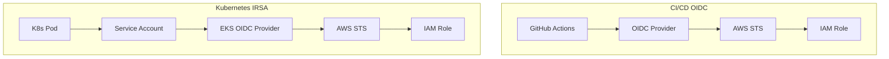

# OIDC & IRSA Patterns

## Overview

**OIDC** (OpenID Connect) enables keyless authentication between identity providers (GitHub, GitLab) and AWS. **IRSA** (IAM Roles for Service Accounts) extends this to Kubernetes pods on EKS.



## Key Benefits

| Traditional | OIDC/IRSA |
|------------|-----------|
| Long-lived access keys | Short-lived tokens (1 hour) |
| Manual rotation | Automatic rotation |
| Secrets in CI/CD | No secrets stored |
| Shared credentials | Per-workflow/pod identity |

## Best Practices

1. **Scope trust policies** - Restrict to specific repos/branches
2. **Use conditions** - Limit by environment, ref type
3. **Least privilege roles** - Minimal permissions per workflow
4. **Audit assume role events** - CloudTrail monitoring
5. **Separate roles** - Different roles for plan vs apply
6. **Tag-based conditions** - Additional security layer

---

## Example 1: Terraform - GitHub/GitLab OIDC Providers

Complete OIDC setup for CI/CD platforms.

📁 **Location**: [terraform/examples/oidc-irsa/](file:///home/nmosquerar/skills-repo/terraform/examples/oidc-irsa/)

### GitHub OIDC

```hcl
# GitHub OIDC Provider
resource "aws_iam_openid_connect_provider" "github" {
  url             = "https://token.actions.githubusercontent.com"
  client_id_list  = ["sts.amazonaws.com"]
  thumbprint_list = ["6938fd4d98bab03faadb97b34396831e3780aea1"]
}

# Role with scoped trust policy
resource "aws_iam_role" "github_actions" {
  name = "${local.name_prefix}-github-actions"

  assume_role_policy = jsonencode({
    Version = "2012-10-17"
    Statement = [{
      Effect = "Allow"
      Principal = {
        Federated = aws_iam_openid_connect_provider.github.arn
      }
      Action = "sts:AssumeRoleWithWebIdentity"
      Condition = {
        StringEquals = {
          "token.actions.githubusercontent.com:aud" = "sts.amazonaws.com"
        }
        StringLike = {
          # Scope to specific repo and ref
          "token.actions.githubusercontent.com:sub" = [
            "repo:${var.github_org}/${var.github_repo}:ref:refs/heads/main",
            "repo:${var.github_org}/${var.github_repo}:pull_request"
          ]
        }
      }
    }]
  })
}
```

### GitLab OIDC

```hcl
# GitLab OIDC Provider
resource "aws_iam_openid_connect_provider" "gitlab" {
  url             = "https://gitlab.com"
  client_id_list  = ["https://gitlab.com"]
  thumbprint_list = ["b3dd7606d2b5a8b4a13771dbecc9ee1cecafa38a"]
}

resource "aws_iam_role" "gitlab_ci" {
  name = "${local.name_prefix}-gitlab-ci"

  assume_role_policy = jsonencode({
    Version = "2012-10-17"
    Statement = [{
      Effect = "Allow"
      Principal = {
        Federated = aws_iam_openid_connect_provider.gitlab.arn
      }
      Action = "sts:AssumeRoleWithWebIdentity"
      Condition = {
        StringEquals = {
          "gitlab.com:aud" = "https://gitlab.com"
        }
        StringLike = {
          "gitlab.com:sub" = "project_path:${var.gitlab_group}/${var.gitlab_project}:*"
        }
      }
    }]
  })
}
```

---

## Example 2: CDK - IRSA for EKS Pods

Kubernetes pod identity with scoped IAM roles.

📁 **Location**: [cdk/examples/oidc-irsa/](file:///home/nmosquerar/skills-repo/cdk/examples/oidc-irsa/)

### Key Features

```typescript
// Create service account with IRSA
const serviceAccount = cluster.addServiceAccount('AppServiceAccount', {
  name: 'app-service-account',
  namespace: 'application',
});

// Scoped IAM policy for the pod
serviceAccount.addToPrincipalPolicy(new iam.PolicyStatement({
  effect: iam.Effect.ALLOW,
  actions: [
    's3:GetObject',
    's3:PutObject',
  ],
  resources: [`${dataBucket.bucketArn}/*`],
}));

serviceAccount.addToPrincipalPolicy(new iam.PolicyStatement({
  effect: iam.Effect.ALLOW,
  actions: ['secretsmanager:GetSecretValue'],
  resources: [appSecret.secretArn],
}));

// Pod spec using the service account
const deployment = {
  apiVersion: 'apps/v1',
  kind: 'Deployment',
  spec: {
    template: {
      spec: {
        serviceAccountName: serviceAccount.serviceAccountName,
        // AWS SDK will automatically use IRSA credentials
      }
    }
  }
};
```

---

## Trust Policy Conditions

### GitHub Actions Conditions

| Condition | Example | Use Case |
|-----------|---------|----------|
| `sub` with ref | `repo:org/repo:ref:refs/heads/main` | Only main branch |
| `sub` with PR | `repo:org/repo:pull_request` | All PRs |
| `sub` with environment | `repo:org/repo:environment:production` | GitHub environment |

### IRSA Conditions

| Condition | Example | Use Case |
|-----------|---------|----------|
| `sub` | `system:serviceaccount:namespace:sa-name` | Specific SA |
| `aud` | `sts.amazonaws.com` | Required for IRSA |

---

## Validation Checklist

- [ ] OIDC provider configured for each CI platform
- [ ] Trust policies scope to specific repos/branches
- [ ] Separate roles for plan vs apply
- [ ] IRSA enabled for EKS cluster
- [ ] Service accounts annotated with role ARN
- [ ] CloudTrail logging for AssumeRoleWithWebIdentity
- [ ] No static credentials in CI/CD or pods

## Related Skills

- [IAM Least Privilege](../iam-least-privilege/SKILL.md) - Scoped policies
- [GitOps Workflow](../gitops-workflow/SKILL.md) - CI/CD with OIDC
- [Modular IaC](../modular-iac/SKILL.md) - Reusable OIDC modules

---
> Converted and distributed by [TomeVault](https://tomevault.io/claim/nicolasmosquerar) — claim your Tome and manage your conversions.
<!-- tomevault:4.0:skill_md:2026-04-13 -->
