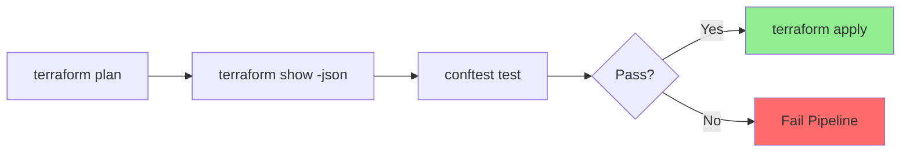

# Policy as Code

## Overview

Policy as Code validates infrastructure changes against security, compliance, and organizational rules **before** deployment. This prevents misconfigurations from reaching production.



## Policy Tools

| Tool | Language | Use Case |
|------|----------|----------|
| **OPA/Conftest** | Rego | Custom policies, Terraform |
| **Checkov** | Python/YAML | Security scanning, compliance |
| **tfsec** | Go | Terraform security |
| **SCPs** | JSON | AWS Organizations guardrails |

## Best Practices

1. **Fail early** - Run policies in CI before plan
2. **Version policies** - Treat as code, review changes
3. **Start permissive** - Warn first, then enforce
4. **Document exceptions** - Clear process for bypasses
5. **Layer policies** - OPA for custom, Checkov for security
6. **Test policies** - Unit tests for Rego rules

---

## Example 1: OPA/Conftest Policies for Terraform

Custom policies to enforce tagging, encryption, and access controls.

📁 **Location**: [policies/conftest/](file:///home/nmosquerar/skills-repo/policies/conftest/)

### Sample Policies

```rego
# policies/terraform/required_tags.rego
package terraform.required_tags

required_tags := ["Environment", "Owner", "Project", "CostCenter"]

deny[msg] {
  resource := input.resource_changes[_]
  resource.change.actions[_] == "create"
  
  # Check for required tags
  missing := required_tags - object.keys(resource.change.after.tags)
  count(missing) > 0
  
  msg := sprintf(
    "%s '%s' is missing required tags: %v",
    [resource.type, resource.name, missing]
  )
}
```

```rego
# policies/terraform/s3_encryption.rego
package terraform.s3_security

deny[msg] {
  resource := input.resource_changes[_]
  resource.type == "aws_s3_bucket"
  resource.change.actions[_] == "create"
  
  # Check for encryption
  not resource.change.after.server_side_encryption_configuration
  
  msg := sprintf("S3 bucket '%s' must have encryption enabled", [resource.name])
}

deny[msg] {
  resource := input.resource_changes[_]
  resource.type == "aws_s3_bucket"
  resource.change.actions[_] == "create"
  
  # Check for public access block
  not resource.change.after.block_public_acls
  
  msg := sprintf("S3 bucket '%s' must block public access", [resource.name])
}
```

### Running Policies

```bash
# Generate plan JSON
terraform plan -out=tfplan
terraform show -json tfplan > tfplan.json

# Run Conftest
conftest test tfplan.json -p policies/terraform/
```

---

## Example 2: Checkov for Security Scanning

Pre-built security checks with custom policies.

📁 **Location**: [policies/checkov/](file:///home/nmosquerar/skills-repo/policies/checkov/)

### Running Checkov

```bash
# Scan Terraform files
checkov -d terraform/ --framework terraform

# With custom policies
checkov -d terraform/ --external-checks-dir policies/checkov/

# Output for CI
checkov -d terraform/ -o junitxml > checkov-results.xml
```

### Custom Checkov Policy

```yaml
# policies/checkov/custom_rds_encryption.yaml
metadata:
  id: "CUSTOM_RDS_001"
  name: "Ensure RDS instances are encrypted"
  category: "ENCRYPTION"
  
definition:
  cond_type: "attribute"
  resource_types:
    - "aws_db_instance"
  attribute: "storage_encrypted"
  operator: "is_true"
```

---

## CI Integration

```yaml
# GitHub Actions example
- name: Terraform Plan
  run: |
    terraform plan -out=tfplan
    terraform show -json tfplan > tfplan.json

- name: Run Conftest
  run: conftest test tfplan.json -p policies/ --no-fail

- name: Run Checkov
  uses: bridgecrewio/checkov-action@master
  with:
    directory: terraform/
    framework: terraform
    soft_fail: false
```

---

## Validation Checklist

- [ ] OPA/Conftest policies for custom rules
- [ ] Checkov for security baseline
- [ ] Policies run in CI before apply
- [ ] Policy exceptions documented
- [ ] Policies version controlled
- [ ] Policy test coverage

## Related Skills

- [Compliance Tagging](../compliance-tagging/SKILL.md) - Tag policies
- [GitOps Workflow](../gitops-workflow/SKILL.md) - CI integration
- [IAM Least Privilege](../iam-least-privilege/SKILL.md) - IAM policies

---
> Converted and distributed by [TomeVault](https://tomevault.io/claim/nicolasmosquerar) — claim your Tome and manage your conversions.
<!-- tomevault:4.0:skill_md:2026-04-13 -->
