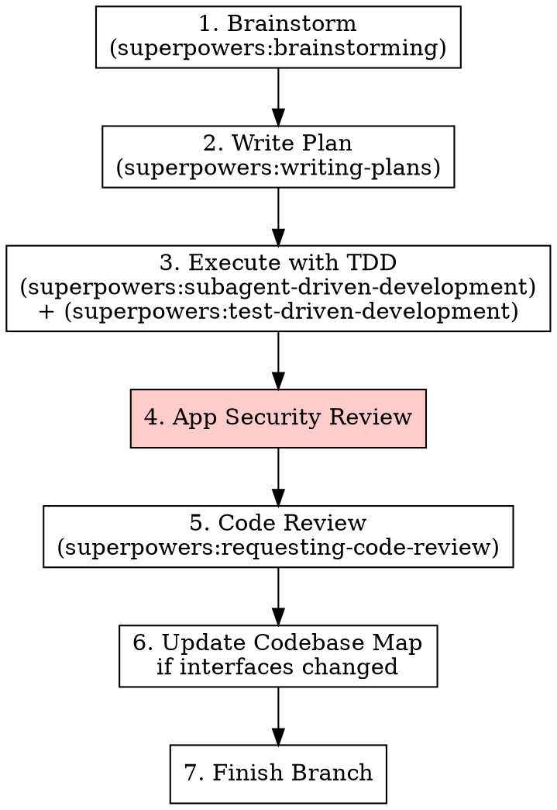

# Staff SWE — Application Development

## Overview

Application code gets tested. Every feature, every bugfix, every behavior change goes through TDD. After implementation, a security review catches OWASP issues before code review.

**This skill wraps test-driven-development (not replaces it) and adds a security gate.**

## When to Use

**Always when:**
- Writing application code, agents, services, APIs, or frontends
- The project CLAUDE.md says "use staff-swe"

**Never when:**
- Working on Terraform, Helm, or CI/CD (use staff-sre instead)

## Pipeline

## Steps 1-2: Scope & Plan

Use the `scope-refine` skill which combines scoping and planning into one persistent doc. The output includes scope (in/out, success criteria) and implementation tasks (files, verification steps, PR breakdown).

## Step 3: Execute with TDD

**Before writing any code:**
1. Create bd issues from the plan tasks: `~/.claude/hooks/bd-create-from-plan.sh <scope-doc-path>` (or `bd create` manually)
2. Verify issues and deps look right: `bd ready`

**Choose execution mode:**

- **Parallel (default for independent tasks):** Use the `execute-plan` skill. It dispatches one agent per ready issue in isolated worktrees, manages checkpoints between batches, and respects task dependencies. Best when the plan has multiple independent tasks across PRs.

- **Sequential (for tightly coupled tasks):** Claim the first ready task (`bd update <id> --claim`), then use `superpowers:test-driven-development`. Red-green-refactor. One task at a time.

- **Manual verification tasks:** Some tasks require on-prem testing, UI validation, or checking external systems. Agents implement and commit, but the human verifies. The checkpoint gate handles this — the agent reports what it did, and the human tests before closing the issue.

**After each task — CHECKPOINT (mandatory):**
1. Run verification (tests green, linter clean) — or note that manual verification is needed
2. Show the user: `git diff --stat`, test results, brief summary of what was done
3. **Wait for user acknowledgment before continuing.** Do not claim the next task until the user confirms.
4. If user flags an issue → fix it before proceeding
5. Only then: `bd close <id>` and check `bd ready` for what's unblocked next

## Step 4: App Security Review

**Before requesting code review, check:**

| Check | What to Look For |
|-------|-----------------|
| **Injection** | No string concatenation in SQL/shell/template commands. Use parameterized queries, prepared statements. |
| **Authentication** | Auth checks on every protected endpoint. No auth bypass via path manipulation. |
| **Secrets** | No hardcoded credentials, API keys, or tokens. All secrets from env vars or secret stores. |
| **Input validation** | User input validated at system boundaries. Reject unexpected types/sizes. |
| **Dependencies** | No known CVEs in direct dependencies. Pin versions, don't use `latest`. |
| **Error handling** | Errors don't leak stack traces, internal paths, or credentials to callers. |
| **Logging** | No PII or secrets in log output. Structured logging with appropriate levels. |

**Found an issue?** Fix it before code review. Security issues don't get deferred.

## Step 6: Update Codebase Map

If this work changed a module/service interface (new endpoints, changed exports, renamed functions):

1. Read `~/.claude/projects/<project-path>/CLAUDE.md`
2. Update the relevant entry in the Codebase Map
3. Keep concise — one-liner + key interfaces

**Skip if:** Only internal changes (no interface change).

## Step 7: Finish Branch

Use `superpowers:finishing-a-development-branch`. When submitting, use `$STACK_SUBMIT_CMD` from `~/.config/claude/workflow.env` if stacking PRs.

## Integration with Other Skills

| Skill | Status |
|-------|--------|
| brainstorming | **Use as-is** |
| writing-plans | **Use as-is** (TDD task structure) |
| test-driven-development | **Use as-is** — this is the core verification method |
| subagent-driven-development | **Use as-is** |
| verification-before-completion | **Use as-is** |
| requesting-code-review | **Use as-is** — after security review |
| finishing-a-development-branch | **Use as-is** — use `$STACK_SUBMIT_CMD` if available |

---
> Converted and distributed by [TomeVault](https://tomevault.io/claim/nilay-shah) — claim your Tome and manage your conversions.
<!-- tomevault:4.0:skill_md:2026-04-15 -->
