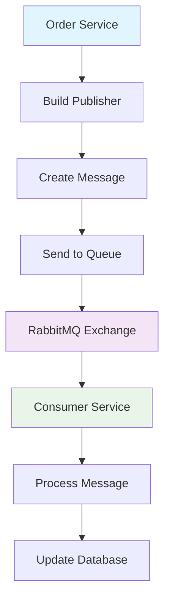
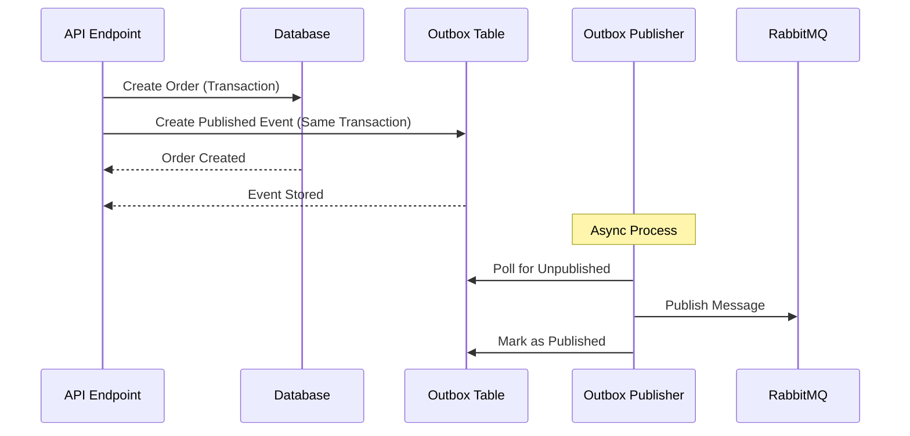
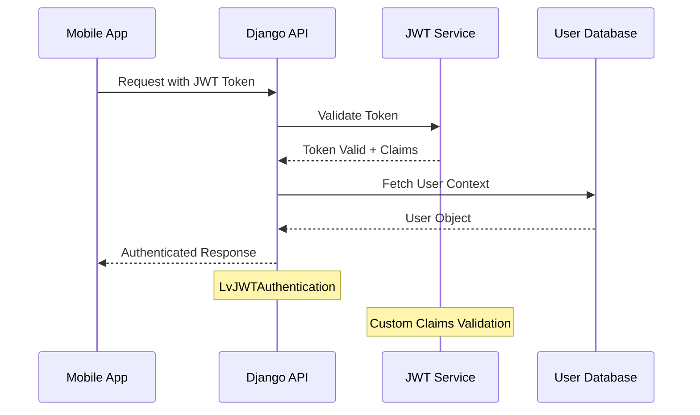
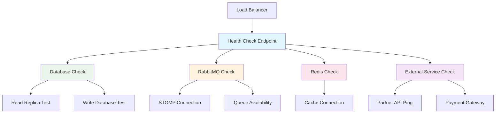
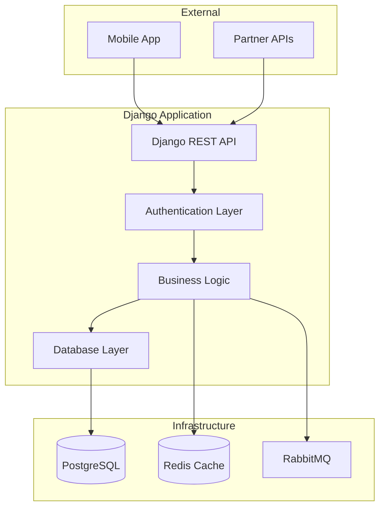
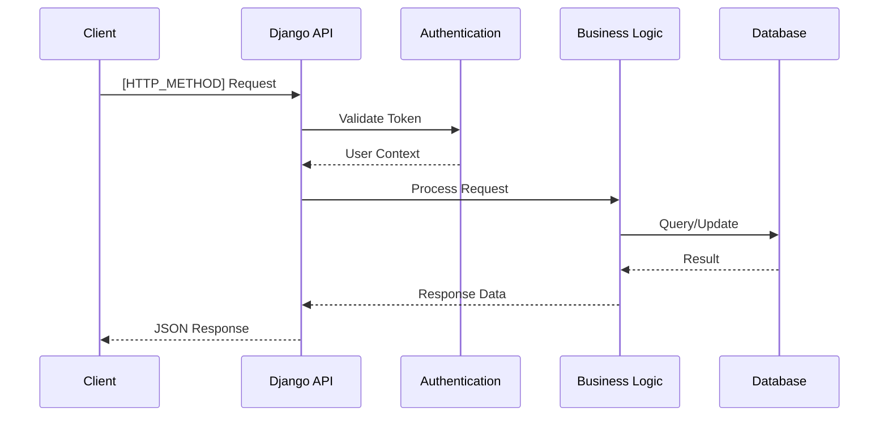

# Django Technical Documenter Skill

*Professional technical documentation with integrated diagrams for juntossomosmais Django applications*

## Purpose

This skill creates comprehensive, professional documentation for Django/Python applications, integrating visual diagrams with detailed technical content. Designed to work with `django-explorer` and `django-analyzer` to create complete project documentation.

## Core Capabilities

### Documentation Types

- **Architectural Documentation**: System overview, component relationships, design patterns
- **API Documentation**: Endpoint specifications, authentication flows, request/response examples  
- **Business Logic Documentation**: Complex workflows, business rules, validation patterns
- **Integration Documentation**: External services, messaging patterns, data flows
- **Deployment Documentation**: Environment setup, configuration, deployment procedures
- **Troubleshooting Guides**: Common issues, debugging procedures, error resolution

### Visual Integration  

- **Architecture Diagrams**: System components, service interactions, data flow
- **Sequence Diagrams**: API interactions, authentication flows, complex workflows
- **Flowcharts**: Business logic, decision trees, error handling
- **Mindmaps**: Knowledge organization, troubleshooting guides, feature planning
- **Technical Diagrams**: Database schemas, message flows, deployment architecture

### Content Generation

- **Code Examples**: Practical usage patterns, implementation samples, best practices
- **Configuration Guides**: Environment setup, service configuration, deployment options
- **API Specifications**: Complete endpoint documentation with examples and schemas
- **Architectural Decisions**: ADR format documentation with rationale and implications
- **Onboarding Documentation**: Developer guides, setup procedures, workflow explanations

## juntossomosmais Documentation Patterns

### STOMP Messaging Documentation

#### Legacy django-stomp Documentation

````markdown
# STOMP Messaging - Legacy Pattern

## Publisher Implementation

```python
from django_stomp.builder import build_publisher

# Create and configure publisher
publisher = build_publisher()

# Send message with transaction
@transaction.atomic
def send_order_update(order_id: int, status: str):
    message_body = {
        "order_id": order_id,
        "status": status,
        "timestamp": timezone.now().isoformat()
    }

    publisher.send(
        queue="/queue/order.updates",
        body=json.dumps(message_body),
        headers={"correlation_id": str(uuid.uuid4())}
    )
```

## Message Flow Diagram

````

#### Modern django-outbox-pattern Documentation

````markdown
# STOMP Messaging - Modern Outbox Pattern

## Implementation

```python
from django_outbox_pattern.models import Published
from django.db import transaction

@transaction.atomic
def create_order_with_event(order_data: dict):
    # Create order in database
    order = Order.objects.create(**order_data)

    # Create outbox event (will be published asynchronously)
    Published.objects.create(
        message_id=str(uuid.uuid4()),
        destination="/queue/order.created",
        body=json.dumps({
            "order_id": order.id,
            "customer_id": order.customer_id,
            "created_at": order.created_at.isoformat()
        }),
        headers={"event_type": "order.created"}
    )

    return order
```

## Outbox Pattern Flow

````

### Authentication Architecture Documentation

#### DRF Authentication Flow Documentation

````markdown
# Authentication Architecture

## Authentication Classes

### Customer Authentication (LvJWTAuthentication)
```python
from rest_framework_simplejwt.authentication import JWTAuthentication

class LvJWTAuthentication(JWTAuthentication):
    """
    Custom JWT authentication for customer requests.

    Features:
    - JWT token validation with custom claims
    - User context injection for permissions
    - Integration with customer service
    """

    def authenticate(self, request):
        header = self.get_header(request)
        if header is None:
            return None

        raw_token = self.get_raw_token(header)
        validated_token = self.get_validated_token(raw_token)
        user = self.get_user(validated_token)

        return (user, validated_token)
```

### Authentication Flow Diagram  

````

### Health Check Documentation

#### Health Check Architecture Documentation  

````markdown
# Health Check System

## Custom Health Checks

### Database Health Check
```python
from django_health_check.backends import BaseHealthCheckBackend

class CustomDatabaseHealthCheck(BaseHealthCheckBackend):
    """
    Enhanced database health check with connection testing.
    """

    def check_status(self):
        try:
            from django.db import connections

            # Test read connection
            with connections['replica'].cursor() as cursor:
                cursor.execute("SELECT 1")

            # Test write connection  
            with connections['default'].cursor() as cursor:
                cursor.execute("SELECT 1")

        except Exception as e:
            self.add_error(f"Database connection failed: {e}")
```

### Health Check Architecture

````

## Documentation Templates

### Application Architecture Template

````markdown
# [Application Name] - Architecture Documentation

## Overview
[Brief description of application purpose and scope]

## System Architecture



## Core Components

### Authentication & Authorization
- **Authentication Classes**: [List and describe]
- **Permission Classes**: [List and describe]  
- **Security Patterns**: [Describe security measures]

### Business Logic Modules
- **[Module Name]**: [Description and responsibilities]
- **[Module Name]**: [Description and responsibilities]

### Data Layer
- **Models**: [Key models and relationships]
- **Database Routing**: [Read/write split configuration]
- **Migrations**: [Migration strategy and considerations]

### Integration Layer
- **Message Queue**: [STOMP patterns and usage]
- **External APIs**: [Partner integrations]
- **Caching**: [Redis usage patterns]

## API Documentation

### Endpoints

#### Authentication Endpoints
[Document authentication-related endpoints]

#### Business Logic Endpoints  
[Document core business endpoints]

### API Flow Examples
[Include sequence diagrams for key API flows]

## Deployment & Operations

### Environment Configuration
[Document environment-specific settings]

### Health Checks
[Document health check implementation]

### Monitoring & Logging  
[Document observability setup]

## Development Guidelines

### Code Patterns
[Document juntossomosmais-specific patterns]

### Testing Strategy
[Document testing approach and patterns]

### Debugging & Troubleshooting
[Common issues and resolution steps]
````

### API Endpoint Template

````markdown
# [Endpoint Name] API Documentation

## Endpoint Details
- **URL**: `[HTTP_METHOD] /api/v1/[endpoint]/`
- **Authentication**: [Required authentication]
- **Permissions**: [Required permissions]

## Request

### Headers
```
Authorization: Bearer [JWT_TOKEN]
Content-Type: application/json
```

### Parameters
| Parameter | Type | Required | Description |
|-----------|------|----------|-------------|
| [param]   | string | Yes | [Description] |

### Request Body
```json
{
  "[field]": "[value]",
  "[field]": "[value]"
}
```

## Response

### Success Response (200 OK)
```json
{
  "status": "success",
  "data": {
    "[field]": "[value]"
  }
}
```

### Error Responses

#### 400 Bad Request
```json
{
  "status": "error",
  "message": "Validation failed",
  "errors": {
    "[field]": ["Error message"]
  }
}
```

## Implementation Flow



## Code Example

### View Implementation
```python
class [ViewName](APIView):
    authentication_classes = [LvJWTAuthentication]
    permission_classes = [IsAuthenticated]

    def [method](self, request):
        # Implementation logic
        pass
```

### Serializer
```python
class [SerializerName](serializers.ModelSerializer):
    class Meta:
        model = [Model]
        fields = [...]
```

## Usage Examples

### Python/Requests
```python
import requests

response = requests.[method](
    '[URL]',
    headers={
        'Authorization': 'Bearer [TOKEN]',
        'Content-Type': 'application/json'
    },
    json={[REQUEST_BODY]}
)
```

### cURL
```bash
curl -X [METHOD] '[URL]' \
  -H 'Authorization: Bearer [TOKEN]' \
  -H 'Content-Type: application/json' \
  -d '{[REQUEST_BODY]}'
```
````

## Advanced Documentation Features

### Interactive Diagrams

- **System Architecture**: Complete system overview with component relationships
- **Data Flow**: Request/response flows with transformation points
- **Integration Patterns**: External service integration patterns
- **Error Handling**: Exception flow and recovery mechanisms

### Code Documentation

- **Pattern Examples**: juntossomosmais-specific implementation patterns
- **Best Practices**: Coding standards and conventions
- **Performance Notes**: Optimization tips and considerations
- **Security Guidelines**: Security implementation and considerations

### Operational Documentation

- **Deployment Procedures**: Step-by-step deployment instructions
- **Configuration Management**: Environment-specific configuration
- **Monitoring Setup**: Observability and alerting configuration
- **Troubleshooting**: Problem diagnosis and resolution procedures

## Documentation Standards

### Structure Guidelines

- Clear hierarchical organization with consistent navigation
- Executive summary for high-level understanding
- Technical details with practical examples
- Visual diagrams for complex concepts
- Actionable troubleshooting steps

### Content Quality

- Accurate and up-to-date information
- Practical examples and use cases
- Clear explanations of business logic
- Comprehensive API documentation
- Visual flow diagrams for complex processes

### Maintenance Process

- Regular review and updates
- Version control integration
- Automated diagram generation where possible
- Feedback collection and incorporation
- Cross-reference validation and link checking

---

*"Transform complex Django architecture into clear, actionable documentation"*

---
> Source: [niltonfrederico/my-agents](https://github.com/niltonfrederico/my-agents) — distributed by [TomeVault](https://tomevault.io).
<!-- tomevault:4.0:skill_md:2026-06-15 -->
