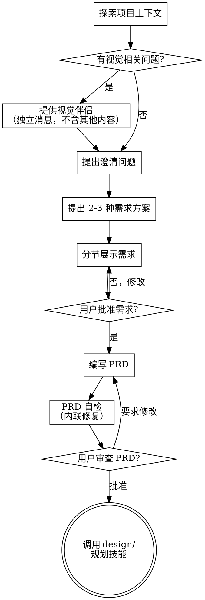

# 头脑风暴：将想法转化为需求

通过自然的协作对话，帮助将粗略想法转化为清晰、可执行的产品需求。

首先了解当前项目上下文，然后逐一提问来完善想法。目标是产出一份完整、无歧义的产品需求文档（PRD），回答构建什么（WHAT）和为什么构建（WHY）。如何构建（HOW）留给后续阶段。

<HARD-GATE>
本技能只关注需求（WHAT）。不得讨论技术架构、技术选型、代码结构、API 设计、数据库 schema、或任何实现细节。在 PRD 编写完成、审查通过并获得用户批准之前，不得调用任何实现技能、编写任何代码、搭建任何项目、或采取任何实现行动。无论项目看起来多简单，此规则一律适用。
</HARD-GATE>

## 反模式："这个太简单了，不需要 PRD"

每个项目都要经过这个流程。一个待办事项列表、一个单函数工具、一个配置变更——全都需要。"简单"的项目恰恰是未经检验的假设造成最多浪费的地方。PRD 可以很简短（对于真正简单的项目几句话就够了），但你必须写出来并获得批准。

## 检查清单

你必须为以下每个条目创建任务，并按顺序完成：

1. **探索项目上下文** — 检查文件、文档、最近的 commit 来了解已有内容
2. **提供视觉伴侣**（如果主题涉及视觉问题）— 这是一条独立的消息，不要与澄清问题合并。参见下方的"视觉伴侣"部分
3. **提出澄清问题** — 每次一个，了解目的、用户、约束、成功标准
4. **提出 2-3 种需求方案** — 不同的范围、功能优先级、或用户流程方案，附带权衡分析和你的推荐
5. **展示需求** — 按复杂度分节展示，每节展示后获得用户批准
6. **编写 PRD** — 保存到 `docs/prd/<topic>.md` 并 commit
7. **PRD 自检** — 快速内联检查占位符、矛盾、模糊性、范围（详见下方）
8. **用户审查 PRD** — 在继续之前请用户审查 PRD 文件
9. **过渡到设计** — 调用 design 或实现规划技能

## 流程图

**终止状态是调用 design 或实现规划技能。** 不要调用任何实现技能。头脑风暴之后你应该调用的是设计/规划技能。

## 流程详述

**理解想法：**

- 首先查看当前项目状态（文件、文档、最近的 commit）
- 在提出详细问题之前，先评估范围：如果需求描述了多个独立功能或用户旅程（例如"构建一个包含聊天、文件存储、计费和分析的平台"），立即指出这一点。不要花时间用问题去细化一个需要先拆分的项目。
- 如果项目规模过大，单个 PRD 无法覆盖，帮助用户分解为子项目：有哪些独立的部分，它们之间有什么关系，应该按什么顺序构建？然后通过正常的 PRD 流程进行第一个子项目的头脑风暴。每个子项目都有自己的 PRD。
- 对于范围适当的项目，每次提一个问题来完善想法
- 尽量使用选择题，开放式问题也可以
- 每条消息只提一个问题——如果一个主题需要更多探索，拆分成多个问题
- 重点理解：谁是用户、解决什么问题、成功是什么样、约束是什么

**探索需求方案：**

- 提出 2-3 种不同的需求方案。这些是产品/功能层面的方案，不是技术方案。例如：
  - 不同的范围级别（MVP vs 完整愿景 vs 分阶段推出）
  - 不同的用户流程或交互模型
  - 不同的功能优先级（哪些能力最重要）
  - 不同的目标用户或用例优先级
- 以对话的方式展示选项，附上你的推荐和理由
- 先展示你推荐的方案并解释原因

**展示需求：**

- 一旦你认为理解了需要什么，就展示需求
- 每个部分的篇幅与其复杂度匹配：简单的几句话，复杂的最多 200-300 字
- 每个部分展示后询问是否正确
- 涵盖：问题陈述、目标用户、用户故事/用例、功能需求、非功能需求（性能、可访问性、安全性）、验收标准、成功指标、不在范围内的事项
- 随时准备回头澄清不明确的地方

## PRD 结构

一份好的 PRD 应该清楚回答以下问题：

- **问题陈述：** 我们要解决什么问题？为谁解决？
- **目标用户：** 谁会使用这个功能？是否存在多种用户画像？
- **用户故事 / 用例：** 用户需要完成什么？用"作为[用户]，我希望[做什么]，以便[达成什么结果]"的格式来写。
- **功能需求：** 系统必须做什么？要具体且可测试。
- **非功能需求：** 性能预期、可访问性要求、安全考量、浏览器/设备支持。
- **验收标准：** 我们如何知道每个需求已经满足？使用具体的、可验证的陈述。
- **成功指标：** 上线后如何衡量这个功能是否成功？
- **不在范围内：** 我们明确不构建什么？这和要构建什么同样重要。

## PRD 之后

**文档：**

- 将验证通过的 PRD 写入 `docs/prd/<topic>.md`
- 如果可用，使用 elements-of-style:writing-clearly-and-concisely 技能
- 将 PRD commit 到 git

**PRD 自检：**
编写 PRD 文档后，以全新的视角审视它：

1. **占位符扫描：** 有没有"待定"、"TODO"、未完成的章节或模糊的需求？修复它们。
2. **内部一致性：** 需求之间有矛盾吗？用户故事和功能需求对齐吗？
3. **范围检查：** 这是否聚焦到可以用一个实现计划覆盖，还是需要进一步拆分？
4. **模糊性检查：** 有没有需求可以被两种方式理解？如果有，选择一种并明确写出来。
5. **可测试性检查：** 每个需求是否可验证？如果你无法描述如何测试它，这个需求就太模糊了。

发现问题就直接内联修复。无需重新审查——修好继续推进。

**用户审查关卡：**
PRD 自检完成后，请用户在继续之前审查书面 PRD：

> "PRD 已编写并 commit 到 `<path>`。请审查一下，如果在我们进入设计和实现之前你想做任何修改，请告诉我。"

等待用户回复。如果他们要求修改，做出修改并重新运行 PRD 自检。只有在用户批准后才继续。

**实现：**

- PRD 是下一阶段的输入：技术设计和实现规划。
- 不要直接跳到编码。根据项目情况调用合适的 design 或实现规划技能。

## 核心原则

- **每次一个问题** — 不要同时抛出多个问题
- **优先选择题** — 在可能的情况下比开放式问题更容易回答
- **严格遵循 YAGNI** — 从所有需求中移除不必要的功能
- **只关注 WHAT，绝不讨论 HOW** — 不涉及技术选型、架构、代码结构
- **增量验证** — 分节展示需求，获得批准后再继续
- **保持灵活** — 有不明确的地方就回头澄清
- **明确不在范围内是优点** — 明确不构建什么，能有效防止范围蔓延

## 视觉伴侣

一个基于浏览器的伴侣工具，用于在头脑风暴过程中展示原型、图表和视觉选项。它是一个工具——不是一种模式。接受伴侣意味着它可用于适合视觉呈现的问题；并不意味着每个问题都要通过浏览器。

**提供伴侣：** 当你预计后续问题会涉及视觉内容（原型、布局、用户流程）时，提供一次以获得同意：
> "我们接下来讨论的一些内容，如果能在浏览器中展示给你看可能会更直观。我可以在讨论过程中为你制作原型、图表、对比图和其他视觉材料。这个功能还比较新，可能会消耗较多 token。要试试吗？（需要打开一个本地 URL）"

**此提议必须是一条独立的消息。** 不要将它与澄清问题、上下文摘要或任何其他内容合并。消息中应该只包含上述提议，没有其他内容。等待用户回复后再继续。如果他们拒绝，继续纯文本的头脑风暴。

**逐问题决策：** 即使用户接受了，也要对每个问题单独决定是使用浏览器还是终端。判断标准：**用户看到它是否比读到它更容易理解？**

- **使用浏览器** 展示本身就是视觉的内容——原型、线框图、布局对比、用户流程图、并排功能对比
- **使用终端** 展示文字内容——需求问题、范围决策、用户故事讨论、验收标准、成功指标、优先级对话

关于 UI 主题的问题不一定是视觉问题。"引导流程应该完成什么？"是一个需求问题——使用终端。"引导向导的哪种布局感觉对？"是一个视觉问题——使用浏览器。

如果他们同意使用伴侣，在继续之前阅读详细指南：
`skills/brainstorming-cn/visual-companion.md`

---
> Source: [ninehills/public-skills](https://github.com/ninehills/public-skills) — distributed by [TomeVault](https://tomevault.io).
<!-- tomevault:4.0:skill_md:2026-07-01 -->
