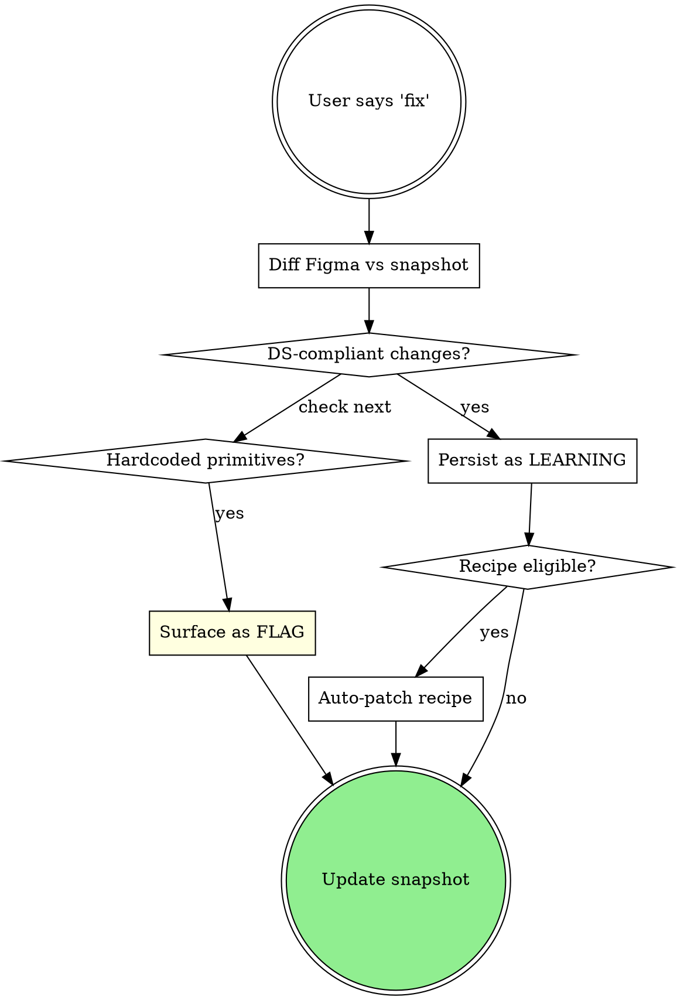

{{ACTIVE_RULES}}

# Learning From Corrections

## Overview

Closes the feedback loop from manual Figma edits back into Bridge's knowledge base. Diffs the live Figma state against the saved snapshot, classifies each correction as a **LEARNING** (DS-compliant → persisted) or a **FLAG** (hardcoded → surfaced), updates `learnings.json`, and auto-patches the active recipe when eligible.

## When to Use

Invoke when the user:
- says "I adjusted it", "I fixed it in Figma", "fix", "correct", or "learn from what I changed"
- has an active CSpec in `specs/active/` with a snapshot

Do NOT use if:
- there is no active CSpec — the user should `make` first (use `generating-figma-design`)
- the user wants to start fresh — use `generating-figma-design` with a new description
- the user wants to ship — use `shipping-and-archiving`

## Procedure

**Before starting, load:**
- `references/transport-adapter.md` (repo-root) — for Figma state re-read
- `references/compiler-reference.md` (repo-root) — for scene graph recompile (if re-executing after fix)

## Prerequisites

- Active CSpec in `specs/active/` (abort if missing: "No active CSpec. Run: `make <description>`")
- Snapshot file exists at `specs/active/{name}-snapshot.json` (abort if missing: "No snapshot found. The design must have been generated with `make`. Run `make` first.")
- Figma MCP transport available (see `references/transport-adapter.md` (repo-root) Section F)

---

### 1. Load artifacts

- Read the active CSpec from `specs/active/{name}.cspec.yaml`
- Read the snapshot from `specs/active/{name}-snapshot.json`
- Read existing learnings from `knowledge-base/learnings.json` (create empty structure if file doesn't exist)
- Load `knowledge-base/registries/variables.json` for token resolution

### 2. Re-extract current Figma state

Run a node tree extraction script via Plugin API execution, using the `rootNodeId` and `fileKey` from the snapshot's `meta`.

**Console transport:**
```
figma_execute({
  code: "return (async function() { ... extraction script with rootNodeId ... })();"
})
```

**Official transport:**
```
use_figma({
  fileKey: "{fileKey}",
  description: "Re-extract node tree for fix diff",
  code: "... extraction script without IIFE wrapper ..."
})
```

The extraction script walks the node tree and captures: `id`, `name`, `type`, `layoutMode`, `itemSpacing`, `padding*`, `cornerRadius`, `fills`, `boundVariables`, `width`, `height`, `componentKey`, `children`.

### 3. Diff snapshot vs current state

Compare the two JSON trees in context. Claude performs this comparison directly.

**Match strategy:**
- Match nodes by `id` (stable across edits)
- For each matched node, compare:
  - Layout: `layoutMode`, `itemSpacing`, `paddingTop/Bottom/Left/Right`
  - Visual: `cornerRadius`, `fills`, `boundVariables`
  - Size: `width`, `height`
  - Component: `componentKey` (detect swapped components)
- Detect **added nodes** (present in current, absent in snapshot)
- Detect **removed nodes** (present in snapshot, absent in current)
- Detect **property changes** (same node, different values)

**Ignore:**
- Pure name changes (layer renaming)
- Position changes (x, y) unless they indicate a structural move (re-parenting)

### 4. Classify changes

For each detected change:

```
Does the new value use a DS token (bound variable)?
  -> YES: Classify as LEARNING (DS-compliant correction)
  -> NO (hardcoded hex, raw px, unbound): Classify as FLAG (needs attention)
```

**Token resolution:** Check `boundVariables` in the current tree. If the property has a bound variable ID, resolve it against `registries/variables.json` to get the token name.

### 5. Save learnings

For each LEARNING-classified change:

1. **Determine context:**
   - `screenType`: from the CSpec's `meta.pattern` or `intent`
   - `component`: nearest component ancestor name, or the node's own name if it's a component instance
   - `section`: parent frame name (e.g., "header", "content", "sidebar")

2. **Check for existing learning:** Search `learnings.json` for a learning with matching `context` + `change.property` + `change.to.token`
   - If found: increment `signals`, append to `history`
   - If not found: create new learning entry

3. **Generate rule:** Write a human-readable rule describing the preference (e.g., "For settings screens, cards use spacing/medium (not large)")

4. **Check promotion:** After updating signals, check if any contextual learning qualifies for global promotion:
   - `signals >= 3`
   - Observations from >= 2 different `screenType` values
   - No contradiction (same property pointing to different tokens in different learnings)

### 6. Extract flags

For each FLAG-classified change:

1. Create a flag entry with the CSpec name, node description, and what was hardcoded
2. Add to `flags` array in `learnings.json`
3. Suggest the correct DS token if one exists: "Node {name} uses hardcoded {value}. Consider using {$token} instead."

### 7. Check recipe patch eligibility

If a recipe was used (check `snapshot.meta.recipe`):

1. Count the number of LEARNING signals from this fix cycle
2. If signals >= 2 for the same recipe context:
   - Load the recipe file
   - Patch the recipe's `graph` to reflect the learned changes
   - Increment recipe `version`, update `lastEvolvedAt`
   - Add entry to recipe `evolution_log`
   - Report: "Recipe {name} patched with {n} corrections (v{version})"

If a learning is promoted to **global** scope, scan ALL recipes and patch any where the change applies.

### 8. Update CSpec

If learnings were extracted (DS-compliant changes):
- Update the active CSpec's token references to match the corrected values
- This ensures the CSpec reflects the final intended design

### 9. Save learnings file

Write updated `learnings.json` to `knowledge-base/learnings.json`.
Update `meta.lastUpdated` to today's date.

### 10. Update snapshot

Re-save the snapshot with the current Figma state (so future `fix` runs diff against the latest corrections, not the original generation).

### 11. Report

```markdown
## Fix: {name}

### Changes detected: {total count}

### Learnings extracted: {count}
| # | Context | Property | From | To | Rule |
|---|---------|----------|------|----|------|
| 1 | settings / card | itemSpacing | spacing/large (24) | spacing/medium (16) | Cards in settings use medium spacing |

### Flags: {count}
| # | Node | Issue | Suggestion |
|---|------|-------|------------|
| 1 | StatusBadge | Hardcoded hex #FF5722 | Use $color/text/error/default |

### Recipe patches: {count}
- Recipe "{name}" v{version}: {description of patch}

### Promotions: {count}
- "{rule}" promoted to global (signals: {n}, screenTypes: {list})

### CSpec updated: {yes/no}
{list of CSpec changes if any}
```

### 12. Offer next step

```
Fix complete for {name}.

Learnings: {n} extracted ({n} new, {n} reinforced, {n} promoted)
Flags: {n} hardcoded values flagged
Recipe: {patched | not applicable}

Options:
  - Continue editing in Figma, then run `fix` again
  - "done" to archive and ship
```

---

## Transition

- If user wants to continue editing -> they can run `fix` again after more changes
- When satisfied -> suggest: "Run: `done`" (handled by `shipping-and-archiving`)

<HARD-GATE>
Every correction MUST be classified before `learnings.json` is written.
Unclassified changes are a gate failure.

Every LEARNING MUST reference a token from the current
`registries/variables.json` / `registries/text-styles.json`. A
LEARNING that points to a non-existent token is a gate failure.

Every FLAG MUST be surfaced to the user before saving the snapshot.
</HARD-GATE>

## Red Flags

See the full catalog at `references/red-flags-catalog.md` (repo-root).

Top flags for this skill:
- "I'll store this hardcoded hex as a LEARNING for later" → **Flags are for DS gaps; hardcoded values are FLAGs, not learnings.**
- "I can tell what changed without re-reading Figma" → **Always re-read Figma. Memory is not a snapshot.**

## Verification

This skill is gated by `references/verification-gates.md` (repo-root):

- **Gate A** — only applies if the fix recompiles the scene graph (rare, optional).
- **Gate B** — applies if the fix re-executes in Figma.

Evidence to surface: diff summary, classification table, updated `learnings.json` diff.

---

## The fix flow (decision diagram)



---
> Source: [noemuch/bridge](https://github.com/noemuch/bridge) — distributed by [TomeVault](https://tomevault.io).
<!-- tomevault:4.0:skill_md:2026-06-18 -->
