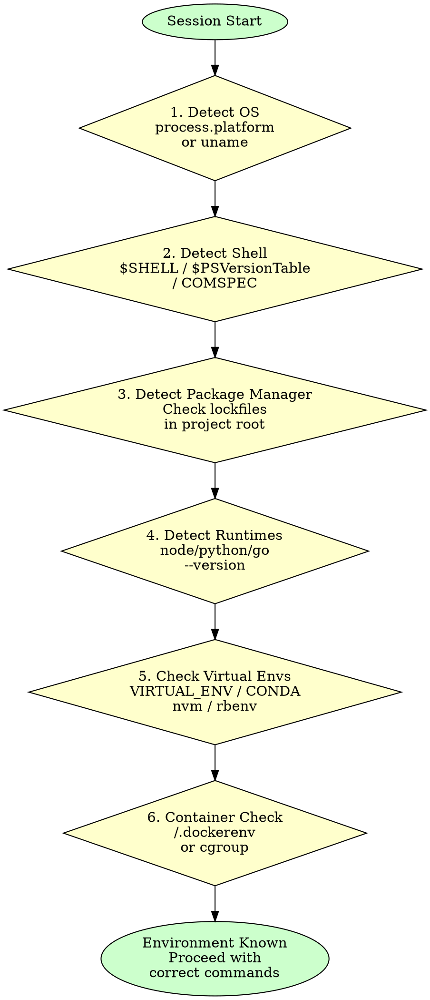

# Environment Awareness

## Overview

The most common AI agent failure mode: running Linux commands on Windows, using npm when the project uses pnpm, ignoring active virtual environments. Every wrong command wastes time and can cause real damage.

**Core principle:** DETECT the environment before issuing ANY shell command. One probe now prevents ten failed commands later.

**No exceptions. No workarounds. No shortcuts.**

## The Prime Directive

```
NO SHELL COMMANDS WITHOUT KNOWING THE TARGET ENVIRONMENT
```

If you have not confirmed OS, shell, and package manager, you are not authorized to run commands.

## When to Use

**Mandatory at session start:**
- First interaction in any new conversation
- Switching to a different project or repository
- After entering a container, VM, or remote machine

**Also required when:**
- A command fails with "not found" or "not recognized"
- Installing dependencies or running build scripts
- Writing platform-specific code (file paths, process management, networking)
- Diagnosing "works on my machine" problems

**Do not skip when:**
- You think you already know the environment (verify, do not assume)
- The user mentions their OS casually (confirm shell and toolchain too)
- Working in CI/CD (runners have different environments than local machines)

## The Entry Protocol

```
BEFORE running any shell command:

1. PLATFORM: Have you confirmed OS and architecture?
2. SHELL: Do you know which shell is interpreting your commands?
3. PACKAGE MANAGER: Have you checked for lockfiles?
4. RUNTIMES: Do you know which language runtimes are available?
5. VIRTUAL ENV: Are there active virtual environments or version managers?

If any answer is NO: probe first, command second.
```

## Detection Flowchart



## Detection Checklist

Run this sequence once per session. Results inform every subsequent command.

### 1. Operating System

| Method | Works On | Command |
|--------|----------|---------|
| Environment variable | Claude Code / Node | Check `process.platform` in tool context |
| uname | Linux, macOS, Git Bash | `uname -s` |
| System info | Windows (any shell) | `systeminfo` or `ver` |

**Key distinctions:**
- `win32` = Windows (regardless of 32/64-bit)
- `darwin` = macOS
- `linux` = Linux or WSL (check further with `grep -i microsoft /proc/version` for WSL)

### 2. Shell

**NEVER assume bash.** Windows alone has CMD, PowerShell, Git Bash, and WSL.

| Check | Command | Reveals |
|-------|---------|---------|
| Shell variable | `echo $SHELL` | Default shell (Unix) |
| PowerShell test | `$PSVersionTable` | PowerShell version |
| Process name | `echo $0` | Current shell (Unix) |
| COMSPEC | `echo %COMSPEC%` | CMD path (Windows) |

**Critical:** On Windows, the Claude Code / AI agent shell context is often Git Bash, but the user's terminal may be PowerShell. Commands you generate for the user to copy must match THEIR shell.

### 3. Package Manager

**Detection priority -- check lockfiles first:**

| Lockfile | Package Manager |
|----------|----------------|
| `bun.lockb` or `bun.lock` | bun |
| `pnpm-lock.yaml` | pnpm |
| `yarn.lock` | yarn |
| `package-lock.json` | npm |

**If no lockfile found:**
1. Check `packageManager` field in `package.json`
2. Check for global install: `which pnpm || which yarn || which bun`
3. Default to npm only as last resort

**For non-JS projects:**
| File | Manager |
|------|---------|
| `Pipfile.lock` | pipenv |
| `poetry.lock` | poetry |
| `uv.lock` | uv |
| `requirements.txt` | pip |
| `go.sum` | go modules |
| `Cargo.lock` | cargo |
| `Gemfile.lock` | bundler |

### 4. Runtime Versions

Probe on first use, not eagerly. Only check what the project actually needs.

```
node --version      # Node.js
python3 --version   # Python (use python3, not python, on macOS/Linux)
go version          # Go
rustc --version     # Rust
java --version      # Java
ruby --version      # Ruby
```

### 5. Virtual Environments

| Signal | Indicates |
|--------|-----------|
| `$VIRTUAL_ENV` is set | Python venv/virtualenv active |
| `$CONDA_DEFAULT_ENV` is set | Conda environment active |
| `.python-version` file | pyenv version pinned |
| `.nvmrc` or `.node-version` file | Node version pinned |
| `.ruby-version` file | rbenv/rvm version pinned |
| `.tool-versions` file | asdf version manager |

**When a version manager is detected:** Use its commands (`nvm use`, `pyenv shell`) instead of assuming the global runtime is correct.

### 6. Container Detection

| Check | Inside Container? |
|-------|-------------------|
| `/.dockerenv` exists | Docker |
| `grep -q container /proc/1/cgroup 2>/dev/null` | Docker/Podman |
| `$container` env var is set | Podman |
| `printenv KUBERNETES_SERVICE_HOST` | Kubernetes pod |

## System Inventory

After confirming the platform and shell, discover what tools, databases, cloud CLIs, and services the user has installed. This inventory feeds directly into planning -- if the user has SQLite but not PostgreSQL, or Docker but not Podman, downstream skills like `deployment-advisor` and `task-planning` can make smarter recommendations instead of guessing.

### When to Run

- **Always:** Git, GitHub CLI (needed by many GodMode skills)
- **If the project touches data:** Database CLIs
- **If the project will be deployed:** Cloud and container tools
- **If the project processes media or structured data:** ffmpeg, jq, curl
- **Never run the full list blindly.** Match checks to project type. A static site does not need a MongoDB probe.

### Inventory Checks

Run each relevant check silently, redirecting stderr so missing tools do not produce noise:

**Databases:**

| Tool | Check | Notes |
|------|-------|-------|
| PostgreSQL | `psql --version 2>/dev/null` | Check for `pg_dump` too if backups matter |
| MySQL / MariaDB | `mysql --version 2>/dev/null` | MariaDB identifies itself in the version string |
| SQLite | `sqlite3 --version 2>/dev/null` | Often pre-installed on macOS and Linux |
| MongoDB | `mongod --version 2>/dev/null` | Also check `mongosh` for the modern shell |
| Redis | `redis-server --version 2>/dev/null` | Also check `redis-cli` |

**Cloud & Hosting CLIs:**

| Tool | Check |
|------|-------|
| AWS CLI | `aws --version 2>/dev/null` |
| Google Cloud | `gcloud --version 2>/dev/null` |
| Azure CLI | `az --version 2>/dev/null` |
| Vercel | `vercel --version 2>/dev/null` |
| Supabase | `supabase --version 2>/dev/null` |
| Fly.io | `fly version 2>/dev/null` |
| Netlify | `netlify --version 2>/dev/null` |
| Railway | `railway --version 2>/dev/null` |

**Container Tools:**

| Tool | Check |
|------|-------|
| Docker | `docker --version 2>/dev/null` |
| Docker Compose | `docker compose version 2>/dev/null` |
| Podman | `podman --version 2>/dev/null` |

**Developer Tools:**

| Tool | Check |
|------|-------|
| Git | `git --version 2>/dev/null` |
| GitHub CLI | `gh --version 2>/dev/null` |
| curl | `curl --version 2>/dev/null` |
| jq | `jq --version 2>/dev/null` |
| ffmpeg | `ffmpeg -version 2>/dev/null` |

### Reporting Format

Report findings concisely. Do not dump raw version output -- extract the version number and summarize:

```
Available: PostgreSQL 16.2, Docker 27.1, gh 2.45, SQLite 3.43
Not found: Redis, AWS CLI, Podman
```

### Principles

1. **Silence errors and force exit code 0.** Always redirect stderr to `/dev/null` AND append `; true` at the end of chained version checks. Missing tools produce non-zero exit codes that surface as red errors in Claude Code. A missing tool is information, not a failure — the output must never show red.
   ```bash
   # WRONG: last missing tool causes exit 127 (red error in Claude Code)
   psql --version 2>/dev/null; redis-server --version 2>/dev/null; mongod --version 2>/dev/null

   # RIGHT: force clean exit regardless of which tools are missing
   psql --version 2>/dev/null; redis-server --version 2>/dev/null; mongod --version 2>/dev/null; true
   ```
2. **Scope to project.** Only check categories relevant to the codebase. Read the project's config files, Dockerfile, CI config, or deployment manifests to decide what matters.
3. **Check once, reference often.** Store results in your working context. Do not re-probe mid-session unless the user installs something new.
4. **Feed downstream skills.** The inventory directly informs `deployment-advisor` (what can we deploy to?), `task-planning` (what constraints exist?), and `project-bootstrap` (what do we need to install?).

## Platform-Specific Command Mappings

Use the correct command for the detected environment:

| Operation | Linux/macOS | Windows CMD | Windows PowerShell | Git Bash on Windows |
|-----------|-------------|-------------|-------------------|-------------------|
| List files | `ls -la` | `dir` | `Get-ChildItem` | `ls -la` |
| Find process | `ps aux \| grep` | `tasklist` | `Get-Process` | `ps aux \| grep` |
| Set env var | `export VAR=val` | `set VAR=val` | `$env:VAR = "val"` | `export VAR=val` |
| Null device | `/dev/null` | `NUL` | `$null` | `/dev/null` |
| Path separator | `:` | `;` | `;` | `:` |
| Delete file | `rm file` | `del file` | `Remove-Item file` | `rm file` |
| Find files | `find . -name` | `dir /s /b` | `Get-ChildItem -Recurse` | `find . -name` |
| Check port | `lsof -i :PORT` | `netstat -an` | `Get-NetTCPConnection` | `netstat -an` |

## When to Probe vs Assume

| Category | Action | Reason |
|----------|--------|--------|
| OS | ALWAYS probe | Affects every command's syntax |
| Shell | ALWAYS probe | Determines quoting, piping, redirection |
| Package manager | ALWAYS probe | Wrong manager corrupts lockfile |
| Runtime versions | Probe on first use | Only matters when running that runtime |
| Virtual environments | Probe when relevant | Wrong env installs to wrong location |
| Container | Probe when behavior is unexpected | Containers lack many host tools |

## Cognitive Traps

| Rationalization | What Is Actually True |
|----------------|----------------------|
| "It's probably Linux" | 30% of developers use Windows. macOS is another 25%. Probe first. |
| "bash is universal" | Windows CMD and PowerShell have fundamentally different syntax. Git Bash exists but is not guaranteed. |
| "npm is the default" | Using npm in a pnpm project corrupts the lockfile and breaks CI. |
| "I'll fix it if the command fails" | A failed `rm -rf` with wrong path syntax can still delete data. Failed installs leave broken state. |
| "The user said Windows, so PowerShell" | Could be CMD, Git Bash, WSL, or Cygwin. Confirm the shell, not just the OS. |
| "CI and local are the same" | CI runners use different OS, different shell, different tool versions. Probe there too. |

## Guardrails -- HALT and Detect

Stop and run detection if you catch yourself:

- Running `ls` without knowing if the shell supports it
- Using `/dev/null` without confirming Unix-like shell
- Running `npm install` without checking for other lockfiles
- Using `python` instead of `python3` without version checking
- Assuming `~` expands correctly (it does not in CMD)
- Writing path strings with `/` without confirming OS
- Using `grep` flags without confirming GNU vs BSD
- Piping commands without knowing if the shell supports `|`

**Every item on this list means: halt command execution. Probe first.**

## Integration

**Complementary skills:**
- **godmode:project-bootstrap** -- Environment detection runs during project setup
- **godmode:fault-diagnosis** -- Environment mismatch is a common root cause of mysterious failures
- **godmode:workspace-isolation** -- Worktree and container setup needs correct platform commands
- **godmode:deployment-advisor** -- System inventory results feed directly into deployment recommendations and platform selection

## The Bottom Line

```
One detection probe now > ten failed commands later
```

Know the OS. Know the shell. Know the package manager. Before the first command. Every single session.

---
> Source: [NoobyGains/godmode](https://github.com/NoobyGains/godmode) — distributed by [TomeVault](https://tomevault.io).
<!-- tomevault:4.0:skill_md:2026-06-28 -->
