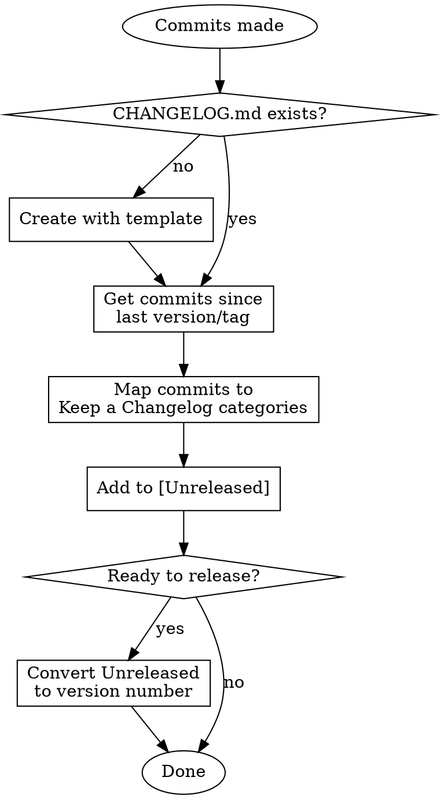

---
name: writing-changelog
description: Use when updating CHANGELOG.md after commits, before releases, or when user asks to document changes. Triggers on commit completion or explicit changelog requests.
---

# Writing Changelog

## Overview

Generate and maintain changelogs following [Keep a Changelog](https://keepachangelog.com) format by parsing git commit history.

## When to Use

- After significant commits (feat, fix, breaking changes)
- Before creating a release or PR
- User explicitly requests changelog update
- **NOT for:** style, chore (deps), or internal tooling commits alone

## Workflow



## Commit to Category Mapping

| Commit Type | Changelog Category | Notes |
|-------------|-------------------|-------|
| `feat:` | **Added** | New features |
| `fix:` | **Fixed** | Bug fixes |
| `fix!:` / `BREAKING CHANGE` | **Changed** + **Removed** | Breaking changes |
| `perf:` | **Changed** | Performance improvements |
| `security:` / security deps | **Security** | Security fixes |
| `deprecate:` | **Deprecated** | Deprecated features |
| `remove:` | **Removed** | Removed features |
| `refactor:` | *Skip or Changed* | Only if user-visible |
| `style:`, `chore:`, `docs:`, `test:`, `ci:` | **Skip** | Not user-facing |

**Critical:** `style:` commits are NOT "Fixed". Only actual bug fixes go in Fixed.

## Changelog Template

```markdown
# Changelog

All notable changes to this project will be documented in this file.

The format is based on [Keep a Changelog](https://keepachangelog.com/en/1.1.0/),
and this project adheres to [Semantic Versioning](https://semver.org/spec/v2.0.0.html).

## [Unreleased]

## [1.0.0] - YYYY-MM-DD

### Added
- Feature description (not commit message verbatim)

### Changed
### Deprecated
### Removed
### Fixed
### Security

[Unreleased]: https://github.com/user/repo/compare/v1.0.0...HEAD
[1.0.0]: https://github.com/user/repo/releases/tag/v1.0.0
```

## Entry Writing Rules

1. **Group related commits** into single entries (don't list each commit)
2. **Write for users**, not developers - describe the change's impact
3. **Use present tense** imperative: "Add X" not "Added X" or "Adds X"
4. **Include scope** if helpful: "Add fingerprint tracking to auth module"
5. **Skip internal changes** - CI, tests, style, docs (unless user-facing)

### Good vs Bad Entries

| Bad (commit dump) | Good (user-facing) |
|-------------------|-------------------|
| "feat(auth): add fp tracking" | "Add device fingerprint tracking for enhanced security" |
| "fix: resolve bug in session" | "Fix rate limiting bypass in session management" |
| "chore: update deps" | *Skip unless security-related* |

## Version Bumping

Only bump version when releasing. Use [Unreleased] for ongoing work.

| Change Type | Version Bump |
|-------------|--------------|
| Breaking changes (`!`, `BREAKING CHANGE`) | **MAJOR** (1.0.0 → 2.0.0) |
| New features (`feat:`) | **MINOR** (1.0.0 → 1.1.0) |
| Bug fixes only (`fix:`) | **PATCH** (1.0.0 → 1.0.1) |

## Commands to Run

```bash
# Get commits since last tag
git log $(git describe --tags --abbrev=0 2>/dev/null || echo "")..HEAD --oneline

# Get commits since specific version
git log v1.0.0..HEAD --oneline

# Get all commits if no tags exist
git log --oneline
```

## Common Mistakes

| Mistake | Fix |
|---------|-----|
| Listing every commit | Group into meaningful features |
| `style:` → Fixed | Skip style commits entirely |
| `chore: update deps` → Changed | Skip unless security-related |
| Skipping [Unreleased] | Always use Unreleased until release |
| Missing compare links | Add links at file bottom |
| Version bump on every update | Only bump when releasing |

## Red Flags - STOP

- About to copy commit messages verbatim
- Categorizing `style:` or `chore:` as Fixed/Changed
- Creating version without asking user first
- Skipping the [Unreleased] section
- Forgetting compare links at file bottom

## After Writing Checklist

- [ ] Used [Unreleased] for ongoing work (not immediate version)
- [ ] Skipped style/chore/docs/test/ci commits
- [ ] Grouped related commits into single entries
- [ ] Wrote user-facing descriptions (not commit messages)
- [ ] Added compare links at bottom for each version
- [ ] Asked user before bumping version

---
> Converted and distributed by [TomeVault](https://tomevault.io/claim/nuri35) — claim your Tome and manage your conversions.
<!-- tomevault:4.0:skill_md:2026-04-16 -->
