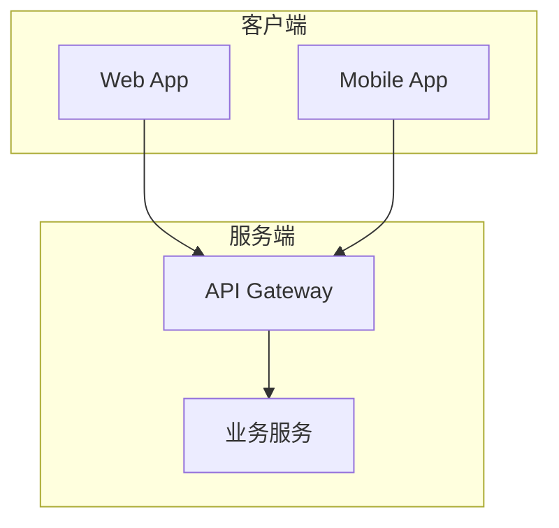
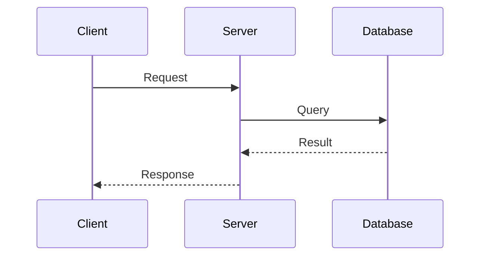

# 技术方案设计 Skill

帮助用户编写规范、完整的技术方案设计文档。

## 触发场景

当用户：
- 明确要求编写技术方案/技术设计文档
- 需要对复杂功能进行架构设计
- 要求进行方案对比和技术选型
- 需要输出可评审的技术文档

## 核心原则

1. **先理解，后设计** - 充分理解需求背景再动手
2. **简洁优先** - 避免过度设计，只写必要内容
3. **可执行性** - 方案必须可落地，避免空泛描述
4. **可评审性** - 文档结构清晰，便于他人评审

## 工作流程

### Phase 1: 需求收集

**必须收集的信息：**

| 类别 | 问题 |
|------|------|
| 背景 | 为什么要做这个？解决什么问题？ |
| 目标 | 期望达成什么效果？如何衡量成功？ |
| 约束 | 有哪些技术/时间/资源限制？ |
| 范围 | 哪些在范围内？哪些明确不做？ |

**收集方式：**
- 阅读现有代码和文档了解上下文
- 使用 `question` 工具向用户提问
- 如果用户已提供 PRD/需求文档，优先从中提取

### Phase 2: 方案设计

**设计要点：**

1. **架构设计**
   - 识别核心模块和边界
   - 明确模块间的依赖关系
   - 使用 Mermaid 绘制架构图

2. **流程设计**
   - 梳理关键业务流程
   - 使用时序图展示交互
   - 标注异常处理路径

3. **方案对比**（如有多个可选方案）
   - 列出各方案优缺点
   - 给出推荐方案及理由

### Phase 3: 文档输出

使用模板 `assets/技术方案设计.md` 生成文档。

**文档结构：**

```
术语表（可选）
一、背景
二、目标
三、方案
  - 方案描述
  - 整体架构
  - 业务流程
  - 方案对比（可选）
四、核心模块设计
五、风险与应对
六、排期（可选）
七、附录
```

### Phase 4: 评审与迭代

- 输出初稿后询问用户反馈
- 根据反馈进行针对性修改
- 确保所有评审意见都被处理

## Mermaid 图表规范

**架构图 - 使用 flowchart：**


**时序图 - 展示交互流程：**


**注意事项：**
- 方括号内避免使用双引号和括号
- 节点命名简洁，使用英文标识符
- 中文标签放在方括号内

## 输出要求

1. **文件位置**: 项目根目录或 `/docs` 目录
2. **文件名**: `技术方案设计.md` 或 `技术方案设计-{功能名}.md`
3. **语言**: 文档用中文，代码和技术术语用英文

## 质量检查清单

完成文档后自检：

- [ ] 背景和目标是否清晰？
- [ ] 架构图是否准确反映设计？
- [ ] 核心流程是否有时序图说明？
- [ ] 风险是否识别并有应对方案？
- [ ] 文档是否可以直接用于评审？

---
> Converted and distributed by [TomeVault](https://tomevault.io/claim/oianthony) — claim your Tome and manage your conversions.
<!-- tomevault:4.0:skill_md:2026-04-13 -->
