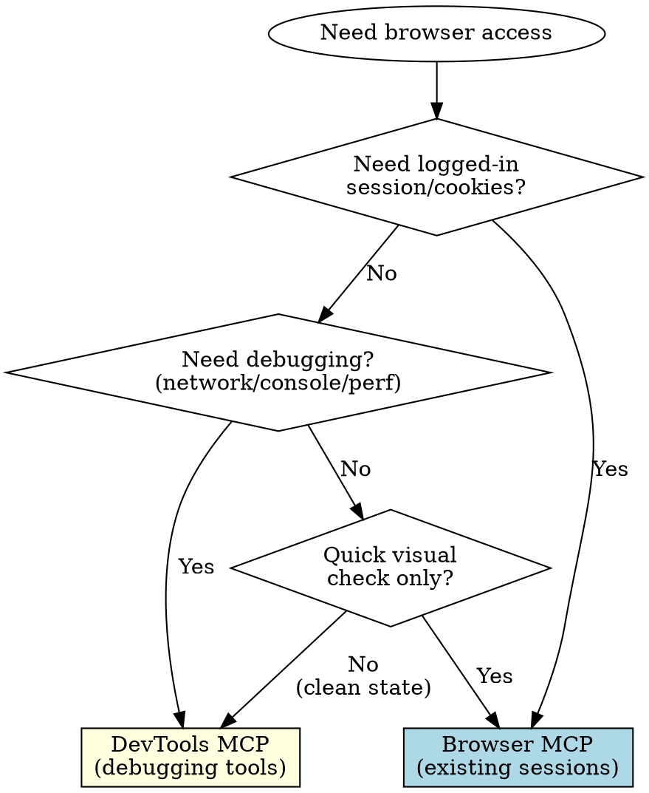

# Browser Inspection

## Overview

Two browser MCP servers are available with different strengths. This skill helps choose the right one based on your needs.

## Critical Rule

**Authentication trumps debugging features.**

DevTools opens a FRESH browser session - it has NO access to the user's existing tabs, cookies, or login state. If the page requires authentication:
- DevTools will show a login page, not the user's logged-in view
- You MUST use Browser MCP first, even if you want debugging features
- Browser MCP has basic console logs - use those when login is required

## When to Use

Use this skill when:
- User says "check the browser", "look at the browser", "inspect the page"
- You need to debug frontend/UI issues
- You need to see what's displayed in the browser
- You need to interact with a web page

## Decision Flowchart

## Quick Decision Matrix

| Scenario | Use | Why |
|----------|-----|-----|
| See logged-in state | Browser MCP | Connects to existing sessions |
| Debug console errors | DevTools | Better console message tools with filtering |
| Inspect network requests | DevTools | Has network request inspection |
| Performance profiling | DevTools | Has performance trace tools |
| Quick visual check | Browser MCP | Simpler, faster setup |
| Test in clean state | DevTools | Fresh session, no cookies/login |
| Interact with user's open tab | Browser MCP | Sees existing tabs |
| Evaluate JavaScript in page | DevTools | Has `evaluate_script` tool |
| Emulate mobile/slow network | DevTools | Has emulation capabilities |

## MCP Guidelines

For detailed usage of each MCP, see:
- [Browser MCP Guidelines](./browser-mcp.md) - For existing sessions and quick checks
- [DevTools MCP Guidelines](./devtools-mcp.md) - For debugging and performance analysis

## Default Recommendation

**Start with Browser MCP** if:
- You need to see something the user is looking at
- The page requires authentication
- You just need a quick snapshot

**Start with DevTools MCP** if:
- You're debugging an error on a PUBLIC page (no login required)
- You need to inspect network requests or console logs
- You need to test in a clean environment

## Common Mistakes

❌ "Debug console errors on logged-in app" → picks DevTools
✅ Use Browser MCP - DevTools can't access the logged-in session

❌ Thinking DevTools can "connect to" the user's session
✅ DevTools always opens a fresh session - no cookies, no login

❌ Prioritizing "better debugging tools" over session access
✅ Authentication requirement is the first decision point - it overrides everything

---
> Converted and distributed by [TomeVault](https://tomevault.io/claim/omril321) — claim your Tome and manage your conversions.
<!-- tomevault:4.0:skill_md:2026-04-11 -->
