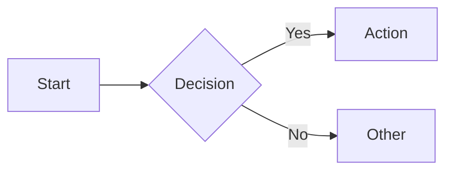
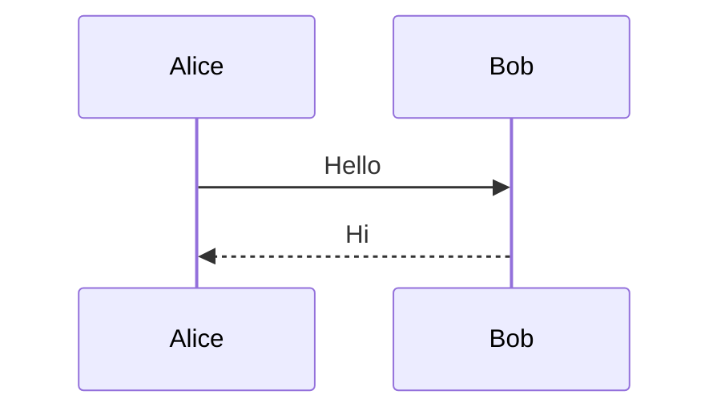

# Slidev Presentations

Create and edit markdown-based presentations using Slidev syntax.

**Before writing slides**: Read **references/style-and-tone.md** for storytelling principles and presentation philosophy.

## When to Use

- Creating new slide decks from topics/outlines
- Editing existing `slides.md` files
- Adding animations, code highlighting, or diagrams to presentations
- User mentions "slidev", "sli.dev", or "presentation slides"
- Creating **story-driven** presentations with clear narrative arcs

## Quick Reference

| Category | Features | Reference |
|----------|----------|-----------|
| **Core** | Slide separators, headmatter, frontmatter, notes | [syntax-basics.md](./references/syntax-basics.md) |
| **Layouts** | 19 built-in layouts, two-cols, image layouts | [layouts.md](./references/layouts.md), [slots.md](./references/slots.md) |
| **Animations** | v-click, v-motion, transitions, ghost preview | [animations.md](./references/animations.md) |
| **Code** | Highlighting, Monaco editor, TwoSlash | [code-highlighting.md](./references/code-highlighting.md) |
| **Code Advanced** | Magic Move, code groups, Monaco diff | [magic-move.md](./references/magic-move.md), [code-groups.md](./references/code-groups.md), [monaco-diff.md](./references/monaco-diff.md) |
| **Diagrams** | Mermaid, PlantUML | [mermaid.md](./references/mermaid.md), [plantuml.md](./references/plantuml.md) |
| **Math** | LaTeX equations and notation | [latex.md](./references/latex.md) |
| **Components** | Arrow, Link, Toc, Tweet, Youtube, Video | [components.md](./references/components.md) |
| **Styling** | UnoCSS, scoped CSS, themes | [styling.md](./references/styling.md) |
| **Layout Tools** | Transform, zoom, draggable, global layers | [transform.md](./references/transform.md), [zoom.md](./references/zoom.md), [draggable.md](./references/draggable.md), [global-layers.md](./references/global-layers.md) |
| **Canvas** | Aspect ratio, dimensions | [canvas-size.md](./references/canvas-size.md) |
| **Composition** | Importing slides, frontmatter merging, MDC | [importing-slides.md](./references/importing-slides.md), [frontmatter-merging.md](./references/frontmatter-merging.md), [mdc.md](./references/mdc.md) |
| **Export** | PDF, PPTX, PNG, static build | [exporting.md](./references/exporting.md) |
| **CLI** | Commands, installation, project structure | [cli.md](./references/cli.md) |

## Quick Start

### New Presentation

0. Follow **references/project-bootstrap.md** for project setup
1. Create `slides.md` with headmatter (deck-wide config)
2. Use `---` with blank lines to separate slides
3. Add layouts, animations, and code as needed

### Edit Existing

1. Read the existing `slides.md`
2. Preserve headmatter and existing structure
3. Make targeted edits

## Core Syntax

### Slide Separators

Use `---` with blank lines before and after:

```markdown
# Slide 1

Content here

---

# Slide 2

More content
```

### Headmatter (First Block)

Deck-wide configuration at the very top:

```yaml
---
theme: seriph
title: My Presentation
author: Your Name
transition: slide-left
fonts:
  sans: "Poppins"
  provider: "google"
---
```

### Fonts Configuration

Configure custom fonts from Google Fonts in headmatter:

```yaml
fonts:
  sans: "Poppins" # Body text font
  serif: "Robot Slab" # Serif font (optional)
  mono: "Fira Code" # Code font (optional)
  provider: "google" # Load from Google Fonts
```

**Preferred font: Poppins** - Use the Poppins font family as the default sans-serif font for presentations.

### Per-Slide Frontmatter

Configure individual slides:

```yaml
---
layout: center
background: /image.png
class: text-white
---
```

### Speaker Notes

Add as HTML comments at end of slide:

```markdown
# My Slide

Content here

<!--
Speaker notes go here.
Supports **markdown**.
-->
```

## Layouts Quick Reference

| Layout            | Use For                | Key Props                  |
| ----------------- | ---------------------- | -------------------------- |
| `default`         | General content        | -                          |
| `center`          | Centered content       | -                          |
| `cover`           | Title/first slide      | -                          |
| `end`             | Final slide            | -                          |
| `two-cols`        | Side-by-side           | Use `::right::`            |
| `two-cols-header` | Header + two cols      | Use `::left::` `::right::` |
| `image-right`     | Image right, text left | `image: /path.png`         |
| `image-left`      | Image left, text right | `image: /path.png`         |
| `section`         | Section divider        | -                          |
| `quote`           | Quotations             | -                          |
| `fact`            | Statistics/key data    | -                          |
| `statement`       | Bold statements        | -                          |

See [layouts.md](./references/layouts.md) for all 19 layouts with examples.

### Two-Column Example

```markdown
---
layout: two-cols
---

# Left Side

Content on left

::right::

# Right Side

Content on right
```

### Image Layout Example

```markdown
---
layout: image-right
image: /diagram.png
---

# Title

Explanation on the left
```

## Animations

### v-click (Reveal on Click)

```html
<v-click>Appears on click</v-click>

<div v-click>Also works as directive</div>

<div v-click="3">Appears on 3rd click</div>
```

### v-clicks (Animate List Items)

```html
<v-clicks>

- Item 1
- Item 2
- Item 3

</v-clicks>
```

### v-after (With Previous)

```html
<div v-click>First</div>
<div v-after>Appears with First</div>
```

### Hide on Click

```html
<div v-click.hide>Visible initially, hides on click</div>
```

### Click Ranges

```html
<div v-click="[2, 4]">Visible from click 2 to 4</div>
```

### Ghost Preview (Show Hidden as Faded)

Override default hiding to show upcoming content as faint preview. See [animations.md](./references/animations.md) for CSS.

## Code Blocks

### Basic Syntax Highlighting

````markdown
```ts
const hello = "world";
```
````

### Line Highlighting

````markdown
```ts {2,3}
const a = 1;
const b = 2; // highlighted
const c = 3; // highlighted
```
````

### Animated Line Highlighting

Use `|` to step through highlights on click:

````markdown
```ts {2|3|4}
const a = 1;
const b = 2; // click 1
const c = 3; // click 2
const d = 4; // click 3
```
````

### Magic Move (Animated Code Transitions)

Animate between code blocks:

`````markdown
````md magic-move
```ts
const count = 1
```
```ts
const count = ref(1)
```
````
`````

See [magic-move.md](./references/magic-move.md) for full documentation.

### Code Groups (Tabbed)

````markdown
```bash [npm]
npm install slidev
```

```bash [yarn]
yarn add slidev
```
````

See [code-groups.md](./references/code-groups.md) for details.

## Mermaid Diagrams

````markdown

````

With configuration:

````markdown

````

Supported types: `graph`, `sequenceDiagram`, `classDiagram`, `stateDiagram-v2`, `erDiagram`, `gantt`, `pie`, `gitGraph`

See [mermaid.md](./references/mermaid.md) and [plantuml.md](./references/plantuml.md) for more diagram options.

## User Comments

Users may leave inline comments in slides for you to address later. The format is:

```markdown
[comment content]::
```

**Examples:**

- `[fix this]::` - Generic fix needed
- `[needs screenshot]::` - Add an image here
- `[split into two slides]::` - Restructure this content

**Workflow:**

1. When you encounter comments, extract ALL to a list first
2. Address each comment systematically
3. Remove the comment marker after addressing

## Common Mistakes

| Mistake                          | Fix                                            |
| -------------------------------- | ---------------------------------------------- |
| Missing blank lines around `---` | Add blank line before AND after separator      |
| Using `v-if` for animations      | Use `v-click`, not Vue's `v-if`                |
| Wrong slot syntax                | Use `::right::` not `#right` or `slot="right"` |
| Frontmatter not at top           | First `---` block must be headmatter           |
| Code highlight without braces    | Use ` ```ts {2,3} ` not ` ```ts 2,3 `          |
| Trailing content visible during v-clicks | Wrap content after `<v-clicks>` lists in `<v-click>` |

## CLI Commands

| Command                       | Purpose                       |
| ----------------------------- | ----------------------------- |
| `slidev`                      | Start dev server              |
| `slidev --open`               | Start and open browser        |
| `slidev export`               | Export to PDF                 |
| `slidev export --with-clicks` | PDF with click steps as pages |
| `slidev build`                | Build static SPA              |

See [cli.md](./references/cli.md) for all commands and [exporting.md](./references/exporting.md) for export options.

## References

### Setup & Philosophy
- [project-bootstrap.md](./references/project-bootstrap.md) - Project setup checklist (Node version, VS Code settings)
- [style-and-tone.md](./references/style-and-tone.md) - Storytelling principles, tone, and presentation philosophy

### Core Features
- [syntax-basics.md](./references/syntax-basics.md) - Slide separators, headmatter, frontmatter, notes
- [layouts.md](./references/layouts.md) - All 19 built-in layouts
- [animations.md](./references/animations.md) - v-click, v-motion, transitions
- [components.md](./references/components.md) - Arrow, Link, Toc, Transform, etc.

### Code Features
- [code-highlighting.md](./references/code-highlighting.md) - Syntax highlighting, Monaco, TwoSlash
- [magic-move.md](./references/magic-move.md) - Animated code transitions
- [code-groups.md](./references/code-groups.md) - Tabbed code blocks
- [monaco-diff.md](./references/monaco-diff.md) - Side-by-side code comparison

### Diagrams & Math
- [mermaid.md](./references/mermaid.md) - Mermaid diagram types
- [plantuml.md](./references/plantuml.md) - UML diagrams
- [latex.md](./references/latex.md) - Mathematical notation

### Layout & Positioning
- [slots.md](./references/slots.md) - Named slots for layouts
- [transform.md](./references/transform.md) - Scale/rotate content
- [zoom.md](./references/zoom.md) - Zoom content
- [draggable.md](./references/draggable.md) - Drag-to-position elements
- [global-layers.md](./references/global-layers.md) - Persistent overlays
- [canvas-size.md](./references/canvas-size.md) - Aspect ratio control

### Advanced Composition
- [importing-slides.md](./references/importing-slides.md) - Include slides from other files
- [frontmatter-merging.md](./references/frontmatter-merging.md) - Frontmatter inheritance
- [mdc.md](./references/mdc.md) - MDC syntax for components

### Styling & Export
- [styling.md](./references/styling.md) - UnoCSS, scoped CSS, themes
- [exporting.md](./references/exporting.md) - PDF, PPTX, PNG export
- [cli.md](./references/cli.md) - CLI commands, installation

### External
- **Official docs**: https://sli.dev
- **LLM-optimized docs**: https://sli.dev/llms-full.txt

---
> Converted and distributed by [TomeVault](https://tomevault.io/claim/omril321) — claim your Tome and manage your conversions.
<!-- tomevault:4.0:skill_md:2026-04-13 -->
