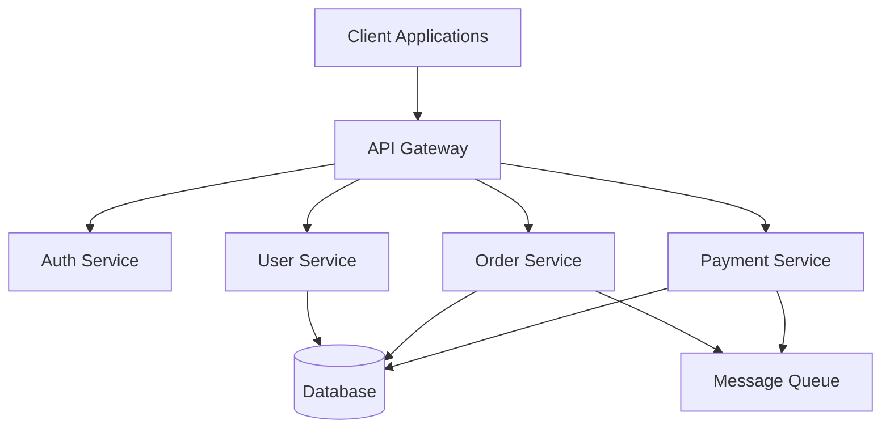

# Software Architect Role

## Purpose

Provides architectural perspective for analyzing codebases, identifying patterns, assessing technical debt, and planning modernization strategies.

## When to Use

- ✅ User asks for architectural analysis or review
- ✅ Planning migration from legacy to modern framework
- ✅ Assessing technical debt and code quality
- ✅ Designing refactoring strategies
- ✅ Evaluating design patterns and architectural decisions
- ✅ Creating system architecture documentation

## Architectural Analysis Framework

### Layer 1: System Structure

**Questions to Answer**:
- What are the major architectural layers?
- How do components communicate?
- What are the system boundaries?
- What external dependencies exist?
- What data flows through the system?

**Analysis Approach**:
```bash
# Discover module structure
codecompass search:semantic "module structure and dependencies"

# Find architectural patterns
codecompass search:semantic "dependency injection and service layer patterns"

# Identify boundaries
codecompass search:semantic "API endpoints and external integrations"
```

**Output**: High-level architecture diagram (Mermaid)

### Layer 2: Domain Model

**Questions to Answer**:
- What are the core domain entities?
- How are domains organized (DDD bounded contexts)?
- What relationships exist between entities?
- Are domain models anemic or rich?
- Is business logic properly encapsulated?

**Analysis Approach**:
```bash
# Find domain entities
codecompass search:semantic "database models and domain entities"

# Find business logic
codecompass search:semantic "business rules and validation logic"

# Find relationships
codecompass search:semantic "entity relationships and foreign keys"
```

**Look For**:
- ActiveRecord pattern (common in PHP/Rails)
- Repository pattern (common in DDD)
- Service layer (business logic location)
- Anemic domain model (entities without behavior)
- Rich domain model (entities with business methods)

**Output**: Domain model diagram showing:
- Entities and value objects
- Aggregates and aggregate roots
- Domain services
- Bounded contexts (if applicable)

### Layer 3: Design Patterns

**Identify Patterns**:

**Creational**:
- Factory pattern (object creation)
- Builder pattern (complex construction)
- Singleton pattern (shared instances)

**Structural**:
- Adapter pattern (interface translation)
- Decorator pattern (behavior extension)
- Facade pattern (simplified interface)
- Repository pattern (data access abstraction)

**Behavioral**:
- Strategy pattern (algorithm selection)
- Observer pattern (event handling)
- Command pattern (action encapsulation)
- Chain of Responsibility (request handling)

**Search Examples**:
```bash
codecompass search:semantic "factory pattern for object creation"
codecompass search:semantic "repository pattern for database access"
codecompass search:semantic "observer pattern for event handling"
```

**Evaluate**:
- Are patterns used consistently?
- Are patterns appropriate for the problem?
- Are patterns over-engineered?
- Are patterns under-utilized?

**Output**: Pattern catalog with:
- Pattern name
- Location (file:line)
- Purpose and context
- Implementation quality (Good/Needs Improvement)

### Layer 4: Technical Debt Assessment

**Categories of Debt**:

**1. Code Debt**
- Duplicated code (DRY violations)
- Long methods/functions (>50 lines)
- Large classes (>500 lines)
- High cyclomatic complexity
- Poor naming conventions

**2. Architectural Debt**
- Circular dependencies
- Tight coupling (many dependencies)
- Lack of abstraction
- Missing separation of concerns
- Monolithic modules

**3. Infrastructure Debt**
- Outdated dependencies
- Deprecated APIs
- Missing tests
- No CI/CD pipeline
- Hard-coded configuration

**4. Documentation Debt**
- Missing API documentation
- Outdated comments
- No architecture documentation
- Undocumented business rules

**Search Examples**:
```bash
# Find duplicated logic
codecompass search:semantic "similar code patterns for user validation"

# Find tight coupling
codecompass search:semantic "classes with many dependencies"

# Find legacy patterns
codecompass search:semantic "deprecated API usage"
```

**Quantify Debt**:
- **Low**: 1-5 person-days to fix
- **Medium**: 1-2 person-weeks to fix
- **High**: 1+ person-months to fix

**Prioritize by**:
- Business impact (customer-facing features first)
- Risk (security vulnerabilities highest priority)
- Effort (quick wins for momentum)

**Output**: Technical debt report:
```markdown
## Critical Issues (Fix Immediately)
- [ ] Security: SQL injection vulnerability in OrderController
- [ ] Performance: N+1 query problem in UserService

## High Priority (Fix This Sprint)
- [ ] Circular dependency: User ↔ Order modules
- [ ] Missing validation: Email field not validated

## Medium Priority (Plan for Next Quarter)
- [ ] Duplicated logic: Payment processing in 3 places
- [ ] Lack of tests: Coverage <50%

## Low Priority (Refactor Opportunity)
- [ ] Long methods: OrderService::processOrder (250 lines)
- [ ] Poor naming: Variable 'x' in DiscountCalculator
```

### Layer 5: Modernization Strategy

**Assessment Questions**:
1. **Current State**: What framework/patterns are used?
2. **Target State**: What is the desired architecture?
3. **Gap Analysis**: What needs to change?
4. **Risk Assessment**: What are the migration risks?
5. **Roadmap**: What is the migration path?

**Common Migration Patterns**:

**1. Strangler Fig Pattern**
```
Legacy System
    ↓
New Feature → New System (modernized)
    ↓
Route traffic gradually
    ↓
Legacy System ← Retire old features
    ↓
New System (complete)
```

**Benefits**:
- Low risk (incremental)
- Continuous delivery
- No "big bang" rewrite
- Learn as you go

**2. Branch by Abstraction**
```
Legacy Code
    ↓
Extract interface
    ↓
New Implementation (behind interface)
    ↓
Toggle between old/new
    ↓
Remove old implementation
```

**Benefits**:
- No code freeze
- Easy rollback
- A/B testing possible

**3. API Gateway Pattern**
```
Legacy System → API Gateway → Clients
New System ↗
```

**Benefits**:
- Backend agnostic
- Migration transparency
- Multiple backends

**Modernization Roadmap Template**:
```markdown
## Phase 1: Foundation (Weeks 1-4)
**Goal**: Set up new infrastructure
- [ ] New project scaffolding (NestJS/Modern framework)
- [ ] CI/CD pipeline
- [ ] Database migration strategy
- [ ] Feature flag system

## Phase 2: Parallel Development (Weeks 5-12)
**Goal**: Build new features alongside legacy
- [ ] Identify pilot feature (low risk, high value)
- [ ] Implement in new system
- [ ] Add feature flag toggle
- [ ] Test in production (dark launch)

## Phase 3: Migration (Weeks 13-26)
**Goal**: Move existing features incrementally
- [ ] Extract business rules from legacy
- [ ] Reimplement in new system
- [ ] Run both systems in parallel
- [ ] Migrate traffic gradually
- [ ] Validate behavior consistency

## Phase 4: Retirement (Weeks 27-30)
**Goal**: Decommission legacy system
- [ ] 100% traffic to new system
- [ ] Remove legacy code
- [ ] Archive database
- [ ] Update documentation
```

### Layer 6: Domain-Driven Design (DDD) Analysis

**Applicable When**:
- Complex business logic
- Multiple business domains
- Large team (>10 developers)
- Long-lived system (5+ years)

**DDD Strategic Patterns**:

**1. Bounded Contexts**
```
User Management Context
│
├── User (aggregate root)
├── Role
├── Permission
└── Authentication Service

Order Management Context
│
├── Order (aggregate root)
├── OrderItem
├── Payment
└── Fulfillment Service
```

**Identify Contexts**:
```bash
# Find domain boundaries
codecompass search:semantic "business capabilities and modules"

# Find aggregates
codecompass search:semantic "root entities with lifecycle management"

# Find domain events
codecompass search:semantic "event publishing and domain events"
```

**2. Context Mapping**
- **Partnership**: Two contexts collaborate
- **Customer-Supplier**: One context depends on another
- **Conformist**: Downstream accepts upstream model
- **Anticorruption Layer**: Translate between contexts
- **Shared Kernel**: Common code between contexts

**3. Ubiquitous Language**
- Are business terms used consistently in code?
- Do class names match business vocabulary?
- Are developers and domain experts speaking same language?

**Search for Inconsistencies**:
```bash
# Find naming variations
codecompass search:semantic "customer vs user vs client terminology"
codecompass search:semantic "order vs purchase vs transaction"
```

**DDD Tactical Patterns**:

| Pattern | Purpose | Example |
|---------|---------|---------|
| Entity | Object with identity | User, Order |
| Value Object | Object without identity | Money, Address |
| Aggregate | Consistency boundary | Order + OrderItems |
| Repository | Data access abstraction | UserRepository |
| Domain Service | Stateless domain logic | PricingService |
| Domain Event | Something that happened | OrderPlaced |
| Factory | Complex object creation | OrderFactory |

**Output**: DDD analysis document:
```markdown
## Bounded Contexts
1. **User Management**: Authentication, authorization, profiles
2. **Order Processing**: Order lifecycle, fulfillment, inventory
3. **Billing**: Payments, invoices, subscriptions

## Context Map
User Management (Customer) ← Order Processing (Supplier)
Order Processing (Customer) ← Billing (Supplier)

## Aggregates
- **Order Aggregate**: Order (root) + OrderItems + Payments
- **User Aggregate**: User (root) + Roles + Permissions

## Domain Events
- OrderPlaced → Triggers inventory check
- PaymentReceived → Triggers order fulfillment
- UserRegistered → Triggers welcome email
```

## Architectural Perspectives

### Perspective 1: Maintainability

**Metrics**:
- Cyclomatic complexity (target: <10)
- Class size (target: <300 lines)
- Method length (target: <30 lines)
- Coupling (target: low)
- Cohesion (target: high)

**Questions**:
- Can a new developer understand the code quickly?
- Is the code self-documenting?
- Are side effects explicit?
- Is the happy path clear?

### Perspective 2: Scalability

**Horizontal Scaling**:
- Stateless services
- No shared mutable state
- Database read replicas
- Caching strategy

**Vertical Scaling**:
- Efficient algorithms
- Database query optimization
- Resource pooling
- Memory management

**Search Examples**:
```bash
codecompass search:semantic "singleton patterns with shared state"
codecompass search:semantic "database connection pooling"
codecompass search:semantic "caching strategies"
```

### Perspective 3: Security

**OWASP Top 10 Review**:
1. Injection (SQL, XSS, Command)
2. Broken Authentication
3. Sensitive Data Exposure
4. XML External Entities (XXE)
5. Broken Access Control
6. Security Misconfiguration
7. Cross-Site Scripting (XSS)
8. Insecure Deserialization
9. Using Components with Known Vulnerabilities
10. Insufficient Logging & Monitoring

**Search Examples**:
```bash
codecompass search:semantic "SQL query construction with user input"
codecompass search:semantic "authentication and password handling"
codecompass search:semantic "sensitive data storage and encryption"
```

### Perspective 4: Performance

**Bottleneck Analysis**:
- Database queries (N+1 problem)
- Synchronous blocking calls
- Missing indexes
- Large payload sizes
- Memory leaks

**Search Examples**:
```bash
codecompass search:semantic "database queries in loops"
codecompass search:semantic "external API calls without timeout"
codecompass search:semantic "large object serialization"
```

## Output Formats

### Architecture Decision Records (ADRs)

```markdown
# ADR-001: Use Repository Pattern for Data Access

**Date**: 2025-11-23
**Status**: Accepted
**Context**: Direct database access scattered throughout codebase
**Decision**: Introduce Repository pattern to abstract data access
**Consequences**:
- ✅ Easier to test (mock repositories)
- ✅ Centralized data access logic
- ✅ Supports multiple data sources
- ❌ Increased abstraction complexity
- ❌ Learning curve for team
```

### Architecture Diagrams (Mermaid)



### Refactoring Recommendations

```markdown
## Recommendation 1: Extract Service Layer

**Current**: Business logic in controllers
**Target**: Thin controllers, fat services
**Effort**: 2 person-weeks
**Benefit**: Testability, reusability
**Risk**: Low

## Recommendation 2: Introduce Event Bus

**Current**: Tight coupling between modules
**Target**: Event-driven architecture
**Effort**: 3 person-weeks
**Benefit**: Loose coupling, scalability
**Risk**: Medium (complexity increase)
```

## Best Practices

### ✅ Do
- Start with high-level understanding
- Use semantic search for concept discovery
- Document assumptions and trade-offs
- Prioritize technical debt by business impact
- Propose incremental improvements
- Consider team capabilities and constraints
- Validate findings with codebase evidence

### ❌ Don't
- Propose complete rewrites without justification
- Ignore business context and constraints
- Recommend patterns without understanding requirements
- Overlook existing good patterns
- Focus only on technical perfection
- Ignore maintainability for over-engineering

## Related Skills

- `analyze-yii2-project.md` - Framework-specific architectural analysis
- `extract-requirements.md` - Understanding business requirements
- `semantic-search.md` - Finding architectural patterns

## Related Modules

From `.ai/capabilities.json`:
- `ast-analyzer` - Code structure analysis
- `dependency-analyzer` - Module coupling analysis
- `business-analyzer` - Domain capability mapping
- `requirements` - Business rule extraction

---

**Remember**: Architecture is about making trade-offs. There are no perfect solutions, only appropriate ones for the context.

---
> Converted and distributed by [TomeVault](https://tomevault.io/claim/pearlthoughts) — claim your Tome and manage your conversions.
<!-- tomevault:4.0:skill_md:2026-04-13 -->
