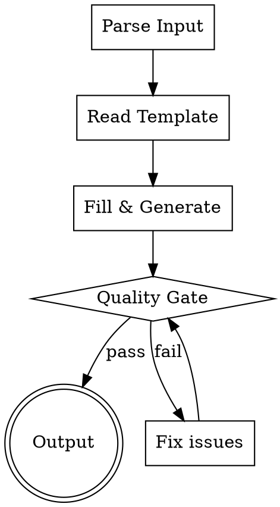

# 编写 Agent 文件

## 概述

根据用户输入生成符合最佳实践的 Claude Code agent 定义文件（`.claude/agents/*.md`）。

**核心原则：** 每个 agent 必须有完整的 frontmatter 和清晰的角色定义，否则无法被 Claude 正确调度。

## The Iron Law

```
NO AGENT FILE WITHOUT COMPLETE FRONTMATTER AND VALIDATED DESCRIPTION
```

没有完整 frontmatter 的 agent 文件不会被 Claude 发现。没有有效 description 的 agent 不会被正确调度。

## Process Flow



## Step 1: 解析输入

从用户消息中提取以下参数。未明确的参数根据上下文推断合理默认值，不与用户交互。

| 参数 | 推断规则 |
|------|---------|
| name | 从用户描述中提取，转 kebab-case |
| description | 从用户意图推导，以 "Use when..." 开头 |
| tools | 未指定则不填（继承所有工具） |
| model | 未指定则不填（继承） |
| permissionMode | 未指定则不填 |
| maxTurns | 未指定则不填 |
| skills | 未指定则不填 |
| mcpServers | 未指定则不填 |
| disallowedTools | 未指定则不填 |
| role | 从用户描述提取核心角色 |
| behavior | 从用户描述提取行为指令 |

## Step 2: 读取模板

读取 `templates/agent-template.md`，获取标准结构。

## Step 3: 填充生成

将解析的参数填充到模板中，生成完整的 agent 文件内容。

**Body 写作要求：**
- 以角色定义开头："You are a ..."
- 包含清晰的行为指令（When invoked / When to use）
- 包含输出格式要求
- 保持简洁，避免过度约束
- 解释 why 而非仅 what

## Step 4: Quality Gate

生成后必须逐项检查：

- [ ] **name**: kebab-case，仅小写字母和连字符，max 64 字符
- [ ] **description**: 以 "Use when..." 开头，第三人称，不含工作流摘要，< 500 字符
- [ ] **tools**（如有）: 合法工具名（Read, Write, Edit, Grep, Glob, Bash, Skill, Agent 等）
- [ ] **disallowedTools**（如有）: 合法工具名
- [ ] **model**（如有）: 合法值（sonnet, opus, haiku, inherit, 或完整模型 ID）
- [ ] **permissionMode**（如有）: 合法值（default, acceptEdits, auto, dontAsk, bypassPermissions, plan）
- [ ] **Body**: 非空，包含角色定义和行为指令
- [ ] **无占位符**: 无 {{}}、TODO、TBD

任何一项不通过，立即修正后重新检查。

## Step 5: 输出

写入文件到目标路径：
- 个人级：`~/.claude/agents/<name>.md`
- 项目级：`<project>/.claude/agents/<name>.md`

优先写入个人级，除非用户明确指定项目级。

## Common Mistakes

| 问题 | 修正 |
|------|------|
| description 总结了工作流 | 删除工作流描述，只保留触发条件 |
| description 用第一人称 | 改为第三人称 |
| name 含大写或下划线 | 转 kebab-case |
| body 过度约束（每步 MANDATORY） | 改为解释 why，给出自由度 |
| body 缺少输出格式 | 添加 Output format 部分 |
| tools 列出不需要的工具 | 只列必须限制的，其余继承 |

## Red Flags - STOP

- description 包含 "does X and then Y and then Z"（工作流摘要）
- body 超过 200 行（agent prompt 应简洁）
- name 含特殊字符
- 同名 agent 已存在且用户未要求修改

**遇到 Red Flag：停止输出，先修正问题。**

## Integration

- 本 skill 由 `claude-ext-author` agent 调度
- 如需评估 agent 效果，读取 `references/agent-eval-workflow.md`
- 如需查看完整的 frontmatter 字段说明，读取 `references/agent-fields.md`

---
> Source: [platootalp/claude-harness](https://github.com/platootalp/claude-harness) — distributed by [TomeVault](https://tomevault.io).
<!-- tomevault:4.0:skill_md:2026-06-15 -->
